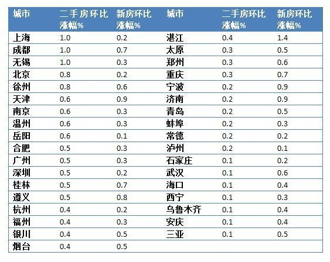
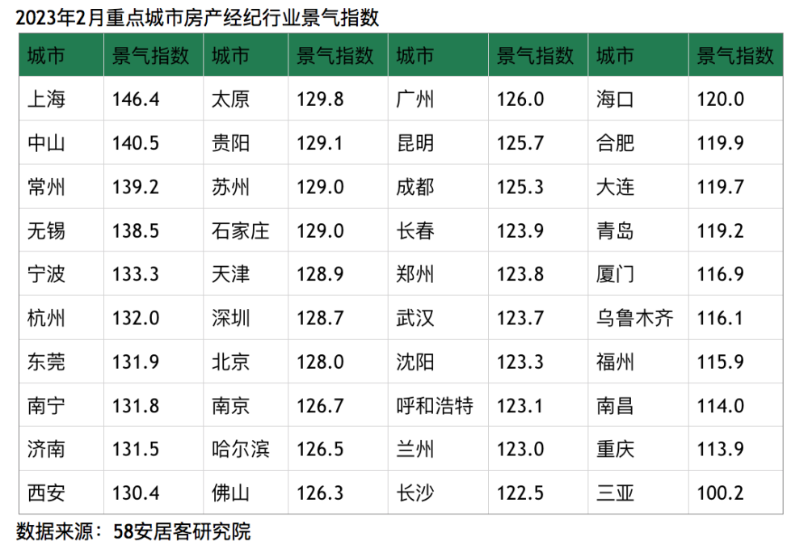

# 楼市回暖了吗？35城进入复苏通道，东北区域房价仍呈下滑态势

3月16日，国家统计局发布2023年2月份70个大中城市商品住宅销售价格变动情况。今年2月份，随着政策效果逐步显现及住房需求进一步释放，70个大中城市中商品住宅销售价格环比上涨城市个数继续增加。

2月，房价上涨城市个数增多，修复面覆盖到各线城市。那么，从数据上看，哪些城市已步入复苏通道，哪些城市还在等待重启呢？

**35城的新房、二手房环比上涨**

按照国家统计局数据，2月份，70个大中城市中，新建商品住宅和二手住宅销售价格环比上涨城市分别有55个和40个，比上月分别增加19个和27个。其中，二手房价格上涨城市数量自2021年8月以来首次超过下跌城市数量。

据澎湃新闻统计，今年2月，新建商品住宅和二手住宅销售价格环比均显示上涨城市共有35个。

_图片来源：澎湃新闻_

诸葛数据研究中心高级分析师陈霄提到，在本轮复苏行情中，一线城市代表北京、上海领衔复苏，新房价格环比连续多月上升，2月二手房价格环比涨幅位居前列。一个是首都城市，一个是GDP领跑全国的城市，占据了全国的经济产业文化优势，汇聚了来自全国各地的人口，强大的购房需求群体支撑起房价的稳步复苏。

同时，重点二线城市尤其是热点经济圈的核心城市涨势也较强劲，如成渝经济圈的成都、重庆，2月房价涨幅可观，长三角经济圈的无锡、徐州、宁波、南京、杭州、合肥等城市凭借着长三角的资源、人口等优势脱颖而出。

根据今年2月最新公布的数据，2023年2月份新建商品住宅价格环比涨幅前十的城市分别为：湛江、天津、宁波、济南、昆明、遵义、重庆、成都、桂林、呼和浩特（郑州、武汉、徐州、宜昌、北海，新建商品住宅价格环比涨幅与呼和浩特相同）。

其中，湛江新建商品住宅销售价格环比上涨1.4%，涨幅居70城首位；天津、宁波、济南、昆明新建商品住宅销售价格环比均上涨0.9%；遵义新房价格环比上涨0.8%；重庆、成都、桂林并列第四，新房价格环比上涨0.7%。

二手住宅销售价格上涨的城市分别为：上海、成都、无锡、北京、西安、徐州、天津、南京、温州、岳阳。其中，上海、无锡、成都三城环比涨幅并列第一，环比上涨1%；北京、徐州、西安次之，均环比上涨0.8%。

根据国家统计局数据，澎湃新闻梳理发现，在热点城市中，成都的表现较为亮眼。自2022年1月以来，成都新建商品住宅价格环比涨幅未跌出过前四，其中2022年4月至7月期间，成都新建商品住宅价格涨幅均居70城之首。从同比数据看，2022年10月以来，成都新房价格涨幅均居第一。从二手房市场表现看，2022年1月以来，成都二手房价格环比涨幅未跌出过前三，其中2022年1月、2022年4月至7月、2022年10月，成都二手房价格环比涨幅均居第一。

**长三角区域房产经纪行业景气度上行比例最高**

从房产经纪行业景气指数来看，市场虽然整体呈现向好，但分化格局表现较为明显。

张波指出，根据58安居客研究院监测的重点城市房产经纪行业景气指数，上海、宁波、杭州、西安、深圳、广州等城市的房产经纪行业景气度呈现持续上涨态势，这也显示出一二线热点城市的市场转暖趋势明显，“小阳春”格局已经确立。从区域分布上看，长三角区域城市景气度上行比例最高，其中景气指数排名前10中，有5个是位于长三角，除了一二线城市，还包括无锡、常州两个三线城市。受节后返工影响和市场活跃度影响，行业整体表现更佳。长三角作为全国楼市无论在土地供给还是市场成交量，都占据了全国三分之一强，长三角整体区域的复苏对于带动全国楼市回暖将起到重要作用。

张波提到，大湾区的复苏韧性强，虽然回暖力度小于长三角，但中山、东莞等城市已开启强劲复苏态势，尤其是中山受政策利好、香港全面通关和深中通道通车预期影响，行业景气度大幅提升，紧随上海之后。值得关注的是，南昌、重庆、青岛、厦门、大连等城市，虽然市场的复苏节奏偏慢，但在二季度有望迎来全面复苏，这些城市的经纪行业景气度提升的后劲相对较强。

**市场分化持续，东北区域房价仍呈下滑态势**

58安居客研究院院长张波指出，虽然热点城市的复苏已经明确，但市场分化还在持续，部分弱二线和三线的市场仍面临压力，尤其是大连、沈阳、长春所在的东北区域新房房价，依然呈现下滑态势。核心原因还是市场基本面修复慢，行业和购房者信心恢复慢，尤其是房企拿地层面逐步偏向高能级城市，以及热点城市的抢人节奏加快，需求侧发力的难度偏大，对房价支撑力偏弱。

从房价仍显示下跌的个数来看，2月份，新建商品住宅价格下跌的城市虽然较1月减少20城，但仍有13个城市房价下行。

从统计局公布的数据来看，新房价格环比下跌的城市为：泉州、丹东、贵阳、长春、大连、南充、牡丹江、锦州、秦皇岛、平顶山、济宁、赣州、沈阳，其中泉州新房价格环比下跌0.4%。

二手房价格下跌城市数量仍较多，为30个。其中跌幅最大的10个城市分别是：韶关、吉林、昆明、南宁、牡丹江、丹东、唐山、兰州、长春、沈阳，数据显示韶关二手房环比跌幅0.6%。

据澎湃新闻统计，2月，新建商品住宅和二手住宅销售价格环比均显示下降的城市共有10个。

_图片来源：澎湃新闻_

贝壳研究院首席市场分析师许小乐提到，1-2月份市场的复苏是前期积压的购房需求补偿性释放，其中大量的交易是改善性换房，短时交易量比较高并不意味着市场进入了快速升温阶段。市场的各项前瞻性预期指标尽管有恢复，但还处在一个相对较低的位置，价格变动也相对平稳。目前二手房挂牌量数量比较多，消费者可以选择的房源非常充裕，并不是供不应求的市场结构，不会出现房价普遍性大幅上涨。随着这波积压的需求快速释放，预计3月市场修复势头较2月有所减弱。但这也并不代表市场“熄火”，而是在向交易中枢修复过程中的正常振荡。

许小乐认为，今年我国房地产市场依然面临不小的外部挑战，但从长期看，我国城镇化正处于从人口红利向人才红利过渡的关键阶段，居民对住房条件改善升级的需求强烈，在房住不炒的大定位下，国家大力支持刚性和改善性住房需求，市场能够走向良性健康循环。

