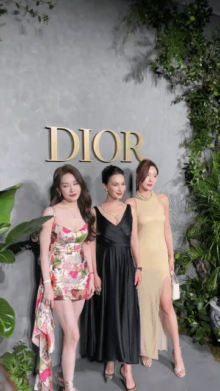
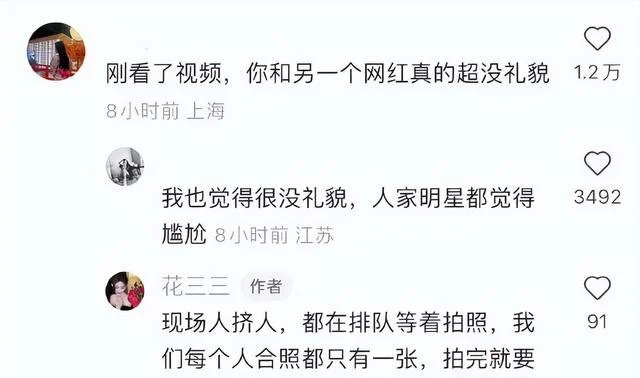
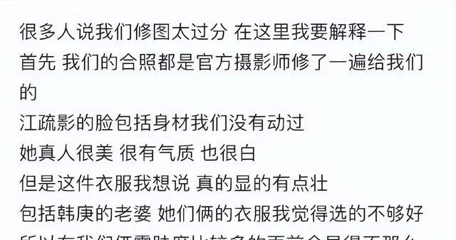
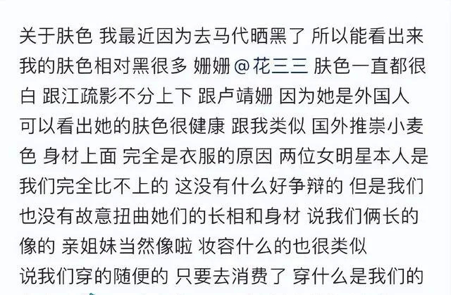

# 网红花三三与卢靖姗合照翻白眼被网友怒喷 花三三回应

近日，网红花三三、可心在社交平台晒出了在某品牌活动上和卢靖姗、江疏影的合照，被质疑故意将自己P得很好看，而把明星P得很丑。随后有网友曝出了合照现场的视频，视频中两名网红与卢靖姗合影过后便径直走开，留下卢靖姗独自尴尬微笑，此举被不少网友认为是不尊重人的表现，并引来了很大的争议。

3月18日，女网红花三三和可心在个人社交平台回应了与卢靖姗、江疏影的合照争议。花三三解释现场人挤人，大家都在排队，所以拍完就赶紧走了，没有对他人不尊重的意思。

可心则表示合照是官方摄影师修整过的，自己没有对江疏影进行二次P图。

编辑：郑亚岚

责编：周尚斗

审核：冯飞

