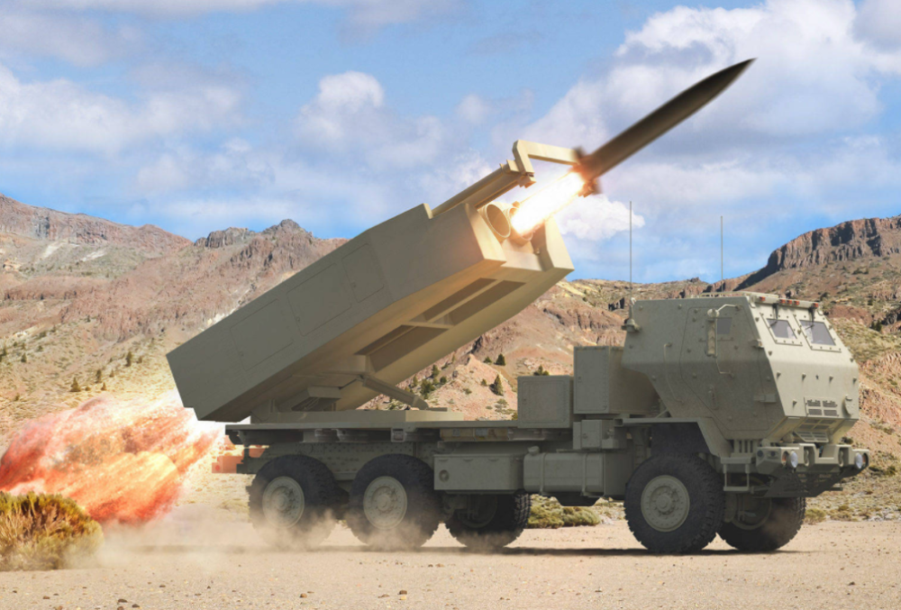
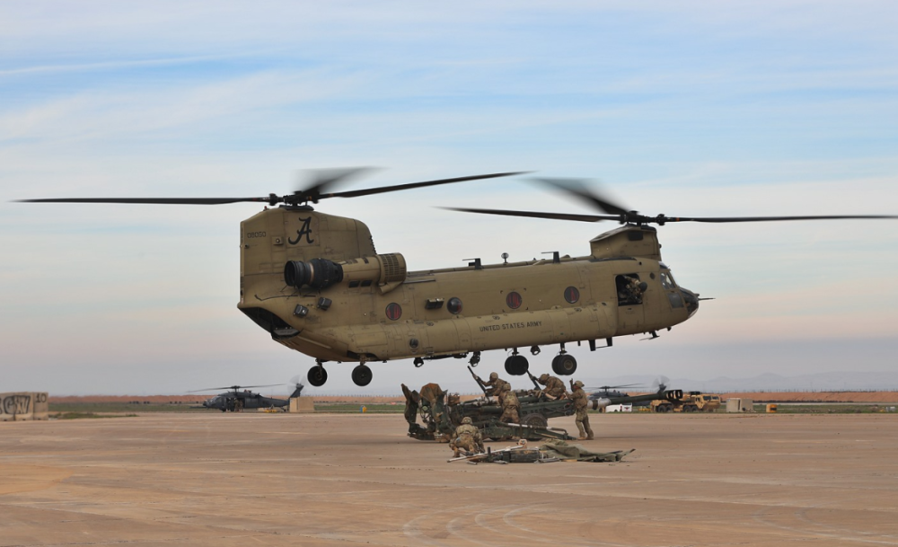
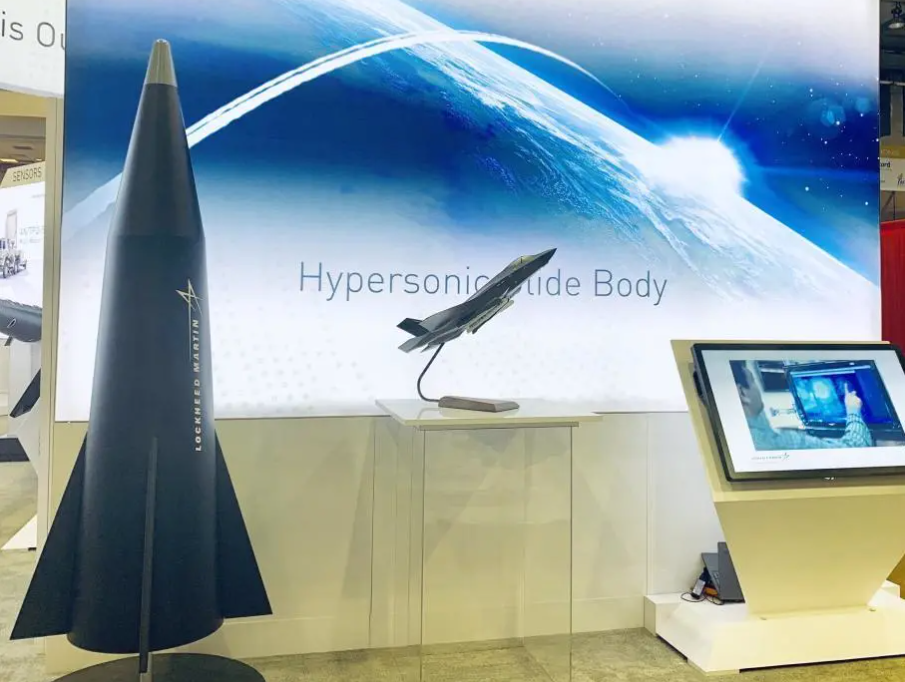

# 美陆军扩建多域特遣部队，加大“印太”地区大国竞争

**热点新闻：**
据美国《国防》月刊网站报道，美国陆军正在组建的第三支多域特遣部队将于5月前实现全面作战能力，届时可与已经完成组建的第一支多域特遣部队在“印太”地区轮换开展行动。

**点评：**
近年来，美国陆军以“大国竞争”目标，积极推进力量转型，其中“多域特遣部队”是根据其目前正在实施的“多域战”概念组建的一种新型战斗单位，通过运用网络、电子战、情报和远程火力等综合手段，实现在特定战区的远程精确打击效果。从未来发展来看，美陆军将以多域特遣部队建设为主轴，多举措提升“多域战”能力，不断推进陆军转型，相关动向不仅影响美军未来建设发展，也将对全球安全形势产生重要影响。

_美国“暗鹰”高超音速导弹射程2700千米，主要用于打击精确目标，该导弹是多域特遣部队的重要武器装备之一。_

**未来战争“游戏规则改变者”**

随着国际安全形势和军事高科技的不断发展，美军不断提出和实践新的作战理念，其中“多域战”是美陆军提出的一项应对新形势下作战环境不断变化的新概念，旨在通过整合所有战争领域（陆、海、空、天、网络空间）的资源和信息，在特定时间窗口形成多重优势，以击败敌人。目前，“多域战”概念已完成理论探索、演习验证等阶段，正逐步走向落实。组建多域特遣部队就是美国陆军实施“多域战”概念的一项重要举措。

2017年7月，美陆军以第1集团军旗下第17野战炮兵旅为基础组建了第一个多域特遣部队，该部队人数为2200人，核心人员800人左右，下辖4个营，其中包括1个情报、信息、网络、电子战太空营，负责获取并整合美军各军种不同情报、侦察和监视平台的资源；1个战略火力营，下辖高机动性多管火箭炮连、中程火力连、远程超音速火力连，负责精确火力打击；1个防空营，负责防空与导弹防御；1个支援营，负责提供管理与技术支援。从武器装备来看，该部队装备的主要打击武器为M777榴弹炮、“海马斯”火箭炮、M270火箭炮、“暗鹰”高超声速导弹等，主要防空系统为“标准”-6、“复仇者”、“毒刺”等防空导弹，飞行器主要是无人机和直升机。第一多域特遣部队成立后，进行了多场演习，取得了令人满意的效果。

2021年，美国陆军在欧洲启动以第41野战炮兵旅为基础组建第二多域特遣部队。该部队的编制装备和作战模式与第一多域特遣部队类似，目前已经组建完毕，部署在德国，主要针对俄罗斯。此次美国宣布将于5月份实现全面作战能力的第三支多域特遣部队实际上于2022年9月已经正式启动，部署在夏威夷，主要针对“印太”地区。未来美国还将计划再组建两支多域特遣部队，分别专注于北极和在全球范围内响应，从而实现五个野战炮兵旅的全部改制。

相比目前美国陆军旅的大型作战编队，多域特遣部队具备很大的灵活性，其核心战斗方式是在陆、海、空、天、网络以及电子战领域，为指挥官提供感知和打击能力，是一支为应对快节奏战场而组建的新型作战力量。该部队通过配备有防空、情报和战略火力装备，具有较强的战场穿透能力，其作战范围覆盖所有领域，并将与所有军种密切合作，可随时随地从空中、太空、海上和网络以及陆地等任何平台发起攻击行动，为空军、海军和海军陆战队提供支持，实现在联网作战部队中协调信息和火力，从而在任何作战域开展更深入和更大规模的联合打击、联合进攻和联合演习行动，实现在与未来对手的潜在战斗中，获得多个领域的竞争优势，甚至消灭对手在战场上的反介入/区域拒止能力，成为未来战争的“游戏规则改变者”。

_“海马斯”火箭炮发射“精确打击导弹”设想图。_

**为“印太”地区提供更多战场能力选择**

近年来，美国不断深化“印太”战略，并以此为指导加大了在“印太”地区的兵力部署和调动。美军认为，由于“印太”地区的地理特殊性，对陆军的作战行动提出了广泛的挑战。首先，“印太”地区大部分是广阔的海洋与陆地相交地区，导致了美国陆军在该地区所占据的优势并不大，为此美国陆军认为在未来与“印太”地区大国对手进行的任何战斗中都不应只局限于地面战斗，而必须考虑到空中、太空、海上、网络等多个领域的全面对抗。

由于多域特遣部队装备有多种高端武器、远程火力、一体化空中与导弹防御系统及情报收集和支持平台，可为美陆军实施多域作战和精确打击提供有力支撑，有效满足在“印太”地区的军事行动需要。同时，未来美陆军还计划将海军“战斧”导弹、“标准”-6导弹改装为陆基发射导弹，使用“海马斯”高机动性多管火箭炮系统发射“精确打击导弹”，可以覆盖“印太”的多个地点，并还将研发和装备远程高超音速导弹，突破敌人由中远程导弹、雷达等组成的分层导弹防御系统，从而有效反制大国对手的“反介入/区域拒止”能力。

此外，美国认为，目前在“印太”地区组建的多边联盟在军事领域发挥的作用还不够明显，特别是对于陆军来说，在开展联合军事行动时，只能依赖与日本、韩国、澳大利亚、泰国和菲律宾的双边协议。而根据美国太平洋陆军司令部副司令詹姆斯·贾拉德中将的说法，“多域特遣部队具备可以跨岛链及远距离分布式作战的特定能力”，可以通过灵活部署，深化与其他国家的军事合作关系。美太平洋陆军司令部司令查尔斯•弗林也称，自2021年以来，第一多域特遣部队就一直在“印太”地区开展行动，几乎参与了“通道”行动的所有演习。该行动的计划目标是扩大美陆军在太平洋地区的参与程度，并通过与亚太地区的军事演习提升区内或外区部队在该区域执行作战任务的能力，从而提高美国、盟军和合作部队的准备状态，特别是提升美国陆军太平洋部队与整个地区伙伴国家之间的战备和协同作战能力。

此次美国陆军新成立的第三多域特遣部队将驻扎在夏威夷，成为了第二支以“印太”地区为重点的陆军力量，未来将通过与第一多域特遣部队在“印太”地区轮换开展行动，以及与海军陆战队第三濒海团在太平洋多国联合战备中心进行联合训练等方式，实现该地区联合部队整体作战能力的提升，并实现其国防战略报告所提出的三大支柱，即一体化威慑、建立长期优势和在太平洋开展活动，同时也为在广阔的“印太地区”为美陆军部队提供更多的战场能力选择。

_M777榴弹炮具有优秀的战略战术机动性，可通过直升机吊挂进行跨区域快速机动。_

**推动未来美陆军力量全面转型**

自2021年美国陆军发布《陆军多域转型——做好战备赢得竞争与冲突》白皮书后，美军着手以多域特遣部队建设为主轴，多措并举提升多域战能力，试图以此为核心推进陆军转型。美军认为，尽管目前其仍然保持一定优势，但由于对手使用各种“非对称”方式并充分利用美军弱点，使美军难以应对，为此美陆军必须要通过构建能在包括陆、海、空、天、电等多种维度作战的特遣部队作为陆军转型的抓手，使得该部队不仅具备陆战场作战能力，还具备在其他多种战场空间进行作战或接受其他战场空间支援的能力，从而凸显美军的优势，成为美军未来战场上的“打击利器”。

为了实现这一目标，美陆军除了扩建多域特遣部队外，还采取了其它举措推进多域战能力建设。例如，美国陆军成立了管理办公室战略行动部，下设网络、电子战、信息作战、太空、战术通信网络、数据架构和人工智能等部门，作为美陆军多域战能力生成的统筹协调机构。此外，美国陆军训练与条令司令部还宣布，将开展多项现代化训练项目，通过训练提升现代化水平，以更好地适应未来多域作战环境，同时向具备多域战能力的部队提供现代化训练设备，截至目前，陆军训练与条令司令部已经对90余万个训练辅助设备、4100余个训练靶场进行了升级。

_“暗鹰”导弹采用双锥体设计的“通用-
高超音速滑翔体”（C-HGB）。_

从发展前景来看，虽然美陆军在推进多域战能力建设上采取了诸多举措并取得了一定的成果，但也面临着诸多制约因素。例如，从当前的情况看，美军的研发与采购体系以军种为基础，各军种采用不同供应商的系统，这就增加了系统整合的难度，跨域指控、通信存在障碍，而美军内部各军种长期以来一直就预算分配问题争吵不休甚至发生内讧，从而导致了美陆军意图通过以多域战能力建设为名实现各军种深度融合也没那么容易。

此外，目前美陆军组建的多域特遣部队都明确针对某个方向的“战略威胁”，这势必会激化其与相关国家的矛盾。例如近期俄罗斯针对美军在多域战能力建设方面咄咄逼人的态势，已经开始强化在欧洲等方向的兵力部署和威慑行动。如果美军继续推动多域特遣部队建设并以大国对手为针对目标的话，必然会引发和激化大国之间的战略对抗，给世界安全与稳定带来不稳定因素。

