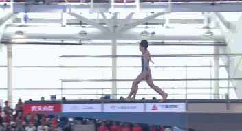

# 首金诞生！全红婵陈芋汐勇夺双人10米台冠军 再演水花消失术

3月19日，2023年全国跳水冠军赛拉开大幕，女子双人10米跳台决赛，世界冠军组合全红婵和陈芋汐拿下冠军，她们的成绩是362.04分，勇夺本届赛事的首金。

赛前入场仪式，运动员们进入赛场，现场观众纷纷鼓掌。

全红婵和陈芋汐在第9个出场，第一跳的规定动作，虽然动作201B的难度不高，但打开的同步性、质量都很高，得到53.4分。

全红婵和陈芋汐也是第一轮结束之后唯一一对得分突破50分的搭档，表现很出色。

第二轮，全红婵和陈芋汐的动作是301B，被认为是教科书般的展示，这一跳她们拿下54.00分，总分依旧位居第一名。

第三轮，全红婵和陈芋汐的动作是107B，动作同步性极高，两人再度上演水花消失术，拿下82.80分，190.20分排名榜首。

第四轮，自选动作407C，全红婵和陈芋汐表现完美，拿下86.40分。

第五轮，全红婵和陈芋汐的动作是5253D，难度3.2 ，表现出色，得到85.44分，总分362.04分，夺得冠军。

​不得不说，全红婵和陈芋汐不愧是冠军组合、金牌搭档，两人此前一起拿下过世界杯和世锦赛的女子双人10米台冠军，配合的时间虽然不是很长，但已经取得了辉煌的成就。如今来到全国跳水冠军赛暨奥运会、福冈世锦赛、亚运会、成都大运会选拔赛，这对搭档自然是希望可以有稳定的发挥，除了争夺冠军之外，还要力争进入到接下来的亚运会和奥运会等世界大赛。

接下来前全红婵和陈芋汐还有女子单人10米台的比赛，两人从搭档变成对手，也是各自想争夺冠军道路上的最大对手，实力对比也伯仲之间，期待接下来全红婵和陈芋汐的表现。

