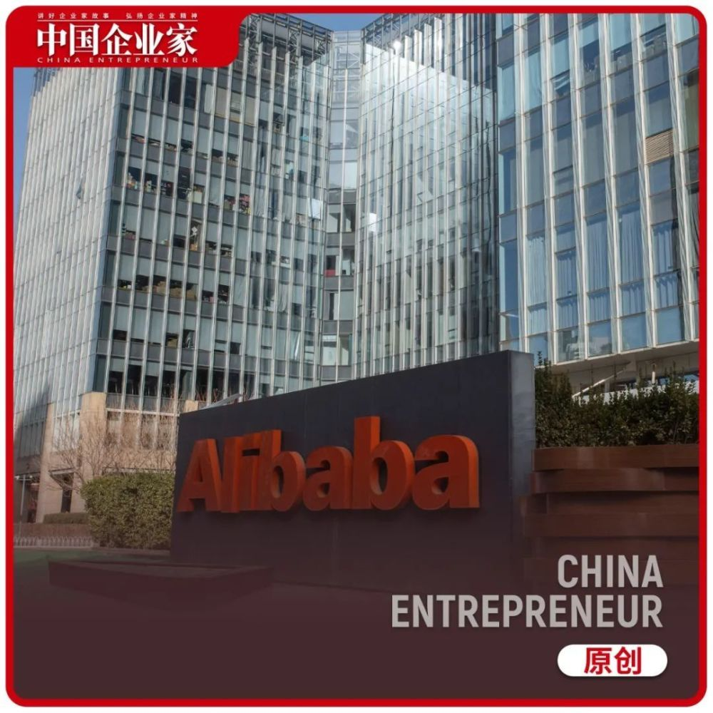
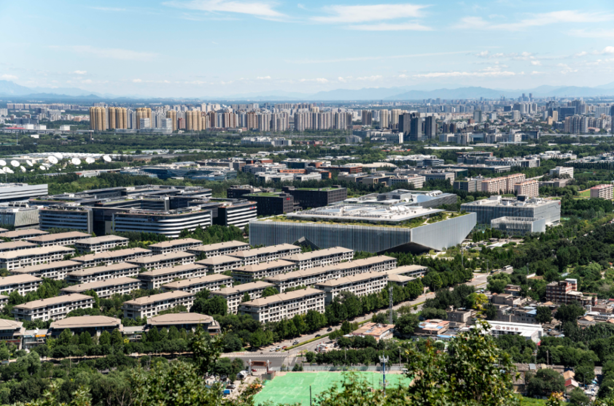

# 8万跌回6万，阿里字节搬家对房价的影响有多离谱

大厂员工所到之处，周边房租大涨。

**文｜《中国企业家》记者 李艳艳**

**编辑｜李薇**

**图片来源｜视觉中国**

“之前卖8字头的，现在只要6开头了。”谈起杭州明星板块未来科技城的二手房价，一位杭州本地中介向《中国企业家》感慨道，“我说的是这里最好的几个小区，8万跌回6万。”

这话的背景是，去年9月以来，阿里将云与科技事业部从未来科技城迁出。与此同时，上万名阿里员工开启大迁徙，目的地是距此5公里以外的云谷园区。

**作为最敏感的那条神经，大厂周边的房价、房租往往最先闻风而动。**
正如，跟着阿里买房，曾是很多人的“财富经”。互联网大厂的扩张，带来了人口和财富的聚集，助推了楼市上涨行情。

但随着大厂也开始过上了“开源节流”的苦日子，这个神话还灵不灵？从北京、杭州、深圳，再到上海和东莞，大厂对房价的影响到底有多大？

“阿里定律”

互联网大厂已成为带动周边房价、房租的有力参与者。

去年9月，阿里云谷园区正式启用，随后，员工陆陆续续搬过来。据了解，本次搬入云谷园区的，绝大多数部门来自阿里云，包括此前在之江飞天园区，未来科技城欧美金融城EFC、未来PARK、乐佳中云&科技办公的员工。此外，达摩院也暂时在云谷园区安营扎寨。

杭州西湖区云谷小镇，荆大街与灯彩街交叉口西北角，是阿里巴巴云谷园区所在地。园区总建筑面积45万㎡，规模大概相当于63个标准足球场。自2013年由城西搬迁至未来科技城西溪园区以来，时隔9年，阿里员工又一次迎来了“万人大迁徙”。

那段时间，“阿里员工抢房、一大波人深夜跟中介看房”的新闻俯首皆是。据当地中介反馈，很多在阿里云、西湖大学上班的阿里员工，早早就跑来租房了。

云谷园区启用前的半年时间内，区域内房租价格涨幅已超过20%；部分热门小区的房子，租金涨幅近千元。一位熟悉杭州楼市的市场人士形容，
**“阿里员工所到之处，周边房租大涨”。**

云谷园区启用后，距离园区直径约1.5公里的楼盘“紫璋台”成为最大赢家， **房租一路飞涨，涨幅超过50%；**
距离园区直线距离1.7公里的万科西雅图小区，租金同样上涨明显。

58安居客研究院统计显示，距离阿里巴巴云谷园区最近的两个板块（紫金港、三墩），去年10月后的租金基本都在上涨，但紫金港的租金早在9月就出现了明显上涨，涨幅为8.31%，而此前两个月，这个小区的租金其实还在持续下跌。

“以此来看， **大厂搬迁对周边板块的租金影响确实比较明显。** ”58安居客研究院研究总监陆骑麟对《中国企业家》分析称。

2009年，阿里总部从文三路搬到滨江；2013年阿里搬至淘宝城，次年在纽交所上市，制造了一批千万富豪。有人说，阿里员工几乎买空了未来科技城的新楼盘，不到10年，区域房价翻了数倍。

不止阿里，互联网超级大厂所到之处，都能带动周边房价和房租的上涨。

自阿里在杭州遍地开花后，杭州楼市形成了一条“阿里定律”： **阿里到哪儿，房价涨到哪儿。跟着阿里买房，已经是公开的财富密码。**

一个广为流传的案例是，2020年11月，蚂蚁集团总部选址杭州之江，消息传出后，之江路某小区某房源的挂牌价，直接从68万翻涨到186万。事实上，2020年7月，蚂蚁上市的消息传开，离蚂蚁总部几公里外的之江九里，房价就开始一路看涨。

有统计称，截至当年9月，之江九里部分楼盘每平米上涨7000元，90平的户型涨幅超过63万元。尽管后续蚂蚁上市被紧急叫停，杭州还出台了新政加码新房调控，但之江九里房价上涨的热潮并未受到明显波及。

“地段论”不过时

杭州未来科技城此前不仅有阿里坐镇，还入驻了vivo、OPPO、抖音等一大批企业。2020年，该区域楼盘单价一度触及8万，市场情绪当时认为，涨到10万没问题。

“以前，阿里附近的主力楼盘成交价是500多万，现在是400多万，普遍降了100万。”一位杭州房产中介曾对媒体表示。

**互联网高薪人群和产业发展前景，撬动了该板块的升值预期。**

此前，很多房企如富力、新城、合景泰富等，都将未来科技城作为深耕杭州的试验田。2020年疫情暴发后，未来科技城一度出现“报复性买房”。2020年中，未来科技城还出现“6万人摇号”的盛况。

58安居客研究院统计数据显示，从杭州未来科技城区域的新房价格走势来看，2018年至今5年间，新房价格从28627元/平方米上涨到当前36751元/平方米，涨幅为28.4%；二手房价格挂牌均价也从2018年初的27643元/平方米，上涨到2022年底的42856元/平方米，涨幅55%。

不过，2022年相比2021年出现了下调，新房成交均价出现了1.5%的下跌。2022年9月，阿里将云与科技事业部从未来科技城迁出。

“这是未来科技城区域新房成交价，近五年以来首次出现下跌的年份。”陆骑麟说，“因此，单从数据来看，阿里对原区域的房价影响还是相对较大的，尤其是，未受限价影响的二手房会更大。”

与杭州房价走势拥有同样轨迹的，还有东莞。

这座城市的房价涨幅一度超过深圳，位居全国第一。尤其是 **松山湖区域，目前均价已逼近4万，和2015年相比，涨了近3倍。**

松山湖的房价上涨与华为有着莫大的关系。2014年，华为设立东莞松山湖基地，包括终端总部、第二代数据中心、研发中心等等，占地总计1900亩。迁址消息一出，人们对松山湖区域寄予厚望，房价逐渐攀升。这一切的变化，都与互联网企业的发展轨迹密不可分。

**互联网大厂的扩张，带来了人口和财富的聚集，助推了楼市上涨行情。**

在深圳南山科技园，2018年前还有租金几百元的“农民房”，随着互联网公司的扩张，这些房子由二房东承包，摇身一变成了“公寓房”，并以2000元~4000元的价格，租给附近从事互联网工作的年轻人。

就深圳市场来看，先是今日头条2020年6月以10亿元代价，拍下南山区粤海街道某一地块，与BAT做邻居。接着，位于同一区域的迅雷大厦大本营传出顺利封顶消息，大疆、vivo总部项目随后接连启动。伴随着互联网大厂的买地建楼史，深圳房地产市场行情一路高涨。

无论过去多少年， **“地段论”依旧是不少人买房所信奉的金科玉律。**

当年的华为深圳坂田总部，南山科技园的腾讯大厦所在区域，身价早已高不可攀，但这些地块也曾无人问津，商业配套匮乏、交通设施不足。随着大厂落子，短短几年，区域热度提升，配套迅速成熟。

**大厂定律要“失灵”？**

阿里云总部搬迁已近半年，还未带动云谷区域房价明显上涨， **尤其是二手房交易市场，甚至出现反向走势。**

今年以来，受杭州二手房市场大环境低迷影响，有中介称，云谷园区附近的万科西雅图小区一些房源，“相比460万的挂牌价，已经跌掉了近100万”。

难道楼市大环境变了，大厂定律要“失灵”？

回到10年前，无论是阿里“过江”，还是淘宝城落户未来科技城，都能极大搅动周边房价的原因是新房供应不足，大量需求涌入。而现在，城市版图不断扩大，供地规模常年保持高位，购房可选余地太大了。

最近几年，互联网大厂不断制造新事业总部，员工更换上班地点成为常态。越来越多的大厂员工选择“买房+租房”的居住模式。
**大厂搬家背景下，相比房价，房租波动更明显。**

2021年3月，字节跳动宣布，上海电商部门将选址在杨浦区，与B站做邻居，消息一出，附近小区房租应声上涨，涨幅高至千元。

“如果园区完全依靠周边商品房市场供应，来满足产业总部人员居住需求，必然会推高房价和租金，因此人才公寓的开发建设短期内能对区域房价产生平抑效果。”陆骑麟说。华为总部研发中心落户坂田后，开发了人才公寓，一定程度保障了研发人员的居住需求。

有人在网上发文——失去阿里的未来科技城，会不会凉？

在杭州，未来科技城一直是房价高位区。随着未来科技城二手房价的水涨船高，该板块核心地段的次新房，一套小户型也要500多万。

不过，过去两年，受互联网公司裁员降薪影响，部分大厂员工暂缓了买房计划。但中介称，这部分人群并非该区域购房主力，整体影响有限。

陆骑麟认为， **阿里搬迁后，未来科技城二手房挂牌均价数据环比逐月下跌，** 阿里对板块房价短期影响相对较大。

“但从长远看，未来科技城板块发展已经相对成熟，即便阿里退出，新的企业也会入驻，且服务于阿里的相关产业已经在该板块落地，短期内也不可能集体搬走。”陆骑麟强调，“因此长期不会对未来科技城板块房价带来巨大冲击。”通过调研他发现，未来科技城板块的整体租金变化，也未出现明显波动。

陆骑麟提醒， **不能神化大厂对楼市的影响。**

“近两年纷纷爆出大厂裁员，周边房价下跌，出现员工背负高额房贷无力偿还的情况，并且整体经济环境处于深度调整中，楼市的调整也不会因为一家企业而持续坚挺。”陆骑麟强调。

