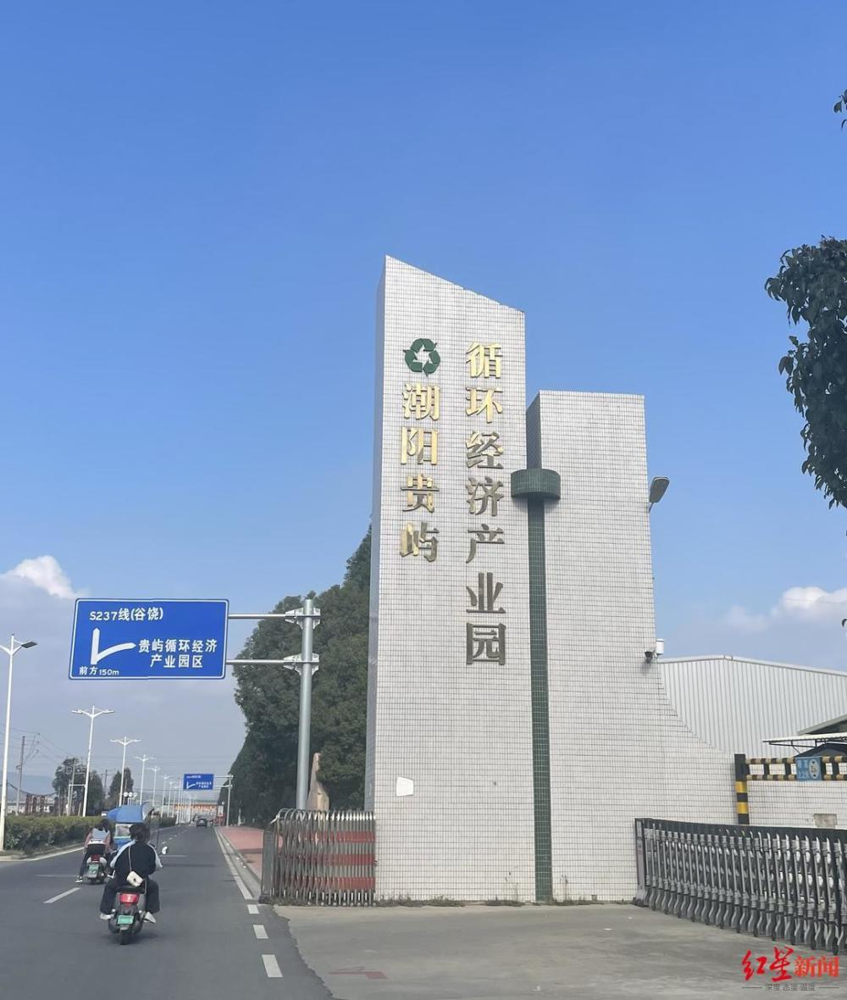
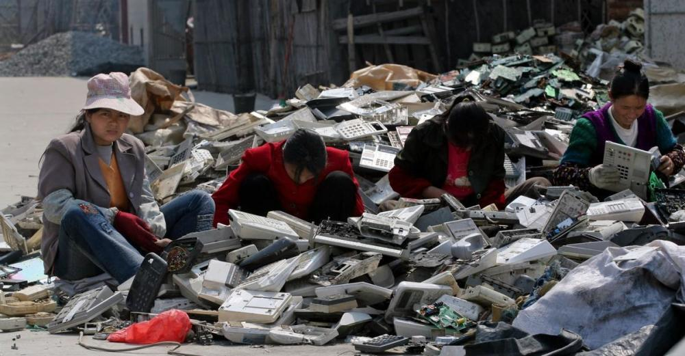
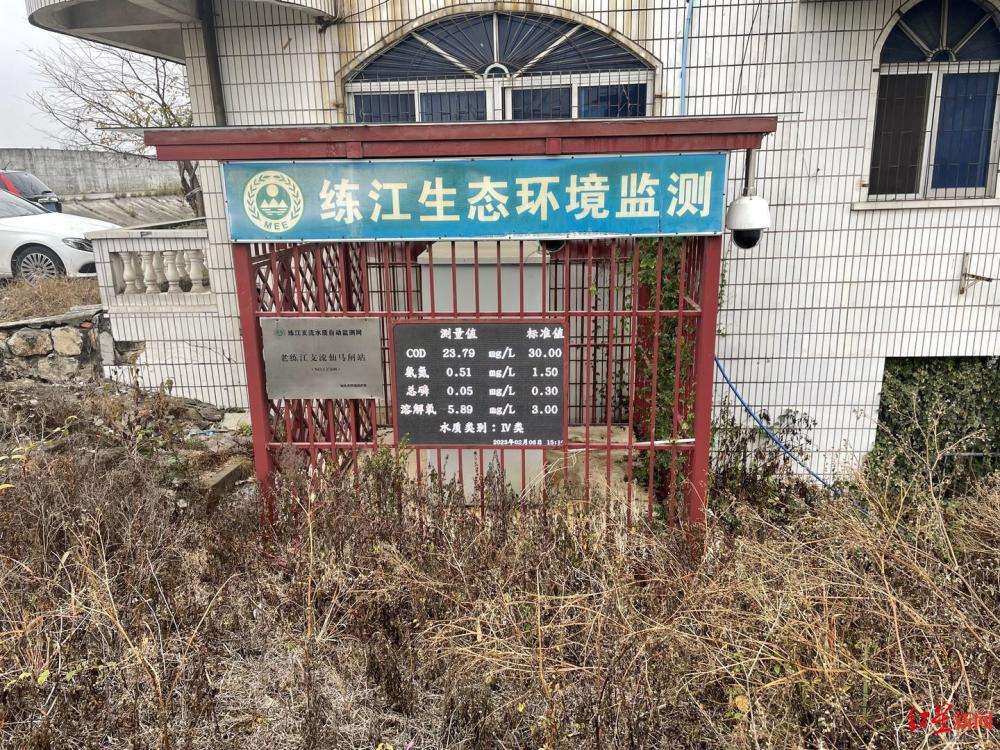

# “洋垃圾”被禁两年丨褪去暴利后的电子垃圾小镇：从上万人到500户 两代人的重新抉择

“我敢说，贵屿30岁以上的人，大都做过（电子垃圾）拆解户，个个是百万富翁。”50多岁的餐馆老板迟疑了一下，继续说，“现在还做的就是混口饭吃，国内货比国外的差太多，当年的那批人早都不干了。”

从上个世纪80年代开始，来自国外的废旧电器、电脑等电子垃圾源源不断地流入到这座潮汕小镇——贵屿。电子垃圾被粗放式的家庭作坊拆解，可重复利用的元件被二次销售，剩下的电路板用来“炼金”。

汕头贵屿被称为“电子垃圾之都”，它的致富之路听起来有些传奇，可这背后也付出了惨痛代价，当地饱受电子垃圾的荼毒。2021年1月1日起，我国全面禁止以任何方式进口固体废物。两年过去，褪去“暴利”外壳后，这座潮汕小镇的发展如何？以此谋生的拆解户又将流向何处？

**产业园现状：**

**一张能够自由流通的“门槛”**

加热至232℃，锡会熔成水银般的液体，带着防毒面罩的工人将电路板浸于锡池中，不到一分钟，零件焊接部位脱落，产生的白烟也顺着管道爬进废气收集系统。

在潮阳区贵屿循环经济产业园区的一处168平的厂房内，一张废弃的主机线路板经过拆解、烧板等工序，被分解成指头大小的元件躺在不同颜色的桶里，老板陈志勇在一旁估摸，这批货还能撑两天。

_↑汕头市潮阳区贵屿循环经济产业园区大门_

处在沿海地区的贵屿人敢拼能吃苦，头脑精明，擅长做生意。陈志勇在17岁那年只身去深圳打工，在华强北卖芯片，5年后又去广州生产装化妆品的瓶罐，最后和合伙人产生矛盾不欢而散，近些年他便回到家中子承父业，做起了“拆二代”（拆解户二代）。

废旧主机板库存消耗殆尽时，陈志勇会赶早进货，他形容这好比“去菜市场买菜”。不到早上8点，产业园区的装卸场就有了动静，各地牌照的车辆依次排开，商户老板齐聚此地挑货，停在露天交易场的大货车、三轮车上堆满白色麻袋。做生意讲究口碑和信任，面对一大堆旧货，陈志勇总是先从认识的货主开始谈，价格没谈拢他就再换一家，有时也会空手而归。

陈志勇提着剪刀，朝麻袋中部划开一道口子，抽查内部是否有其他电子废品。今年开年的价格比往常贵，部分货主还未开工，市场上的货就显得稀缺，有些商户库存不足就买的多，陈志勇不想去竞争，他根据经验判断这样只会抬高价格，最后只收了2吨货。

_↑买家会用剪刀划口子检查货物_

与早期混乱无序的私自进口废弃电子垃圾不同，现在园区里流通的一张张物流单标明了货物的来源、名称、重量及转移流向，这张凭证也是废弃电子产品在产业园自由流通的“门槛”。来自广东、湖北等地废弃电子产品都会被运往产业园，不同元件的行情价格也在电子交易市场透明公开。

制度的完善得益于对“洋垃圾”的全面打击。
**2020年11月，生态环境部、商务部、国家发展和改革委员会、海关总署联合发布《关于全面禁止进口固体废物有关事项的公告》，从2021年1月1日起，我国全面禁止以任何方式进口固体废物。**

早在2017年4月份，中央深改组会议就审议通过了《关于禁止洋垃圾入境推进固体废物进口管理制度改革实施方案》（简称《方案》），要求全面禁止“洋垃圾”入境。

曾被贴上“最毒电子垃圾小镇”标签的贵屿，更是将战线提前了5年。据官方2012年5月统计数据，贵屿镇电子废物拆解经营单位共5169家，行业从业人员达17282人，总经营面积707860平方米，年均处理量达107.8万吨左右。同年，贵屿镇所在省、市、区各级党委政府以改善生态环境、守护绿水青山为目标，坚持问题导向，建立多部门联合执法机制，挂牌督办，强力推动贵屿镇专项环境综合整治。

陈志勇时常会想起，以前每天出门的场景，“就像一整条街烧烤店的烟雾都朝着你吹”。直到读书时一位外地同学来找他，一句“你们这里的空气好臭”，才让他意识到，原来不是所有的地方都是贵屿“黑烟缭绕”的环境，原来不是所有小孩都得在这样的环境下长大。

**回溯当年污染：**

**“刺鼻烧焦味”与“黑色污水”**

贵屿当年的生态环境乱象引起了环保机构的重视。时任绿色和平组织资深污染防治项目主任的赖芸，曾几十次探访过电子废物拆解集散地——贵屿，与不同的研究机构一起在当地开展人类学研究、健康体检、环境质量评估等项目工作。每次回想起二十年前初见贵屿的那一幕，都让他内心深受震撼。

_↑20年前，贵屿拆解户正在手工烧板
图据赖芸_

时间回到2003年的一天，那时候还没有手机导航，赖芸顺着纸质地图上标记的贵屿方向前行，在快到贵屿的时候，偶尔也会看到一两家电子垃圾拆解户，空气里混杂着阵阵烧塑料的味道，“那种（味道）很难忘，一天走下来，发现衣服上都是那股味道，怎么样也洗不掉”。

越往下走，刺鼻气味逐渐浓烈，直到眼前竖着“贵屿”的路牌，这座“垃圾”小镇的神秘面纱才被完全揭开：村子道路两边各式各样的电子废品堆积成山，几乎每家每户都在参与手工拆解和烧板，粗暴地用螺丝刀拆开电视机、显示器、键盘等外壳。仔细一看，会发现不同的区域处理的电子垃圾不同，有的区域在烧板，有的专门做塑料回收，还有的就只是负责拆解，分工很细。

在一栋4、5层楼的小洋房内，家用小煤炉烤着线路板“嗞嗞”地冒着烟，工人们眼疾手快，把线路板上面的一个个细小元件取下来，快速扔进旁边用于分类的几个回收桶里，炉具前面有一台电风扇将烟雾往外吹，试图减轻烧焦带来的臭味。

_↑当年贵屿拆解户席地而坐，埋头拆解的场景
图据赖芸_

而在远离居民区的地方，农田或是河岸边有一些貌似废弃的小工棚，那就是“洗金”的场地。赖芸在调查时碰到过几次，酸洗的工人不是一天24小时都待在那里，“有货了，偷偷跑到那里，处理完就走人。”他看到棚里堆满装着浓硫酸、硝酸等化学品的大桶，酸洗完的废水要么直接倒入挖好的土坑里，要么排到河里，这也导致当地地表水和地下水的严重污染。

当地人曾给赖芸演示水质受污染的情况，他们将泡好的乌龙茶，倒进干净的矿泉水里，颜色被稀释，变淡了。然而，当乌龙茶倒进从当地打上来的井水里，整杯水的颜色立刻变黑。

据新华社报道，由汕头大学医学院教授霍霞等人发起的调查表明，贵屿当地儿童和新生儿生物样本中，铅、镉、铬、锰等重金属的水平明显高于对照人群。

为何要在如此恶劣的环境下生存？在赖芸看来，当地的经济依赖于电子垃圾拆解，这是每家每户的生活来源，可能刚发展电子垃圾拆解的时候，谁也不知道会造成如此严重的污染和持久的影响。赖芸在调查期间，接触到的人都对他说，这里空气不好，但要讨生活，环境差一点也没关系，等挣钱了，就回去；也有当地人反对，但他们有能力之后就搬走了，有的老板在市区买了房，留在贵屿的楼房成了拆解电子垃圾的工厂和工人宿舍。

如今走在贵屿镇上，已经闻不到刺鼻的味道，肉眼看到的水域呈深绿色，有妇女在岸边洗衣服，偶有废弃塑料垃圾漂浮，不过这与赖芸印象中的“黑色污水”已大不相同。在一处练江生态环境监测点，监测点工作人员介绍，地表水共分为五类，五类水就可以满足灌溉，越往上水质越好。

_↑练江生态环境监测显示，水质类型为Ⅳ类_

记者从当地政府了解到，近两年来，通过强化园区规范管理和持续深入环境整治，贵屿地区环境质量明显改善，具体表现在：土壤方面，土壤环境污染指标的含量水平整体保持稳定，土壤环境质量有所改善，无出现重金属严重污染的情况；水体方面，北港河底泥中重金属的铜、镍、镉和铬含量有所降低，水体质量有所改善；空气方面，空气环境中常规指标和重金属镉、铅、砷和汞及其化合物等指标均符合《环境空气质量标准》年平均浓度的二级标准，空气环境质量连续稳定达标。

**褪去“暴利”外壳：**

**洗牌后两代人的重新抉择**

“我敢说，贵屿30岁以上的人，大都做过拆解户，个个是百万富翁。”50多岁的餐馆老板迟疑了一下，“现在还做的就是混口饭吃，国内货比国外的差太多，当年的那批人早都不干了。”

在过去十多年的时间，当地一边打击取缔电子垃圾非法来源及非法拆解行为，一边将达到整治要求的拆解户迁入产业园，以“堵疏结合”的方式将昔日的粗放式家庭作坊彻底铲除。随着贵屿无序混乱的状态结束，电子垃圾褪去“暴利”外壳，属于上一辈人的“淘金”时代落幕。

_↑园区内环境_

没做拆解后，华美村的陈华年和老婆摆摊卖起了卤味，一天时间，自制的卤味鸡鸭肉就卖了5000元，可陈华年觉得自己这几年挣的都是“辛苦钱”。

“和当年还是不能比，那时候钱才好赚，一年最多时赚几百万，烧出来的线路板会卖，锡、铜也会卖。”陈华年回忆道，从美国、日本等全世界各地拉过来的“进口货”，最多时候家里可以放100多吨货，烧板的时候有10多个外地工人，一个小时能赚十几元，一个月天天做，可以有7000元。陈华年称，“当时一克黄金两百多，而进口的电路板一千斤可以提100克左右的黄金。”

赚到钱后陈华年从“下山虎”样式的老宅搬出来，花了几十万挖地基，建了四层楼房。当地人习惯把一楼盖到4、5米高，这能大量存放电子垃圾，也能方便叉车装卸，二楼以上才住人。环保打击之后，严查酸洗和烧板，陈华年觉得偷偷摸摸还赚不了钱，干脆不干了。如今的一楼当作客厅和车库，用来停放摩托车。

因为赚钱少，陈华年的下一代不愿意待在贵屿打工。“没生意做的都去外面打工，有生意的才留在家里继续做。”他支持孩子去南阳服装厂，一方面觉得产业园工作辛苦，另一方面，他担心继续拆解电子垃圾对孩子身体有伤害，“我们当年怎么会意识到这些？现在就不会让自己的孩子继续做了。”陈华年说。

彭才文的父亲在园区建成后，也关闭了自己的家庭作坊。当年做的生意规模小，平时都是家里兄弟几人帮忙做最基础的拆解工作，家里没赚多少钱，而入驻园区需要一笔启动资金用来交租金和设备投入，他要借20万元。考虑到国外电子垃圾被禁后，没有好的货源，行情也在走下坡路，彭才文的父亲鼓励他出去靠自己另谋一条生路。

2018年，25岁的彭才文在深圳一个月工资两千块，只住得起几百块一间的筒子楼。就在他快放弃时，他发现手机膜定价高的商机，向朋友借了两百万，在家开厂创业。那段时间，彭才文自己钻研压膜工艺，找渠道卖货，现在主要给几家知名电商品牌供货，年利润上百万，现在彭才文每个月会定期给父亲打生活费。

上一辈的老拆解户要么闲赋在家，靠子女赡养；要么做点小买卖，快60岁的陈华年觉得“体力和头脑都已不如现在的年轻人”，彭才文的父亲回看前半辈子也不免遗憾，“他有时跟我说，当时要是去园区做生意，也许现在多少能赚到点钱，就不用全靠孩子补贴了。”彭文才说。

**园区拆解户数量精简至500户**

**龙头企业带来更大经济效益**

在扭转当地人固化思维的同时，如何减缓整治对拆解户带来的冲击，又如何让停产转型的拆解户再就业，园区建成后不少拆解户仍在逐步面临这样的问题。

记者从汕头市潮阳区贵屿循环经济产业园区管委会了解到，园区2015年基本完成首期500亩建设并投入运营，发展至今，现有工业企业41家，入驻商户500多家，从业人数3000余人，2022年园区废弃电子电器成交量达到14.5万吨。园区税收、产值呈现逐年上升趋势，2022年上缴税收1.18亿元，实现工业产值17.8亿元。

据介绍，园区建成后，当地拆解户以行业类型、亲缘关系、地缘关系等为基础组建成29家公司（约1400多户）进驻园区生产，通过近几年规范管理，推动产业转型升级，商户发展呈现精细化、集聚化特征，目前有约500户商户。园区管委会相关负责人表示，在加强规范管理，引导大量小规模商户进行整合归并，形成规模较大的企业。此外，部分商户在此过程转投其他行业，因此，从数量上看，园区商户较最初进园时呈现数量上的精简。

“园区最开始的规划是，首期500亩，全部落地2025亩，但是从现在的行业形势来看，现有的500亩已可以满足，所以重点进行了转型升级。”园区管委会相关负责人坦言，由于国内市场调节及环保严控的形势压力，园区各企业普遍面临成本上升、利润下降、生存压力加大等问题。同时，随着国内、省内其他地区陆续建成一批循环经济产业园区，电子拆解市场已趋于饱和、行业竞争日益激烈、转型升级迫在眉睫。

_↑汕头市TCL德庆环保发展有限公司工厂内部作业的冰箱拆解线_

与园区一条马路之隔，留有一片规划建设用地待施工。红星新闻记者从园区了解到，这是目前正在重点推动的TCL循环经济产业创新基地项目。园区管委会相关负责人表示，该项目包括废旧电器电子产品基金拆解基地、废旧电器电子产品非基金拆解和元器件再制造基地及交易平台。该项目将于近期动工建设，建成投产后预计年产值可达4亿元以上，年税收5000万元。

作为园区龙头企业，汕头市TCL德庆环保发展有限公司一名工作人员向红星新闻记者透露，TCL以揭阳、汕头回收仓为中心，布局覆盖粤东地区的自有回收体系，经过对回收的废旧家电进行拆解，回收塑料、铁、铜等可再生资源，回收利用率在90%以上。

同时整个产业园对危废处理的工艺也在不断提高，中节能（汕头）再生资源技术有限公司代加工园区内拆解企业的废电路板，在去年投入使用国内首个顶吹熔池熔炼炉。该技术目前有两方面优势，一是生产运行的成本比较低，二是更加环保节能。公司相关工作人员表示，目前项目经营状况良好，具备行业优势。

“经受住考验的拆解户和公司起到了带头作用，未来会有更多的就业岗位，带来更大经济效益。”园区管委会相关负责人表示，考虑到电子拆解产业转型升级后将出现劳动力部分溢出，结合周边纺织服装、电子商务等产业已发展成熟的现状，稳妥有序引导这部分人转向纺织服装、电子商务等产业，保障当地就业市场稳定可控。

赖芸说，如今每家每户都干电子拆解的情况已不复存在，国家也一直在引导推动当地进行产业升级，帮助当地产业有更多的资金支持，以及发展“更好”一些的技术支持。

只是赖芸对产业园的发展仍有些担忧。在他看来，目前工业园区其实还是存在烧板的工艺，虽然不像过去那么简单粗暴，但烧线路板始终都是采用加热烧烤的处理方式，虽然拆解后可能卖的价钱会高一点，但这过程中，还是会造成污染。“一些国家处理废弃线路板，会将其完全破碎，分离出各种金属原料，然后再回收，而且整个过程还是在封闭的机器里进行的，这种物理的方式不会造成严重的污染。”

因此，他认为烧板等污染的工艺应该被完全转换成更环保的处理方式。“如何在技术层面去改进，能够把整个产业的所有废弃产品都进行无害化处理，我觉得这个才是未来更重要的方向。”赖芸说。

（文中陈华年、陈志勇、彭才文均为化名）

红星新闻记者 罗丹妮 发自广东贵屿

编辑 郭宇 责编 冯玲玲

