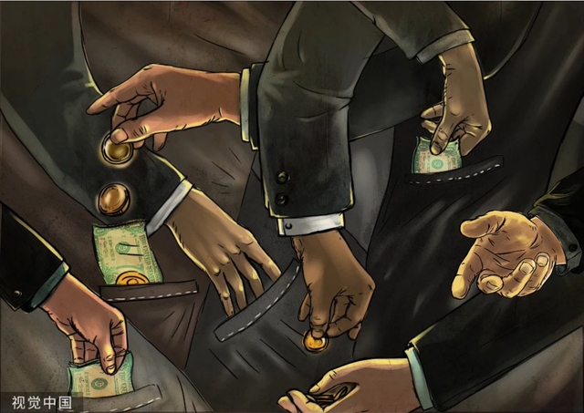

# 一个东北院长落马样本：哈医大一院周晋案一审细节披露

3月17日，哈尔滨医科大学附属第一医院（下称“哈医大一院”）原院长周晋受贿案一审公开开庭审理，案件更多细节再披露。

据大庆市人民检察院指控：2004年3月~2019年9月，周晋利用其哈医大一院院长职务便利，非法收受的财物折合人民币共计2204万余元。

早在1年半前，2021年10月，周晋涉嫌严重违纪违法的调查通报第一次传出。当时，退休两年的周晋南下深圳，正担任南方科技大学附属医院血液科主任，他曾表示，“想看看改革开放的先行地，感受开放后的繁荣”。

但事与愿违，周晋最终难逃退休后被追查的命运。

哈医大一院是黑龙江排名第一的大三甲医院。周晋被查时，医疗圈反腐开始在大三甲院长的头上“动刀”，周晋被查的消息一时震动东北、乃至全国医疗圈。

在血液病领域，周晋是国内知名的专家。在黑龙江，哈医大一院、二院、三院、四院，再加上哈尔滨市人民医院，几乎垄断了整个黑龙江医疗板块，而周晋掌管的哈医大一院，是其中的绝对龙头。

“一众院长中，周晋最难接触，他办公室所在地，有专门的保安把守。”某东北地区的药企工作人员告诉八点健闻，“几乎所有院长都防着别人送钱，他们只收安全的钱。”周晋这种级别的院长所经手的大项目，往往都有长久的利益纽带牵扯其中，“大家或许不会轻易打破这种平衡”。

在不少人看来，周晋一直比较低调。

但另一面，多位受访者也表示，周晋长达15年的医院管理中，在外界看来，几乎没有留下印象深刻的发展大事记。甚至有人说，“哈医大一院，在周晋来之前是当地老大，在周晋走后还是当地老大。”

也有一位医疗律师表示，周晋长达15年的任期也并非寻常。“任职规定里明确说，一个人同时在院长岗位上连续干满两届的话，就不得再继续连任，”他补充道，“要么就是医院离不开他，要么就是违纪违法。”

在周晋被调查的近两年里，中国医疗圈里大三甲院长，被查和落马不断。

落马的院长中，不乏业界“能人”，不仅是专业领域的领军人物，在医院运营上也都是数一数二的，周晋正是如此。

要理解这批在中国公立医院特殊发展阶段大权在握、缺少监管的医院一把手，理解他们如何行至高处又匆匆下坠，周晋或许是个有代表性的切入点。

周晋背后：“塌方式”腐败，黑龙江医疗圈的浮动

在哈尔滨医疗圈，几家说得上名号的医院，都曾在近几年发生过或大或小的贪腐事件。

而提起震撼哈尔滨乃至整个黑龙江医疗圈的贪腐事件，不得不说被查处的哈医大四院原院长申宝忠。

2018年，申宝忠被查，因受贿1613万余元，被判10年。一位曾在东北工作多年的药企工作人员告诉八点健闻，申宝忠的倒台震撼了整个黑龙江医疗圈，无人不知。

申宝忠作为中国医疗影像界的带头人，在分子影像学研究方面做出过重大贡献，江湖地位昭然若揭，上述工作人员进一步强调了他对医院经营的才能，“他一手带着哈医大四院从一个铁路中心医院发展到如今规模，与哈医大一二三院、黑龙江省医院，一同代表黑龙江医疗的最高水准。他的倒台，让不少人唏嘘叹惋。”

申宝忠被抓，正式开启了近五年来黑龙江医疗圈的浮动。

相较之下，周晋显得平稳多了。

一位旁观者甚至评价：在周晋掌管医院的15年里，医院一直处于一个比较平稳的状态，至少没有发生重大事故，像一种“不求有功，但求无过”的状态。不像当时哈医大二院，还出过天价医疗的事故，哈医大二院院长因此下台，后去到哈医大四院做科主任。

这样的评价，耐人寻味。

从另一个角度看，周晋近乎完美地平衡了学术的精进与官场的钻研，有人对此评价为，“周晋是医生里面最会做官的，谁能比得上他？也是官员里面最会治病的。”

自博士毕业后就进入哈医大一院血液风湿内科，周晋此后的25年里从未离开过这家医院，他的仕途也“一帆风顺”。

入院短短一年，周晋便从医师升级为副主任医师，四年后成为了血液风湿内科的主任。此后三年里，周晋实现三级跳，主任升为副院长、副院长升为党委书记，最后直接坐上了哈医大一院的头把交椅，成为院长，一坐便是15年之久。

担任院长职位期间，周晋身兼数职，担任过中国疾病预防控制中心地方病控制中心副主任、哈尔滨医科大学口腔医学院院长、省血液肿瘤研究所所长、哈尔滨医科大学血液肿瘤医院院长。

有业内人士向八点健闻评价，周晋是“典型技术流，做医生出身的院长，非常难得”，而他也进一步强调，正因周晋从底层一点点干起来，反而更容易被“纳入到监察的管制体系里”。

2019年光荣退休或许是周晋人生的至高点。

退休之后，他选择南下深圳，担任南方科技大学附属医院血液科主任，彼时，东北出现一波医生“南下潮”，人才大量流失。仅两年后，本已平稳落地的周晋再次回到监察的聚光灯下，重新北上接受调查。

很多人对周晋的落马并不意外。在此之前，哈医大一院已发生多起腐败事件，被逐步连根拔起的，似乎是一整个贪腐团队。

2019年11月，周晋退休前夕，哈医大一院副院长刘宏宇以受贿罪判处有期徒刑十年。此后一年，哈医大一院副院长徐永欣、林志国接连被查。两年时间里，哈医大一院共三位副院长相继落马。

其中，有报道称，刘宏宇、徐永欣、林志国曾一起在医院共事多年，三人关系十分微妙。哈医大纪委有关负责人曾表示，少数医疗机构工作人员与供应商在医药购销环节，内外勾结，利益链条环环相扣。

“塌方式”腐败是医疗反腐的特点之一，禁不住诱惑是众多官员陷入沉沦的导火索。

但一条利益链条上往往有好几个人。

“别人都收了，你若不收，恐怕都难以在医院立足。”一位医疗律师表示，很多被通报的官员，整个职业生涯从未清廉，在年轻的时候就已经被架上了这趟列车，只能沿着轨道继续往下走，最后眼睁睁看着这趟列车驶入深渊，而无法抽身。

而哈尔滨医疗圈的贪腐震荡不止，与东北的整个社会风气也相关。

一位医疗公司高管向八点健闻透露，中国是人情社会，东北更甚。在东北，很多事用逻辑是行不通的，必须得有关系。尽管现在实行药品耗材零加成，但医疗器械企业、药企的产品要进医院多少需要上下打点。

2016年左右，全国大部分地区早已禁止医护收取患者红包，但东北某家医院的主任办公室门口，早上还有很多排队来送红包的患者。

中国医疗圈最乱的年头，大面积的“灰色地带”

在周晋一案中，15年，共非法收受2204万余元。

这并不是一个惊人数字。

自2018年以来，在已经查处的诸多院长贪腐案件中，三甲医院院长受贿金额2000万元以上是“常规操作”。

一位医疗律师认为，单是医院引进新设备就需要大几千万，而医院如果要扩建新院区起码也要几个亿，“一个院长一年过手这么多钱，目前披露的2000多万算比较少。”

也有东北地区卫健委某官员表示，对于这种省会级这种龙头医院来说，这2000多万还算正常，“不算少，也不算多。”但对于2000多万是否这是真实数字，他进一步表示，“据说也有检察院会‘画’一条线，院长交代到一定金额，检察院会告诉他够了。”

不过，也有与哈医大一院曾有往来的医疗企业高管有不同看法。结合哈医大一院的营收情况以及年代来看，他认为两千万不算少。尽管哈尔滨是黑龙江资源最集中的地方，但经济形势也不容乐观。该高管所在的企业曾与哈医大一院有过合作，但尾款久久未能付清。“可能哈医大一院的财政并非想象中的宽裕。”

值得注意的是，周晋担任哈医大一院院长的15年，经历了中国医疗行业监管由松到紧的过程。

上世纪八十年代，为了弥补我国卫生投入的不足，“以药养医”成型落地，医院拿“优扣”、医生拿“回扣”被视为正常的收入来源，医药代表进进出出医院司空见惯。

潘多拉魔盒被开启，公立医院的发展经历了一个野蛮生长的时期。药品配送、设备采购、耗材供应、工程建设，腐败无孔不入，医院医生收受贿赂成为公开的秘密。

相比于普通医生的受贿集中在药械购销、处方、检查单开具等环节，院长的寻租范围更广，无论是单次受贿还是受贿总额，都远远大于“计件”拿钱的普通医生。

在医疗设备采购中，如果院长参与拿回扣，比例一般可达10%~20%，山东省淄博市第八人民医院原院长段明福曾经有一次刚批准了采购1200万元CT设备，就收到了供货商给的存有110万元的银行卡。

除了准入环节的寻租空间，医院长期存在的拖欠货款，也可以用于寻租。在青海省第五人民医院原院长柴多的案件中，因为迟迟拿不到货款，飞利浦代理商就给了他10万元，收钱后，柴多才给设备科负责人“打招呼”催促付款。

支付环节也有油水可捞。十几年前，患者在医院支付往往是办一张卡存钱消费，住院也好、看病也好，账户里总有一些结余，这些资金就形成了沉淀资金。

上述企业高管介绍说，“这种现象在大型的医院里大量存在，比如浙江有一家医院，沉淀资金有十几个亿，而当地人比较富裕，大概率不会追回这笔钱。沉淀资金在几年前被有支付牌照的公司接管以前，诱惑力巨大。”

当下，监管尺度收紧，灰色地带的空间也不断压缩，集采后院长贪腐的空间变得更小。但财政吃紧，医院每年的消耗不会减少，于是，工程基建成为院长们最容易栽跟头的地方。

研究近些年院长落马的通告不难得出一个结论：院长要贪腐，触手或早或晚会伸到工程基建上。

两三年前，公立医院开始大肆圈地跑马，盖新楼建新院，动辄上亿，庞大的资金如水流来，比吃药品耗材回扣来得更多、更快，落马的院长很多沾染过工程款项。

一位药企工作人员说到，“做工程的人比医疗圈的人更复杂一点，所以院长更容易在这个地方翻车。院长通常和医疗圈的人有固定利益关系，但做工程的人可不一定会认同这个圈子的潜规则。”

医疗反腐开始聚焦“关键人物”

打大虎，已经是这两年医疗圈反腐的主要方向。

据八点健闻不完全统计，截至周晋案一审前夕，2023年已有37位医院院长、党委书记等医院高层管理人员因贪腐问题落马。

医疗反腐冲击波甚至蔓延到医疗教育圈——3月14日，南方医科大学党委书记陈敏生被公开落马。实际上，这一消息从2月初就开始流传，一时震动岭南医疗圈。

有医管专家向八点健闻表示，医疗反腐跨入到了新阶段——目光落在了所有医疗机构的“关键人物”上。

而医院院长，已然成为一个“高危职业”，风险的背后是权力，院长权力背后是医院坚固的优势生态位。

作为医疗领域的消耗大户，医院要买地、建房、买设备、供水供电、买药和耗材……几乎是“永远的甲方”。而在决策过程中，院长的话语权很大，每一个决定都牵连着方方面面。

然而，这一权力或许至今都缺乏制约。

这和医疗的特性有一定关系。一位业内人士告诉八点健闻，不论是国企还是私企，上市公司会受到证监会的严格监管，财报等数据都是公开透明的；但医院更像是一个黑箱，财务上有特殊性，监管单位只能从进出账目、治疗合理性、医保等方面入手，“很难管”。

2018年，《监察法》将公立医院管理人员和企业管理人员纳入监察范围。此前，很多医院的院长本身在卫健委担任职务，有当事人想投诉医院腐败、到卫健委立行政违法案件时，经常无法立案。

“这就像在一场比赛中，院长既当裁判员，又当运动员，所以外部监管很难。但2018年监察委成立后，将医院的体系纳入监察系统，外部监管力度随之加大。”该业内人士称。

有医院内部人士表示，在近几年的严格打击和政策约束下，贪腐空间依然越来越小，未来类似案件会越来越少。

即便集采和零加成一定程度上制约了贪腐空间，但“对策”是有的，比如说“院边店”。

“零加成刚提出来时，大家用的是院边店，在医院地下或者外面开一个药店，这个药店虽然进到医院是零加成，但药店里面仍然有利润的。”一位药企方的业内人士说，“药店就相当于医院的小金库，它可以源源不断地把利益再输送给医院做补贴。”

大权在握，监管缺乏，院长不可避免地成为重点围猎对象。

这对人性是很大的考验——有人认为，院长腐败就是个人行为，越爱弄权、权力越集中的人风险越高。

同时，作为一院之长，无时无刻不处于关系场中，这考验着院长个人“八面玲珑”的水平。通常情况下，院长并不是缺钱，但是在一些社交场合下不得不收；如果不收，会被认为不识趣，“不懂社交”。

另外，“礼尚往来”和“行贿受贿”之间的界限并不清晰。正如一位知情人士所言，一座城市的医疗圈子不大，业务往来频繁，几十年相处下来成为朋友，日常走动、吃饭送礼十分正常。或许正因此，不止一个受访者表示“没有禁得住查的院长”，尤其是在讲究人情往来的北方地区。

一名业内人士表示，为了控制风险，几乎所有院长都会防着送钱的人，只收“安全的钱”。

复杂的业务和成长路径赋予了院长多重身份：医生，科学家，社会活动家，企业家，管理学者。

但这并不意味着院长在各个身份上都足够专业。

一位三甲医院副院长告诉八点健闻，有时他甚至不敢在一个几百万的设备采购单上签字。作为非专业人员，他不懂招标采购的项目细节，无法判断一个项目资金流动合规与否；而签字意味着确权，无法规避的诱惑及风险随之而来。

在一名医管专家看来，院长不做决定就不会接触诱惑，也就不会犯错；但是不做决定无法发展，一旦决定发展，被诱惑和犯错的风险也就随之上升。甚至有业内人士直言，如果一个院长不擅长和企业交往，就会影响医院整体发展。

这意味着院长们必须在“谋求发展”和“控制风险”中探索平衡。

或许正因此，所有人都认同“院长难当”。一名院长直言，“能够把一个医院做成功了，随便到哪个国企当个老总，都不在话下。”

但在那般特殊的发展阶段下，试着去定义“好院长”的标准，却显得愈加艰难。

不止一位受访者认为，在当下的现实里，似乎能带着医院挣钱的院长，就是好院长。

**唐卓雅 张晓艺丨撰稿**

**李 琳丨责编**

**本文首发于微信公众号「八点健闻」，未经授权不得转载**

