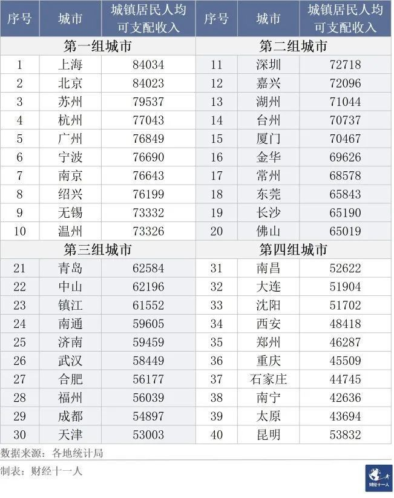
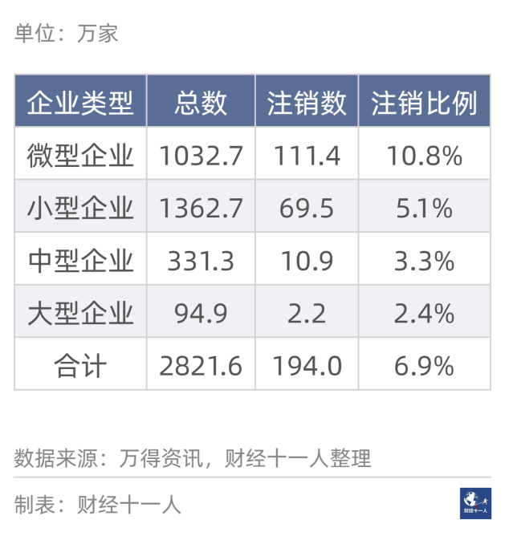
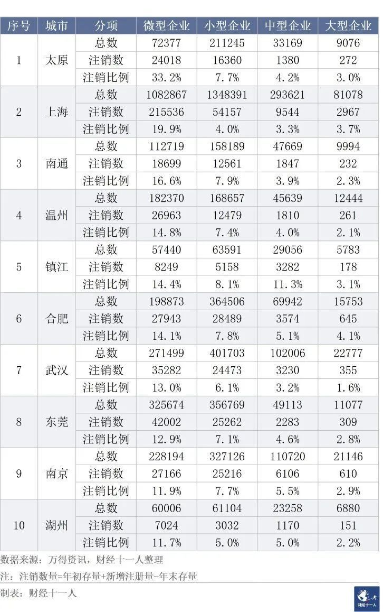
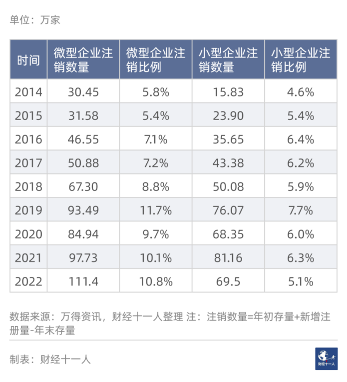
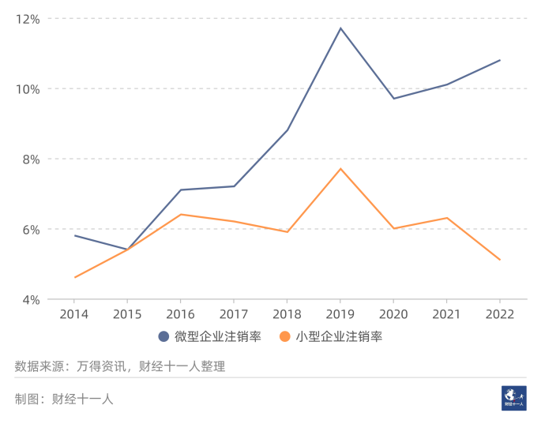
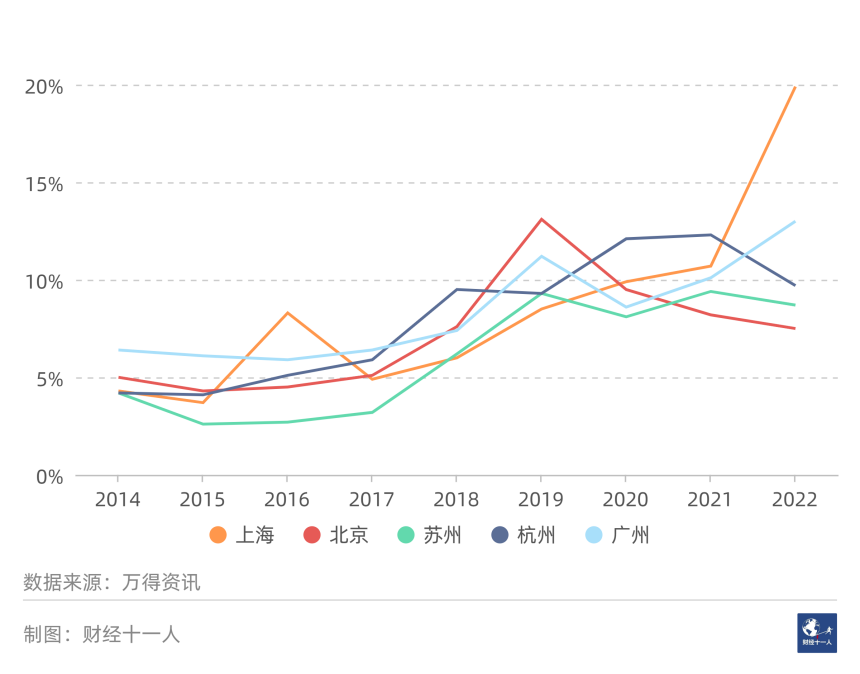
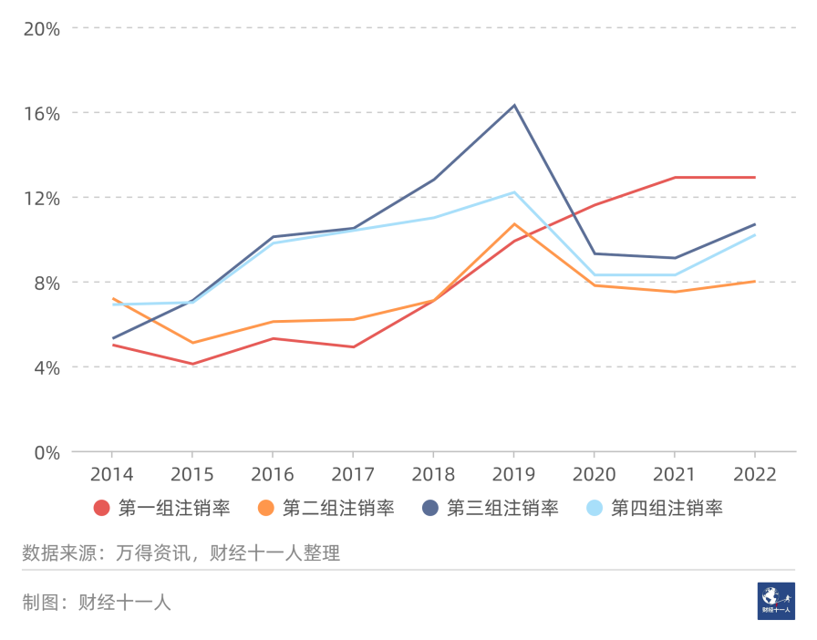
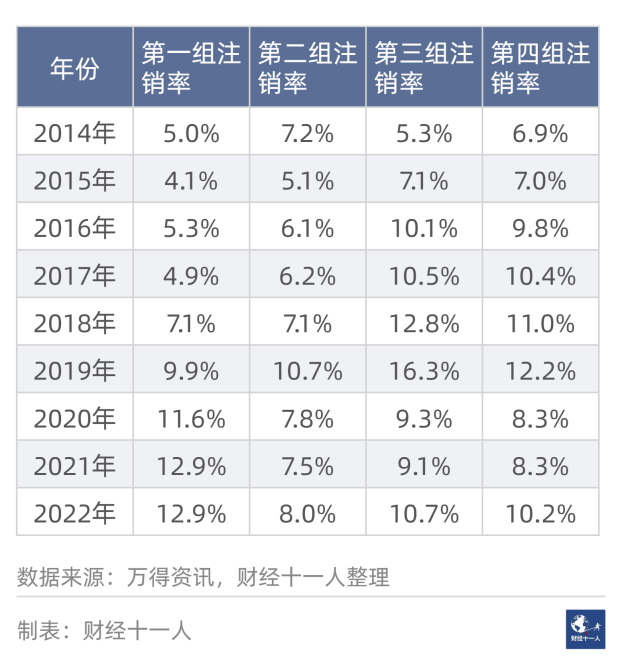
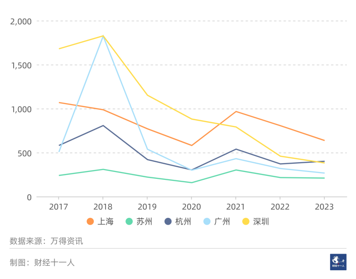

# 中国重点40城，九年间消失了多少企业？

_图/视觉中国_

文 | 刘建中 陈汐

编 者 按

疫情三年，关门歇业似乎比以前更加常见。我们想知道每年有多少企业不复存在？疫情期间企业注销比例是否大幅上升？各类企业生存状态有何不同？但目前鲜有文章揭示这些信息。本文是在这个方向上的一个努力。

本文数据来自于官方，但由于经济的复杂性，文章关于如何判断经济周期的结论可看作一家之言，供读者品评。

**本文主要结论如下：**

第一，在经济景气时，“重点40城”各组城市的微型企业注销率都约为5%-6%；而在不景气时，注销率可达10%以上。极端情况下，某些城市可以达到20%。

第二，本轮经济周期下行开始于2016年，而不是2018年的中美贸易战，也不是2020年的疫情。

第三，当很多城市的微型企业注销率开始显著下降，并不能由此判断经济开始复苏。

**以下是正文。**

众所周知，注册之后，企业出现；注销之后，企业消失。竞争中优胜劣汰，一些企业出局，一些企业入局，新陈交替并不是坏事。

但如果在很多重要城市中，都发生了企业注销数量快速上升的现象，却应该引起政策制定者的重视。这可能预示着经济下行周期的到来。

什么是“重要城市”？首先人口多，本文设定的筛选标准是人口大于300万。其次，为了研究老百姓的富裕程度对企业生存的影响，我们优先选择了富裕的城市。

“可支配收入”是百姓真正能用于消费、储蓄、投资的收入。所以和人均GDP相比，“人均可支配收入”更能反映老百姓的富裕程度。而对于企业，尤其微型、小型企业，民间购买力是影响其生存的关键因素。

我们利用富裕程度、人口数量、城市层级等标准，选出了40个对中国经济举足轻重的城市，文中简称“中国重点40城”或“重点40城”。这40城，按照居民富裕程度分为四组。如表1所示，第一组最富，第二组其次，第三组再次，第四组最低。具体筛选方式见尾注1。

_表1: “重点40城”分组情况_

下面看看，2014年-2022年的九年间，“重点40城”有多少企业被注销？注销情况有何规律？先看看2022年的情况。

**2022年“重点40城”注销了多少企业**

**2022年，这40个城市的企业总数为2821.6万家，注销总数为194万家，注销比例为6.9%。这40个城市常住人口为4.27亿，约占我国人口的30%。全国企业注销数量，可以由此大致推算。**

为了便于分析，本文把企业按照注册资本金额分为四类。这种分类方法和常用的认定方法不同，仅为方便本文讨论。

下文称注册资本小于100万元的企业为 **微型企业** ；

称注册资本在100万元到1000万元之间的企业为 **小型企业** ；

称注册资本1000万元到5000万元之间的企业为 **中型企业** ；

称注册资本在5000万元以上的企业为 **大型企业** 。

“重点40城”的大中小微四类企业的注销情况如表2所示。

_表2:
2022年重点40城市中四类企业的情况_

**不难发现，企业规模越大，注销比例越低。** 微型企业的注销比例远高于其他类型企业：微型企业是小型的2倍多，是中型的3倍多，是大型的4倍多。

在所有注销企业中，小型企业和微型企业占了绝大多数。微型企业的注销数量占所有注销企业的一半以上（111.4 / 194=57.4%）；

而小型和微型企业的总注销数量占所有注销企业的93%以上 **【（111.4+69.5）/194=93.3%】** 。

表3展示了2022年“重点40城”微型企业注销率排名前10的城市，以及它们各类企业的注销情况。

_表3:
2022年“重点40城”微型企业注销率排名前10城市的情况_

2022年上海由于特殊情况，微型企业消失了21.6万家，注销企业数量排名全国第1。注销率为19.9%，排名第2。但上海小型企业注销比例仅约4%，中型企业为3.3%，大型企业为3.7%。这反映了微型企业抗风险能力较弱，更容易受到经济波动的影响。

2022年太原微型企业注销率高达33.2%，排名第1。看太原所辖市区数据，发现各区注销率都很高。比如企业数量较多的小店区，微型企业注销率为32.4%，与太原全市的水平基本一致。

在这10个城市，虽然微型企业的注销率都超过了11%，但大型和中型企业的注销率很少超过5%。

**2014年-2022年“重点40城”的企业注销率**

表4展示了2014年-2022年九年间，“重点40城”小型和微型企业的注销数量和比例。

_表4：2014年-2022年“重点40城”微型和小型企业注销的数量和比例_

2014年和2015年是本轮经济周期中景气度较高的年份。表4和图1显示，2014年和2015年，“重点40城”微型企业的注销比例低于6%。

_图1:
2014年-2022年“重点40城”微型和小型企业注销率变化_

图1中，2016年微型企业注销率开始显著上升，此时约为7%；2018年上升到8.8%；2019年达到峰值11.7%；之后注销率略有回落，但数值仍然很高，约为10%。

**微型企业注销率和经济景气度有怎样的关系？**

可以看出，2014年-2022年随着经济从景气高峰向不景气运行，“重点40城”微型企业注销率大体呈现上升趋势。

小型企业的变化趋势类似于微型企业，但不完全相同。小型企业的注销率2016年-2019年比2015年显著上升。2019年达到最高值，2020年之后有所回落。这反映了小型企业抗风险能力强于微型企业。

**需要注意，2014年和2015年的微型企业注销率显著低于2016年之后的数据。从2016年开始，微型企业注销率显著提升，反映出经济形势已经开始走弱。**

所以，本轮经济周期的走弱并非起始于2018年的中美贸易战，更不是2020年的疫情。实际上，微型企业注销率显示，中国经济从2016年已经开始走弱。

**城市富裕程度如何影响企业注销率**

本文的一个研究重点是，城市居民的富裕程度如何影响企业注销率。因为微型企业注销率的变化趋势最为明显，所以我们仅比较微型企业的注销率。

先看“重点40城”中最富裕城市的情况，也就是排名第1到第5的城市。它们是“上北苏杭广”。

_图2:
五大城市2014年-2022年微型企业的注销率变化_

如图2和表5所示，2017年以前广州微型企业注销率一直在6.5%以下，其他4个城市的注销率基本都在6%以下。

2018年，它们的注销率都开始显著上升；而2019年五大城市的数值都继续上升，其中北京、苏州、杭州、广州上升到约10%的水平。2020年之后，五大城市的注销率基本都保持在8%以上。

_表5：2014年-2022年五大城市的微型企业注销率_

下面分别看看“重点40城”第1到第4组城市的情况，第1和第2组代表富裕城市组，第3和第4组代表相对贫穷的城市组。

**如图3和表6所示，第1和第2组2017年以前数值比较低，2018年显著上升，2019年达到约10%的水平，2020年之后继续保持高位。这和五大城市的情况非常类似。**

_图3:
2014年-2022年第1到第4组城市的微型企业注销率_

第3和第4组城市，2014年-2015年的注销率较低，数值略高于第1第2组。但是2016年，微型企业注销率就上升到接近10%。2017年-2019年数值继续上升，2019年达到峰值，之后稍微回落。

_表6：2014年-2022年第1到第4组城市的微型企业注销率_

从上述情况看，城市的富裕程度如何影响微型企业的生存状态？

在经济景气的时候，富裕城市（第1和第2组）和不富裕城市（第3和第4组）的微型企业注销率都比较低。

当经济从景气向不景气演化过程中，不富裕城市的注销率首先显著提高，而且远远高于富裕城市（如图3或表6中2016年-2018年所示）。

当经济不景气持续多年，富裕城市和不富裕城市的注销率区别变的不再明显（如图3或表6中2020年-2022年所示）。

**为何当经济不景气持续多年，富裕和不富裕城市的微型企业注销率区别不再显著？**

一个可能的解释是，不富裕城市首先进入经济寒冬，前几年已经将“体质较弱”的微型企业淘汰。这时，富裕城市才刚刚入冬，富裕城市中存在“体质较弱”的成员，而不富裕城市中剩下的企业却是抵抗力较强的精英。

也正因如此，虽然2020年-2022年第3和第4组城市的微型企业注销率有所下降，但不能判断经济回暖。不是天气变暖了，只不过剩下的都是抗冻的精英。

**结论和启示**

本文有三点结论。

**第一点结论：**
在经济景气时，“重点40城”各组城市的微型企业注销率约为5%-6%；而在不景气时，注销率可达10%以上。极端情况下，某些城市可以达到20%。微型企业抗风险能力弱，在经济不景气时，其注销率远远高于其他类型的企业。

**得到的第一点启示：** 当发现经济开始下行，应积极优化微型企业的生存环境。否则微型企业会大比例消失，这也会成为推动经济下行的一股力量。

**第二点结论：**
本轮经济周期下行开始于2016年，而不是2018年的中美贸易战，也不是2020年的疫情。“重点40城”第3和第4组的微型企业注销率从2016年就显著提升到约10%，这表明经济已经开始下行。

**得到的第二点启示：**
“重点40城”第3和第4组的微型企业注销率可以作为一个观察指标，用于观察经济景气度。当这些城市组的微型企业注销率显著上升，说明经济景气高峰已过。

**第三点结论：** 当很多城市的微型企业注销率开始显著下降，并不能判断经济开始复苏。

2020年-2021年，第3和第4组城市的微型企业注销率下降，但这并不能说明经济复苏。因为经历了几年不景气，体质较弱的微型企业已经被淘汰。剩下的微型企业抗风险能力较强，所以注销率下降了。但这并不能说明，经济好转和信心增强。

**判断经济复苏，要看其他数据。比如在相关研究中，我们发现新增大型企业数量上升是经济复苏的一个标志。这背后的道理也容易理解：大企业注册资本大于5000万元，虽然注册资本不需要全额实缴，但大企业的新增数量仍然可以反映经济信心。**

**而且，新增大型企业的经济活动又会成为带动经济向上的一种动力。**

北上广深苏杭是中国经济最强的六个城市。目前北京的数据还没有更新，我们看看其余五个城市的数据。图4是上海、广州、深圳、苏州、杭州各年1月和2月累计新增大型企业的数量。

_图4:
2017年-2023年五大城市1月和2月份累计新增大型企业数量_

从图4看，2023年2月这五大城市新增大型企业数量仍处于低位。除了苏州，其他城市的数据远低于2018年，也低于2021年和2022年。所以目前还看不到投资信心的增强，也还看不到经济复苏的迹象。

**尾注：“中国重点40城”选取方法**

第一，首选富裕的城市。在富裕城市中，企业活力较强，抗风险能力也较强。下表列出了2022年城镇居民人均可支配收入排名前30的地级以上城市（不包括香港、澳门、台湾）。从表7中排除人口小于300万的城市：舟山、珠海、马鞍山、东营。最终得到了26个城市。

_表7：中国城镇居民人均可支配收入30强_

第二，加入以上26个城市中未包含的直辖市：天津、重庆，得到28个城市。

第三，加入以上28个城市中未包含的非省会副省级城市：大连，得到29个城市。

第四，加入以上29个城市中未包含的、GDP总量排名靠前的11个省的省会城市：郑州、成都、福州、合肥、石家庄、西安、南昌、沈阳、昆明、南宁、太原。

天津虽然人均可支配收入略低于昆明，但考虑到天津直辖市的低位，将天津归于第3组。

通过以上方式，最终得到中国重点40城名单。从整体看，这40个城市中排名1-10的城市为第1组，居民比较富裕；11-20名为第2组，居民财富次之；21-30名为第3组，居民财富再次之；31-40名为第4组，居民财富最低。

作者为《财经》产业研究中心研究员，编辑：刘建中

