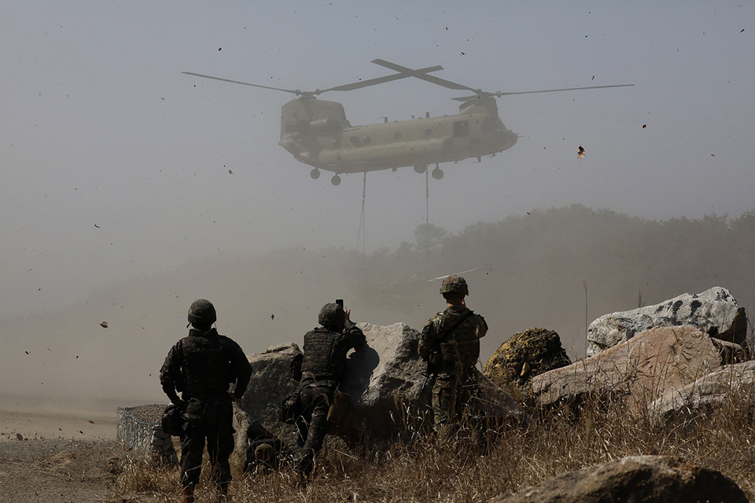

# 射弹怼联演，朝鲜半岛“军演链”酝酿新危机

_当地时间2023年3月19日，韩国抱川，罗德里格斯靶场，一架支努干直升机携带M777榴弹炮在野战炮兵营的火炮突袭演习中，这是联合自由护盾(FS)演习的一部分。
（视觉中国/图）_

半岛上空的战机轰鸣声刚过，韩美“史上最长”的联合军演就再度拉开帷幕。

当地时间2023年3月13日，韩美两国军队正式启动“自由护盾”联合军演，为期11天。这是韩美5年来最大规模的联演，也创下了历届演习时长之最。此次演习只是韩美2023年谋划的二十余次军演“链条”上的最新一环。

针对韩美之间频繁的双边军演，朝鲜密集进行各类导弹发射。“自由护盾”联合军演启动前后，朝鲜于12日和14日连续射弹强势回应。朝鲜外务省发表声明警告，“将针对美国及其追随势力最卑鄙的敌对阴谋活动采取超强力反制措施”。

军演与射弹接连展开，朝韩之间以硬碰硬，半岛局势的不确定性越来越强。

韩美联手打造“军演链”

据韩国国防部消息，“自由护盾”联合军演将持续至3月23日，旨在“检查联合防卫态势”，进一步加强韩美同盟应对能力。韩国纽西斯通讯社3月13日报道提到，美国“尼米兹”级核动力航母、“宙斯盾”驱逐舰、核动力潜艇等均有可能亮相此次军演。

尽管驻韩美军发言人艾萨克·泰勒此前在联合新闻发布会上表示，此次演习是一次例行演练，纯粹是防御性的，但在联演的第一天，韩美两军就跳过防御演习阶段，直接进入了“击退和维持朝鲜地区稳定”的演习当中。

按照韩联社的说法，此次演习期间，联合野外实兵机动训练规模将升至过去的“鹞鹰”（FE）韩美联演水平。这意味着文在寅时期叫停的战区级韩美联合实兵机动演习时隔5年后再度启动。

自尹锡悦政府上台以来，便频繁与华盛顿展开军演，将朝鲜半岛变成了练兵场。2月17日，朝中社刊发题为“朝鲜民主主义人民共和国外务省发言人发表谈话”的文章，其中提到，美国和韩国筹划2023年进行二十余次联合军演，企图开展史上最大规模的野外机动战术训练。

近段时间，接续不断的“军演链”已经在朝鲜半岛悄然形成。自2022年8月韩美重启中断将近5年的“乙支自由之盾”大规模联合军事演习以来，两国不是在军演，就是在准备军演的路上。

2022年9月，韩国和美国海军在朝鲜半岛东部海域启动联合军事演习，美国“里根”号航空母舰及其随行舰艇参与演习，这是自2017年以来，两国首次举行有美国航母参加的联合军事演习；10月下旬，继17日至28日在韩国全境举行大规模实兵机动的“护国军演”后，两国又展开史上规模最大的“警戒风暴”韩美联合空中演习。

2023年开年以来，韩美双方在演习上依旧动作频频。此次“自由护盾”联合军演之前，首尔和华盛顿已连续在朝鲜半岛西部海域和韩国中部内陆上空进行了4次空中演习。此外，2月22日，韩美国防部在美国举行第8次延伸威慑手段运用演习，五角大楼称，(兵棋推演)情景主要集中在朝鲜使用核武器的可能性上。

“多年来朝鲜半岛问题起起伏伏，此番韩美军演是半岛形势不断起伏波动的一种继续。”复旦大学国际问题研究院任晓教授向南方周末表示。

韩国前总统文在寅执政期间，对朝奉行“阳光政策”，大规模军演大幅减少，向平壤释放善意，半岛局势一度有所缓和。

尹锡悦政府上台以来，一改此前的对朝怀柔政策，选择一边倒向美国，配合美国使朝鲜半岛局势升温，以此提高韩国在美国联盟体系中的地位和分量。尹锡悦曾直言不讳地表示，前任自由派政府的和解策略是无效的，“安抚朝鲜的时代”已经结束。

对于尹锡悦的表态，多位专家学者分析指出，韩美两国试图通过军演实现多重战略目的。

山东大学韩国研究中心主任毕颖达教授表示，强化同盟关系是韩国保守派的一贯做法。韩美军演名义上是应对朝鲜核导威胁，同样包含着强化美日韩三边军事安全合作、构建多边同盟体系的意图在内。

自拜登执政以来，以“俱乐部”多边主义重振联盟体系成为美国外交战略中的核心部分，通过朝核问题将美日、美韩双边轴辐体系增强为三方安全串联符合拜登的外交战略设计。

据多位专家分析，美国利用朝核问题使日韩同时加大对东北亚区域战略资源的投入，不仅分摊了美国的区域战略投入成本，还调动了两大盟友的政策自主性和积极性，为印太战略推进提供了内生性动力。

朝鲜射弹应对

对于韩美军演的高频次施压，朝鲜则不甘示弱还以颜色。

3月12日，在韩美启动大规模军演前夕，朝鲜“8·24英雄舰”潜艇在朝鲜东海景浦湾水域发射了两枚战略巡航导弹。《日本时报》称，最新的潜射训练已发出最新信号，表明朝鲜能够采取实际行动，而不是空谈。

两天后，朝鲜导弹再度升空。韩联社援引韩国联合参谋本部的消息报道，朝鲜3月14日上午7时41分至7时51分许从黄海南道长渊郡一带向韩半岛东部海域发射了2枚短程弹道导弹（SRBM）。韩联社报道指出，这是朝鲜今年第五次发射弹道导弹，距离上一次仅过去了5天。9日傍晚，朝鲜在南浦附近发射了6枚近程弹道导弹（CRBM）级导弹。

韩联社3月14日社评文章表示，接连发射巡航导弹和短程弹道导弹，这表明朝鲜将采取措施应对韩美联合军演的宣示绝非说说而已。

与此同时，朝鲜对外宣传网站“我们民族之间”13日也发文警告，这场前所未闻的战争演习将把原本就尖锐对立的朝鲜半岛局势推向难以收场的危局。

伴随着韩美军演，朝鲜已于今年陆续进行了洲际导弹、战术弹道导弹、巡航导弹以及超远程火箭炮的发射。

任晓指出，朝鲜对美国的惯性思维就是不能示弱，进行射弹“以超强硬对强硬”，是朝鲜的常规化应对手段。“朝鲜此次的‘硬碰硬’，更加强了威慑美韩的色彩。”毕颖达补充道。

值得一提的是，2月18日，朝鲜成功发射了洲际弹道导弹“火星-15”。日本防卫大臣滨田靖一表示，推测导弹实际飞行69分钟，射程最远超过1.5万公里，可涵盖美国本土。随后，朝鲜劳动党中央委员会副部长金与正发表谈话称，朝鲜将太平洋当作本国射击场的频率取决于美军行动的性质。

不难看出，朝鲜希望通过试射洲际导弹、精准打击等方式来构建“核对核”的对等威慑力，对美韩释放“超强硬回应”的战略信号，意图将美韩制造的“单边核威慑”转变为“相互保证摧毁”的双向核威慑态势。

半岛对抗加剧

在半岛循环往复的军演与射弹中，核问题成为一个绕不开的话题。

2006年至2017年，朝鲜在东北部咸镜北道的丰溪里核试验场陆续进行了6次核试验。2018年，朝鲜停止核试验，并废弃了北部核试验场。

然而，在韩国国内，“自主拥核”的声音在不断高涨。2023年1月，韩国总统尹锡悦在与国防部和外交部的工作报告会上表示，韩国将考虑自主发展核武器，或者要求美国在朝鲜半岛重新部署核武器。自美国1991年从朝鲜半岛撤出所有核武器之后，这是韩国总统首次正式谈及用核武器武装国家。韩国方面的一份民调亦显示，有76%的韩国民众支持本国独立开发核武器。

面对外界的种种猜测与疑虑，目前朝鲜的回应重心仍然在于通过试射导弹来印证自身的战略和战术打击能力。

韩美与朝鲜轮番展示“肌肉”，引发国际社会对半岛局势的普遍担忧。朝鲜半岛局势在2023年将再度成为地缘政治的热点。

在韩美一改对朝怀柔政策的当下，朝美、朝韩之间的“强对强”态势已经形成，各方都为了提高谈判筹码展现出强硬的姿态，谈判妥协的空间被不断压缩。

其次，地缘政治冲突的大背景下，主要大国之间的战略信任度降低，政策协调意愿减弱，难以形成有效的危机管控机制。

“不过，目前的复杂紧张局势还很难说会发展成新一轮的朝核危机，也不至于激化到擦枪走火的境地。”毕颖达分析指出，朝鲜试射导弹既可以实际提升自己的核打击能力，又能达到回击韩美和反向施压的效果，也可在一定程度上淡化国际社会对其“有核”的关注。

但如果朝鲜重启核试验，无异于是将聚焦于俄乌冲突的全球目光拉回半岛，使朝鲜陷入更加不利的境地。因此，在美韩没有采取极为过激行动的情况下，朝鲜应该也不会轻启核试验。

南方周末特约撰稿 王航

