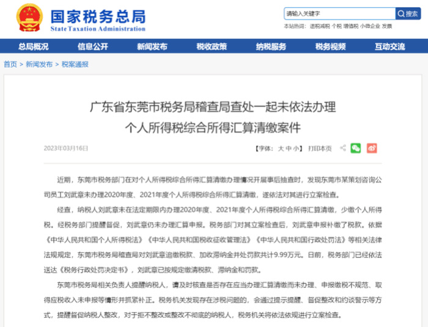

# 广东一男子两年未办理个税汇算，补税加罚金共计近10万

2022年个人所得税(下称“个税”)汇算清缴正在火热进行中，税务总局公开曝光一则案例需引起关注。

3月16日，税务总局官网披露了广东省东莞市税务局稽查局查处一起未依法办理个税综合所得汇算清缴案件。东莞市税务部门抽查发现，东莞市某策划咨询公司员工刘武章未办理2020年度、2021年度个人所得税综合所得汇算清缴，经提醒督促，刘武章仍未办理汇算申报。税务部门对其立案检查后，刘武章申报补缴了税款。

最终根据相关法律法规规定，东莞市税务局稽查局对刘武章追缴税款、加收滞纳金并处罚款共计9.99万元。日前，税务部门已经依法送达《税务行政处罚决定书》，刘武章已按规定缴清税款、滞纳金和罚款。

根据个税法，纳税人取得综合所得需要办理汇算清缴。所谓个税汇算清缴，就是将工资薪金、劳务报酬等四项综合所得收入，减除相应的扣除额等，按照相应税率计税。然后与上一年预缴税额相比，多缴税税务局会退税，少缴税则需要补税。

那么究竟哪些人需要办理个税汇算清缴？税务总局明确了两种情形，一种是已预缴税额大于汇算应纳税额且申请退税的。另一种是当年取得的综合所得收入超过12万元且汇算需要补税金额超过400元的。

根据中国国际税收研究会研究，目前中国办理个税汇算清缴中，大概一半人会收到退税，对于这部分人而言，办理个税汇算积极性高。即便不办理，也被视为不申请退税，并不违法。而真正不愿办理个税汇算且违法的，主要是需要补税的个人。为了避免补税，一些人如前述刘武章索性放弃办理个税汇算清缴。

而这显然违法违规。在经过税务部门提醒督促后，个人如果仍拒不办理汇算清缴，就将被税务部门立案检查。最终个人除了需要补缴税款之外，还需要对滞纳税款之日起，按日加收滞纳税款万分之五的滞纳金，并且面临少缴税款50%以上5倍以下的罚款，最终得不偿失。

上述案例公开曝光，也提醒纳税人应及时办理2022年个税汇算清缴。2022年度个税汇算办理时间为2023年3月1日至6月30日。

东莞市税务局相关负责人提醒纳税人，请及时核查是否存在应当办理汇算清缴而未办理、申报缴税不规范、取得应税收入未申报等情形并抓紧补正。税务机关发现存在涉税问题的，会通过提示提醒、督促整改和约谈警示等方式，提醒督促纳税人整改，对于拒不整改或整改不彻底的纳税人，税务机关将依法依规进行立案检查。

来源：第一财经

编辑：刘丹

