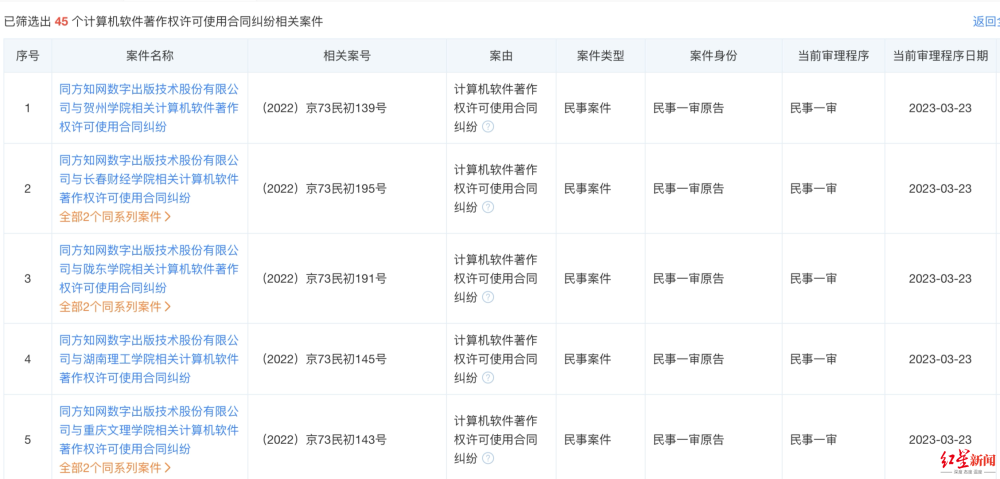
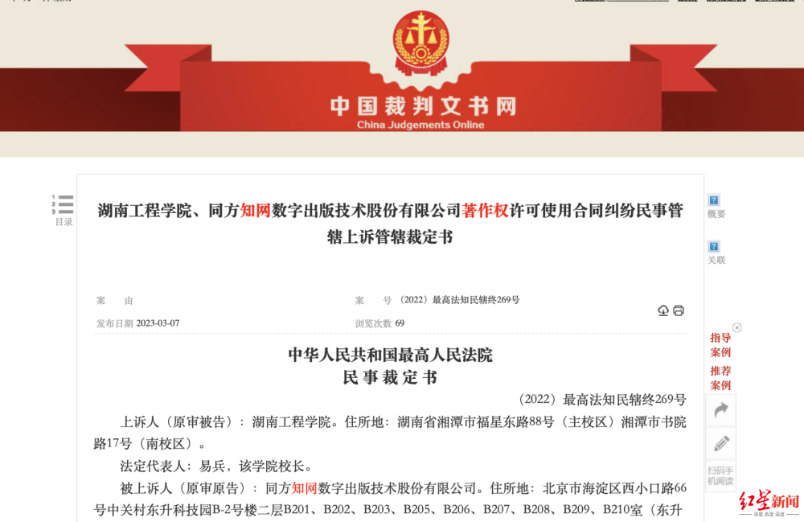
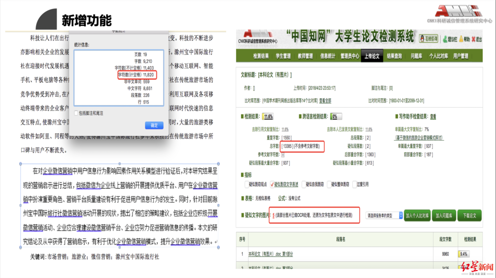
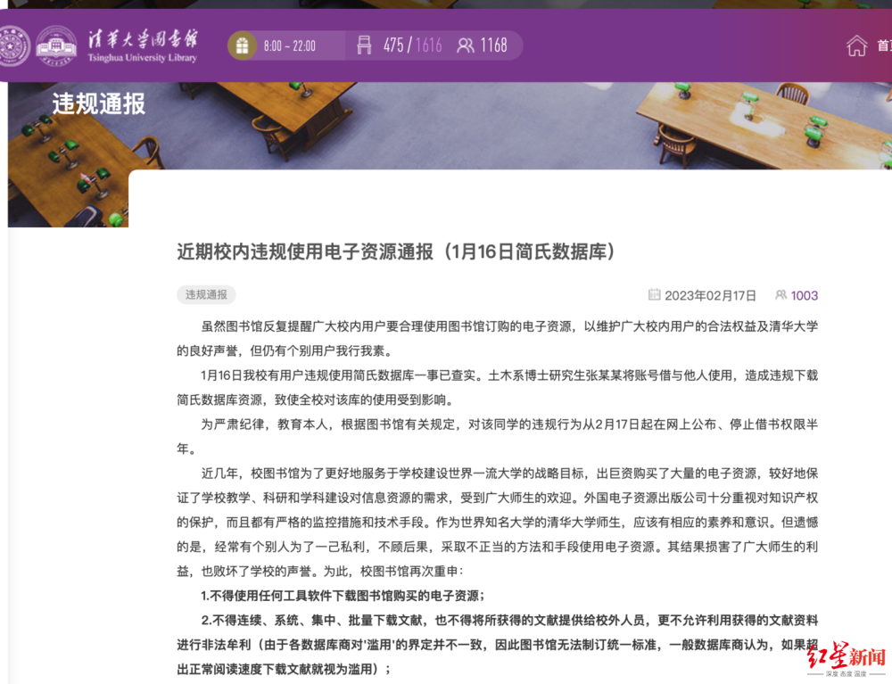

# 知网起诉5所高校侵权，此前曾以同样案由起诉多所高校

3月23日，5所高校被同方知网数字出版技术股份有限公司（下称知网）起诉侵权案将在北京知识产权法院开庭审理，案由为计算机软件著作权许可使用合同纠纷。

3月20日，被起诉高校之一的图书馆负责人向红星新闻介绍，此案涉及的是论文学术不端文献检测系统，即查重系统的数据异常问题，但数据异常存在多种可能。

_↑5所高校被诉
图据天眼查_

此前，知网曾因同样案由起诉多所高校，诉称高校存在违反合同约定，将大量账号直接或间接提供给第三方使用的行为，要求解除合同并支付相应违约金。其中多数案件以知网撤诉结案，也有少数是高校败诉后支付知网赔偿金。

**知网起诉5所高校侵权**

**高校：数据异常存在多种可能**

近日，红星新闻了解到，知网新增多则开庭公告。案件原告为知网，被告包括贺州学院、长春财经学院、陇东学院、湖南理工学院、重庆文理学院在内的5所高校，案由均为计算机软件著作权许可使用合同纠纷，将于3月23日在北京知识产权法院开庭审理。

其中，长春财经学院、陇东学院、重庆文理学院3所高校在2021年12月就曾以同样案由被知网起诉，均因原告知网撤诉结案。

3月20日，被起诉高校之一的图书馆负责人向红星新闻介绍，此案涉及的是论文学术不端文献检测系统，即查重系统的数据异常问题。知网对账号使用情况进行监控检查时，发现数据异常，认为学校间接或直接造成校外第三方人员使用，存在滥用贩卖行为，因此起诉学校。

据该负责人分析，数据异常存在多种可能。“一种情况是，可能是学生放假期间，在家进行了查重服务，后台数据肯定就不是学校的IP地址。也有些老师住在校外，也在校外进行论文查重，因此也不一定是校外人员使用。”

“当然，也不排除有些人为蝇头小利将账号给校外人员使用。”该负责人介绍，一般学校一次性购买的查重次数多，会有一些剩余的免费查重指标。
**据了解，知网合同规定只能在校内IP范围内检测本单位的大学生论文。**

20日，红星新闻就此事采访知网市场企划部负责人，截至发稿时未获回复。

**知网曾以同样案由起诉多所高校**

**称其将大量账号直接或间接提供给第三方使用**

天眼查显示，知网此前曾以同样案由起诉多所高校，包括广西教育学院、浙江越秀外国语学院、兰州城市学院、重庆三峡学院、河北科技大学等在内共14所，集中在2021年12月审理，多数案件以知网撤诉结案，也有少数是高校败诉后解约并赔偿。

以中国裁判文书网3月7日公布的一份最高人民法院民事裁定书为例。2021年，知网以软件著作权许可使用合同纠纷向法院提起诉讼称，2020年4月8日，知网与湖南工程学院签订涉案合同，后知网如约发送相关账号，开通相应权限，湖南工程学院也如约支付了合同款。

_↑裁判文书网_

知网称，随后，其在对湖南工程学院的账号使用情况进行监控检查时，发现大量数据异常。数据显示，湖南工程学院存在违反合同约定将大量账号直接或间接提供给第三方使用的行为，给同方知网公司的社会声誉造成恶劣影响。因此，知网要求解除双方签订的计算机软件许可使用合同，并判令湖南工程学院支付违约金6万元。

2022年8月，经法院查明，涉案合同显示，合同名称为《“中国知网”大学生论文检测系统使用许可合同》；涉案合同约定，乙方许可甲方使用乙方开发的“中国知网”大学生论文检测系统，甲方只限于在甲方单位内部IP范围内检测本单位的大学生论文。

此外，由本合同引起或与本合同有关的任何争议，双方均应通过友好协商解决。协商不成，任何一方均可将争议提交乙方所在地人民法院裁决。最终，法院判决解除双方签订的计算机软件许可使用合同，湖南工程学院支付知网违约金，驳回湖南工程学院对案件的管辖权提出的异议。

**未向个人开放前，催生大量代查重服务**

**高校提醒合法使用数据库**

据了解，知网大学生论文检测系统又称学术不端文献检测系统，拥有全面专业的比对资源，涵盖期刊、博硕士学术论文、会议论文等全文的海量比对数据库，以实现对抄袭与剽窃、伪造、篡改等学术不端行为的快速检测，可供用户检测论文，并支持用户自建比对库。一般由高校向知网购买，对校内做科研课题研究的师生开通服务。

_↑知网大学生论文检测系统介绍_

2016年，教育部出台《高等学校预防与处理学术不端行为办法》，据此高校普遍采取对毕业生学位论文进行查重。论文重复率这个量化数字，由此成了高校治理学术不端行为的具体抓手。有媒体曾报道，因不愿支付高昂的知网查重费用，许多有查重需求的毕业生选择了别的途径对论文进行查重，这也催生了在平台或网店开展的代查重服务。

2022年6月12日，中国知网正式宣布向个人用户直接提供查重服务。此前，知网并不开放个人查重服务，只开放高校、研究院等机构用户。据知网当年6月发布的《个人查重服务常见问题》称，知网过去只面向机构提供查重服务，忽略了广大个人用户学术规范自检与查新等实际需求，客观上造成了黑市与高价的问题。

红星新闻注意到，目前，许多网店上架的“知网查重”服务，称“中国知网，在线数据库、实时更新、硕士博士论文专用系统，与学校结果一致”。某家店铺客服介绍，“本站不是知网官网，本站所用的为高校、图书公司剩余查重指标，原文不动提交学校检测，检测结果跟学校基本一致。”

高校内部账号如何流向了网店？中国知网法务总监张毓霞在接受央视财经采访时曾表示，“一种情况是，高校内部存在部分人倒卖知网账号，学校有一些多余的检测篇数，可能就会被一些人拿去使用。”另一种情况，是“通过技术手段比如说黑客技术，窃取用户单位的账号”。2021年，就有媒体报道大四学生知网账号被盗后现电商平台。

除学术不端文献检测系统外，不少高校也发布声明，对违规使用数据库的行为进行约束和处罚。2023年2月17日，清华大学图书馆通知称，1月16日，校内土木系博士研究生张某某将账号借与他人使用，造成违规下载简氏数据库资源，致使全校对该库的使用受到影响。对该同学的违规行为即日起在网上公布、停止借书权限半年。

_↑清华大学图书馆通报_

清华大学图书馆提醒，不得将所获得文献提供给校外人员，更不允许利用获得的文献资料进行非法牟利。由于各数据库商对“滥用”的界定并不一致，图书馆无法制订统一标准，一般数据库商认为，如果超出正常阅读速度下载文献就视为滥用。

2022年7月，中国社会科学院大学图书馆发文透露，由于学校读者违规使用《Westlaw
Classic法律在线》数据库，学校接到数据库商的通报，学校IP受到该数据库商永久封禁，影响数据库的正常使用。数据库商提供数据显示，某同学在2022年6月16日137分钟内下载842篇文献，6月17日137分钟内下载1736篇文献，严重影响了该校师生正常的学习和科研秩序，也有损学校声誉。

红星新闻记者 蔡晓仪 实习生 唐梦婕

责编 官莉 编辑 张莉

