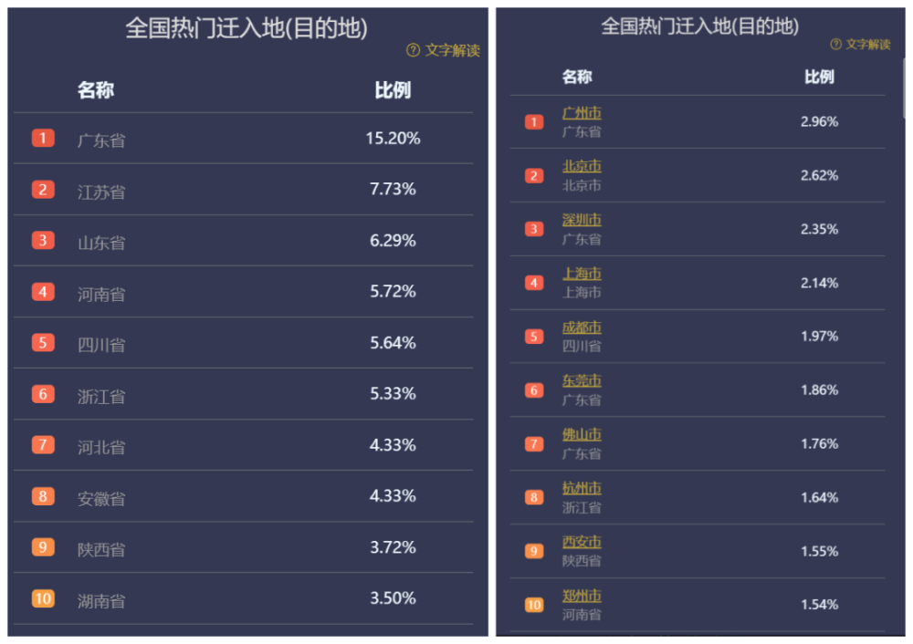
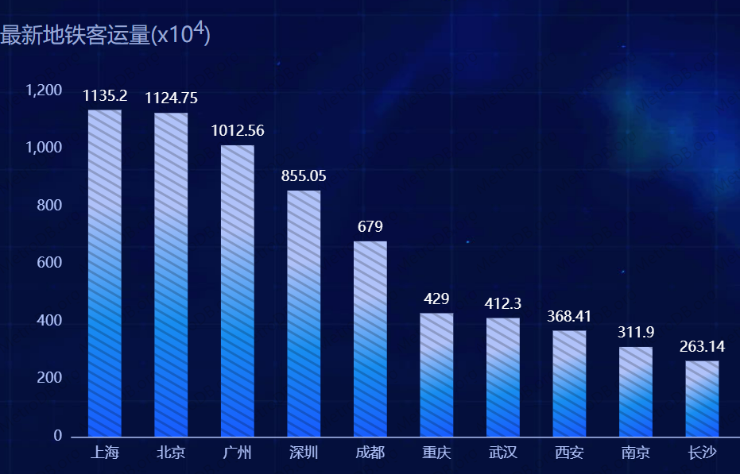
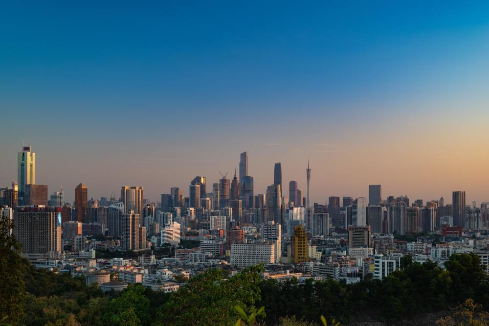
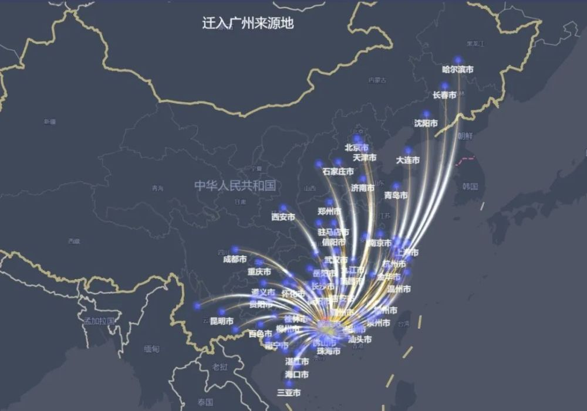
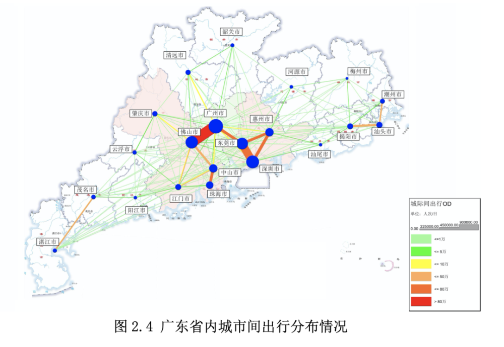
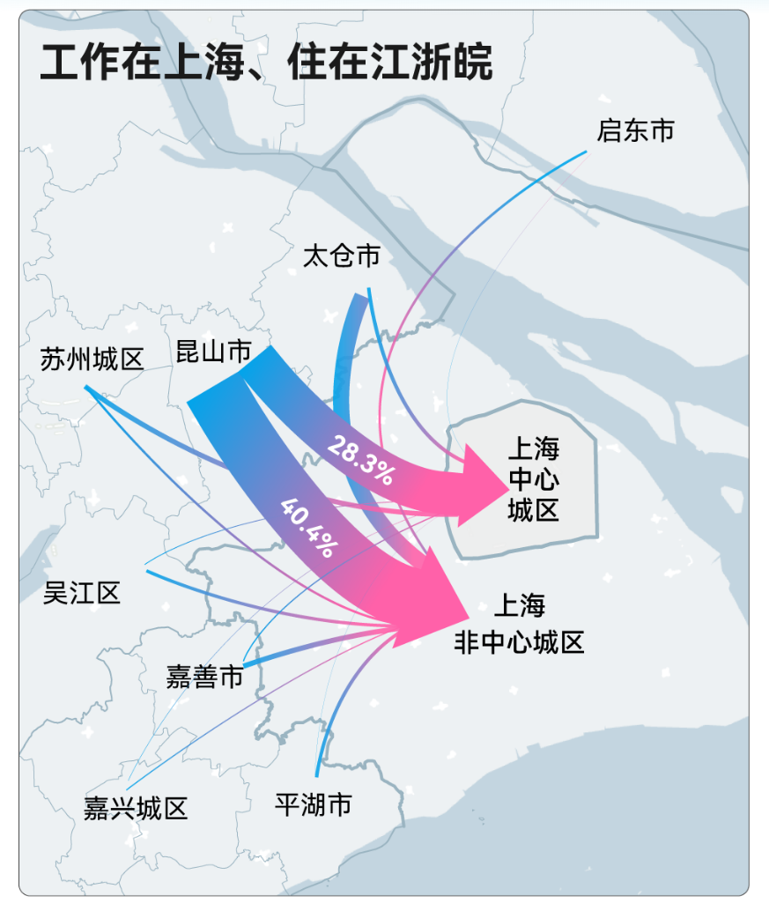
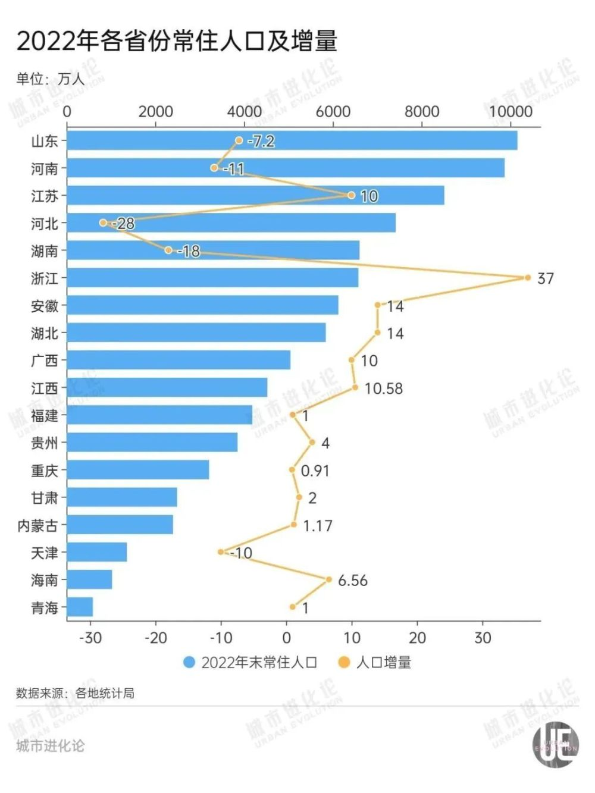

# 连续霸榜！全国人口流入TOP1，为何是它？

**划重点：**

  * _1_ 过去两个月，人口迁入最多的10个城市中，广东一省就占了4个：广州、深圳、东莞、佛山。
  * _2_ 与各自户籍人口规模相比，广西每8个人、湖南每13个人，就有一个来到了广东。
  * _3_ 目前，全国已有多个省市公布了2022年最新人口数据，湖北、安徽、江西、广西、贵州、甘肃、青海、重庆等多个中西部省份人口逆势增长。

**文|凯风**

人口大流动，正在全面恢复。

01

全国每100个外出人口，15个都来到了这个省。

百度实时迁徙地图显示，开年以来， **广东连续2个月霸榜全国人口热门流入地首位，广州蝉联人口迁入地第一** 。

_来源：百度迁徙_

过去两个月，人口迁入最多的10个城市中， **广东一省就占了4个** ：广州、深圳、东莞、佛山。

2023年的这几个月，给人最大的感受是“从早堵到晚”、“到处都是人”、“又排长队了”，人们从来没有像今天这样如此拥抱 **人潮汹涌** 。

地铁客流提供了更进一步的佐证。

年后， **广州地铁** 最高单日客流量迅速迈上1000万人次大关， **深圳地铁** 突破800万人次，超过2019年同期水平。

_地铁客流量最高的10城（2023/3)_

比地铁客流量更客观的是客流强度，即每公里地铁平均每天运输的客流，衡量的是地繁忙程度及大众出行的强度。

在 **客流强度方面，广深更是稳居全国TOP2。**

根据《这些城市，正在疯狂建地铁》一文提供的数据，广州、深圳月平均客流强度分别高达1.39、1.31万人次/公里/天，力压京沪，超过了许多二线省会城市的2倍以上。

有网友调侃，广州地铁之挤，让人想起了那些年流行过的名场面：《勇闯三号线》、《决战珠江新城》、《登陆体育西》、《决战嘉禾望岗》……

珠江新城、体育西、嘉禾望岗，都是广州客流量庞大的换乘枢纽，堪称全国地铁繁忙之最。

一时之间，那个熟悉的广州深圳回来了，那个充满活力的广东回来了。

02

东西南北中，发财到广东。

早在疫情之前，广东就是每年春节“空城计”的主场，也是春节后人口大迁徙的热门流入地。

这种场景在疫情期间一度有所收缩，连带广深新增人口一度出现大幅放缓。

如今，后疫情时代，所有限制社会流动的因素几乎都已不复存在，人口大流动再次重回熟悉的轨道。

**外来人口蜂拥而入，这些人都来自哪里？**

作为第一经济大省和工业大省，凭借强大的产业基础，过去几十年来，广东吸引了大量来自中西部地区的年轻人口。

根据七普数据，广东外来人口总规模高达2962万人，占总人口的23.5%，位居全国之首。

广东的外来人口，主要来自 **广西、湖南、河南、湖北、四川、江西、贵州** 等省份，这些地方基本都是人口大省和劳动力输出大省。

其中，广东外来人口最多的2个省份是广西、湖南，双双超过500万人。

与各自户籍人口规模相比， **广西每8个人、湖南每13个人，就有一个来到了广东。**

这从最近的人口迁徙地图也可见一斑。在广州、深圳的人口迁入地来源中，除了广东省内之外，最多的是湖南、广西、江西、湖北等省份。

这些外来人口多以 **年轻人为主** 。

广东能成为全国出生人口最多、老龄化率相对较低的省份，能成为全国财政转移支付贡献第一大省、养老金中央调剂贡献第一大省，与这一点不无关系。

03

与省外人口涌入相比，广东省内的跨城出行热度之高，也远超一般省份。

在广州、深圳的主要人口迁入来源地中，来自省内的人流占了相当大的比例，且多为都市圈和城市群成员。

**广州的人口迁入来源地** 中，佛山、深圳、东莞、清远、惠州占比最高；而 **深圳** 则以东莞、惠州、广州、佛山、中山为最。

这一格局，生动体现了 **粤港大湾区的深度融合，广深双子星城的高频互动，经济商业的强势反弹** ，以及 **广深都市圈各自的“势力范围”** 。

广州都市圈以广州、佛山为中心，辐射肇庆、清远等地，深圳都市圈以深圳、东莞、惠州为中心，辐射汕尾、河源等地。

_广东5大都市圈_

在这些城市中， **广佛、深莞互动最为频繁，而广佛更是遥遥领先。**

原因在于，广佛城市几乎连成一片，且已有3条跨城地铁贯通，而深莞之间的地铁互通仍未落地。（参阅《扩容！中国最大的“跨市”地铁群来了》）

根据官方发布的报告， **广佛两市间日均出行量174 万人次** ，高于深莞20%（128 万人次）、深惠（约为50万人次）、珠中7%（45 万人次）。

当然，无论是广佛还是深莞，都显著高过 **上海与周边地区的跨城出行量** 。

根据长三角跨城通勤报告，上海周边的 **南通、苏州、嘉兴、无锡**
等地级市流入上海市域的跨城通勤总人数达到1.48万人，其中苏州的昆山、太仓和苏州城区占了80%左右。

这背后，除了疫情影响之外，长三角的跨城地铁建设正在路上， **苏州11号线正与上海11号线即将无缝对接**
，届时从苏州城区到上海将有地铁直连，跨城人流将会出现井喷。

人流、物流、资金流，是都市圈乃至城市群一体化的最直观体现。

当跨城地铁连线成网，当都市圈内的产业一体化初具规模，跨城通勤将会更为频繁，都市圈、城市群有望真正连为一体。

04

这几年，全国人口流动趋势出现了哪些大变化？

目前，全国已有多个省市公布了2022年最新人口数据， **湖北、安徽、江西、广西、贵州、甘肃、青海、重庆** 等多个中西部省份人口逆势增长。

这一波人口增长，靠的并非出生人口的贡献，也不乏 **人口回流** 的支撑。

重庆、湖北、安徽等地自然人口已经负增长，但总人口规模仍在膨胀，背后正是得益于人口流入的贡献。

这究竟是 **疫情导致的短期人口回流，还是长期转化的大势所趋？**

过去几年，由于各种“码”的存在，整个社会大流动不复以往，人口跨市、跨省域的出行受到一定限制，加上超大特大城市偶发疫情的存在，更多人选择在省内就地务工，为常住人口正增长提供了支撑。

如今，这些限制因素不复存在，人口大流动开始恢复疫情之前的状态。广东、江苏、浙江、山东等地持续霸榜人口迁入地，就足以说明这一点。

换言之，没有疫情等因素影响， **孔雀东南飞，** 人口向东部发达地区涌入的现象只会有增无减。

不过，中西部并非毫无机会。

这些年，靠着大投资大基建改善区位优势，借助“产业西移”再造产业矩阵，通过强省会重塑强中心城市， **中西部地区人口回流，渐成趋势。**

未来， **“东部沿海经济强市人口虹吸+中西部强省会人口回流”** 的双重竞争格局，将会成为主流。

