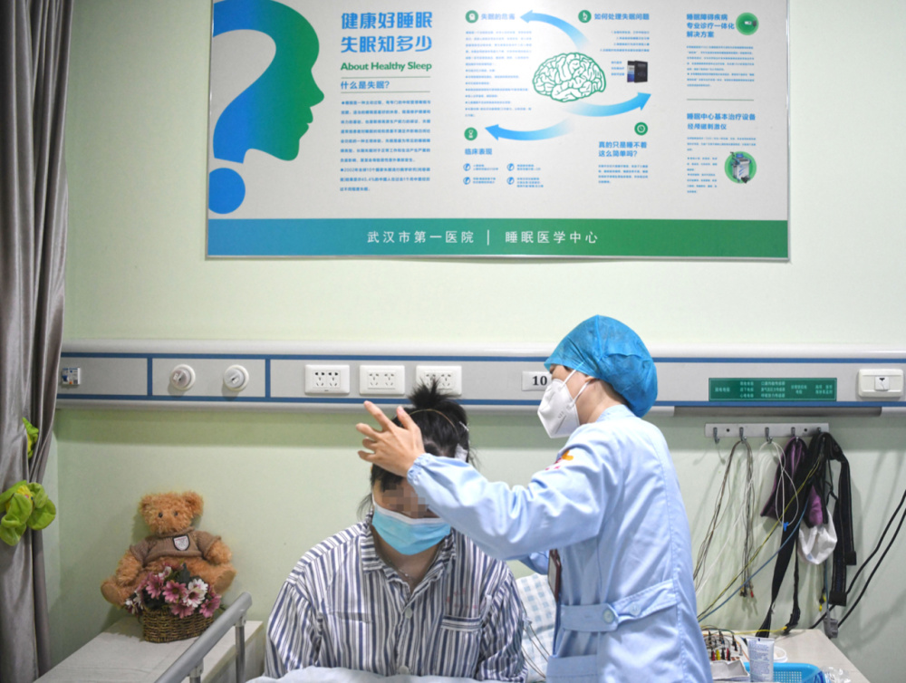
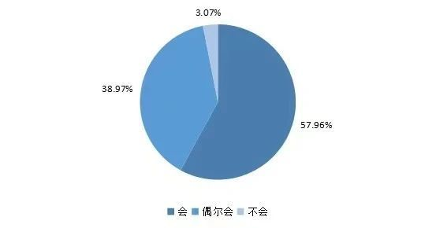

# 世界睡眠日来临，我国三亿人困于失眠

或许没有人需要学习睡觉。和学习穿衣、学习做饭、学习骑车不同，睡眠是自然的，是人类的本能。作为一个长期熬夜、作息紊乱的文字工作者，和睡眠“交手”多年，仗着年轻，乱中取胜，失去的睡眠总有办法找补，很少败下阵来，直到三周前。

清晨6点半，我躺在床上，困意浓稠得像止咳糖浆，窗外的微光透过淡粉的布艺窗帘照进房间，东三环的车流声传入耳边，北京醒了，我还没睡着。10点，勉强入睡三小时后，突然惊醒，再无睡意。白天还有琐碎的工作要处理，晚上也并没有意料中的困意，继续躺在床上重复昨天的故事。

这样的状态持续三天之后，我看见镜中的自己，面色从日常枯黄加深到焦黄，毛孔粗大仿若白芝麻长在脸上。

三亿人有类似的体验。中国睡眠研究会发布的《2021运动与睡眠白皮书》显示，2021年中国有超过3亿人存在睡眠障碍。

3月21日是世界睡眠日。我走进医院的睡眠门诊，观察我的“病友”，向医生求教，浏览豆瓣上的“睡吧”，寻找网络上的睡眠咨询师，我想要知道，睡不着是病吗？当我们失眠的时候，我们的身体和心理究竟在发生些什么？怎么样才能睡个好觉？

_2021年9月1日，武汉市第一医院睡眠医学中心。图/IC
photo_

**“我使劲睡，这一听就是个笑话”**

在北京安定医院，睡眠门诊聚集的可能是医院最不严重的患者，副主任医师陈群说。3月13日上午，在一间10平方米的白色诊室里，陈群迎来了27位患者。

首先是一位40多岁的母亲，她代替孩子来开药，孩子厌学，不去学校，常常凌晨1点还醒着。焦虑的母亲说：“本来挺聪明的，以后这孩子怎么办？做父母还是希望孩子好。”陈医生轻轻回答，“自己过好就行。”“我心态还行，孩子爸想得比较多，天天焦虑，觉得孩子毁了。”“别把压力传递给孩子，孩子生病是为你们生病。”

在睡眠门诊，“病友们”诉说的似乎是人生困境。

一位40多岁中年男子，上次来就诊是半年前。他逻辑清晰，表达准确，提前记录好了自己的症状，陈群医生刚问第一个问题，他已声音洪亮地回答完全部。“烦躁，和同事吵架，控制不住情绪；伤心，很多事不顺利，别人欠钱不还。去年12月份阳了之后，吃了药也睡不着。最核心的是睡不着，烦。”

一位从河北来的，50多岁即将退休的教师，吃了陈群医生开的药后好了很多。她原来是高三班主任，压力大，清晨5点到教室，晚上11点到家，睡不好，两个小时醒一次。这次复诊她的工作有了新变化，她申请不教课，退到后方做教研工作，“遵医嘱有用。”

还有一个年轻白领，在公司里做总经理秘书，凡事为领导操心，周末也干活，爬山也背着电脑。去年做了一次手术之后她开始出现睡眠问题，最近连着三天睡不着，常常夜里三四点还醒着，到早上八九点能睡一两个小时。她和陈群说，想看心理医生。

最后一个就诊的患者，40多岁男性，语调急促，充满活力。去年12月他做过心脏支架手术，元旦之后出现两次突然的不真实感，“看什么都觉得像做梦，意识模糊，好像要晕倒。”从ICU出来，他精神崩溃，觉得自己快要死了，“一直哭”。父母妻子不和，他觉得没有人真正理解他，“觉得自己挺努力了，为什么40多岁在ICU体验濒死感？脑子一直想，一个晚上醒七八次。”

陈群医生向他解释，不真实的虚幻感，往往是急性焦虑的一种，叫解体。并建议他前往心理科病房住院治疗，他拒绝了，拿了抗焦虑药后离开。

在陈群医生的睡眠门诊，以“失眠”为主诉就诊的患者中，90%左右存在不同程度的焦虑情绪。“大量的患者就是过度关注失眠，导致维持住了失眠。我使劲地睡，这一听就是个笑话，本来睡觉就是不需要使劲的一个事情。”陈群说。

一个明显的变化是，新冠之后，涌入睡眠门诊的患者增加了。“阳康”之后的失眠，来势汹汹，密集且强烈，往往发生在新冠之后的两个月内。

陈群医生说，新冠引起的短期失眠，起病较急，原因在学界还没有准确的解释，但多数一个星期就好了。可以将它视为生理的应激状态，是身体启动的自我保护机制，不必把它灾难化，如果严重影响了日间生活，可以通过用药快速打断失眠过程，防止它演变成三个月以上的慢性失眠。

_中国睡眠研究会发布的《2021运动与睡眠白皮书》显示，2021年中国有超过3亿人存在睡眠障碍。图/IC photo_

**7万人的失眠自救**

不是所有人都需要来睡眠门诊，也不是所有人都能来到睡眠门诊。很多人并不知道有睡眠门诊存在。失眠了，人们的第一反应是上网搜索。

豆瓣上一个失眠小组“睡吧”，聚集了7万多人。

小组内容分为，求助，评估，分享三个板块。在求助板块，一个标题为“失眠太痛苦了，救救我，有没有办法”的帖子中，网友何寒（化名）自述：“昨晚一整晚都没睡着，顺其自然也没有用，感觉心跳得越来越快，快跳出来了。”

_豆瓣小组“睡吧”首页。来源：网络截图_

2019年何寒在上海经历了人生的第一次严重失眠。那时的他刚毕业，在一家房地产公司上班，从学校到职场，他觉得身份没有转变过来，每天加班，工作压力大，不适应人际关系和工作环境，内心焦虑抑郁，“成宿成宿地睡不着”，运动、精油、听白噪音等方法他都试遍了，最严重的时期连续三天一分钟都没有睡着。普通安眠药没有用，医生开了强力安眠药并且加大剂量才能让他睡着。

吃了大半年的抗焦虑抗抑郁药物和安眠药之后，他辞职了。之前有一点外界声音他都睡不着，但辞职后，即便晚上有人打呼噜或者在外面看电视，他都照睡不误。看起来，导致失眠的外因消失，失眠也就结束了。

今年二月份失眠重新来袭，同事辞职，他要承担起更多的工作。几乎就在同事辞职的第二天，何寒晚上11点躺床上，要到凌晨2点多才能睡着，并且6点多就早早醒来。直接诱因依然是工作，他想辞职，但又觉得不能每次都以辞职来逃避。

最近他去医院看了心理科，开了一些药，也在尝试网上学到的一套正念练习和睡前放松的方法，往往是做完第一套动作，他发现自己还没睡着，就开始焦虑烦躁，“虽然说不能把它当成一个任务，但其实我内心就是把它当成一个任务，所以做起来反而更有压力。”

加入豆瓣睡吧，何寒发现很多人的问题比他严重，看的帖子越多，他越焦虑。在他的求助帖下面，有一些真诚的回复和建议，一位豆友说，“一切为失眠所做的计划和努力都是在为失眠助力，越努力越远离。”

其中还有组长“match”的回复，“太多抱怨，而不去真正行动，你对待失眠的方法完全错了”。“match”名叫李明，他是一名互联网工程师，生活在国外。有着16年失眠史的李明，在2010年创立了睡吧。

断断续续失眠的16年间，李明几乎尝试了所有方法，他靠着瑜伽和冥想，曾短暂恢复了一段时间。但下一次失眠再来的时候，瑜伽和冥想失效了，似乎得用上更厉害的招数才能对付失眠。李明也和很多人一样，陷入了失眠的沼泽中，越挣扎陷得越深。

李明为了探索自救的方法，也下载和阅读了大量外国文献。转机在一本英文书里出现，美国一位失眠学博士写的《和失眠说晚安》，他按照书中的方法，不困不睡，无论睡得多晚第二天早上都按时起床，维持白天正常的生活，四星期后再次打败了失眠。和失眠相处的理念被他归结成——无为而治。他说，失眠就像精心培育的盆栽，你努力给它浇水，它会不断长大。

从2010年创办睡吧到现在，13年过去了，组内的每一个帖子他都会认真回复。李明发现，在给别人回复的过程中，他也成了受益者。通过浏览那些充满焦虑的失眠体验，他会不断提醒自己，在低谷期保持一种平衡的积极的健康的生活方式。“失眠只是身心不够健康的一个副产品，它只是一个症状。”

他说，三年来小组成员爆发式增长，并且求助的人越来越年轻，学生居多。另外一个变化是，“能听得进意见的变少了”。十年前，求助者会按照睡吧里志愿者给出的建议付出实际行动。现在李明觉得“人心变得更浮躁了”，很多人不愿意耐心去看，去学，“更希望立刻让睡眠问题消失”。睡吧更像一个寻找同类、互相安慰的平台。这似乎背离了李明的初心。

李明认为睡吧给出的任何意见都不是针对睡眠本身，而是针对造成睡眠障碍的原因，他更关心清醒时白天发生了什么，而不是夜间的辗转反侧，也就是说，所有的归因，最终还是要回到生活本身。

**“失眠是个闹钟”**

大多数人的一生有三分之一的时间在睡觉。

而失眠，有点像闹钟，对李明来说，“它响了之后，我需要做一些改变。”比如生活中跟家人朋友出现矛盾，这些矛盾细微且持久，经年累月不断积攒之后，失眠会恰逢其时地出现，像一个闹钟，提醒他去处理这些矛盾。

闹钟响起来的原因很多。35岁的友玲（化名）是因为和男朋友分手，她觉得心里总是有石头压着，整夜睡不着，清晨七点按时起床上班，中午眯个半小时，这样持续三四天之后，心慌心悸胸闷各种躯体不适出现，无论身体和心理都处于崩溃边缘。

“身体自己会调整。”四天没睡了，第五天就能睡三四个小时。反反复复过了差不多半年，她认识了现在的老公，“他就会一直鼓励我，说没关系，睡不着的时候都可以找他聊天。”引发“闹钟”的分手事件过去，失眠随之离去。

像友玲这样因情感婚恋出现危机而失眠的人不在少数，48岁的晴芬（化名）也是其中之一。从高中起，她的睡眠较轻，外界环境的一些声响动静都容易影响她的睡眠。

前年婚姻出现危机，离婚和孩子抚养问题，她以为自己可以处理好，直到身体告诉她答案。那段时间，天色变暗她的心情也随之低落，白天时不时会心跳加速，她感到自己跟这个世界中间，“好像隔着什么东西”。

离婚像是打开了情绪开关，触发了堆积在内心深处的情绪垃圾，全部的焦虑都转移到失眠这件事情上，“为了睡觉而焦虑”。她尝试了针灸、按摩，后来朋友推荐吃安眠药。“吃一颗，睡觉的感觉很舒服，完全是深睡眠。”

之前，一天晚上她只能浅睡两三个小时，吃了安眠药，有时候能睡四五个小时。但也有失效的时候，她有一种深深的无力感，“所有人到了点儿都该睡了，为什么我自己不行？”

2019年出版的《中国失眠障碍综合防治指南》中指出，慢性失眠的病因主要有三个因素：第一个是易感因素，指的是容易导致失眠的与生俱来的先天因素，比如完美主义、神经质和敏感等人格特质；第二个是诱发因素，导致失眠发生的重大生活事件；第三个是持续因素，使失眠长期维持下去的因素。当第二个诱发因素也就是原始压力源消退之后，失眠通常也跟着消失，往往是因为不良的应对方法、不正确的失眠认知等反而维持住了失眠。

慢性失眠的三大病，第一个易感因素，指的是容易导致失眠的与生俱来的先天因素，比如完美主义、神经质和敏感等人格特质；第二个是诱发因素，导致失眠发生的重大生活事件；第三个是持续因素，使失眠长期维持下去的因素。来源：《中国失眠障碍综合防治指南》

也有一些患者，是人为地剥夺睡眠。陈群医生曾经接诊过一个外企高管。四十岁，对工作要求高，对健康要求高，也注重身材管理。白天努力工作，晚上八九点下班之后，去健身房举铁。晚上10点，回家打游戏放松，睡前打游戏的时间是属于他自己的，白天工作越有压力，他越珍惜这段打游戏的时间，常常不知不觉玩到深夜。

日复一日，他出现了入睡困难。有网友将这种行为称为“奋斗型失眠”，争分夺秒利用专属于自己的睡前时间，该睡的时候不睡，人为地拖延出来了失眠。

陈群医生说，睡前的健身和打游戏都是让大脑兴奋的行为，这些错误的生活习惯，反而维持住了他的失眠。他来看睡眠门诊，期待通过药物治疗缓解症状。陈群医生没有给他开药，而是建议更改睡眠习惯。

**与失眠握手言和**

曾经，失眠患者李明惧怕和人谈论失眠，但在睡吧谈论13年后，他对失眠的态度就像对待感冒，“你怎么对待感冒？感冒来了不太舒服，但它只是感冒，你甚至都不需要吃药。”

大多失眠的人都会经过一个执着结果、最终接纳的过程。

大一学生曾幻，每周有三四天都在服用褪黑素助眠。

高二有一段时间曾幻失眠严重，一整晚包括午睡可能只有四五个小时，白天注意力不集中，脾气暴躁。她去看了医生，大部分医生说她是因为学习压力过大，希望她自己调节一下。还有医生说起自己当年高三，怎么苦怎么累，如何调节。听完这些诊断，曾幻觉得“太扯了”。

有人建议她睡不着的时候起来看书，或者做运动，她曾试过一次深夜运动到两点多，还是睡不着。最严重的一次晚上十点多在床上，凌晨四点多才睡着。睡不着的时候，思绪像一个漫无边际的链条，可以从最近身边的一件小事，无限追溯到记忆深处。

到了大学，课程安排不一，有时候早上没有课。虽然在宿舍里有规律的熄灯时间，但起床的时间比较随机。入睡困难对她来说似乎成为了常态，“我已经完全接纳了”。

如果说李明和曾幻的失眠已经像感冒一样平常，可以无为而治。但对于那些失眠伴有焦虑症、抑郁症的人群，接纳过程则更加漫长曲折，时常需要药物干预。

比如晴芬，当焦虑最严重的时候，她不得不服抗焦虑药物，“吃了以后心能沉静下来了。”同时她也在寻求心理医生的帮助。

待焦虑症状有所缓解之后，她开始遵照医生的建议，尝试失眠认知行为治疗（CBT-I）。

陈群医生说，药物治疗对症，但不是解决问题的根本办法。CBT-I失眠认知行为治疗是现行治疗失眠的首选。《中国失眠障碍综合防治指南》中介绍，CBT-
I治疗元素包括：睡眠时间限制、刺激控制、认知治疗、放松疗法以及睡眠卫生教育。

第一次听说这个疗法的时候，晴芬表示怀疑，“我觉得改变一个人的认知怎么会治疗你的失眠呢？”

晴芬所就诊的医院设计了一款小程序开展CBT-
I治疗。小程序里每天提醒她，在床上只做与睡眠相关的事情，帮她重新建立“床=睡觉”的联结，避免在床上看书、看剧、玩游戏等，只在感到困的时候才上床；如果15-20分钟无法入睡，可以起床离开卧室去做让自己放松的事情；无论前一晚的睡眠如何，次日都在固定的时间起床；避免在日间或傍晚小睡。小程序里面也有短视频科普，告诉她失眠很正常，每个人都会失眠，还有一些冥想肌肉放松的训练。

如此持续了四个多月的时间，晴芬告别了安眠药，似乎拥有了“睡眠自由”。之前吃两颗安眠药一颗抗焦虑的药，减到只有1/4颗抗焦虑药，治疗结束。

但并不是一劳永逸。后来晴芬又开始想睡就睡，晚睡，睡前躺床上玩手机，白天补觉，“这些坏习惯又全部捡回来。”两个多月后，她开始了短暂的波动，“一天晚上只睡两个小时”。正在建立起来的睡眠信心受到了打击，她开始每天晚上担心，“今天晚上不会又睡不着吧？”然后就有了第二次，第三次，再次为了睡眠而焦虑。

_典型的失眠认知行为治疗规划。来源:《中国失眠障碍综合防治指南》_

尽管CBT-I的临床有效性得到大量考证，但目前广泛推广仍有挑战。陈群医生说，很多医院开展CBT-
I治疗的资源不足，缺乏受过良好培训的专业治疗师，比如安定医院的CBT-
I一个疗程是8次，每次50分钟，面对面的心理治疗模式代价高，需要投入大量的时间成本和经济成本。目前很多机构在开发CBT-
I线上疗法，自助治疗，但在线治疗需要患者有足够的自律和主动性，中断治疗的比例较高，《中国失眠障碍综合防治指南》中介绍，无法自助完成治疗的比例在43%-99%。

**我们对睡眠有什么误解？**

3月17日，《中国睡眠研究报告2023》在北京发布。报告显示，2022年，中国民众每晚平均睡眠时长为7.40小时，整体睡眠状况有所改善，近半数人睡不够8小时。陈群医生解释，8小时睡眠是一个最大的误解，不是所有人都需要8小时睡眠，睡眠质量评价的标准更多在于第二天的精力和活力，而不是精准的8小时。

_熬夜已经成为当代大学生的常态,57.96%的大学生经常熬夜,38.97%的大学生偶尔熬夜,不会熬夜的只有3.07%。来源：《中国睡眠研究报告2023》_

在我们国家，各类睡眠障碍者约占人群的38%，但真正需要积极干预的在10%左右，也就是1.45亿，北京大学人民医院睡眠科主任、亚洲睡眠学会主席韩芳说。

“一说失眠来了，然后就是两片安眠药，这是最大的误区。”韩芳说，睡眠疾病在国际分类里有九十多种，失眠只是一个症状，睡眠医学的目的就在于发现背后的原因，对因治疗。

韩芳举了一个四十多岁，睡眠呼吸暂停误食安眠药去世的例子。病人夜里睡觉打鼾，在很多人看来以为这是睡得香，而实际上，打鼾严重会引起睡眠呼吸暂停，被憋气憋醒，自己会误以为是失眠，如果这时候没有精准识别，吃了安眠药，引起上呼吸道堵塞，有可能在夜里憋死，造成严重后果。

首都医科大学宣武医院主任医师李宁医生说，在她这里治疗失眠的人群画像，集中在退休后的老年人、青少年和各类顽固性失眠。比如她遇到失眠时间最长的，是一位失眠六十多年，目前70多岁的病人。这位病人多年来尝试了国内所有能用的药。像这种顽固性失眠，李宁说，几乎不可能回到每天睡七小时的状态，“这是不现实的，但是我们会帮他寻找一个更好的治疗方案，安眠药减少到最低剂量，保证他在药物的有效性和副作用之间达到最佳的平衡，以便长期应用。”

最近的一次门诊中，她记得一位刚退休的患者，从工作忙碌突然过渡到无所事事的老年生活，生活规律被打破，社交减少，内心充满失落，夜里开始失眠。李宁给对方提供药物治疗的建议，但她知道心理疏导是更重要的。“每个人都要退休，这种失落感怎么解决？”

但矛盾之处是，大多数老年人还不能接受心理治疗，“不接受不等于我不去说，很多问题就是要去说去宣传，大家才能知道，慢慢转变就会发生。”

一些话，李宁可能每天要说几十遍。很多人来了之后会问，“你为什么要让我去配合心理治疗？你为什么给我开抗焦虑的药？”“您这个可能和焦虑有关。”“我没有焦虑呀，我哪有焦虑呀？”

在李宁看来，绝大多数的失眠都是心因性的，也和性格有关。性格是中性的，但总有一些性格的人容易被失眠缠上。她举例，比如做事认真、思虑过多的人，所有事情都考虑得非常周到，天生好强、追求完美的人，或者比较神经质，遇事容易被激怒，过度敏感的人等等。

“所以为什么失眠它不太容易去根呢，基础的性格不太容易改变，后续的东西就不太容易改变。”李宁说。不追求让它完全消失，尽可能减少对日常生活的影响，也许才是我们和失眠的相处之道。正如一位豆瓣网友留言中说的，“顺其自然是让我们带着症状生活，不是努力研究症状，深陷其中。”

新京报记者 朱清华 编辑 陈晓舒 校对 贾宁

