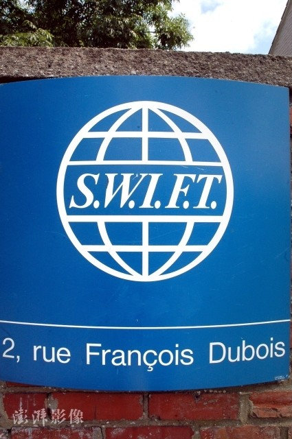
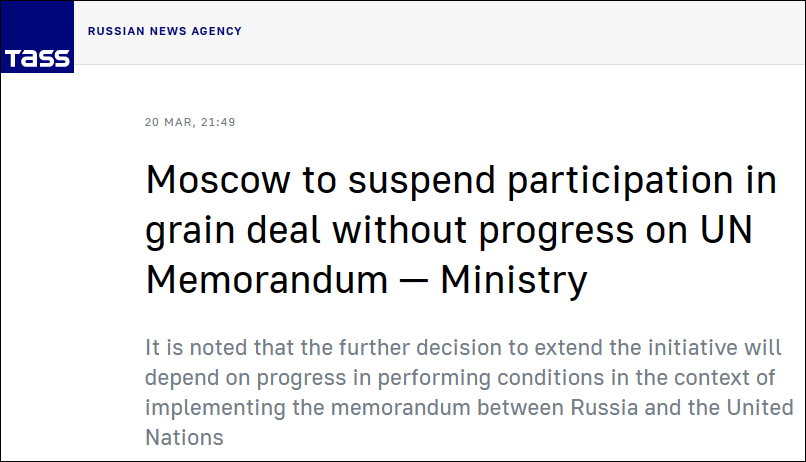

# 俄罗斯央行：10月1日起，各银行境内交易必须只用国内金融传输系统

【文/观察者网
熊超然】当地时间3月20日，俄罗斯央行宣布，从今年10月1日起，俄罗斯各银行在境内进行资金转账时，必须只使用俄罗斯国内的平台和金融基础设施进行金融信息传输，并称此举“将确保俄境内交易数据的可靠性、连续性和安全性”。

对此消息，“今日俄罗斯”（RT）用“俄罗斯禁用SWIFT”为题作报道，并指出，俄罗斯央行事实上是禁止了俄金融机构在国内交易中使用环球银行金融电信协会（SWIFT）国际结算系统，也就是说，SWIFT仅被允许用于国际支付。

与此同时，俄罗斯外交部3月20日明确表示，如果不能落实包括“让俄罗斯农业银行重新连接SWIFT结算系统”等问题，俄罗斯将暂停参与黑海粮食倡议。此前一周，俄方已表态，不反对将黑海粮食倡议延长60天，但其他各方则希望将该协议再延长120天。

_RT报道截图_

据RT报道，有关此类国内金融交易，各银行现在需要通过俄罗斯央行自己的银行系统、第三方俄罗斯公司提供的服务，或通过俄罗斯央行金融信息传输系统（SPFS）进行传输。

据介绍，作为在国内市场中替代SWIFT的产品，SPFS是由俄监管机构于2018年创建的。尽管SPFS的覆盖使用范围仍远小于SWIFT，但近几个月以来，SPFS的推广势头一直在增强。今年2月，俄罗斯央行曾宣布，SPFS目前有469个参与者，其中包括来自14个国家的115个外国实体。

_俄罗斯央行网站公告声明截图_

自去年俄乌冲突爆发以来，作为美西方制裁的一部分，俄罗斯的一些大型银行与SWIFT的联系被切断，俄罗斯也被迫只能在与外国合作伙伴交易时寻找SWIFT的替代方案。

去年2月26日，白宫发布联合声明称，美国、欧盟（法德意）、英国、加拿大决定将部分俄罗斯银行从SWIFT国际结算系统中剔除出去，这一动作当时也被许多外媒称为是丢向俄罗斯的“金融核武器”。

总部设在比利时的环球银行金融电讯协会（SWIFT）创建于1973年，主要职能是在全球各地银行系统间转移资金、传递结算信息。经过多年的拓展，目前SWIFT已经打造出全球最安全、最便捷和最重要的跨境支付系统，全世界几乎所有的重要金融机构都是该系统的成员，因此对于全球金融业极具战略性意义。

一般来说，不同国家的银行之间进行跨境转账都需要通过SWIFT，因此该系统也在实质上控制了大多数的国际贸易。如果被移除出这一系统，就无法用美元进行结算，只能用本国货币或者是和其他签订了货币互换协议的国家进行贸易。2012年，美国和欧洲升级对伊朗的金融制裁，并将伊朗四家重要银行从SWIFT中剔除，导致伊朗损失了近一半的石油出口收入。

_资料图：位于比利时布鲁塞尔总部的SWIFT徽标
图自澎湃影像_

截至去年俄乌冲突爆发之初，SWIFT拥有约1.1万个成员，其中包括近300家俄罗斯银行，如果这些俄罗斯银行被移除出这一系统，占俄罗斯财政总收入40%以上的石油和天然气出口收益将被切断，其经济会立即受到重大影响，包括本国货币大幅波动，以及大量资本的外逃。

不过，将俄罗斯从SWIFT中剔除，伤害的不仅是俄罗斯，还有欧洲大型经济体，欧洲大陆的能源进口也势必受到牵连。正因如此，此前在讨论使用这一“金融核武器”时，美国的盟友曾出现过分歧，特别是高度依赖俄罗斯能源出口的德国，曾一度表示反对。最终，制裁范围也没有覆盖所有俄罗斯主要银行。

据报道，目前，有10家俄罗斯银行与SWIFT的联系被切断，包括俄国内两家最大的银行——俄罗斯联邦储蓄银行（Sberbank）和俄罗斯VTB银行。而那些没有被切断联系，但正受到美西方封锁制裁的银行，也可能会在使用SWIFT时遇到障碍。但总体来看，西方的相关措施并没有产生所谓“金融核武器”般的效果。

另据塔斯社、路透社当地时间3月20日报道，俄罗斯外交部当天表示，如果在落实俄罗斯-
联合国关于俄农产品出口的备忘录方面没有取得进展，俄罗斯将暂停参与黑海粮食倡议。

_塔斯社报道截图_

俄外交部指出，所谓“取得进展”，这包括让俄罗斯农业银行重新连接SWIFT结算系统，恢复农业机械、备件和服务维护的交付工作、取消保险和再保险限制，以及取消港口禁令等。否则，俄罗斯将不会在5月同意续签一项允许乌克兰黑海港口出口粮食的协议。

3月13日，俄罗斯副外长韦尔希宁在日内瓦与联合国主管人道主义事务的副秘书长马丁·格里菲思、联合国贸易和发展会议秘书长蕾韦卡·格林斯潘举行了会谈。韦尔希宁表示，双方讨论的重点是2022年7月在伊斯坦布尔达成的“一揽子”协议。

韦尔希宁指出，会谈是全面坦诚的，俄罗斯不反对在3月18日黑海粮食倡议期限到期后再次延长该倡议，但只延长60天。俄罗斯的进一步立场将取决于俄罗斯农产品出口正常化的实际进展，这包括对银行付款、运输物流、保险、金融活动的“解冻”以及通过陶里亚蒂-
敖德萨管道的氨气供应。

**本文系观察者网独家稿件，未经授权，不得转载。**

