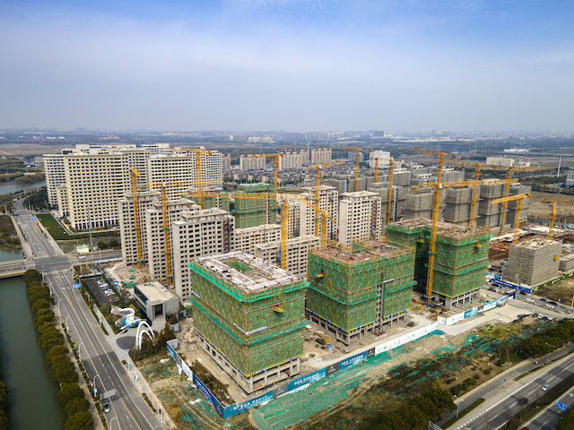

# 全国楼市狭义库存下降，但待售面积仍够1600万人居住

2022年，楼市经历了全国性的深度调整，行业投资、施工、新开工等各项指标均出现了深度回调，其中新房成交同比下降27%，按常理来看，楼市库存去化压力应当急剧攀升。

但在此背景下，全年土地成交出现了深度调整，土地购置面积同比下降53%，大量土地被城投公司托底拿下，整体开工率偏低。据克而瑞地产研究中心监测，由于房地产住宅项目2022年领取销许速度放缓、新推案减少，全国商品房狭义库存竟不增反降，超过六成的典型城市狭义库存同比下滑。

不过，部分城市楼市成交量下滑幅度过大，但土地出让的回调力度不足，楼市总体库存去化形势仍然严峻，广义库存量仍在攀升。国家统计局数据显示，我国商品房待售面积已经突破6.5亿平方米，现有待售面积足够1600多万人居住。

**新推案减少致狭义库存不升反降**

克而瑞按照狭义和广义两种库存量数据来反映各地库存情况，其中狭义库存量指已批准预售的商品住宅中尚未销售的建筑面积，广义库存量的统计范围更广，指可销售房屋量和涉宅用地施工量之和，这里面包括已拿地未动工项目和已动工未拿销证的项目，地域范围也包含了地级市下辖县市。

一般来说，狭义库存是一个中短期指标，也是一个房地产业内和主管部门重点关注的指标，而广义库存量则是反映楼市库存量的长期指标。

受楼市行情影响，人为放缓销售许可发放可以降低楼市狭义库存量。从土地端来看，土地交易量下降、大量城投托底拿地也导致了狭义库存的整体降低。

2022年是实行集中供地的第二年，民营房企的投资力度跌入谷底，城投成为拿地新势力，集中供地地块有近半数被各地城投拿下，城投拿地开工率显著低于平均水平，2021年城投开工率仅有38%，2022年城投拿地开工率仅为8%，开工率过低必然导致新推案的减少。

分城市能级来看，根据克而瑞数据，楼市热度较高的一线城市狭义库存反而逆势上涨，至2022年12月末整体库存达到近3807万平方米，反而较2022年初上升了8%左右，是各能级城市中唯一库存规模上升的。

二线城市的狭义库存在2020年末一度达到2.7亿平方米左右的高位，但2021年、2022年出现连续两年的规模负增长，2022年同比下降3%。

三四线城市由于楼市信心显著衰退，狭义库存出现快速回落，2022年狭义库存同比降幅高达6.5%。在市场走向不明、企业资金面承压的情况下，再加之前期土地交易量下降的影响，2022年三四线新房项目领取销许的规模明显下降，并且明显超过了新房交易规模的下降速度。

**楼市长期库存压力仍在攀升**

由于还存在大量新增的已拿地未开工项目以及已开工未领销售许可项目，2022年狭义库存的降低，实质上是一种“假性回落”。

克而瑞数据显示，2022年广义库存同比增幅达到6%，八成城市广义库存同比上升，青岛同比增幅高达36%，长期库存压力仍在攀升。

此外由于楼市成交量低迷，无论是狭义库存还是广义库存，其消化周期都在上升，并且已经超过了2014年高点，截至2022年末，三四线城市的平均楼市消化周期达到23.7个月，较2014年高点增加了26%。

记者查阅国家统计局网站，发现商品房待售面积最新数据同比大幅增加，已经突破6亿平方米。

国家统计局数据显示，截至今年2月末，商品房待售面积达到6.55亿平方米，同比增长14.9%。其中，住宅待售面积3.27亿平方米，同比增长15.5%；办公楼待售面积4700万平方米，同比增长21%；商业营业用房1.39亿平方米，同比增长12.1%。

按我国人均住房建筑面积39.8平方米计算，现有待售商品房面积已足够1600多万人居住。由此可见，全国楼市库存去化形势仍然严峻。

据克而瑞统计，全国有超过四成城市的楼市狭义库存消化周期超过两年，仅极少数城市消化周期能保持在10个月以内。

典型的消化周期保持健康的城市是上海、杭州，截至2022年末，这两城的消化周期分别为6.9个月和6.4个月，较2014年高点的降幅均超过60%。这两城商品房年成交规模均维持在1000万平方米左右的相对高位，狭义库存规模控制在了较低水平，仅为500万平方米量级，使得狭义库存消化周期指标处于相对安全的范围。

广义消化周期在3年以内的城市，仅余合肥、杭州、上海、泉州等，其中杭州的楼市库存广义消化周期目前维持在2年左右的绝对低位。

而广义消化周期过长的城市占比过半，其中重庆达到9.8年，主要原因是重庆商品住宅成交在2022年出现了大幅下滑，远远低于往年2000万平方米量级的交易规模，加上土地供应回调力度不足，导致重庆广义消化周期出现了巨幅上升。

_图片摄影：任玉明_

**三分之一已完工住宅没卖掉**

根据国家统计局数据，截至2022年末，全国住宅竣工未售面积已经达到2.7亿平方米，同比上升18%，创近五年新高。

但就历史数据来看，目前的全国住宅竣工未售面积仍远低于2015年4.5亿平方米的高点。2016年起，楼市进入去库存周期，棚改等一系列手段的使用，一度让竣工未售面积逐年下降，在2019年达到低点。克而瑞地产研究中心认为，这个指标在2022年出现急剧上升，主要原因还是竣工住宅的售出率出现了显著下降。

通俗来讲，房子变得不好卖了。到底有多不好卖呢？根据住宅待售面积、住宅竣工面积、现房销售面积等指标，可以测算出历年中国竣工住宅的未售率。根据克而瑞测算，2022年，全国已竣工住宅的未售率攀升至32%——也就是说，截至2022年末，有大约三成已造好的商品房没有卖掉。

由于我国实行商品房预售制，从房子卖出到竣工一般需要1-2年的施工期，2016年起房地产周期上行，住宅未售率下降，至2019-2021年达到低点；而2020年起，整体市场去化率开始下行，直到2022年全国商品住宅销售规模较上一年下降了4亿平方米，所以竣工住宅未售率的攀升，与房地产市场下行周期是一致的。

克而瑞地产研究中心预判，若2023年消费者预期和行业销售不能得到良好回正，竣工住宅未售率必将在接下来一两年内继续上行，导致商品住宅待售面积加速攀升，房地产库存积压将更加严重。

