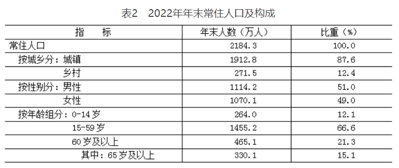

# 北京2022年末常住人口为2184.3万人，比上年减少4.3万人

2023年3月21日，北京市统计局、国家统计局北京调查总队发布《北京市2022年国民经济和社会发展统计公报》。数据显示，2022年末北京全市常住人口为2184.3万人，比上年末减少4.3万人。

北京市统计局说明，2022年常住人口有关数据为全国统一组织开展的2022年人口变动情况抽样调查推算数，调查标准时点为2022年11月1日零时。

具体来看，北京市2022年城镇人口为1912.8万人，占常住人口的比重为87.6%；常住外来人口为825.1万人，占常住人口的比重为37.8%。此前在2021年，北京市常住外来人口为834.8万人，占常住人口的比重为38.1%。

_图片来源：北京市统计局网站_

2022年，北京市常住人口出生率为5.67‰，死亡率为5.72‰，自然增长率为-0.05‰。北京市人口自然增长率转负，从全国范围看，2022年多数省份出生人口数量和出生率均出现下降。

2022年，北京市15-59岁劳动年龄人口为1455.2万，占总人口比重为66.6%。全市60岁及以上老年人为465.1万，占比21.3%，其中65岁及以上老人为330.1万，占比15.1%。

各地近期正在陆续公布2022年国民经济和社会发展情况，此前已有近20省份公布人口变动数据。河北、山东、河南、湖南、辽宁等省份的常住人口总量出现负增长，其中辽宁省减少32.4万人，降幅最大。2022年常住人口增长的省份中，浙江省以增加37万人排名第一，湖北、安徽、江西、江苏、广西等省份常住人口增量也达到10万人及以上。

其他数据方面，2022年北京市全年城镇新增就业26万人。全年城镇调查失业率均值为4.7%，运行在年度调控目标内。

此外，2022年北京全市居民人均可支配收入为77415元，比上年增长3.2%，扣除价格因素，实际增长1.4%。全年全市居民人均消费支出为42683元，比上年下降2.2%。年末参加企业职工基本养老、城镇职工基本医疗、失业、工伤和生育保险的人数分别为1764.2万人、1496.2万人、1391.4万人、1337.8万人和1086.6万人，分别比上年末增长2.3%、0.7%、2.4%、2.3%和0.4%。

