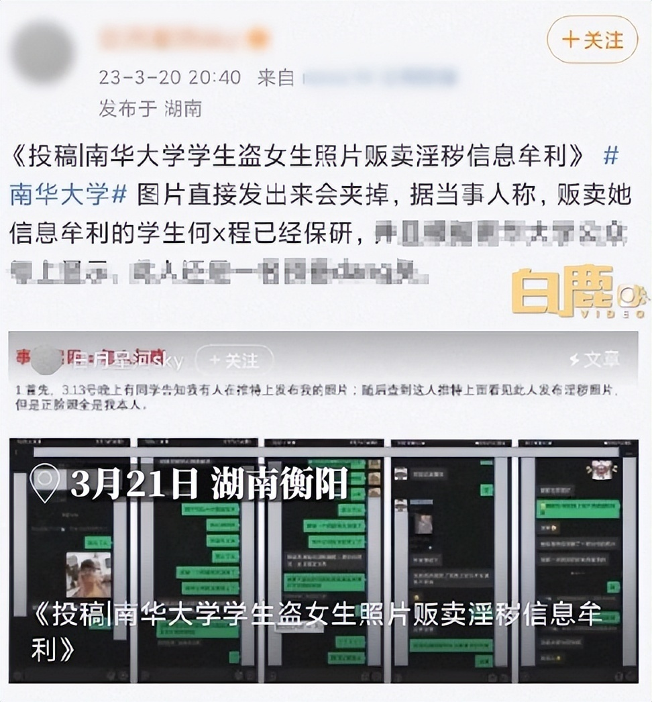
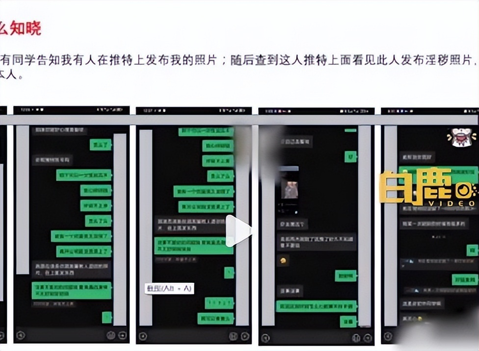
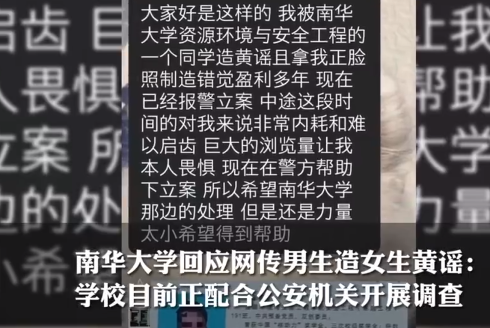
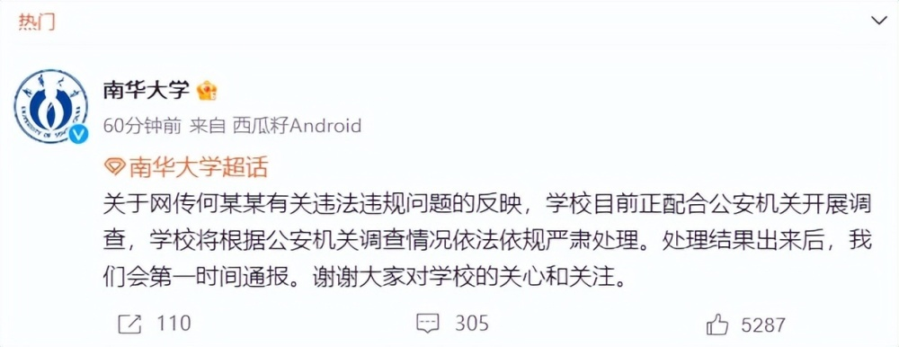

# 南华大学再通报“网传男生造女生黄谣”：违法行为属实，开除学籍

3月21日，有网友称南华大学一学生盗用女生照片贩卖淫秽信息牟利，对此南华大学官方回应称，学生何某某违法行为属实，公安机关已作出行政处罚决定。现依照学校相关规定，给予该生开除学籍处分，后续将按程序办理。

南华大学官方公告如下：

经调查核实，我校学生何某某违法行为属实，公安机关已作出行政处罚决定。现依照学校相关规定，给予该生开除学籍处分，后续将按程序办理。

我校将坚持问题导向，切实加强大学生思想道德和法治教育，积极营造文明向上的育人环境。感谢广大网友对我校的关心关注和支持！

**此前报道 >>>**

3月20日，有网友投稿称，南华大学学生盗用女生照片贩卖淫秽信息牟利，而该学生何某程已经保研，还曾获竞赛奖。

被盗用照片女生表示，自己在3月13日被人告知有人发布自己的照片，一些不堪入目的图片正脸都是自己，才发现自己被恶意P图，被盗图片均来自自己朋友圈。

另据新黄河报道，被盗用照片女生表示，自己与何某程是初中同学，不但被何某程造黄谣，且拿自己正脸照制造错觉营利多年，现在已报警立案，但中间这段时间自己感觉非常内耗和难以启齿，巨大浏览量让自己畏惧。

3月21日，南华大学宣传部门回应，学校正配合公安机关开展调查，校方拿到公安机关的结论后第一时间就会严肃处理，昨晚连夜和公安沟通，处理结果出来后会直接发通报。

该工作人员表示：“接到举报电话就一直在调查，公安机关会有一个程序，我们拿到结果会第一时间进行处理。昨晚通宵跟警方进行了沟通，处理结果出来马上会发通报。”

3月21日上午，南华大学官方也发布公告，称：“关于网传何某某有关违法违规问题的反映，学校目前正配合公安机关开展调查，学校将根据公安机关调查情况依法依规严肃处理。处理结果出来后，我们会第一时间通报。谢谢大家对学校的关心和关注。”

**【来源：九派新闻综合白鹿视频、新黄河、南华大学官方微博】**

