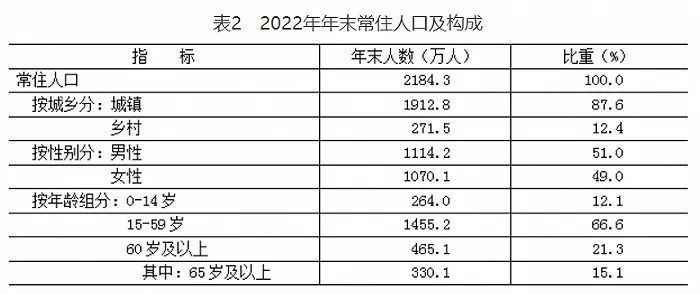
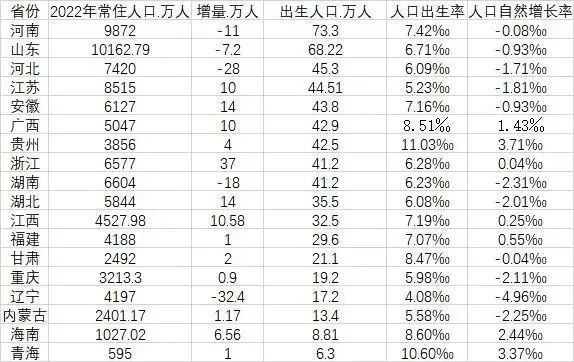
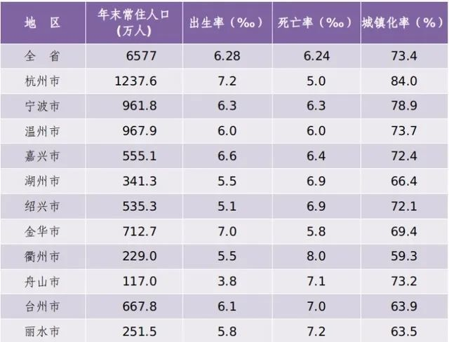

# 辽宁去年死亡人口是出生人口2倍还多，人口减少32万暂居全国第一

2022年各地的人口增长情况如何？近日部分省（区、市）统计局发布统计公报，披露了常住人口和出生人口、死亡人口等数据。

多个省（区、市）常住人口出现下降。根据北京市统计局数据，2022年末北京全市常住人口为2184.3万人，比上年末减少4.3万人。辽宁省统计局数据则显示，
**与2021年相比，辽宁2022年常住人口减少32.4万人。**

**北京常住人口数量减少4万多**

3月21日，北京市统计局、国家统计局北京调查总队发布《北京市2022年国民经济和社会发展统计公报》，统计公报显示，按常住人口计算，全市人均地区生产总值达到19万元，保持各省区市领先水平。

初步核算，北京全年实现地区生产总值41610.9亿元，比上年增长0.7%。就业、物价形势总体稳定，全年居民消费价格同比上涨1.8%，呈现温和上涨态势；城镇调查失业率均值为4.7%，运行在年度调控目标内。
**年末全市常住人口2184.3万人，比上年末减少4.3万人。**

_图片来源：北京市统计局_

具体来看，北京市2022年城镇人口为1912.8万人，占常住人口的比重为87.6%；常住外来人口为825.1万人，占常住人口的比重为37.8%。此前在2021年，北京市常住外来人口为834.8万人，占常住人口的比重为38.1%。

2022年， **北京市常住人口出生率为5.67‰，死亡率为5.72‰，自然增长率为-0.05‰。**

从年龄结构上看，2022年，北京市15-59岁劳动年龄人口为1455.2万，占总人口比重为66.6%。全市60岁及以上老年人为465.1万，占比21.3%，其中65岁及以上老人为330.1万，占比15.1%。

2022年，全市居民人均可支配收入为77415元，比上年增长3.2%。其中，农村居民人均可支配收入增长4.4%，高于城镇居民1.3个百分点。

此外，2022年北京市全年城镇新增就业26万人。全年城镇调查失业率均值为4.7%，运行在年度调控目标内。

**辽宁省一年减少32.4万人**

在北京之前，已有近20省份公布人口变动数据。河北、山东、河南、湖南、辽宁等省份的常住人口总量出现负增长， **其中辽宁省减少32.4万人，降幅最大。**
2022年常住人口增长的省份中， **浙江省以增加37万人排名第一** ，湖北、安徽、江西、江苏、广西等省份常住人口增量也达到10万人及以上。

_图表来源：第一财经_

具体来看，辽宁省统计局日前公布的统计公报显示，2022年末常住人口4197
万人。其中，城镇人口3064万人，占常住人口的比重为73.00%，乡村人口1133万人，占27.00%。

公开资料显示，2021年末，辽宁省常住人口为4229.4万人。与2021年相比，辽宁2022年常住人口减少32.4万人。

2022年，辽宁省出生人口为17.2万人，出生率为4.08‰；死亡人口38.1万人，死亡率为9.04‰；人口自然增长率为-4.96‰。简单计算可以发现，
**2022年辽宁省死亡人口数量约为出生人口数量的2.2倍。而据国家统计局今年1月发布的数据，2022年全国人口总计减少85万人。**

从年龄结构上看，年末0~15岁(含不满16周岁 )人口472万人，占常住人口的比重为11.25%；16~59岁
(含不满60周岁)人口2567万人，占61.16%；60周岁及以上人口1158万人，占27.59%。

3月18日，由辽宁省委组织部、辽宁省人力资源和社会保障厅、辽宁省教育厅共同举办的“梦筑辽宁•才助振兴”高校毕业生等青年留辽来辽就业促进行动在沈阳启动。启动仪式上，东北三省一区人社部门签订高校毕业就业工作战略合作协议，深度推进区域联合招聘、人才对接和队伍培训工作，努力提升三省一区整体公共就业服务水平，共同为新时代东北振兴发展集聚人才、留住人才、用好人才。

_图片来源：人民日报客户端_

在已公布的常住人口增长数据中，浙江省的数据排名第一。

《2022年浙江省人口主要数据公报》显示，2022年末，浙江省全省常住人口为6577万人，比2021年末的6540万人，增加了37万人。
**浙江省11个市中，全都实现了人口增长。**

_浙江各地市新增人口数据 图表来源：浙江统计局_

同时，16-59岁的人口为浙江省常住人口的“主力军”，达到4341万人，占总人口的66.0%。而与浙江省常住人口数相近的湖南省和安徽省，相同年龄段人口占比分别为61.01%和62.13%。

不仅如此。浙江统计局数据显示，2022年浙江省出生人口为41.2万人，死亡人口为40.9万人，自然增加人口为0.3万人。

也就是说，浙江的人口增长除了自然增长以外，更多依靠于机械增长，也就是人口迁入。

**“人口红利”没有消失**

据第一财经统计，已公布数据的省份中，出生人口超过50万省份有河南和山东，其中，河南去年出生人口为73.3万人。山东位居第二，为68.22万人。其他省份中，河北、江苏、安徽、广西、贵州、湖南和浙江出生人口位于40~50万之间。

包括河北、安徽、广西、湖南、湖北、江西、福建、甘肃、辽宁、内蒙古、海南等省份去年出生人口降幅超过一成。

值得注意的是，
**山东去年出生人口近几十年来首次低于70万，河北出生人口也是几十年来首次低于50万，福建出生人口是几十年来首次低于30万大关，重庆自1997年直辖市以来出生人口首次低于20万，湖北出生人口近几十年来首次低于40万。**

3月13日上午十四届全国人大一次会议闭幕后，国务院总理李强出席记者会并回答中外记者提问。李强表示，人口红利既要看人口数量更要看人口质量，既要看人口数更要看人才数，所以我们的人口红利并没有消失，我国人才红利正在逐步形成，发展的动力依旧强劲。当然，对人口增减变化带来的一系列的社会问题，我们一定是进一步深入研究、积极应对。

人民网接着发布评论称，我国发展动力依旧强劲这一论断，不仅具有高度的科学性，更具有强力的现实支撑。“我国有近9亿劳动力，每年新增劳动力超过1500万，人力资源丰富仍然是中国的突出优势。更重要的是，我国接受高等教育的人口已超过2.4亿，新增劳动力平均受教育年限达到14年。”这些数据清晰地印证了总量与质量、人口与人才之间的关系，中国劳动力资源持续增加带来的生产力提高以及经济增长效应仍然可观。

**编辑|** 卢祥勇 杜恒峰

**校对|** 孙志成

每日经济新闻综合自北京市统计局、界面新闻、澎湃新闻、第一财经

