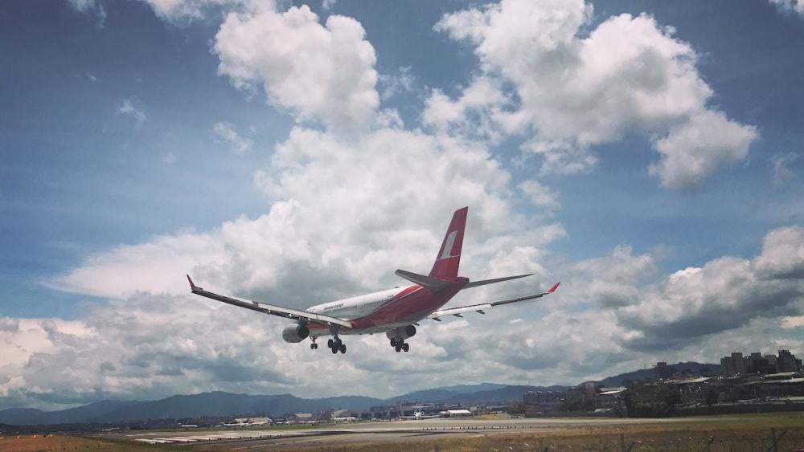

# 随心飞涨价回归！南航销售系统被挤爆：套票最高4688元，消费者喊贵

本文来源：时代财经 作者：林心林

“随心飞”卷土重来了？

_图片来源：图虫创意_

2020-2022年，曾是大厂员工的李明买了三次“随心飞”产品，打卡了伊犁、西双版纳、贵阳、成都、重庆、恩施、大连、三亚等城市。李明都快记不清自己到底飞了多少趟，“最疯狂的一次，周六上午从杭州飞西双版纳，周天晚上回杭州的航班临时取消，只能从西双版纳飞南京，周一早上6点从南京坐最早一班火车回杭州，还赶上了上班打卡。”

彼时，李明每次用“随心飞”兑换机票时只需额外支付机建费50元。如今，燃油费恢复征收、机票价格一路走高，李明感叹再也找不到50块钱随心飞全国的快乐了。

尤其是，防疫政策调整以来，各大航司基本都下架了随心飞产品。不过，3月16日起，李明所在的旅游机票群又活跃了起来，一条接一条信息弹出。

当日，中国南方航空在公众号宣布随心飞产品“畅游中国”即将开售。尽管为产品预热阶段，仅公布了不限年龄、境内航线畅飞规定，但“59元代200元代金券”“5人拼团可39元代200元代金券”的预售优惠已经让南航小程序一度崩溃。

南航又推“随心飞”，销售系统一度挤爆

3月21日早上11点，南航开放了畅游中国销售通道。产品出行日期为4月3日至7月2日，须提前5个自然日兑换，且每次兑换须支付20元以及机建燃油费。

与以往不同，此次畅游中国产品分为全国版、探索版、成都天府版、北京大兴版、东北版、云南版等众多版本，这也打消了许多出发地不在南航主要基地的消费者的疑虑。

据时代财经了解，畅游中国全国版最低3488元起，4日款（周一至周四）、4+1款（周一至周四、周五至周日指定1天）、4+2款、7天畅行款分别为3488元、3988元、4488元、4688元。

很快，有消费者在社交网络上感叹“太贵了”“决定把代金券退了”。买过三期南航“随心飞”的王励则对此次南航“随心飞”产品价格上涨早有预期，“这几年都在慢慢上涨，第一次是3000元使用6个月，第二次是3499元使用三个月，第三次已经是4100元使用三个月，这一次果然每一阶都涨了三四百元。”

常居杭州的李明则更关注东航、春秋航空等航司的产品，其也感叹，近两年许多航司的“随心飞”产品都在不断涨价，如春秋航空从999元涨至1299元。“现在‘随心飞’已经没有以前那么好薅羊毛了”，李明称即便不考虑涨价，光是每次兑票的额外费用以及机建燃油费，来回一趟的硬成本也是300元起。

尽管价格有所上涨，但南航此次推出的“畅游中国”还是吸引了不少消费者，销售系统一度出现卡壳。时代财经了解到，3月21日下午2点-3点就有不少消费者无法顺利购买，有消费者感慨“比以前难抢了”。

三年没有远程旅游的陈莉一早就买好了代金券，并在3月21日发售时入手了4688元的七天畅行版。这是陈莉第一次购买“随心飞”产品，“疫情防控放开了，计划多出去旅游，看看世界。最近机票太贵了，买套票更划算。”陈莉还称，许多一起拼团购买的消费者都是辞职待业状态，旅游时间充裕。

王励也算了一笔账，以深圳飞昆明为例，考虑到旺季机票价格普遍在500元以上，往返四五趟便基本能回本，飞得越多则越划算。“如果你选择飞一趟新疆或者西藏，一次就够本了。”

今年以来，随着疫情政策调整，国内出行限制有所减少，出行需求上涨带动机票价格水涨船高。2023年2月曾有一则“七家航司停止投放低价机票”的消息传出，要求七家国企航司减少亏损，停止低价投放。

尽管多家航司并没有正面回应该传闻，但自进入2023年，春运以及旅游需求爆发，机票价格上涨明显。航班管家便指出，由于需求量旺盛，春运前半段时间大部分热门航线平均票价均超过2022年同期，与疫情前持平。

民航业喊出力争盈利，“随心飞”不退场

对于此次“随心飞”产品返场，市场颇显意外。

“随心飞”“快乐飞”等机票产品最早出现在2020年。彼时受疫情影响，各大航司为开源相继推出机票套票产品，产品售价一般在3000元上下，旅客在购买的半年内可以任意乘坐所属航司的国内航班。

统计数据显示，2020年国内共有数十家航空公司推出“随心飞”产品，销售总量达60-80万份，合计销售额超过20亿元。

过往，每一波“随心飞”产品的推出，都伴随着旅客出行需求和上座率下降的节点。然而，今年以来民航市场快速复苏，航旅纵横提供的数据显示，3月以来（3.1-3.16），国内航线实际执行客运航班量超过17万班次，同比去年增长约62%；国内民航旅客运输量超过2000万人次，同比去年增长约102%。

过去三年累计亏损了4000亿元的民航业，亦喊出了2023年力争实现盈亏平衡。

而在此次南航发售畅游中国之前，除中联航在2023年2月22日发售了一款名为踏春“尊享飞”的随心飞季卡，各大航司均没有在今年发售过类似的“随心飞”产品。

为何商旅出行旺盛时期，被认为将退出舞台的“随心飞”会悄然返场？

广州民航职业技术学院副教授、民航专家綦琦对时代财经表示，夏季新航季到来，国内航班大幅增加，票价将出现走低，航司此举也是为了提前锁定客户，激活市场需求。

据了解，国内客运航班将在3月26日-10月28日执行夏秋新航季，周度计划航班量116412班次，同比2019年夏秋增长28.2%。航司也在陆续公布航班计划，海南航空便宣布换季后将新增进出港国内航线150余条，增频北京、三亚、深圳等地进出港公商务航线30余条等。

从近期机票价格走势来看，国内航线票价或将持续回落。携程最新统计数据显示，1月、2月、3月（1-18日）国内机票含税均价分别为984元、887元、833元，航旅纵横数据显示，3月以来国内航线机票平均支付价格为946元左右，比上月同期略有下降。

民航专家林智杰亦表示，接下来民航将进入传统的淡季，南航或也是希望通过“随心飞”产品在淡季增加一些收益，利用空余的座位；另一方面也是针对于某一些特定市场投放一些优惠的产品，比如成都天府、北京大兴、东北都有比较大的市场空间。

而根据过往使用随心飞产品心得，李明也认为除了热门航线，大部分航班上座率并不满， 南航的促销产品能充分利用空余座位。

同时，李明指出每个航线开放给随心飞用户名额有限，如春秋航空以往每个航班只有15个名额，一些大航司仅有5个名额，且都是售卖经济舱尾票，对于航空公司来说并不会产生什么损失。

“3个月内想飞回本不是很容易，要考虑时间、精力、花销，而且‘随心飞’也需要抢票，新疆、西藏、云南游一些热门城市的航班‘随心飞’名额都是秒光。”

（除綦琦、林智杰，其他受访者均为化名）

