# “沙”过来了吗？长春下泥、北京下土，北方沙尘继续向南推进

长春下泥

今年来北方最大规模沙尘来袭。今早长春出现降雨，雨水吸附了沙土灰尘，下泥雨的既视感。

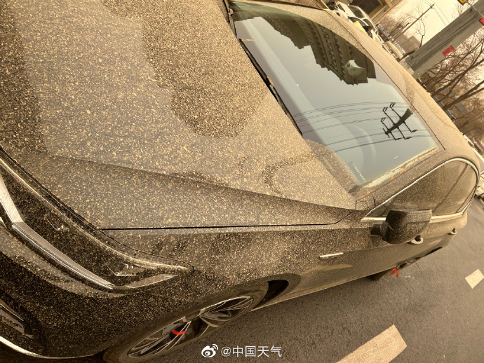

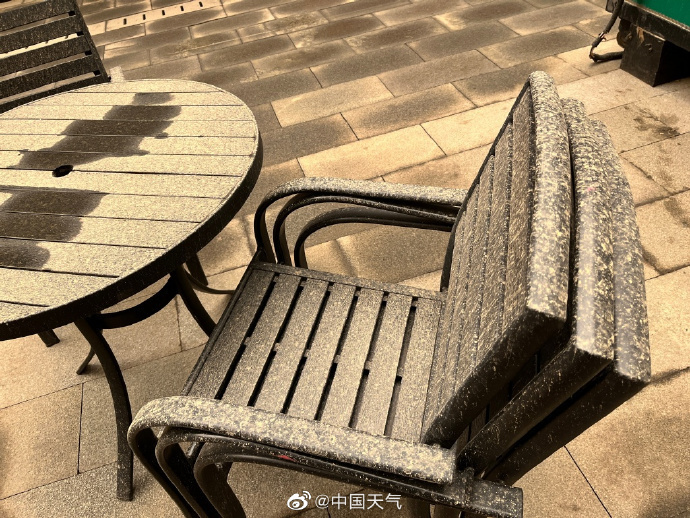

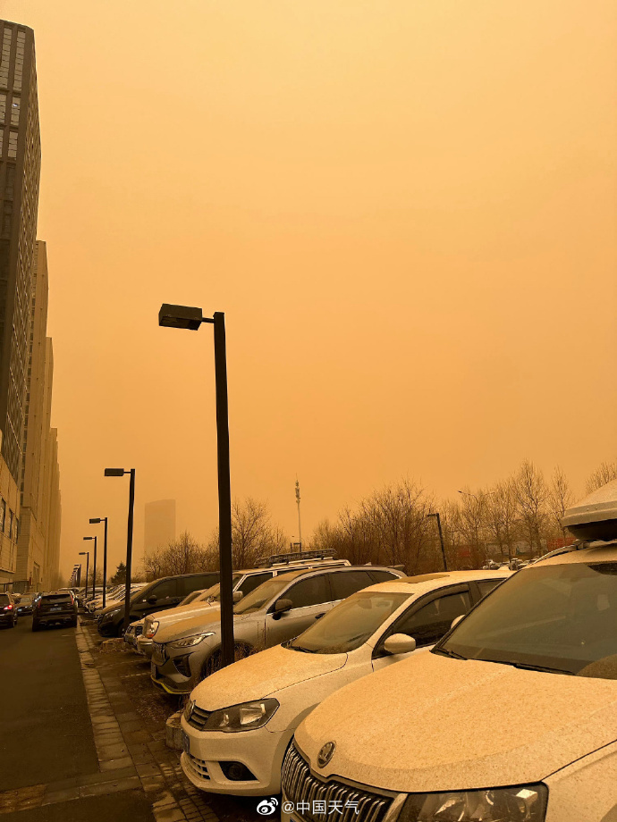

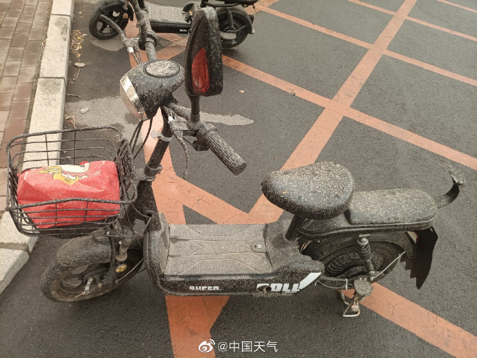

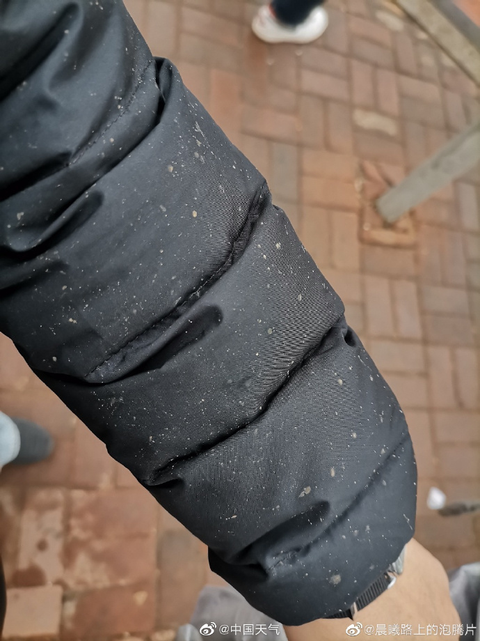

北京下土

**受沙尘暴影响，北京市属公园游船、香山公园索道暂停运营**

目前北京大风沙尘明显，截至9时，北京大部分地区能见度2到3公里，阵风六七级，山区阵风八级左右，外出注意防风防沙，外出注意健康防护，驾车注意交通安全，控制车距。预计午后能见度转至4到5公里。

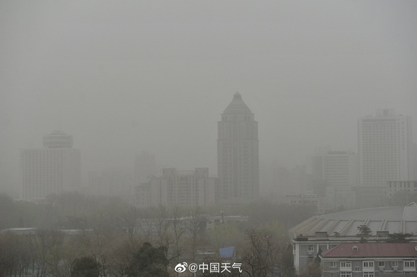

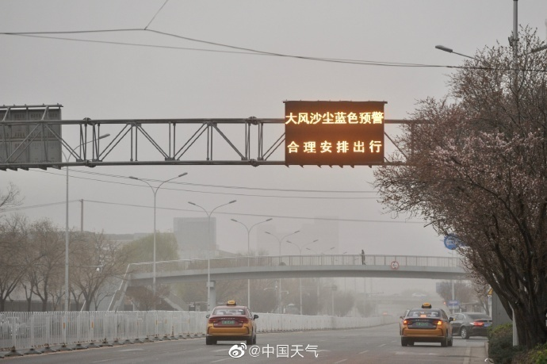

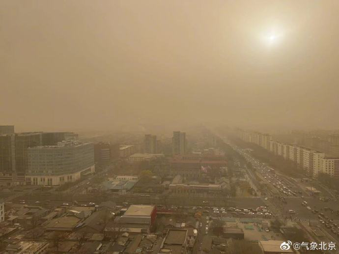

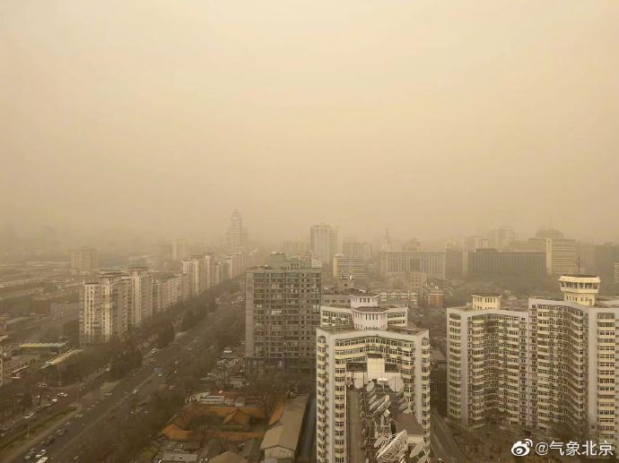

据@气象北京，今天白天晴间多云，伴有沙尘暴，大风蓝色和沙尘暴黄色预警中。为保障游览安全，市属公园游船、香山公园索道暂停运营，感谢您的理解与配合。今天北风强劲并伴有沙尘暴，请各位游客游园加强健康防护，注意防风防沙。​

**北方沙尘继续向南推进，南方雨带南压强对流发展**

冷空气带来的大风沙尘仍在我国北方地区肆虐！3月21日，大范围的沙尘天气覆盖我国西北、华北等地，今天还将继续向南推进至黄淮南部一带，预计到明天白天才会逐渐减弱结束。而在南方，今年以来最强降雨和强对流天气过程也在继续上演，公众需注意做好防范工作。

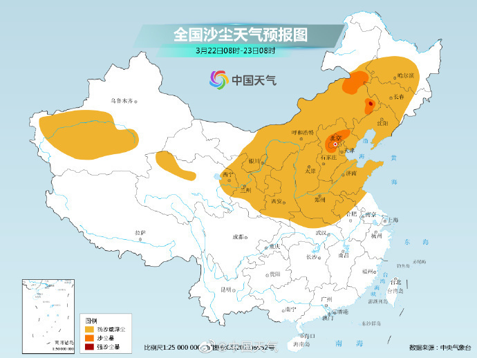

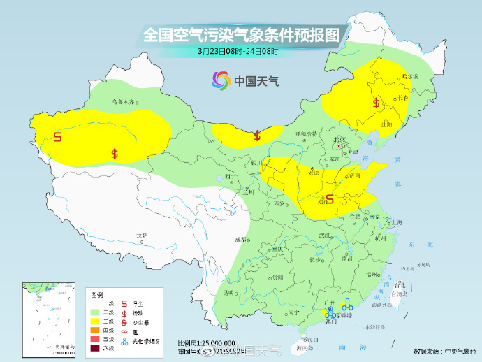

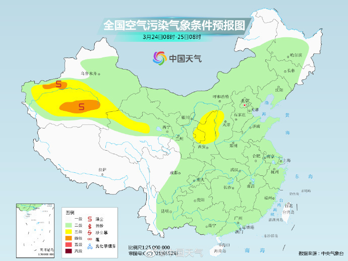

什么是沙尘暴，我们该如何防护

每当天空泛黄，空气中有尘土漂浮时，就有人认为：沙尘暴来啦！其实，并不是所有的沙尘天气都是沙尘暴。只有沙尘天气达到一定强度时，才能称为沙尘暴。在气象学上，按照影响由轻到重，沙尘天气可分为浮尘、扬沙、沙尘暴、强沙尘暴和特强沙尘暴。

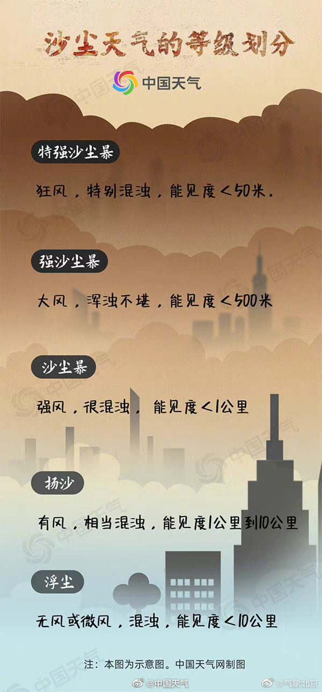

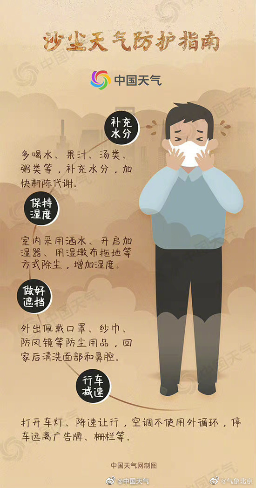

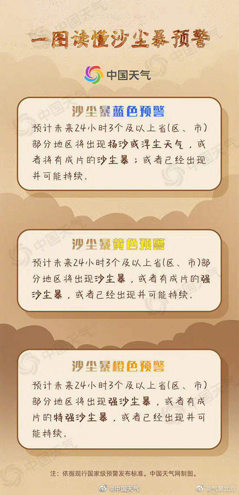

浮尘程度最轻，是指尘土、细沙均匀地浮游在空中，使水平能见度小于10公里的天气现象。

扬沙天气时，风将地面尘沙吹起，使空气相当混浊，水平能见度在1公里至10公里以内的天气现象。

当达到沙尘暴级别，大风会将地面大量沙尘吹起，使空气变得很浑浊，水平能见度小于1公里。

强沙尘暴则是强风将地面沙尘吹起，空气模糊不清，浑浊不堪，水平能见度小于500米。

而最恐怖的特强沙尘暴出现时，狂风将地面沙尘吹起，空气特别浑浊，水平能见度不足50米。

（综合@中国天气、@气象北京、@畅游公园）

统筹：王长善

编辑：刘瑶

