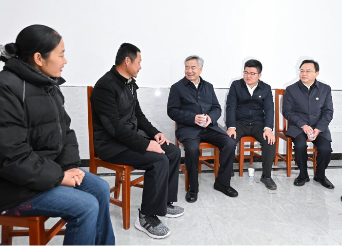
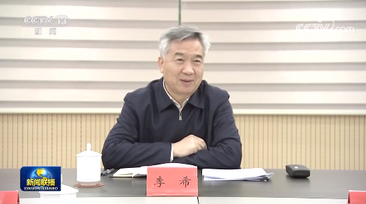

# 中央纪委书记首次外出调研，透露重磅信号

**撰文 | 高语阳**

3月19日至21日， 中共中央政治局常委、中央纪委书记李希到湖北调研。

**这是李希于2022年10月23日当选中央纪委书记以后，首次外出调研。**

政知君梳理，李希调研有3个重点，透露了纪检监察工作重要方向。

第一，深入开展乡村振兴领域不正之风和腐败问题专项整治

在湖北，李希前往武汉市东湖新城社区、鄂州市鄂城区峒山村。他与群众交流，听取对加强基层党风廉政建设的意见建议。

**李希表示，纪检监察工作要监督保障党中央惠民富民政策措施落实，深入开展乡村振兴领域不正之风和腐败问题专项整治。**

_3月20日李希在鄂州市鄂城区峒山村调研_

首先，注意四个字：“专项整治”。

**今年以来，从高层到中央纪委层面，都非常重视分领域开展专项整治。**

1月9日，习近平在二十届中央纪委二次全会上的讲话中指出，要对比较突出的行业性、系统性、地域性腐败问题进行专项整治。

全会公报也指出，要突出重点领域，深化整治金融、国有企业、政法、粮食购销等权力集中、资金密集、资源富集领域的腐败。

随后，李希在全会上的工作报告全文发布。报告在部署2023年主要工作时明确指出，积极开展乡村振兴领域不正之风和腐败问题专项整治，加强对重点项目、重大资金、重要环节的监督检查，看住国家资产、集体财产，维护农民合法权益。

**这意味着，在专项整治工作中，乡村振兴领域的突出问题成为下一阶段监督重点。**

2月16日，中央纪委印发《关于开展乡村振兴领域不正之风和腐败问题专项整治的意见》。 **这是中央纪委层面首次发文，专项整治乡村振兴领域问题。**

《意见》明确了乡村振兴领域5个方面的重点工作，并指出，
**要对乡村振兴领域问题线索进行“大起底”和“回头看”，对新增问题线索严查速办、动态清零，加大线索存量处置力度，严查违纪违法问题。**

《意见》印发以后，各地纷纷行动，剑指乡村振兴领域不正之风和腐败问题。

政知君注意到，近期报道显示，黑龙江省、辽宁省纪委监委在全省范围内作最新部署。

3月21日，黑龙江省纪委监委召开全省乡村振兴领域不正之风和腐败问题专项整治工作动员部署视频会议，对专项整治工作作出安排部署。

专项整治从2023年3月开始，至12月底结束。分为动员部署、自查自纠、查办案件、督导检查、整章建制5个阶段，重点整治乡村振兴领域政策落实、产业发展、项目实施、惠农资金管理使用等重点领域、重点环节的不正之风和腐败问题。

3月22日，辽宁省纪委监委制定并印发《贯彻落实〈关于开展乡村振兴领域不正之风和腐败问题专项整治的意见〉的具体措施》。

《具体措施》中指出，要全面摸排查找乡村振兴领域侵害群众利益的突出问题，全面排查起底乡村振兴领域问题线索。

第二，要高度重视、切实抓好全国纪检监察干部队伍教育整顿

调研期间，李希前往湖北省纪委监委、省委巡视办和鄂州市华容区纪委监委，了解工作进展情况，并主持召开部分省市纪委书记座谈会。

李希表示，各级纪检监察机关要严格纪律教育和纪律执行， **要高度重视、切实抓好全国纪检监察干部队伍教育整顿**
，以更高标准、更严要求纯洁思想、纯洁组织，打造忠诚干净担当、敢于善于斗争的纪检监察铁军。

_3月21日李希主持召开部分省市纪委书记座谈会_

全国纪检监察干部队伍教育整顿是今年的一项大部署。

1月9日，习近平在二十届中央纪委二次全会上指出，纪检监察机关要勇于自我革命；要完善内控机制，自觉接受各方面监督，对纪检监察干部从严管理，对系统内的腐败分子从严惩治，坚决防治“灯下黑”。

李希在全会上作工作报告时明确提到，要结合主题教育扎实开展全国纪检监察系统干部队伍教育整顿。

**2月24日，全国纪检监察干部队伍教育整顿动员部署会议在北京召开。在全系统范围内开展纪检监察干部队伍教育整顿，尚属首次。**

李希在会上指出， **清仓起底全面处置线索，刀刃向己主动说清问题，严肃认真坚决清理门户，动真碰硬重点推进整改。**

要以最鲜明的态度、最有力的措施、最果断的行动坚决查处“两面人”、坚决防治“灯下黑”；要坚持全员参与、全面覆盖，分层分类指导督导，防止运动式，避免“一刀切”，确保取得实实在在成效。

动员会以后，多省份省级党委书记在省委常委会会议上对纪检监察干部队伍教育整顿作要求，多省份省级纪委书记开会部署具体工作。

最新报道显示，3月21日，广东省召开全省纪检监察干部队伍教育整顿动员部署会。

广东省委常委、省纪委书记宋福龙指出，要层层压实责任，把握重点关键，加强指导督导，营造良好氛围，从政治上保证教育整顿有力有序推进。

公开报道显示， **有些省份已经成立省级“领导小组”。**

2月27日，福建省委常委、省纪委书记迟耀云主持召开省纪委常委会（扩大）会议，审议了福建省纪委监委开展教育整顿实施方案，研究具体贯彻措施。

会议指出，要加强组织领导和整体谋划，成立全省纪检监察干部队伍教育整顿领导小组，发挥下设办公室的统筹、监督、指导、检查作用，各司其职、分层同步推进教育整顿。

这是公开报道中首次提到要成立“全省纪检监察干部队伍教育整顿领导小组”及其下设办公室。

3月14日，陕西省纪检监察干部队伍教育整顿动员部署会议召开。陕西省委常委、省纪委书记王兴宁首次以“陕西省纪检监察干部队伍教育整顿领导小组组长”的身份出席会议。

第三，推进国有企业党风廉政建设和高校纪检监察体制改革

李希在湖北的行程还包括调研武昌船舶重工集团有限公司、中国长江三峡集团有限公司，以及武汉大学。

在企业调研时，李希指出，要深入推进国有企业党风廉政建设，推动国有企业做强做优做大，更好服务国家战略；

在武汉大学，李希调研了高校纪检监察体制改革等情况，对推动党委认真履行管党治校主体责任、“一校一策”做好巡视整改提出明确要求，并就有关课题与专家学者座谈交流。

两个关键词：国企、高校。

前文提到，二十届中央纪委二次全会公报指出， **要突出重点领域，深化整治金融、国有企业、政法、粮食购销等权力集中、资金密集、资源富集领域的腐败。**

另外中央纪委国家监委网站发表评论文章写道， **突出惩治重点，紧盯金融、国有企业、政法、粮食购销、体育、高校等重点领域。**

国企、高校名列重点领域之中。

**近年来，国企、高校反腐一直是纪委监委工作重点之一，接连有“一把手”落马。**

政知君注意到，李希在湖北调研期间中央纪委国家监委还发布了国企“一把手”落马消息。

3月20日，中央纪委国家监委网站消息，日前，国家监委对紫光集团有限公司原董事长赵伟国涉嫌职务犯罪问题进行了立案调查。

赵伟国被指身为国有企业管理人员，利欲熏心，肆意妄为，背弃职责使命，公器私用、化公为私，将所管理的国有企业视为私人领地，处心积虑巧取豪夺国有资产，违规将本单位的盈利业务交由亲友进行经营，以明显高于市场的价格向亲友经营管理的单位采购商品，致使国家利益遭受特别重大损失。

赵伟国涉嫌贪污、为亲友非法牟利、背信损害上市公司利益犯罪被移送检察机关审查起诉。

另外， **李希专门调研了高校纪检监察体制改革情况。**

此前，李希在二十届中央纪委二次全会上作工作报告时指出， **加强对中管企业、中管金融企业、中管高校深化纪检监察体制改革的指导**
，全面推进垂直管理单位纪检监察体制改革，提高派驻监督全覆盖质量。

同时，深化地方派驻机构改革，推进省市县三级派驻机构设置和人员配备等工作， **扩大省级纪委监委向省管高校和国有企业派驻纪检监察组试点。**

**资料｜ 新华社 中央纪委国家监委网站**

**【版权声明】本文著作权归政知新媒体独家所有，未经授权，不得转载。**

