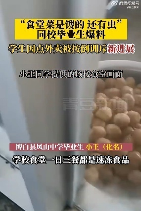
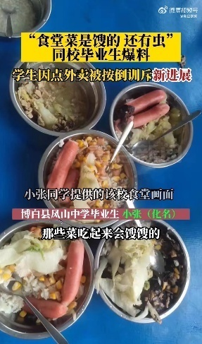
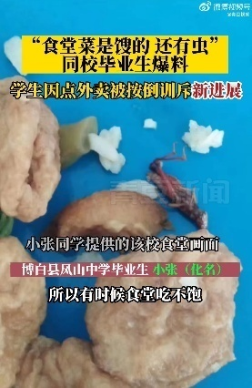

# 中学生因点外卖被保安按倒，同校学生：学校强制消费，食堂饭菜是馊的

3月21日晚，据河北青年报“青豆视频”报道，3月20日，媒体就“中学生因点外卖被校务人员按倒训斥”一事进行了采访报道，3月21日，该校毕业生小王（化名）向记者透露，学校食堂的饭菜大多是热狗和肉丸等速冻食品。

小王表示：“上学三年，学校食堂一日三餐都是速冻食品，一餐7块钱，强制消费。”

另一名也已经毕业的学生小张（化名）称，食堂饭菜有过馊的情况，菜里面还有虫，并提供了当时拍摄的视频和图片。“那些菜吃起来会馊馊的，青菜里面还有虫，所以有时候食堂吃不饱。”

经多方核实，该校在读学生的说法与两位毕业生介绍的情况基本一致。随后，记者致电博白县教育局，工作人员称，目前还在调查了解中。

**【来源：九派新闻综合河北青年报“青豆视频”】**

