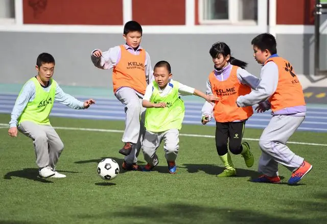
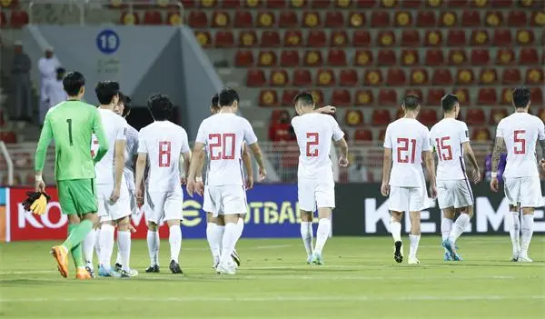

# 为何中国足球水平不升反降？

近年来，中国足球尤其是男足国字号球队长期在低位徘徊，职业联赛呈现诸多乱象，足球市场萎靡难振。与此同时，国内青少年足球人口依然严重不足，社会足球发展难见突破。出现这些问题的症结究竟在哪里？又该如何解决？

日前，《工人日报》记者针对相关问题，专访了著名足球评论员、原国安足球俱乐部总经理、副董事长张路，以期释疑。

关于职业足球发展

**问：为什么近年来中国足球水平会出现不升反降的情况？**

答：从各级国家队和各级职业联赛近年来的表现来看，中国足球的整体水平与以往以及和周边国家比，不仅没有得到提高，反而有所下降。最重要原因就是缺少踢球的人，这是一切问题的根本症结。

上世纪90年代，全国20个足球重点城市常年踢球的小学生只有一万余人，而到了2000年至2004年，这一数字可能降到5000人左右。而日本这一数字不低于60万人。正是由于这个阶段常年踢球的孩子少，注册球员的数量也少，难以选拔大量具备天赋的优秀球员，反映在竞技体育上的成绩就是近年来一路走低。

**问：近年来，国内足球职业联赛发展面临重重困境。您认为应该如何规范职业联赛？**

答：这些年，许多球队的运营缺乏有机的循环体，当投资人经济效益受损，球队的生存便出现问题，真正职业化才是中国足球联赛的未来。客观来说，面对近年来的联赛运营危机，中国足协并没有熟视无睹。现在严格俱乐部准入，倒逼他们解决欠薪等政策都是在促进联赛健康发展。

关于青少年足球发展

**问：为什么中国青少年足球人口长期偏少，是因为小孩子们都不爱踢球吗？**

答：实际上很多孩子都爱踢球，但为什么踢球的小孩这么少，主要还是因为长期以来我们的方向错了。

小学阶段，在出成绩的目的下，很多学校会组织校队。然而，在低年级阶段，孩子们的时空感、球感等足球天赋是很难看出来的。很多体育教师凭借自己的感觉，如认为个子高、跑得快就适合足球，于是组成一支球队苦练。

我曾经调研过，一些小学校队的训练时长甚至比专业运动员还长。这样一来，不少孩子过早失去了对足球的兴趣。更严重的后果是，他们长期在学校的球场训练，也间接剥夺了其他可能对足球感兴趣的孩子练习的机会。加之长时间的苦练也使得孩子很难兼顾文化课。如此一来，越来越多的家长就会反对孩子在学校踢球。我的观察是，一个孩子在小学阶段不踢球的话，中学以后踢球的概率也很低，所以一定要在小学阶段尽可能让多数孩子接触足球。

**问：那应该如何调动更多青少年参与足球运动？**

答：简单来说就是去除功利思想。绝大部分孩子成为不了足球人才，要给那些最终没有走入职业足球道路的孩子一个踢球的理由。需要什么理由呢？足球运动是促进人的素质全面提高的教育手段之一，为了孩子的健康和快乐，才是发展校园足球的主要目的。体育教师要善于引导，让孩子们充分享受足球运动，在这个过程中获得健康、快乐和成就感。

**问：您认为应该如何抓好校园足球和青训？**

答：重点是要去除早期专项化，过早地把孩子“练废”的恶果，把踢球和文化课学习两者兼容起来。我建议小学和初中学生每周练两次，每次不超过一个半小时，每周进行一场比赛，不进行排名。这样的安排不会影响孩子的学习，也去除了功利性。

我认为，校园足球和青训是两码事。在我看来，青训属于提高阶段，不是主要的，搞好校园足球是基础，对当下的中国足球来说更重要。至于青训如何搞好，足球发展得好的国家有现成经验，完全可以借鉴，关键在于落实到位，久久为功。

关于社会足球发展

**问：发展社会足球对于当下的中国足球有何意义？**

答：除了我们刚才谈到的抓好基础，让更多的青少年参与足球运动之外，不可忽视的是社会足球对于足球文化氛围的积淀作用。所有足球强国，其完整的顶级职业联赛体系，无不建立在区域内半职业赛事和民间赛事所构筑的雄厚基础上。

**问：在发展社会足球或者说是草根足球方面，应该如何着力？**

答：我认为，国内基层足协在这方面长期处于缺位状态，绝大多数地方的等级联赛至今没有搞起来。这一点有做得好的地方，但极少，我知道的例子是陕西省志丹县在业余联赛方面的建设卓有成效。

县级和地级市足球赛事的重要性在于，组织联赛方便，接近普通大众。全国近3000个县级行政单位，如果有十分之一的地区能够建立起完善的业余联赛体系，我想中国足球将是另一番局面。

**问：中国足球应该如何积极自救？**

答：最重要的就是扭转对足球的认知，以利益驱动转变为兴趣驱动，改变这么多年以来急于出成绩的错误导向。在抓好后备人才的过程中，要坚决摒弃急功近利的心态，一步一个脚印地打造后备人才培养和成长的路径通道。其次，要充分发挥主管部门、市场和社会的力量，建立“三位一体”的社会足球发展体制和运行机制。

来源：工人日报 工人日报记者 刘兵

