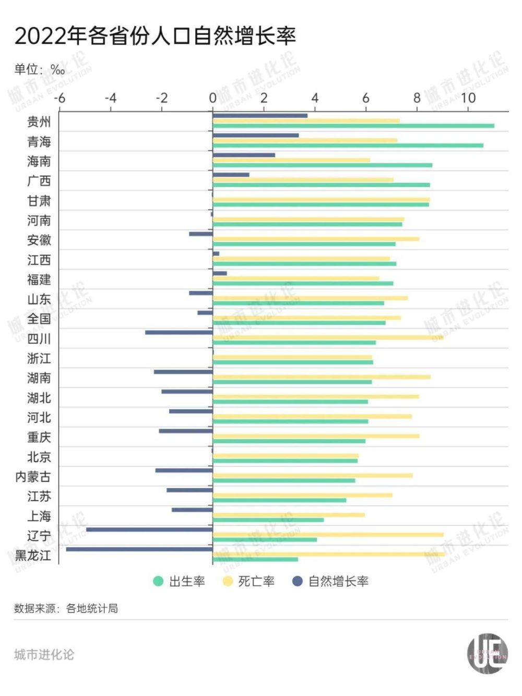
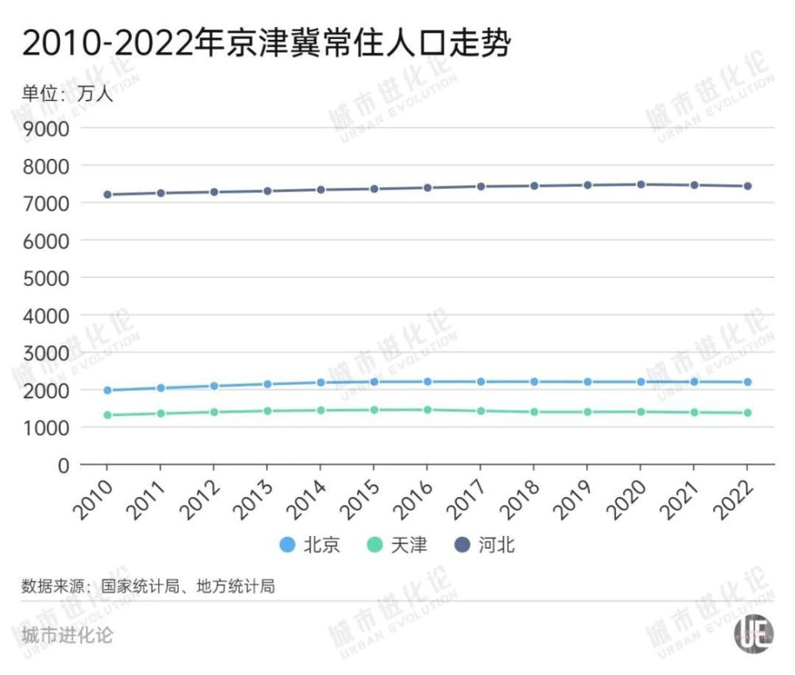
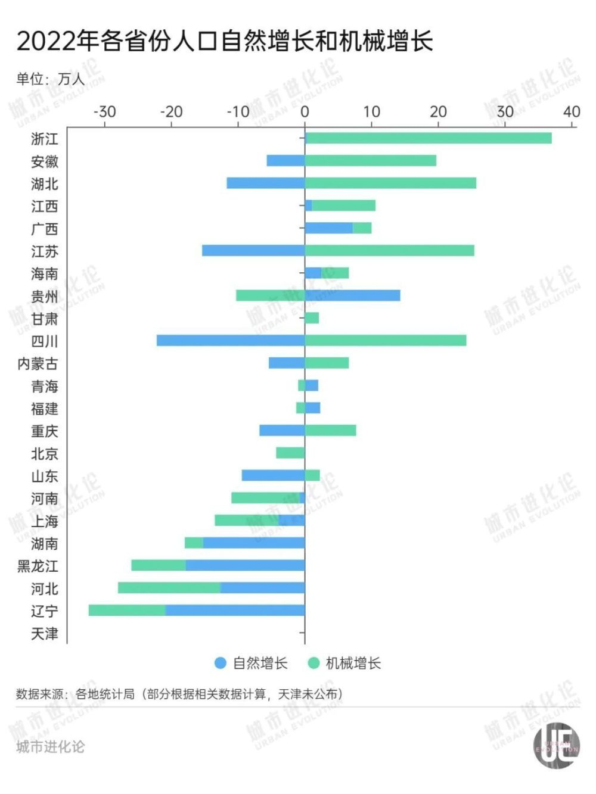

# 各地人口压力显现：40万人离开京津冀，长三角增量“腰斩”

__

近期，各省份陆续发布2022年国民经济发展情况，在“2022年全国人口减少85万”的大背景下，地方人口数据变化尤为引人关注。

在已公布的23个省份中，浙江以净增37万人位列第一，因“人口第一大省”广东尚未披露数据，其能否蝉联“人口增量冠军”还有待确认；湖北、安徽以净增14万人并列第二，江西则以10.58万增量排在第四位，紧随其后的江苏、广西净增人口也突破两位数，达到10万人。

总体来看，虽然目前已有6个省份实现两位数人口增长，在不算上广东的情况下，已追平2021年。但锐减的增量数据，直白地暴露了各地的人口压力——

一方面，2021的增量“佼佼者”纷纷被调减。除浙江增量接近减半外，湖北、江苏、福建人口增量分别减少40.74万、18.1万、25万，广西减少得最少，增量从18万回落至10万。

同时，从区域来看，回调趋势同样明显。其中，长三角2022年常住人口增量十年间首次跌破100万人，实际仅增加47.46万人。而京津冀的情况更不容乐观，继2021年减少29.84万人后，2022年人口流失规模进一步扩大，达到42.3万人。

按照学界的观点，人口负增长一旦开始，将会持续较长时期。这意味着，吸引人口保持机械增长将是接下来地方竞速的发力重点，而继2017年“抢人大战”推动具有一定学历和技能的人口基本实现“零门槛”落户后，新一轮“抢人大战”是时候开始了。

**01**

**长三角：增量跌破50万**

截至目前，23个披露数据的省份中已有16个人口自然负增长。其中，山东、河南、安徽、甘肃首次由“正”转“负”，北京则是在2003年短暂出现负增长后，20年间第二次负增长。

对比来看，2021年人口自然负增长省份一共是13个。当然，越来越多省份开启“负增长”状态，并不令人意外。正如中国社科院人口与劳动经济研究所一位研究员所言，当生育更替水平低于2.1，“一定会在未来某个时刻走向负增长”。

自然增长乏力，机械增长成为地方“稳人口”的主要办法——通过吸引外来人口，实现人口净增长。上述研究员提到，上海、江苏等地虽然此前执行了较为严格的计划生育政策，但通过大量吸引外来人口，在人口规模上一直表现不俗。

数据显示，2021年上海、江苏人口自然增长率首次转负，分别为-0.92‰、-1.12‰，浙江、安徽保持正增长，但也只有1‰、0.05‰。在这样“紧平衡”的状态下，长三角全年净增人口达到109.21万人。

到了2022年，安徽也转入自然负增长，“-0.93‰”对应减少5.7万人，而浙江自然增长率也已逼近临界线，自然增加人口仅0.3万人。也就是说，在浙江、安徽全年净增人口中，分别有36.7万、19.7万是“受吸引而来”。

需要强调的是，长三角作为经济高度活跃的地区，长期保有较高的人口吸引力，过去十年间，区域内常住人口增量规模一直保持在100万人以上。但2022年三省一市净增人口仅47.46万，创历史新低。其中，上海人口减少13.54万人，为10年间人口减少最多的一次。

**02**

**京津冀：减量超40万人**

京津冀的情况更不容乐观。继2021年负增长29.84万人后，2022年人口流失规模扩大至42.3万人。

具体来看，北京已连续六年常住人口“温和”负增长，2022年人口减少最多，为4.3万人；天津则连续两年净减少人口规模在10万水平；最大的变化发生在河北身上，继2021年减少15.84万人后，2022年流失规模接近翻倍，达到28万人。

从增长构成来看，京津冀2021年自然增长率分别为0.96‰、-0.93‰、-0.43‰，2022年北京也转负（-0.05‰），天津尚未公布相关数据，河北则进一步扩大至-1.71%。由此计算，在河北去年减少的28万人中，自然负增长12.7万人，意味着还有15.3万人净流出；北京自然减少0.1万人，人口净流出规模则达到4.2万人。

中国区域经济学会副会长兼秘书长陈耀在受访时指出，随着京津冀在全国大盘中经济份额减小，在此背景下，就业岗位变化势必会影响人口流动。

国家统计局数据显示，2022年京津冀占全国GDP比重为8.29%，而2012年这一份额为9.5%，十年间呈现下降趋势。对比来看，同期长三角占全国GDP比重保持相对稳定，2012年为23.7%，2022年为24%。

有观点认为，北京作为京津冀地区吸纳人口的主力，2014年开始主动“减量发展”后，常住人口减少是一个必然结果。但如果河北“兜不住底”——除了就业岗位，还有营商环境、公共服务品质，都会影响普通人“用脚投票”的选择，进而影响整个区域的人口规模。

_图片来源：新华社_

此前，在以“动批”为代表的北京商贸服务业外迁过程中，河北承接了大量人口，2014年至2020年常住人口年均增加22万人。但其中一些产业远离了北京又很难存活，打工人“往就业岗位多的地方去”也就在情理之中。

一位人口学专家也提到，京津冀的经济分布结构与长三角、珠三角很不一样，除北京外，其他两个省份吸纳就业的能力相对较弱，而北京又更倾向于“高精尖”，如先进制造业、高端服务业，但从人口结构看，“现在流入流出的人口中，高端人才毕竟是少数。”他提醒道。

**03**

**江西贵州由负转正**

从2022年各地常住人口的变化中，还可以看到，产业发展已成为一些地方“扭亏为盈”的主要筹码。

以江西为例，常住人口增量由2021年的-1.46万人转变为2022年10.58万人，这里面，自然增长仅1.1万，机械增长达到9.48万人。

内蒙古的情况相似，常住人口增量由2021年的-2.8万人转变为2022年的1.17万人，不同的是，其自然增长人口仍然为负，减少5.4万人，通过吸引6.57万外来人口，方才实现“转正”。

陈耀表示，江西这两年“涨势”不错，把稀土、锂矿等战略性资源的优势发挥了出来，在培育新能源产业上有不错表现，能够提供更多的就业岗位，而内蒙古除了畜牧业外，能源基地建设、“东数西算”工程等布局，都为其吸引外来人口提供了支撑点。

不过，另外两个“转正”的省份，形势仍颇为严峻。

其中，贵州常住人口增量虽然由2021年的-6万人转变为2022年的4万人，但具体来看，其人口自然增长就有14.3万人——是已公布人口数据的省份中自然增长量最多的一个，也就是说，贵州还没有足够的吸引力，留下“自己人”。

而甘肃2022年净增2万人，其中包括机械增长人口2.1万，但在陈耀看来，甘肃尚未培育形成新的经济动能，产业上缺乏亮点，还将面临比较困难的人口外流局面，“一个年度的数据不能说明问题”。

显然，经济和人口是联动的。数据显示，贵州人均GDP曾长期排名全国最末，在2015年、2017年、2018年连续超越甘肃、黑龙江和广西，排名升至倒数第四，而甘肃在被贵州超越后，至今排在最后一位，2022年人均GDP仅4.5万元，约等于浙江人均GDP的38%。

**04**

**该拿什么吸引人口？**

长三角是不是在“虹吸”京津冀的人口？目前披露的数据还不能直接证明这一点，但在产业集群化发展的发展思路下，细分行业向特定区域集中的趋势也愈发明显。

_图片来源：新华社_

比如，根据第三方招聘平台数据，杭州日前放话“吸走”了北京和上海的人才，而流入杭州的人才中，有近三成进入了“IT\互联网\游戏”行业——杭州的优势领域。

在陈耀看来，区域格局中，产业分工和岗位多寡是影响就业人口转移的关键。他强调说，一个地方的吸引力有多大，取决于区域内的就业岗位和公共服务品质。特别是随着Z世代走向社会，地方政府更需要研究当代年轻人的需求，有针对性地提供供给。

按照受访专家的观点，鼓励支持生育的效果并不能很快显现，在2017年那一轮“抢人大战”拉平了绝大多数城市的落户门槛后，接下来应该拿什么吸引人口保持机械增长，是考验，也是机遇。

文字 | 余蕊均

