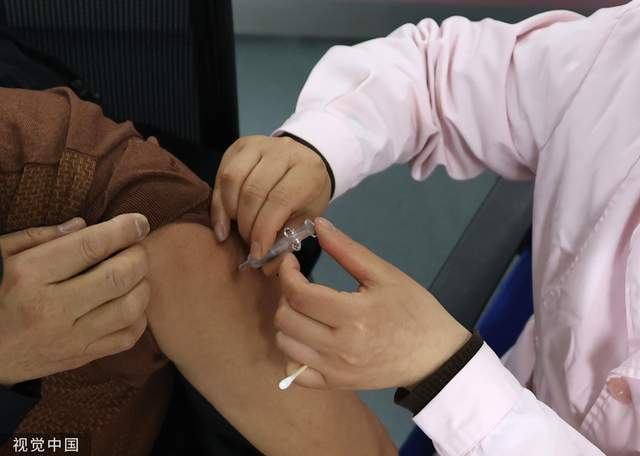
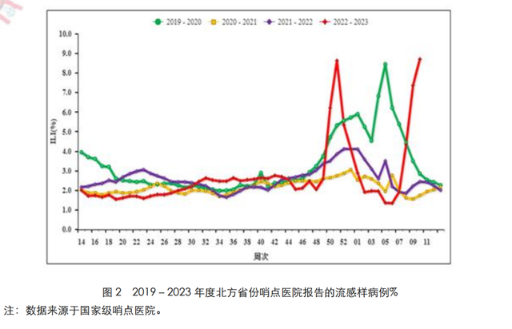

# 大面积甲流正在过高峰？多地依旧焦灼，流感疫苗接种“亡羊补牢”

本轮流感终于过峰？乐观言论似乎为时尚早。

最近几日，部分地区流感流行确实开始显露缓和迹象。比如北京在第10周（3月6日~12日）时，全市报告法定传染病例数达到了多年未见、极为惊人的69705例（其中流感排名第一），远高出往年水平。

而进入上周后（第11周），多家北京地区医院发热门诊患者数量明显减少，北京市本轮流感疫情的“盛极转衰”可能已经开始。

但放眼全国，甲流与人群依旧处于胶着状态。流行病学专家表示，部分地区出现下降趋势，并非意味着甲流即将偃旗息鼓，也有可能出现波动反弹。

甲流疫情的地区特征明显，各地对高峰感知并不一致。在临床，有些城市的医院门急诊目前仍处于高压，甚至过载状态。

国家流感中心最新周报（第10周）显示，两周前，南、北方省份流感样病例百分比仍处于高位，而且无论是南、北方的哨点医院，一周的流感样病例报告数较上一周依旧升高。

由于流感病毒无差别攻击全人群的特性，加上疫情后人们更加关注个体健康的情绪，今年人们对“甲流中招”的感知格外强烈。

_2023年3月10日，连云港市民在接种流感疫苗_

一切都有迹可循——“免疫欠债” “报复性反弹” “流感疫苗欠账”，重重压力之下，一波传播迅速、涉及人群范围广的流感以千钧之势到来。

多名临床医生和流行病学家明确表示，此次流感疫情规模显著大于过往数年。

但更为大家关心的，本次流感疫情究竟什么时候结束？一位流行病专家表示，今年流感流行季的流感病毒毒株仍以H1N1
为主，与既往毒株相比没有十分显著的改变，因此，估计其过峰速度与过去相比也不会有明显的变化。

感染正在过峰？各地感知不一

在一些地区，流感过峰的好消息，从医院传来。

三月初，杭州市儿童医院每日要接诊上千例发热患儿，门诊部副主任赵伟忙到晚上十一点下班；近日，赵伟说，从3月13日开始，甲流患儿已经逐步减少，发热门诊量减少了50%左右，几乎没有重症患儿。

三月初，浙江省一家三甲医院里，感染科医生还在连夜开会讨论如何应对这波甲流；昨天，医院医生说，门诊量已经减少一半左右，药品、床位等资源也变得宽裕。

三月初，上海市儿童医院严阵以待，几乎全员上前线，许多岗位取消了5天工作制，尤其病区的大夫们经常要加班到晚上9点多钟；最近几天，消化感染科主任张婷也感到稍稍松了一口气，因为虽然病房依旧饱和，但是门诊过载的情况开始有所缓解，这周大家终于可以争取回到5天工作的正常节奏了。

“相比最高峰时期，目前儿童发热门诊的接诊量只有当时的三分之二，而且下降趋势已经持续了三四天。最高峰的时候，儿童发热和急诊日接诊量为400多人次。”北京清华长庚医院儿科副主任晁爽也告诉八点健闻。

但是，在三月初甲流并不严重的地区，如今却涌进了不少甲流患者。

各地出现了错峰“过高峰”的现象。

月初时，江苏省北部地区某三甲医院呼吸科主任还没有明显感受到甲流的到来，只是偶尔会接诊几例甲流患者。

自此之后的半个多月时间里，甲流患者陆续增多，他感觉最近一周的时间，甲流已经达到高峰，“本院呼吸科病人增加了30~40%左右，东院的门诊大概增加了40~50%”。病房里出现了病人之间交叉感染，“甚至有一个病房里三四个人全部出现高烧的情况。”

甲流与人群正处于胶着状态，出现下降趋势并非意味着甲流即将偃旗息鼓，也有可能出现波动反弹。

北京京都儿童医院儿科副主任医师王玉芳表示，从上周开始，甲流患者就诊量出现缓慢减少的趋势，但到了周六日，门诊量又猛增了。

“这周，日门诊量达到2400人次左右，门诊最高峰的时候有2600人次。”她解释道，“流感暴发后，门诊量较之平常增加了好几百。为了应对流感暴发，医院增加了数个小夜诊，急诊增加了多个班次。”

实际上，流感流行存在地区差异，各地流行进度不一，这本就是多年来的经验。

昨日，中国疾控中心病毒病所国家流感中心主任王大燕指出，此次流感活动水平在2023年2月初开始升高，2月底后上升趋势明显，到3月中旬已经进入高峰期。虽然目前整体仍处于高位，但也监测到有几个省份流感活动高峰已经出现拐点，开始下降。

根据国家流感中心流感监测周报（第10周），可以看出，南北方的流感样本例仍处于上升态势，不过，南北方省份的上升曲线都有趋缓的迹象，北方省份更为明显。

需要强调的是，不论南北，今年的流感都处于近几年的绝对历史高位。

_图源：国家流感中心流感监测周报（2023年第10周）_

_图源：国家流感中心流感监测周报（2023年第10周）_

虽然流感流行增长态势已经趋缓，但什么时候结束仍需要时间观察。

尽管今年的流感比往年来得晚一些，但是南方科技大学公共卫生及应急管理学院流行病学教授魏晟估计，这次流感的过峰速度与过去相比也不会有明显的变化。

被耽误的流感疫苗

作为季节性的公共产品，流感疫苗常在每年秋冬季节开始接种，以预防来年冬春之交的流感病毒，很少有地方会持续到3月。

而今年春天已经开始回暖，部分地方流感疫苗接种的时间延长了，至今还未停止。

京都儿童医院预防接种科医生刘榕告诉八点健闻，过去门诊从前一年的9月开放流感疫苗的预约接种，持续到年底或次年1月为止。但今年，2月起流行的甲流导致接种意愿骤然汹涌，在2月初至3月中旬前，医院罕见地迎来了一波流感疫苗接种小高峰。

甚至还出现了父母特地为去年没有接种的孩子预约流感疫苗，结果还没到接种日期，孩子就感染了甲流，无法接种的情况。

为此，医院追加进货了一批流感疫苗，3岁以上的进了20支，3岁以下的十几支，加上去年遗留的不到40支的库存，总共不到100支的量，在3月15日之前全部接种完毕。“现在还剩下最后几支库存，是供3岁以下儿童接种的第二针。”她说。

另一个影响接种期延长的因素，是去年秋冬时存在感还很强的新冠疫情。

一位儿科医生在出门诊时了解到，去年11月份，正是流感疫苗接种的时候，结果却赶上封控，很多学生还没来得及打疫苗就回家上网课了，担心外出会增加新冠感染风险，也没有独自接种，“因此有一批孩子没打成”。

这种“被耽误”在养老院里也存在。

南方省份一位养老院院长坦言，既往院方一直有针对流感疫苗的接种宣教，接种率一直保持在30%左右，“但去年打的很少，因为所有精力都放在新冠疫苗接种上了，分身乏术”。该院的新冠疫苗接种率是100%。

一边是延迟的流感疫苗接种期，一边是呈两级分化的接种进程，这种差异性在老年人的流感疫苗接种中尤为明显。

多位养老机构负责人向八点健闻表示，该地未见甲流流行，养老院里没有出现甲流感染，既往也没有过流感疫苗的宣教或集中接种组织。

“流感疫苗属于自费疫苗，打不打决定权在于家属，院方不会干涉，再者，也没必要宣传疫苗接种，以免引起恐慌。”一位中部省份的养老院院长说。

为了应对甲流，锦欣福星康养旗下的养老院延续了新冠时期的防护措施，定期消毒、通风，不仅实行家属预约探视，还要求探视期间全程佩戴口罩。

最近两天，或许是甲流感染带来的紧迫感，长沙一家养老机构正在收集家属意愿，希望赶在接种的尾声之前，抓紧给老人们打上流感疫苗。

在3月下旬的这个时间节点里，很多社区卫生服务中心的流感疫苗已经用尽，机构也几乎不大可能再进货——因为流感疫苗具有保质期，4月份就基本到期——但上述养老机构仍然在做亡羊补牢式的尝试。

或许是此次流感并未在老年人群中引起较大规模传播，相当一部分老年人对流感病毒的危害仍一无所知。

“去年新冠防控放开的时候，我们第一时间推出了居家老人新冠照护支持热线，这次甲流，我们本来也考虑要不要在热线里增加这一项，结果统计意愿后发现真的没有，倒是仍旧有零星关于老人新冠复阳的来电咨询。”青松康护创始人王燕妮说。

多重压力下的甲流

流感年年有，为何今年态势如此凶猛？

以往，儿童和老年人是流感的重点“攻击对象”，但今年，成年人也难逃一劫。

这波是无差别攻击，中疾控原公卫专家向八点健闻表示，“所有年龄组均对流感易感。只不过一部分人过往感染过同一毒株，体内会有残存的抗体对人体进行保护。”

也有一名呼吸科医生表示，虽然儿童和老人是流感的易感人群，但本次感染中成人的感染率并不少。“因为大家现在都没有免疫力。”

大家的免疫力都去哪儿了？

病毒学专家常荣山告诉八点健闻，由于过去三年，人群普遍戴口罩，保持社交距离，间断性居家隔离，导致正常状态下经常被空气中各种微生物攻击而处于警戒状态的粘膜免疫系统处于“关机”状态，可以形象的称之为“群体免疫抑制”，人群免疫力普遍下降。

在“免疫欠债”的情况下，人口流动频繁、人群聚集度增强，被新冠病毒“压制”已久的流感病毒出现“报复性反弹”，甚至隐隐有超过新冠及其他流行病的趋势。

“这是这几年防控措施放开后的反弹，除了流感，还有一系列的传染病都可能出现这种反弹。”魏晟表示。实际上，广东省疾控中心也于近日预测，今年广东水痘、流行性腮腺炎发病水平较去年将有所上升。

“免疫欠债”并非没有应对办法，老生常谈的是，提前接种流感疫苗可以很大程度降低流感感染率。多位公卫专家反复强调，流感疫苗季节性强，每年必须在流行季节之前进行接种，可以有半年左右的保护期，老年人尤其是接种重点。

不过，我国的流感疫苗接种率常年低迷，而且疫情三年更进一步挫伤了人群流感疫苗接种的积极性。

中疾控传染病管理处赵宏婷等于2022年发表在《中华预防医学杂志》上的一篇论文显示，2021~2022年度，我国流感疫苗接种率由2020~2021年度的3.16%下降至2.47%，同比下降0.69%。此外，2021~2022年度，我国绝大多数人群接种率下降，下降较多的依次为医务人员等其他人群、学龄前儿童、老年人。

“民众有疫苗犹豫，担心副作用等问题。同时，流感疫苗属于二类疫苗，在大部分城市都需要自费，国产流感疫苗价格在100元左右，进口流感疫苗价格则是200元左右，对老百姓是一个不小的费用。”常荣山表示，“加之，公众对每年流感疫情了解很少，每年公布的流感死亡数据也语焉不详。”

“免疫欠债” “报复性反弹” “流感欠账”，重重压力之下，一波传播迅速、涉及人群范围广的流感以千钧之势到来。

流感周报数据显示，在过去的2023年第10周（3月6日~3月12日），全国共报告807起流感样病例暴发疫情。南方省份检测到3119份流感病毒阳性标本，北方省份检测到3732份流感病毒阳性标本，共计有6838例甲流阳性标本。

多位公卫专家及临床医生指出，由于报告的流感患者数少于实际感染人数，所以统计的阳性标本数并不能反映流感的真实水平，只能做流行趋势的判断。

江苏北部某三甲医院呼吸科主任表示，遇到很多来就诊的病人有高热的症状，但是检测结果不一定是甲流阳性。

杭州市第一人民医院呼吸内科主任医师沈凌告诉八点健闻，他在出诊时遇到一名患者出现发热症状，患者女儿感染了甲流，但是该患者甲流检测结果为阴性。后建议该患者再做一次核酸检测，结果就成了阳性。

多名临床医生向八点健闻解释，检测手法的不同、样本送达检验时间的长短等因素都会影响甲流的检测结果，报告显示的数据只是被确诊了的、并且被上报至系统的相当一部分的基础情况，没有统计到的数据才是海面下的冰山。

唐卓雅、田为丨撰稿

严雨程丨责编

**本文首发于微信公众号「八点健闻」，未经授权不得转载**

