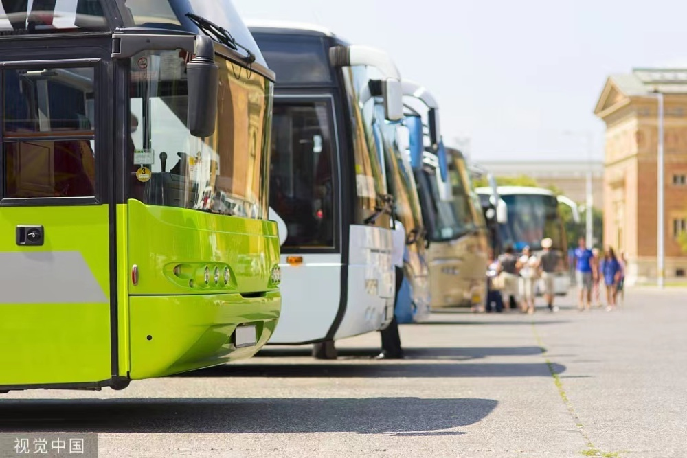

# 客运站，要消失了？

_图/视觉中国_

“这么新、这么漂亮的车站要停用，太可惜了。”谈到要停运的汉口北客运中心，曾多次在此乘车的武汉市民王君感叹。

武汉最大客运站汉口北客运中心，最近一直在停运边缘徘徊。

今年3月1日，武汉市黄陂区交通运输局发布公告，汉口北客运中心将于2023年3月15日起终止经营。

这是武汉继新荣客运站之后，又一停运的客运站。据了解，汉口北客运站停运后，在汉口北客运中心发班的多趟班车将迁移至青年路客运站。

但到了原计划关停的3月15日，车站仍有不少原有线路正常运营，只是缩短运营时间，之后的几天，情况仍然如此。

但无论如何，汉口北客运中心萧条到几近关停的势头，并没有改变。

事实上，不止汉口北客运中心，近年来，多个城市的汽车客运站，传出了停运的消息。数据显示，全国公路客运量在2012年达到顶峰355.7亿人次，之后就开始一路下滑。

武汉之外，全国越来越多汽车客运站陷入关停风潮。近两三年，客运站关停仿佛开启“加速度”，今年开年3个多月，就有海口汽车东站、湛江汽车南站等多个车站接连宣布停运。

**建成三年即陷停运风波**

汉口北客运中心从投入运营到准备关停，不到3年时间。

2020年7月1日，该站正式投用，同一天，武汉的新荣客运站停运，26条班线、105个班次整体调转至此。

作为湖北交通基础设施重点项目、武汉最大的交通运输综合体，汉口北客运中心总投资9566万元，占地面积26万平方米，总建筑面积11.9万平方米。按照设计，该站日均发送旅客3万人次，最高峰可达6万人次，客运班线覆盖17个省（区、市）。

彼时，为确保该站的顺利运营，武汉交通部门联合公交、地铁，制定地铁运营配套以及公交接驳地铁方案，仅在汉口北地区就布局了8条公交线路。

到关停之前，车站有30多条线路在运营，目的地多为周边县城。

有汉口北客运中心工作人员透露，2022年车站就多次传出停运传闻。这位工作人员说，“因为长期只发较低的基本工资，不少员工人心惶惶。”

事实上，自运营以来，该站的客源就一直处于低位，车站附近商铺，不少都处于关停状态。

在王君看来，汉口北客运中心之所以人少，最大原因是不方便，远离市中心。他说，“原来从新荣车站，到老家红安县要1个半小时，搬到汉口北客运中心后，即使不堵车，也要两个多小时。”

不少网友对该站评价也是如此。比如，有网友评价，比起原来的新荣车站，汉口北客运中心实在太远了。还有网友评价，出站去武昌换乘地铁都要一个小时出头，更不用说坐公交车了。

此外，上述车站工作人员认为，车站之所以如此萧条，与附近批发市场没有达到预期效果密切相关。

该车站紧邻汉口北批发市场。在建设之初，车站除了从事旅客运输外，还设有货运仓储物流中心。

2020年车站开始运营时，汉口北集团总裁曹天斌在接受媒体采访时表示，随着车站的开通，将对到汉口北来的商户提供补贴政策，凭借各个市场的进货凭证，可以报销来程的车票。

“但最近三年，批发市场客流同样不容乐观，对车站带动有限。”上述工作人员表示。

汉口北客运中心关停后，其现有运营的线路将转移到青年路客运站，两客运站之间相距约19公里，乘坐地铁需要45分钟。

**逐步消失的客运站**

汉口北客运中心陷入关停境地，有其自身原因，但更与客运行业的大势息息相关。

事实上，近期不少城市的客运站都陷入了亏损、关停的风潮。

今年2月，已经投运30年的海口汽车东站，拟于2023年4月停止运营。据海南海汽运输集团统计，海口汽车东站周一至周四日均客流量仅五六百人次，即使在节假期也不过1000人次。

同样在2月，湛江市交通局官网显示，在湛江市汽车南站向该局提出停业申请之后，“我局同意该站自2023年3月15日起停止营业”。

在湛江汽车南站停运前几个月，由于客源越来越少，公司收入连员工工资都难以保障。

今年的1月1日，广州市的罗冲围客运站因经营原因停止班车发班。仅在2021年一年，广州撤离和关停的客运站就多达十家。而整个广东省关停的客运站则多达42家。

交通运输部数据显示，全国公路营业性客运量在2012年达到顶峰355.7亿人次，后续每年下降，2014年达到190亿人次，2019年为130亿人次。疫情之后，公路营运客流惨遭“腰斩”，2021年全年只有50亿人次。

在国家发改委综合运输研究所城市交通中心主任程世东看来，客运交通方式的转变，是其中关键原因。

“原来公路客运中长距离出行的需求，比如从省会到地级市，或从一个地级市到另外一个地级市，被高铁逐步抢占；而从地级市到县或者从县到乡镇这些100多公里以内的出行需求，则被私家车或顺风车挤占。”程世东对中国新闻周刊表示。

同样是2012年到2022年，全国铁路营业里程从9.8万公里增长到15.5万公里，其中高铁从0.9万公里增长到4.2万公里，大多数地级市都已纳入到高铁网中。

而在这10年中，网约车逐步推出顺风车、拼车等功能。

值得注意的是，尽管汉口北客运站一直在关停边缘，武汉目前还有新的在建客运站。

汉口客运中心毗邻汉口火车站，前身为金家墩客运站，2017年3月全面停业进行封闭改扩建施工。

公开资料显示，其规模将是前期的4倍，此次扩建，包含一座客运站、2栋办公塔楼、1栋4层高商业配套。按照目前计划，2024年春运期间，汉口客运中心将全面恢复运输服务功能，届时将成为华中最大客运站。

**新出路在哪里**

国家发改委今年提出，“十四五”时期，高铁网将基本覆盖50万人口以上城市，这意味着不仅地级市，未来越来越多人口大县也将逐步通高铁。

目前，客运行业主要客群已经逐步下沉到县域之间的客流，如果这部分客源也逐步被高铁挤占，未来城市客运站是否会逐步消失？

“即使如欧美发达国家的汽车普及率，城市客运依然有其生存空间。我国城市的客运，未来虽然不可能再与鼎盛时期相提并论，但依然有特定的生存空间。”程世东说。

在他看来，在现行市场之下，城市客运还需要在多方面调整，才能稳定需求客源，客运“公交化”就是其中的方向之一。

“传统的客运，将旅客集中到汽车站里，必须按照规则进站买票，大大增加了旅客的出行时间。‘公交化’运营之后，购票的话，能不能网上买直接上车，或者像公交那样刷卡？在出发城市，能否多设几个上下车站点，能否紧邻高铁站设置下车站点？另外，‘公交化’以后，下车站不一定只到县城的客运站，沿途较大的村镇或县城中某个便利的公交站点都可成为站点。”

此外，定制客运成为不少相关企业探索的新模式。

比如早在2020年，成都东站就引进定制客运，让客运企业开通7座以上小型客车，根据旅客需求通过平台软件进行网络预约，点对点服务。2021年1月，大同新南客运站也推出定制客运，旅客通过“智行山西”微信公众号提前下单预约选择乘车地点，无需进站，即可享受上门接送服务。

2022年8月，交通运输部发布的《班车客运定制服务操作指南》中也明确，可基于已经取得经营许可的道路客运班线，开展定制客运。

“‘公交化’和定制客运推广后，未来客运站的功能，可能更集中于停车和检修。”程世东说。

作者：赵越

