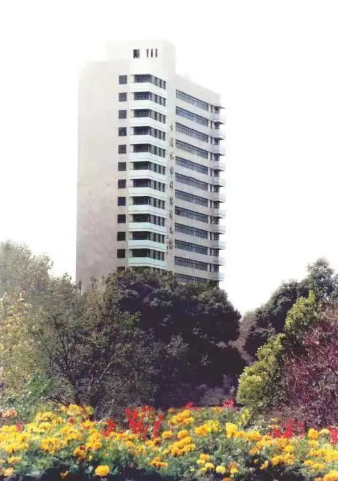
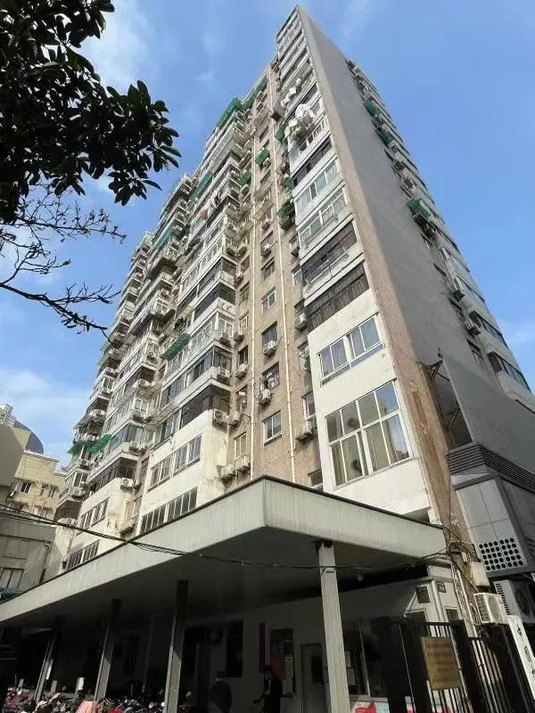
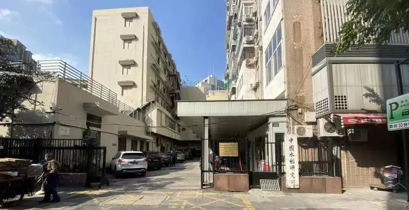
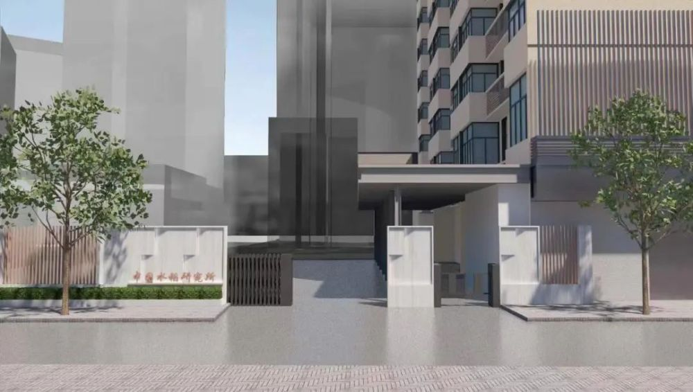

# 曾经的杭州第一高楼开始旧改，当年里面住满科学家

曾经的浙江省第一幢高层住宅楼——中国水稻研究所，最近开始旧改了。

它的位置在体育场路359号，体育场路与武林路交叉口东侧。

_上世纪80年代，刚建成的水稻所大楼_

体育场路上高楼鳞次栉比，一幢比一幢气派。淹没在茫茫楼海之中，中国水稻研究所大楼早已不起眼，甚至因为年代久远，有些许破败的气质。

但在上世纪80年代，它迎着改革开放的春风走来，一度可以算是杭州的第一高楼，高大气派的样子，再加上高挂着“国”字号招牌，风光一时无二。

**中国水稻研究所旧改**

**改外立面也改内部管线**

沿着体育场路，这幢大楼一楼是一排商铺，一点点、OPPO、中国移动、鑫概念酒店……如果不是绕到万寿亭路上，看到“中国水稻研究所”的牌子，已经很难将这幢楼跟水稻所联系在一起。

现在，大楼外已架起防护架，随着旧改，未来它将更有辨识度。旧改大致分为两部分：一部分是外立面改造，一部分是内部管道、电线等设施改造。

这幢楼建成于1989年，外立面采用当时时兴的马赛克墙砖，走廊安装的是钢玻璃窗棂。

_现在水稻所已经30多岁_

如果细看，会发现体育场路一侧的墙壁，马赛克瓷砖已经成片脱落，露出灰色的水泥墙。天水街道相关负责人说：“之前发生过墙砖掉落砸坏车的事情，总是担心万一哪天砸到人。”

接下来，马赛克墙砖会重新处理，做防水、涂料等面层，改铺粉纸筋灰，刷真石漆。横向则铺穿孔铝板。铝板上的每个穿孔，都是麦穗的形状，连在一起形成麦浪。窗户则换成更结实的夹胶玻璃铝合金窗。

“外立面改造，是按照水稻随风摇摆的样子设计的，色彩取自成熟麦穗的黄色，同时，铝板材质又能增加一些现代感。”负责这次改造的设计师杜俏声说。

为了更有辨识度，墙上还将装上“中国水稻研究所”几个字，楼的东侧新建一个小区大门。

_旧改后的效果图_

外立面改造关乎“面子”，设施改造，改变的则是“里子”，“主要解决漏水、电线杂乱、安全隐患等问题。”天水街道相关负责人说。

比如，楼里是2梯6户的连廊式设计，长长的走廊里管线纵横交错、杂乱无章，排烟井一个排着一个。接下来，走廊会安装网格吊顶、电井门等。

**当时这幢楼的名气很大**

**能住进来的都是科学家**

中国水稻研究所第一批研究员、81岁的汤圣祥几乎全程参与了旧改的前期筹备，“不仅参与，我还负责张罗居民开会、投票。”大楼刚一交付，汤圣祥就一直住在这里。

**中国水稻研究所虽建成于1989年，但开建的往事，却要追溯到1979年。**

_万寿亭路进去，可以看到水稻所牌子_

那时，我国刚刚迎来改革开放，国际水稻研究所的代表们来中国与中国农科院商谈合作事宜。会上，中方试探性提出，有没有可能帮助中国建一个全国性的水稻研究所。这一想法得到了对方的支持，并很快得到联合国开发计划署支持。

中国水稻所建在哪儿？很多农业强省，尤其湖南、广东都很积极。浙江虽然报告提交得晚，但态度最积极，“要钱有钱、要人有人、要地有地”。

1981年，国务院批准中国水稻研究所在杭州建立。为了能吸引国内外科研人员，当时的规划是，在杭州市区建一座集行政办公、中转接待和中高级科学家宿舍于一体的大楼，科研工作和实验设施则放在富阳皇天畈试验农场。

市区大楼便选址在当时的体育场路171号，也就是现在的359号。

汤圣祥回忆，1988年底建成后，大楼一层是商店、值班室，二层到四层是所里的招待所和办公室，再往上，就是中高级科技人员宿舍。

“当时这幢楼的名气很大，大家哪见过这么高的住宅楼，进来还有电梯。”汤圣祥说，能住进来的，都是所里的科学家、博士等科研人员。

楼里一共86户，普通户型70多平方米。如今看起来，房间面积不算大，但在当时，杭州才刚刚有了住宅小区的概念，朝晖、采荷、翠苑等第一批住宅小区开建，一幢19层高的电梯房横空出世，实属“豪宅”无疑了。

**短暂的第一高楼**

**和杭州的“国字号”们**

**当时的体育场路，可以说是一年一个样，杭州第一批真正意义上的摩天大楼，都诞生于此。**

虽然中国水稻研究所启动时间早，在启动时可能是杭州第一高楼，但期间一波三折，等到建成，第一的位置已经易主了。跟中国水稻研究所同年竣工的杭州工业大厦，高达103.6米，成为当年当之无愧的MVP（最优秀选手）。1995年，杭州大酒店以112米的高度刷新天际线。

在汤圣祥记忆里，当时，所里的班车每天早晚都会准点出现在体育场路上，载着科研人员去富阳上班。

班车来来往往三十载，体育场路的高楼大厦越来越多，水稻所大楼很快就光芒暗淡了。后来，中国水稻研究所的行政办公人员陆续搬迁至富阳，整个大楼的1、2、3、4、19层全面出租，只剩科学家们居住于此。

_将在体育场路建一个小区大门_

如今，这幢大楼破了、旧了，住在这里的科学家们也相继退休。而水稻与杭州，一个代表着“民以食为天”，一个是旅游城市、数字之城，
**听起来风马牛不相及，却相融相生四十余载，引领中国端稳“中国饭碗”最坚实的底座。**

随着发展，杭州的国字号越来越多，中国（杭州）知识产权保护中心、国家版本馆、超重力离心模拟与实验装置国家重大科技基础设施项目……杭州不断刷新的，不只是物理上的天际线，更是技术、经济的天际线。

中国水稻研究所，迎着改革开放的春风而生，在40年的光景里，目睹这座城市被经济的春风抚摸，遍地开花。如今，已是杭州万花丛中一点的它，随着旧改，将再次被春风吹过。

橙柿互动·都市快报记者 王青

通讯员 何垚

图片 拱墅区天水街道

