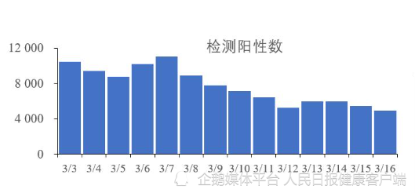
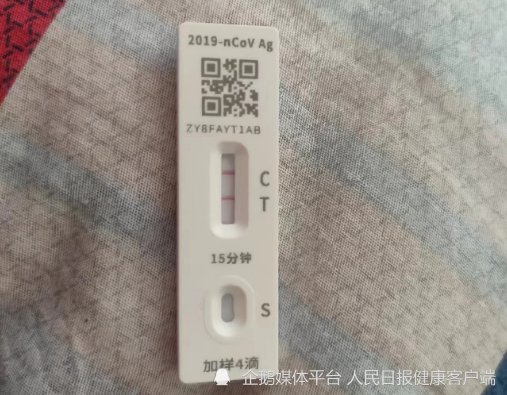

# 每日核酸阳性4000人以上，专家：新冠没有消失，处于低水平流行

**人民日报健康客户端记者 刘静怡**

近期，来自上海、北京、山东、安徽等多地的网友在社交平台发文称自己于近日感染新冠，
“以为自己终于挺进‘决赛圈’了，结果在3月份还是中招了。”一位北京居民告诉人民日报健康客户端记者。

“新冠没有消失，只是处于低水平流行状态。”国家卫健委全国新型冠状病毒专家组成员、北京大学公共卫生学院流行病学与卫生统计学系研究员刘珏告诉人民日报健康客户端记者。

据中国疾控中心最新发布的全国新型冠状病毒感染疫情情况，自3月3日以来，我国新冠病毒核酸检测阳性数呈波动下降趋势，每日报告核酸检测阳性数仍保持在4000人以上。

“感染过程基本和第一次感染一样，最开始是咽喉不适，当天下午开始发热，第二天退烧后开始嗓子疼、咳嗽，一周后转阴。”家住河南郑州的陈雪（化名）向人民日报健康客户端记者表示，一月份已感染过一次新冠。“此次感染是因为家人首次感染了，在家人感染后的六七天才出现了症状，说明还是有一些抵抗力的，可能还是因为接触病毒太多了。”

_在首次感染两个月后，家住郑州的陈雪（化名）再次感染新冠，抗原检测显示阳性。受访者供图_

南方医科大学公共卫生学院生物安全研究中心主任赵卫在接受人民日报健康客户端记者采访时表示，从群体水平看，大暴发后6个月内一般不会再次暴发，但也有例外，如新冠病毒发生大的变异，从个体看，不能完全排除二次感染的可能性。“尤其是一些免疫力较弱或免疫反应不持久的人群，包括有免疫缺陷、基础病等，另外还与进入体内的病毒量有关，如果一次性进入体内的病毒量大，也会更容易发生二次感染。”

赵卫提醒，考虑到目前叠加流感的形势，建议公众继续保持密闭场所戴口罩、勤洗手和开窗通风、保持社交距离和咳嗽礼仪等卫生习惯。听从防疫部门的提示和指引，是正确应对的好方法。

