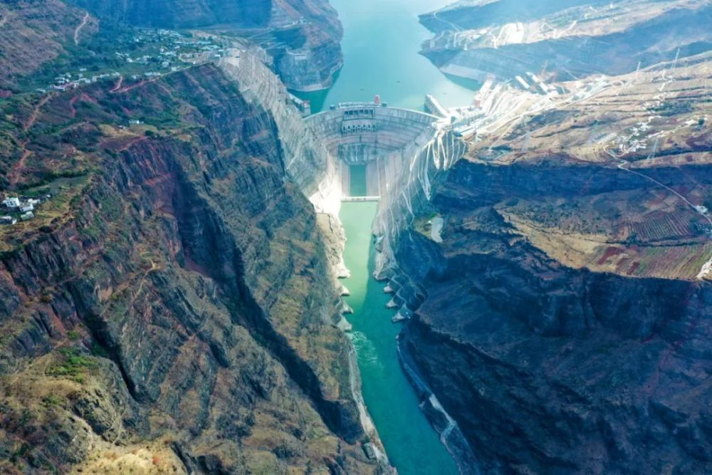
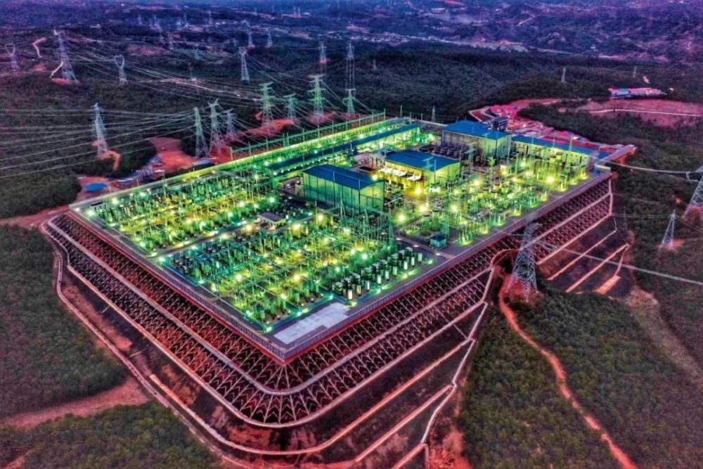

# 水电告急：西南水电大省受冲击

2023年2月，云南对电解铝企业实施限产措施。这已是半年内云南电解铝企业第三次被限产。

受影响较大的云铝股份，于2月27日在投资者互动平台上透露了此次限产的原因：公司近期收到云南电网通知，目前云南省内电力供需形势严峻，水电蓄能同比大幅减少。

其实，从2022年下半年开始，包括云南在内的多个西南水电大省来水偏枯，水电发电能力严重不足，省内水电蓄能也严重不足。今年的形势依然不容乐观。

“近年来的西南水电大省用电紧张状况与2016年前后的大规模弃水状况形成了鲜明对比，原因在于电力资源的供需错配。”华北电力大学经济与管理学院教授袁家海告诉《中国新闻周刊》，当地依靠丰富水电建立起来的能源经济体系，正受到严重冲击。

当西南地区水电面临的问题从“送不出去”频繁变为“发不出来”，面临挑战的不仅仅是西南省份的高能耗产业。

缺电的不仅是云南

“这一轮减产受到最大影响的是云南铝业、云南神火、云南其亚3家企业，受限产能约80万吨。减产从春节后开始，2月下旬完成。”上海有色网大数据部总监刘小磊告诉《中国新闻周刊》，确定减产前后，电解铝价格一度上涨，突破1.9万元/吨，如今回落至1.8万元/吨。

早在2022年9月，云南电解铝企业就先后两次接到压减用电负荷通知，比例分别为10％、15％~30％。当时业内预计两轮限产累计影响年产能约190万吨，占云南建成电解铝产能三分之一左右。更早之前的2021年，云南省能耗“双控”形势严峻，也曾在年中压减电解铝企业用电负荷。

供电缺口导致限产，这似乎已经成为云南雄心勃勃的承接高耗能产业计划的绊脚石。

电解铝企业是用电大户，用电成本约为总成本的四至五成。《云南省2022年有序用电方案》提出，按照“以保障安全为首要前提，先错峰、后避峰、再限电、最后拉闸”的顺序，合理安排有序用电，确保安全有序用电，做到限电不拉闸，限电不限民用。

_每年10月至次年4月为云南的枯水期。图/视觉中国_

有序用电时，电解铝企业往往首当其冲。“电力供给缺口一时难解，企业普遍认为，云南电解铝工厂开工率偏低会成为常态。”有电解铝业内人士向《中国新闻周刊》感慨。

2月中下旬的减产与去年9月两轮减产原因一致，即云南电力供给出现缺口。

云南电力结构较为单一，水电占比接近八成。截至2022年12月底，云南全省发电装机容量11144.6万千瓦，其中水电装机容量8061.59万千瓦、火电1533.55万千瓦、风电891.39万千瓦、太阳能475.89万千瓦。

各流域来水多寡，直接决定水电发电能力，可谓“靠天吃饭”。

而且，云南干湿季节分明，冬春季节为干季，降水仅占全年15％，尤其是春季气温升高，蒸发量加大之时，极易发生干旱。因此，每年10月至次年4月为云南枯水期，枯水期水电出力通常不足50％，枯水期干旱则会加剧水电供给不足。

这正是云南今年2月中下旬遭遇的问题。2月初，云南省水利厅便表示：2023年以来，云南省大部分地区无明显降水，河道来水总体偏少，库塘蓄水总量下降加快，当前气象干旱发展迅速，玉溪、大理、丽江局部地区旱情影响逐步显现。

截至2月中旬，云南全省有90％的区域出现气象干旱，大部地区以中等及以上气象干旱为主。云南省水利厅召开的全省水旱灾害防御形势会商会指出，预计2023年云南省大部分地区降水总量正常偏少，干旱和洪涝灾害较上年将偏重发生，全省各地防汛抗旱面临严峻形势。

而从近两年中国气象局发布的《中国气候变化蓝皮书》来看，中国降水变化区域间差异明显，其中西南地区东部和南部年降水量呈减少趋势。“中国主要雨带北移”似乎正在发生，而这对于水电占比超过七成的云南来说，不是好消息，意味过往水电“出力格局”或将被改变。

北京大学能源研究院特聘副研究员李想告诉《中国新闻周刊》，水电季节性较强，通常情况是枯水期偶尔缺电，丰水期甚至“弃水”。但近两年，云南、四川等西南水电大省来水异常，枯水期和丰水期缺电频率都在变高。“如果极端现象连续发生，便是正常现象。水电面临的问题从‘送不出去’变为‘发不出来’。”

在袁家海看来，这种变化对地方来说，多少有些措手不及，只能抓紧应对。

他分析，“十三五”中后期，云南、四川主要采取加大外送规模和引进工业企业来消纳富余水电，在解决弃水问题的同时也增加了经济产出。但这一切是建立在本地水电发电能力始终维持在历史正常水平的预测基础上。但“十四五”以来，雨季降水减少、全年高温干旱加剧的“意料之外”状况，使得作为主力电源的水电发电能力明显下降，其他类型电源或规模没有增加、或可靠供电能力不足，被迫采取限产限电措施也就在“情理之中”了。

如果西南水电的发电能力将受到大幅削弱，近年来水电减发的状况会成为常态。袁家海判断，西南水电大省在未来很长一段时间内将面临严峻的电力安全考验。

外送电矛盾更加突出

当水电出力受限，当地火电却难以起到调节作用，这是西南省份面临的第二重难题。

虽然火电是云南省内第二大电源，不过在2020年之前，火电发电小时数已经被水电大幅挤压。云南火电利用小时数从2007年5014小时下降至2019年的2113小时。

“煤电厂运行成本中六七成源自购置煤炭，水电站无需购置任何燃料，发电成本更具优势。在水资源比较丰富的西南省份，水电将火电利用小时数挤压得很低。”李想告诉《中国新闻周刊》，当全国火电每年利用小时数为4500~4800小时时，云南仅为2000小时左右。“2019年底，云南火电厂国电宣威电厂甚至申请破产清算，负债率超过400％。”

不过他认为，这是市场竞争的结果。“在一些电力市场成熟的国家，当风、光等可再生能源发电能力较强时，便会压低电价。虽然火电成本更高，但是考虑停运再启动的成本，甚至会以‘负电价’出售。我国虽然尚未建立成熟的电力市场，但是火电相比水电显然不具备成本优势。”

_云南昆明市的一处“西电东送”大通道的换流站。图/新华_

在没有成熟的电力市场引导灵活性资源配置的情况下，更多由国企持有的火电是缓解当前困境为数不多的选择，但是需要解决火电亏损问题。“目前云南也在探索容量市场，即使电站不发电也可以获得容量电价。等到有需要时，如枯水期，再将闲置的容量开启。”李想说。

2023年1月1日起，《云南省燃煤发电市场化改革实施方案》正式施行。其中提到，云南将建立煤电电能量市场，允许煤电上网电价在基准价上下浮动20％。同时，云南在全国率先提出建立煤电调节容量市场，按照各类电源、用户的不同需求分摊调节容量成本。

除了推动煤电市场化改革、建立容量市场，云南在规划上也提出要建设火电。2022年7月，云南省政府印发的《云南省产业强省三年行动（2022—2024年）》提出，加强系统灵活调节电源建设，抓好煤炭清洁高效利用，加快推动480万千瓦火电装机项目建设，全面实施煤电机组灵活性改造，发挥煤电机组托底保障及调峰备用作用，增加新能源消纳能力。

袁家海认为，西南水电大省要按照水电发电量较历史同期下降一定程度的预期，来安排今年的能源电力供需工作。但显然，在数月内快速投产大量发电机组已不现实，只能最大化利用存量电力资源，实现“开源节流”。“合理安排火电检修计划和电煤采购计划，保障用电高峰时期的机组正常开机和燃煤供应，充分发挥火电的顶峰发电能力。”

作为“开源节流”的重要方式，袁家海特别提到，“需要提前计划水电的本地消纳与外送电规模，与江苏、广东等地共同协商送受电量，尽力争取本地留存电量，作为省内安排电力供需的边界前提。”

云南是“西电东送”大省，占据一半以上电量。“十三五”期间，随着滇西北直流、金中直流、永富直流、禄高肇直流、坤流直流建成投产，目前已在云南建成“十条直流、两条交流”共12回大通道，外送通道能力达到4220万千瓦。

云南、广东分别是南方电网体系中最大的送电方和用电方，近几年，云南外送电量中有约九成送至广东。

2022年，云南“西电东送”电量完成1436.48亿千瓦时，同比下降2.48％，占到云南电网发电量的38％，以完成框架协议计划为主。昆明电力交易中心称，2023年，云南省“西电东送”电量作为整体打捆按计划送出，全年计划送电量为1452亿千瓦时，较2022年增加1％。

尴尬的是，作为“西电东送”的主要送出省份，今年云南即使自身缺电，也需执行在省间协议框架下的外送电量。李想解释，建设跨省特高压线路是为了支持“西电东送”，送电方向、时间、电量都是确定的，比较刚性，受到长期购电协议的约束而非实时市场价格机制的引导。其中明确规定了送电量的考核方式，因此只能由各个省份在谈判外送电协议时博弈。“比较死板的调度方式难以发挥特高压线路双向互济的作用，如果四川、云南缺电就难以获得反向输电。”

“西南水电大省用电负荷的提升，水电发电能力下降，使得电力供需形势较‘十三五’初期发生了重大变化，弃水问题已经成为历史，考虑本地发展需求和资源的开发限制条件，需要适当更改大型水电站的外送电协议，但是从发展全局来考量，重新协商阻力较大、增加的留存电量有限。”袁家海认为。

在他看来，解决西南水电外送矛盾，一是要掌握增量水电项目的主动权，依据自身需求在一定范围比例内安排外送电力；二是将外送协议逐渐纳入到全国统一电力市场体系中，借助市场力量来调配资源；三是加快开发新能源项目，等量替代水电的外送电量，保证外送总量不变的情况下，发挥大型水电项目的调节能力。

产业转移受挫

云南当然希望留住更多电以支持本地产业发展。

“企业不希望被限产，政府在居中协调电网与企业之间的关系。政府与企业希望将更多水电留存在当地，而电网企业则要通盘考虑多个省份的需求。”刘小磊说。

昆明电力交易中心数据显示，2022年，云南电网发电量3789.11亿千万时，同比增长7.02％。同年，受经济恢复及新增铝硅用电的明显拉动，云南省全社会用电量为2389.52亿千瓦时，同比增长11.8％，增速排在全国第二。

2018~2020年，云南凭借水电优势，以低电价作为吸引，从山东、河南、陕西、甘肃等省份承接了超500万吨电解铝产能。云南电解铝产量从2019年开始迅猛增长，当年增速达到14.6％，2020年更是达到72.1％，
从150万吨左右到突破250万吨。

其中较大的新增投资主体是魏桥集团，这家民营企业此前的电解铝产能主要集中在山东省滨州市。2019年10月，魏桥集团已向云南文山州转移203万吨电解铝产能，分两期建成，已于2022年建成投产。

据《中国有色金属报》报道，截至2022年12月份，中国电解铝建成产能4445万吨。其中，云南地区建成产能532万吨，占比约为12％。2022年，云南电解铝产量约433.8万吨，电解铝耗电量占到全省用电量近30％。

“电解铝企业多在近三四年迁入云南，云南本地用电需求迅速增长。丰水期发电量可以支撑规划产能，但是从每年10月至次年4月底枯水期发电量难以匹配产能。”刘小磊告诉记者，云南电解铝企业度电成本约为0.45元，火电发电成本接近0.5元/度。

压低成本只是企业的考虑之一，“双碳”目标下，碳排放被明确限制，电解铝企业要寻求发展，只能从煤电大省转移，这是行业大趋势。

过往，电解铝行业多是“煤电铝一体化”，电解铝工厂配套火电厂，用电成本约占总成本的四分之一，电解铝行业也被视为用能大户。但是在“双碳”目标的压力下，“煤电铝”概念过时，取而代之的是“水电铝”“光电铝”。“即使云南的电解铝企业使用的电源也并非百分之百的水电，枯水期也需要火电配套，水电占比约为87％。”

刘小磊表示，虽然电解铝行业尚未进入碳交易市场，但是欧盟从今年10月1日起开始迈出征收碳边境税的第一步，需要企业提供产品碳足迹证书，追踪整个生产流程中的碳排放量。为了规避未来碳关税，以及国内碳配额交易的影响，驱使电解铝企业更多使用可再生能源，争相在云南、四川等水电资源丰富的省份布局产能。

工信部等三部门去年11月中旬印发的《有色金属行业碳达峰实施方案》提出，确保2030年前有色金属行业实现碳达峰。其中，铝是碳排放重点品种，碳排放占全行业75％以上，方案提出力争2025年、2030年电解铝使用可再生能源比例分别达到25％、30％以上。

“按照SMM（上海有色网）统计，目前国内电解铝建成产能约为4500万吨，可再生能源驱动的产能约为1000万吨，占比不足25％。”刘小磊告诉记者。

显然，云南不想放过这样的机遇。2022年7月，《云南省产业强省三年行动（2022—2024年）》对外发布，其中共列出12个重点产业，位列第二的便是“绿色铝谷”，提出的目标是到2024年，全省铝合金化率达到90％左右，率先打造形成2~3个绿色低碳高端铝产业园区，绿色铝产业链产值力争达到3500亿元左右，成为国家重要的铝产业基地。

“力争电解铝产能全部建成”，但是这样的目标正在遭遇挑战。

“一些电解铝产能转移已经受到影响，比如魏桥集团旗下的云南宏泰，除了位于文山州砚山县的项目外，另外红河州尚有200万吨项目尚未投产。这个项目正面临较大不确定性，如果电力供给充足，哪怕云南没有电价优势，电解铝企业也愿意转移产能。但是如果电力供给面临刚性缺口，企业不可能转移产能后就停产。”有电解铝业内人士告诉记者，核心问题是水电大省承接电解铝产能的能力有限，产能转移速度势必减缓。

“决定项目收益的廉价稳定水电已经成为过去式。”袁家海认为，在存量高耗能项目推高全社会用电量、近四年电力装机并未显著增加、干旱缺水状况或将延续的情况下，西南水电大省已经进入了“缺电”周期。从宏观调控角度来看，为保障社会生产生活的用能安全，要从严把控高耗能项目的审批。

发于2023.3.20总第1084期《中国新闻周刊》杂志

杂志标题：水电告急：西南水电大省受冲击

记者：陈惟杉

