# 沙尘暴又来了，蒙古国的环境问题有多严重？

蒙古国的问题

作者：德米特里

校稿：辜汉膺 / 编辑：大黄蜂

今天早晨一觉醒来，发现窗外的一切都黄了，仿佛是在火星。毫无疑问，沙尘暴又来了。

中央气象台已经发布沙尘暴黄色预警，受一股全能型冷空气的影响，从昨晚到今天，沙尘天气基本覆盖北方大部地区，西北、华北、东北地区中西部、黄淮等地将先后出现沙尘。

沙尘主体将于22日晚经过京津冀及周边区域。受我国南方系统性降水过程影响，沙尘过程对淮河以南地区影响有限。本次沙尘过程影响，预计将于明天白天减弱并趋于结束。

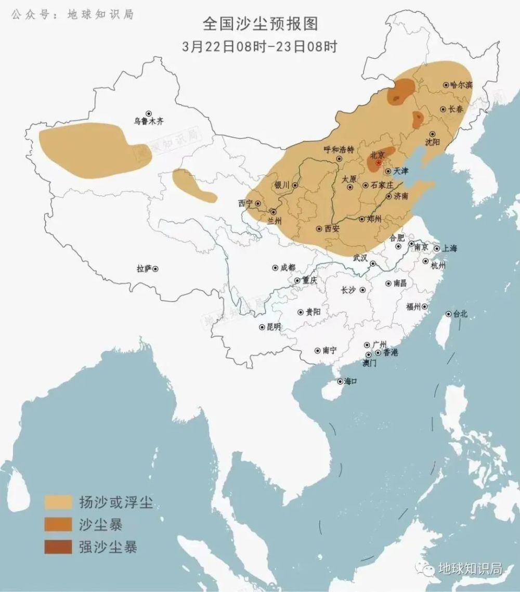

_影响面积也太大了_

沙尘暴来临时，人们开始追索源头，通过卫星遥感发现，此次随气流空运而来的沙子并不是国产货，沙源地位于蒙古国南部的戈壁沙漠。随着气温显著回暖，沙源地提前解冻，而同时期降水又偏少，植被长不出来，导致地表沙土裸露。

随着冷锋经过沙源地，近地面大风携带大量颗粒物向东南方向推进，造成的沙尘天气波及到我国北方大部分地区。

最近频繁的沙尘暴揭开了蒙古国环境恶化的面纱：近几十年来，因气候变迁和人为破坏导致了大面积荒漠化、水土流失、空气污染等问题。

_乌兰巴托的日夜：黄了吧唧（图：shutterstock）_

风卷尘沙起

对于环境气象工作者来说，中国的沙尘暴来源于蒙古国这件事情并没有什么稀奇的，蒙古国南部一直都是我国沙尘暴的重要源头。

蒙古国是一个建立在内亚草原上的中高纬度国家，从地理位置上看整个国家全境深居内陆远离海洋，这就注定着其国土都位于温带大陆性气候区。来自太平洋的湿润气团难以翻越大兴安岭从东到西到达，来自北冰洋的水汽也难以到达杭爱山以南，于蒙古国南部就形成了干旱的戈壁沙漠。

太平洋水汽基本被拦在第二阶梯，北冰洋不多的水汽则被拦在蒙古国北部。

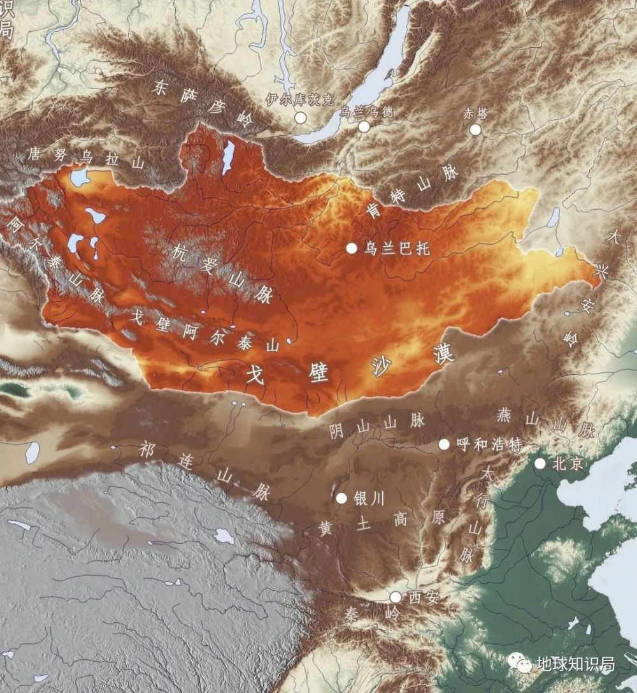

在这个国家的领土上，易受荒漠化影响的土地面积占了90%。仅有最北部的库苏古尔省和肯特省的部分地区能免受土地荒漠化的影响，可以说荒漠草原景观遍布了全国。

一个建立在荒漠草原上的国家，也是一个容易被荒漠化吞噬掉的国家。

_（图：shutterstock）_

蒙古国的植被覆盖情况可以按地理方位进行一个简单粗暴的划分，即从东北到西南愈加干旱。最东北部的肯特省和东方省延续呼伦贝尔草原的余韵，夏季受到季风影响较其他地方更高，克鲁伦河、鄂嫩河自西向东流过，分别注入我国的呼伦湖和中俄边境的额尔古纳河，给沿岸的土地增添了不少绿意。

相比之下，南部则是茫茫的荒漠戈壁。这从蒙古国省份命名上也能看得出来，中南部的三个省份分别为东戈壁省、中戈壁省和南戈壁省，西南部还有戈壁阿尔泰省。这四个干旱的省份中，有三个直接与我国内蒙古自治区接壤。

东北部省份吧，还好。南部则是赤裸裸的戈壁省份。

我们的沙尘暴就从这里形成。

蒙古国南部的荒漠化，最主要的原因是自然原因，自然原因中首先归功于其气候特点，蒙古国全国平均降水量约为230mm，相比之下中国的年平均降水量约为560mm，相差巨大。

就这样相对低的降水分布还极不均匀，蒙古国北部地区的年降水量每年略高于500mm，而南部地区则不到50mm，十多倍的差距。

北部尚且有大量降雪，进而形成河流、养育森林，南部则完全是黄沙漫卷。

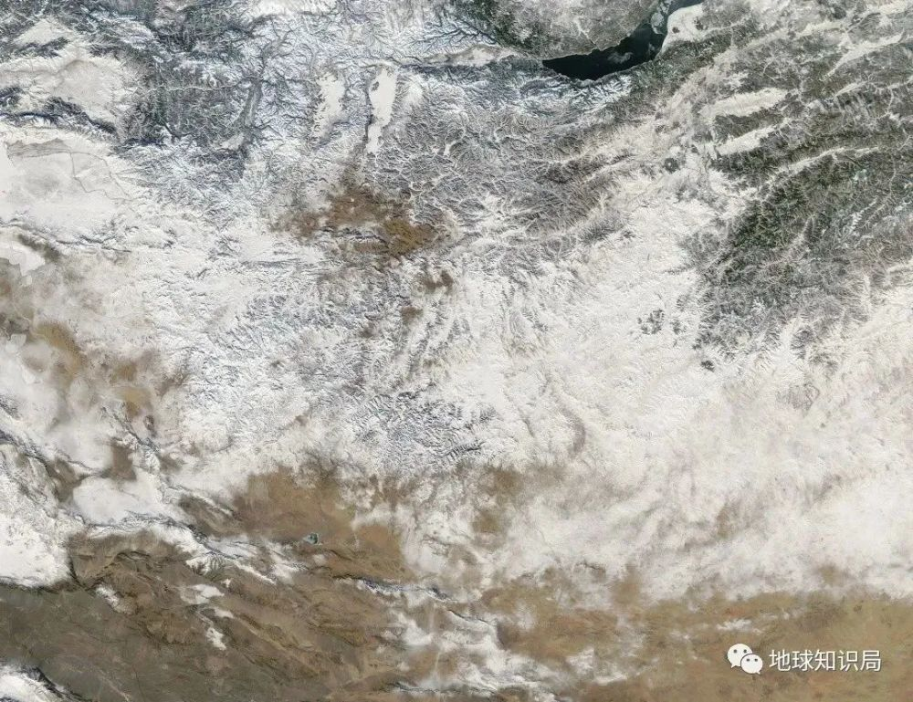

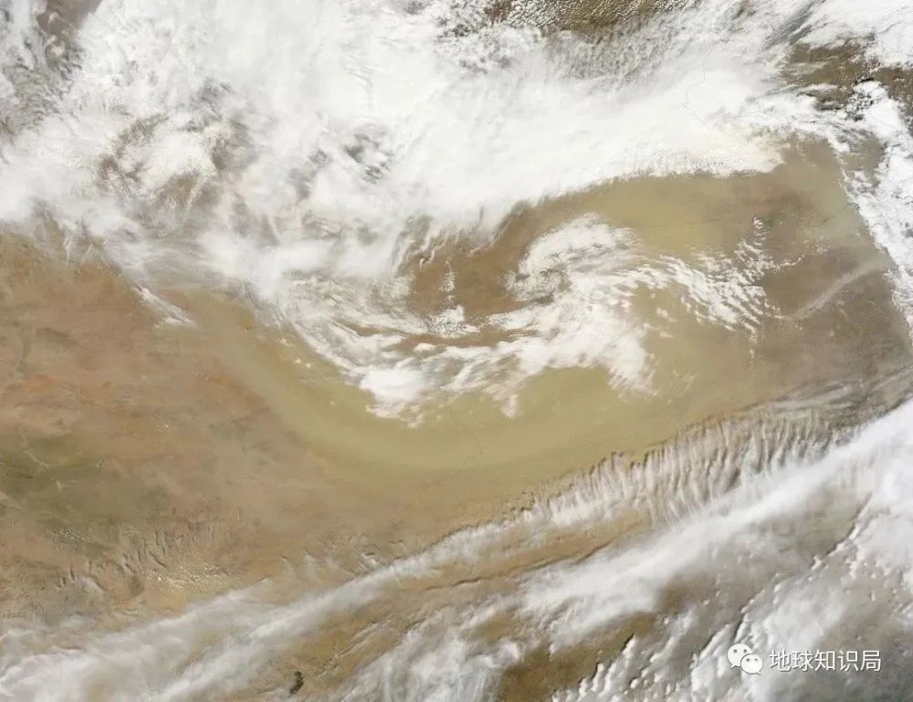

_（图：NASA）_

我们谈到降水量对一个地区的影响的时候不能不考虑蒸发量，白雪皑皑又有冰层覆盖的南极看起来并不干旱但却是全球降水量最低的地区之一。在蒙古国大约90%的降水被蒸发返回到大气中，只剩下的10%。

这10%当中有63%的降水会变成地表径流，蒙古国是内陆国，且地势较高，所以河流里的水有95%要流出这个国家，不能作为水资源补充。

而北边不远处就是需水量最大的淡水湖—贝加尔湖，可惜这是俄罗斯的领土。

_（图：NASA）_

林林总总算下来，本就可怜的年降水总量之中，只有约３%渗入土壤以补充地下水，而且大多它们以土壤水或潜水形式存在，也就是成为了所谓“潜在水资源”，不可直接被地表生物利用。

这就导致了在南部干旱区域地表土壤和岩石基本上都是裸露状态，即不毛之地。这种裸露的土地就是戈壁，而戈壁是源于蒙古语的一个词汇，独指中亚、蒙古、中国西北地区的干旱土地。

戈壁是中国和蒙古之间一个特有的类型，其中多数地区不是沙漠而是裸岩。

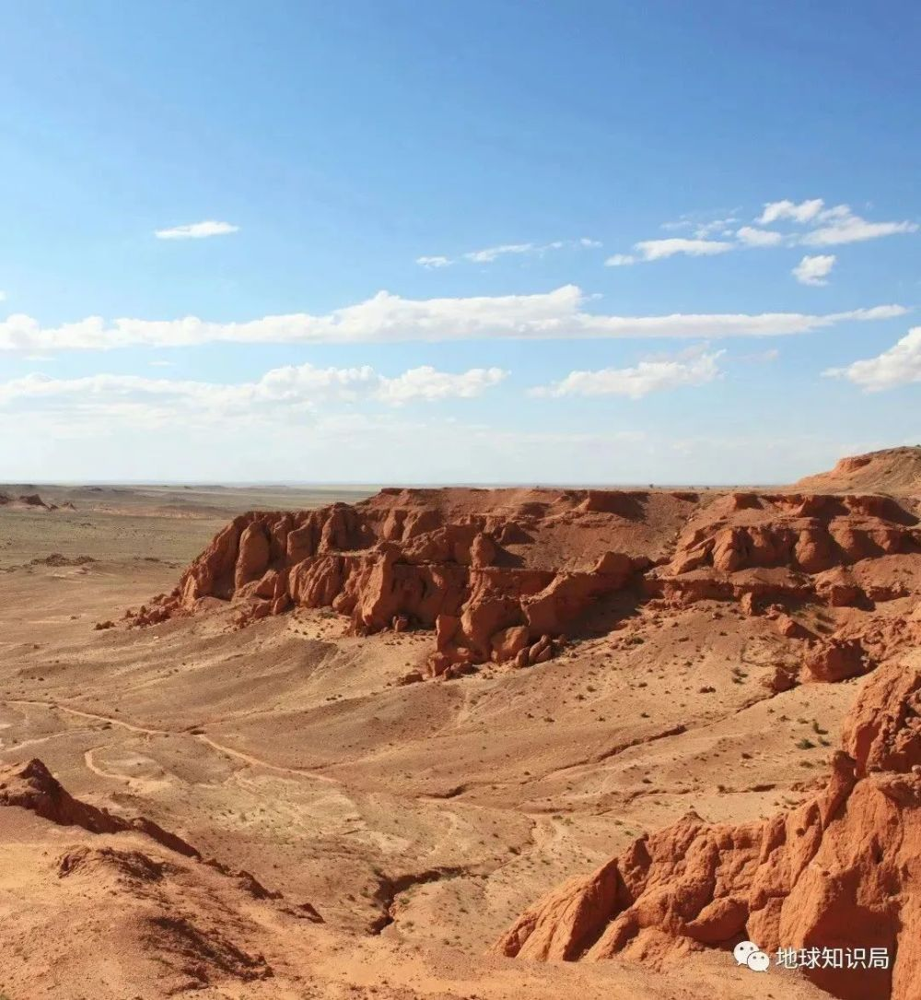

_（图：shutterstock）_

戈壁的地表形态让太阳辐射极容易对地表的岩石造成影响，蒙古国的温度和气候变化都极为剧烈。单日温差最高可达30℃，平均年冬夏温差巨大，部分地区年温差可逼近极端的90℃。比如乌兰巴托周边地区，冬季因极端低温而到—60℃，夏季因强烈日照和城市热岛效应达到30℃。

完美契合温带大陆性气候的特点，干旱和风暴是蒙古的两大自然灾害。

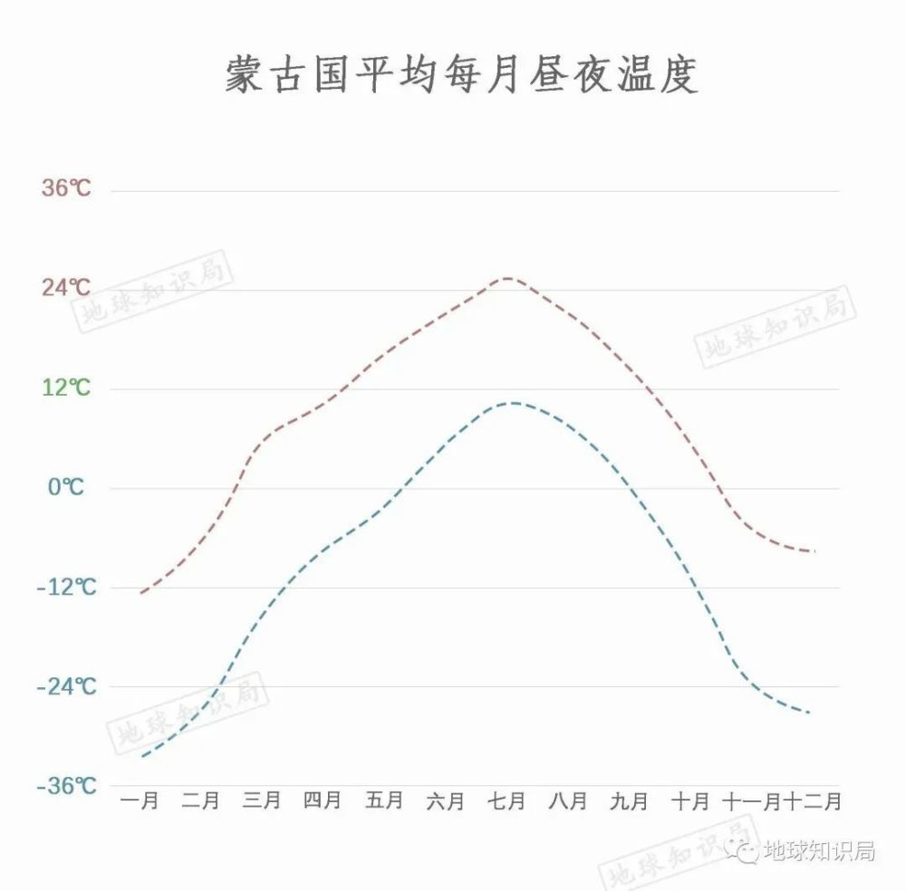

极端的温差造就了极端的自然景观，岩石在千万年的风化当中不断破裂变得细碎。蒙古国戈壁地区平均风速为3m/s到4m/s，细碎的砂石再经过近地面狂风的打磨，这就是沙漠里面沙子的来源。

_蒙古戈壁沙漠（图：Richard
Mortel /Wiki）_

牛羊满山坡

气候让蒙古国的自然环境极其脆弱，易受到人类活动的破坏。

蒙古国是一个羊比人多数倍的国家，157万平方公里的土地上养育的人口超过300万，而牛羊等牲畜和野生动物的数量则超过6600万。

畜牧业是蒙古的支柱产业，肉类多出口至中国和俄罗斯。

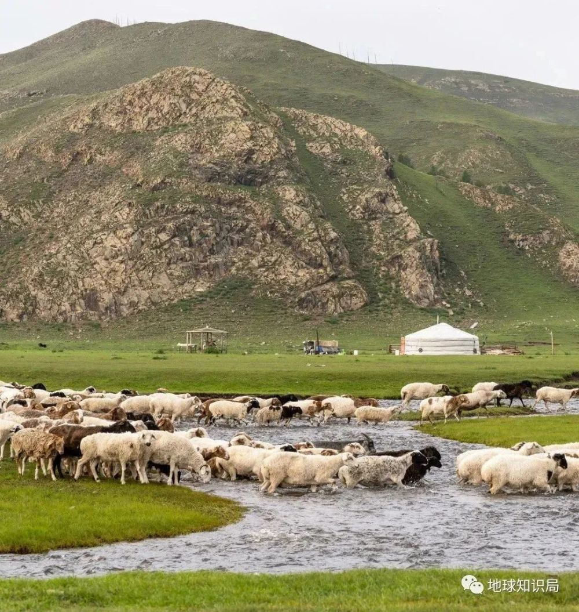

_（图：shutterstock）_

过度放牧是造成蒙古国荒漠化现象的一个重要原因，也是人为因素里面最大头的一个。根据1998年的官方统计，蒙古国18360户家庭里面，拥有牲畜数量3130万头。这大大加剧了草原草场的压力。

其实蒙古高原地区千百年来就一直有草原民族的存在，一直有牧人在放牧牛羊，为什么恶果却只在近几十年显现呢？这是因为草原生活方式的改变。

相比于蒙古国存在的时间，这片高原上的放牧历史则长的多。

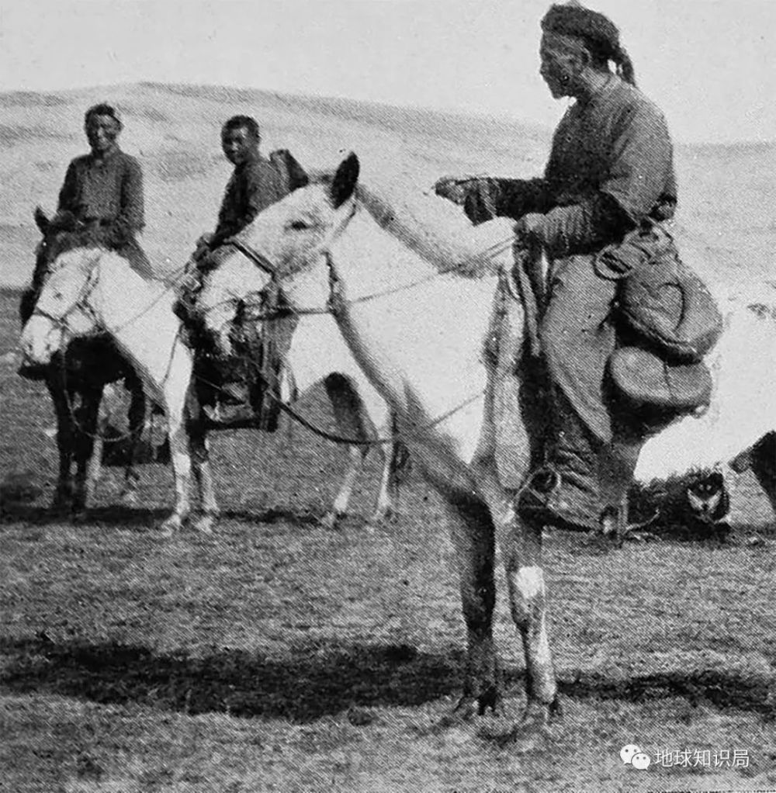

_（图：Wiki）_

在过去，草原民族过着逐水草而居的游牧生活，每隔一段时间换一片草原放牧，这就做到了让草场轮休的效果。而第二次世界大战前后，蒙古国受苏联影响深刻，吸取了苏联式“集体农庄”的经验。

这种改变是多方面的。首先体现在居住生活方式上，习惯了居无定所的牧民不得不定居在一块土地上，不得更换住所和牧区。其次在生产方式上，草原被划分为一块又一块的牧场，每一片牧场都有自己的生产单位，牧民在这上面进行集体劳动。

定居下来是改善了牧民流离的生活状态，但政策的制定也要考虑大自然的规律。

_（图：shutterstock）_

这就让草原承担了巨大压力，年复一年地放牧得不到休息。而且受当时错误思想的指导，人们盲目追求高产量，畜群规模无序扩张，更多的牛羊、更羸弱的草场这一对矛盾愈发尖锐，造成的结果就是环境的破坏。

可着一块地啃，可不就秃了么。

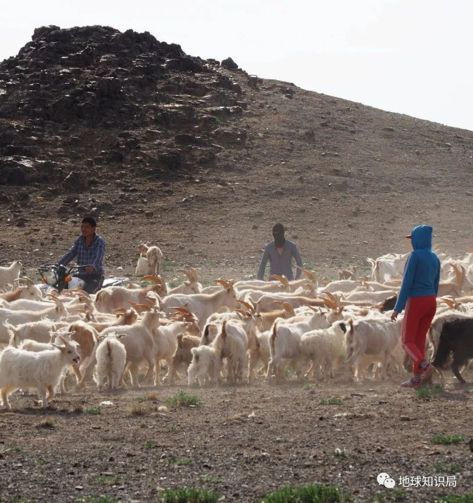

_（图：shutterstock）_

另一个角度来看，其实温带荒漠地区的环境承载力极为有限，土壤、气候方面限制了当地的生产发展，并非是适宜人类居住的区域。从古至今草原民族的人口数量都有一个瓶颈，达到一个极值就会下跌。蒙古国建国之初全国共有70万人口，尚在温饱线上挣扎。今时今日，由于工业时代的来临和医疗水平的发展，这个国家人口已经到了320万的水平。

300多万的人口看起来是不多，主要是蒙古国的经济支柱太吃资源优势了……

_（图：shutterstock）_

更多的人口需要更多的物质来支撑，蒙古国的两大支柱产业——采矿和畜牧，都对环境有着极大的破坏力。随着时间的推移，尤其是在近30年，该国环境的恶化呈现出一个不可逆的趋势，荒漠化程度一天天加重。

蒙古拥有世界已知的煤炭储量的十分之一，大多矿场都采取露天的方式，这本身就是污染的一大原因。

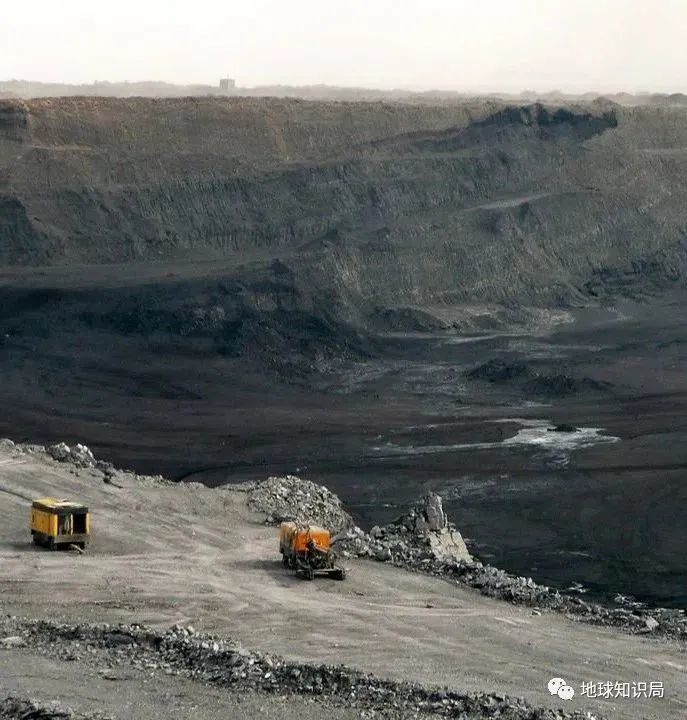

_（图：shutterstock）_

乌兰巴托的夜

蒙古国的荒漠化现状是多种因素共同作用引起的，除了最重要的过度放牧之外，采矿业和种植业的发展也对环境产生了负面影响。

水在这个国家属于珍贵资源，过去几十年里，由于灌溉、采矿的大肆利用，蒙古国多条河流的水文状况处在恶化当中。包括但不限于水位下降、河道干涸和水体污染等等。

气候变化和一味追求经济发展造成的水资源短缺，不仅影响到了畜牧业，连居民用水都受到了威胁。

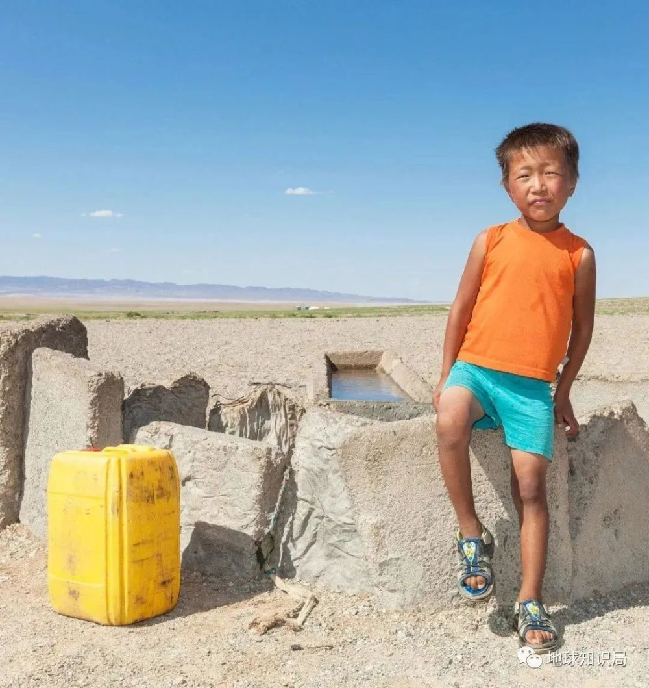

_（图：shutterstock）_

以全国最干旱的南部地区举例，过去曾孕育文明、养育一方水草的乌兰湖、奥罗格湖等已经几近完全干涸。有些河流虽然依然存在，但也遭受到严重的影响，其活力大大减小。比如位于中央省的图勒河，与上世纪70年代相比，它年平均流量减少了32%。主要原因在于上世纪出于发展的原因，图勒河流域270平方公里的森林遭到砍伐，大大加剧了流域范围内的水土流失问题。

曾作为戈壁地区五大湖泊之一的乌兰湖，在20世纪后期，就因金矿计划开始干枯了。

_（图：tourism.omnogovi.gov.mn）_

图勒河是蒙古国人为的对自然造成破坏的事例中最典型的一个。作为全球最地广人稀的国家，蒙古国并没有太多对自然进行大规模改造的能力和必要，图勒河流域问题作为一个孤立事件，其背后是乌兰巴托首都严峻的环境。

发源于肯特山脉的图勒河从乌兰巴托南部流过，是其境内重要的水源之一。

_（图：shutterstock）_

一个最地广人稀的国家，却有着极高人口密度的首都。乌兰巴托市聚集了超过150万的人口，相当于这个国家总人口的一半。首都和其他地区仿佛是两个国家，乌兰巴托的城市景观相对完善，高楼大厦车水马龙，与全国大部分地区的荒芜落后形成鲜明的对比。

蒙古分为两个地方，乌兰巴托和其他。

_（图：shutterstock）_

为了维持首都这个庞大城市的运作，周围的林木基本都被砍伐殆尽。作为上世纪苏联式工业建城思路的延续，乌兰巴托城市污染十分严重，工业废气废水不经节制地排放，加上车辆的尾气，以及城市规划时期对绿化问题的忽视，共同作用之下，乌兰巴托的空气质量本来就在一个相对低的水平。每年春夏之交，扬沙、沙尘天气对于当地居民来说也是稀松平常了。

乌兰巴托多次被媒体评为“拥有世界上最肮脏空气的地方”。

_（图：shutterstock）_

对于蒙古过来说，可能最严峻的问题在于，环境的恶化目前还看不见转机。一方面全球变暖让极端气候更为频繁地出现，表现在蒙古国的戈壁地区就是越来越高的温差让荒漠化加剧，越来越多的草原变为戈壁沙漠。另一方面生产方式的转型非一朝一夕所能完成，现下来看也没有这个内在动力，所以人类对大自然的索取并不会有太大改观。

即使问题就摆在眼前，但想不想治理和有没有能力治理还是个问题。

_（图：shutterstock）_

但恶果已经显现，近十年里蒙古国境内戈壁地带一年中发生的沙尘暴次数，比20世纪60年代增加了４倍。也许未来的极端天气会越来越频繁，中国北方的沙尘暴就是一个预警。环境问题没有任何一个国家可以置身事外。

旅游部门再努力宣传无尘，也挡不住漫天沙尘。

_（图：tourism.omnogovi.gov.mn）_

参考文献：

https://en.wikipedia.org/wiki/Mongolia

《蒙古国生态环境与其荒漠化的关系》，刘淑娟,AriunaaOchir,刘虎俊,刘开琳,李菁菁,万翔,陈芳

《蒙古国统计年鉴1998》

*本文内容为作者提供，不代表地球知识局立场

**封面：shutterstock**

**END**

