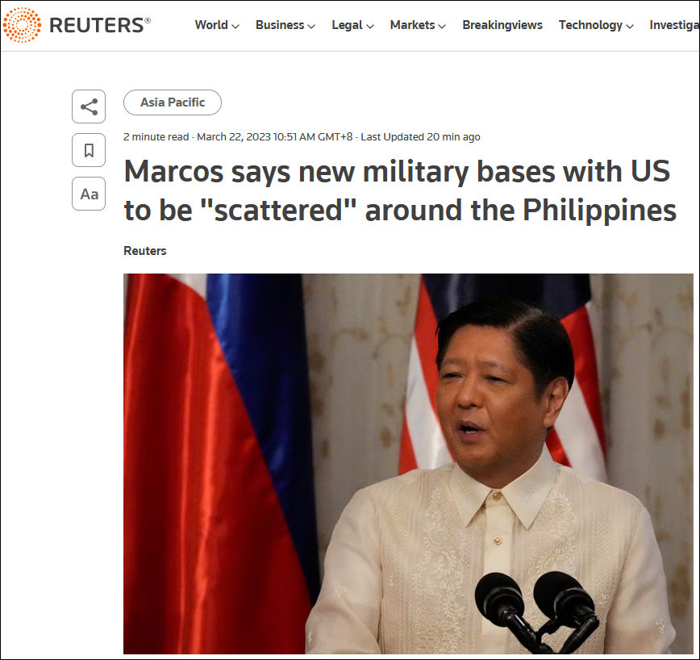
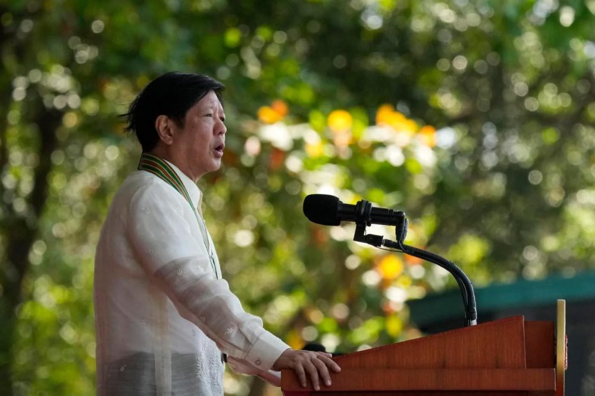
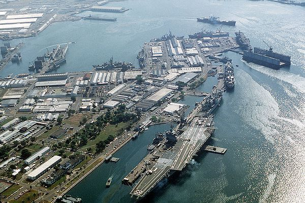

# 菲律宾即将宣布新增4处美军基地位置，分散南北等各处

【文/观察者网 熊超然】今年2月2日，美国和菲律宾两国国防部发布联合声明称，菲方同意向美军再开放4个军事基地的使用权限。

据路透社当地时间3月22日报道，菲律宾总统马科斯当天表示，根据美菲两国于2014年签署的《加强防务合作协议》（EDCA），他将很快正式宣布这4个军事基地的地点位置，这些基地将“分散”在菲律宾全国各地。

路透社和法新社猜测，新增的4个军事基地大概率会位于吕宋岛，地点靠近中国的台湾岛和南沙群岛。此前有专家认为，扩大基地使用权本身并非大事，但对于台海或南海问题却意义重大，是美菲欲全力推动联盟现代化的信号。

不过值得注意的一点是，菲律宾总统马科斯过去曾表示过，他预计美国和菲律宾之间的军事关系将加强，但排除了重启美军在苏比克湾和克拉克的前军事基地的可能性。他还明确指出，允许外国在本国领土设有军事基地是违反菲律宾宪法的。

_路透社报道截图_

据报道，马科斯当天在菲律宾建军节纪念活动间隙，对记者谈及了新增的4处美军基地：“在菲律宾各地还有4个额外地点（可以设置美军基地），有一些在北部，有一些在巴拉望岛周围，还有一些在更南边。”

此前的3月20日，美国空军部长弗兰克·肯德尔（Frank Kendall）也在一场新闻发布会上透露，美菲两国将尽快宣布新增基地的地点位置。

法新社报道猜测，其中2处新增基地将位于菲北部卡加延省，距离中国的台湾岛不到400公里。而路透社的报道援引一名军方消息人士称，美国已要求进入菲律宾伊莎贝拉省、赞巴莱斯省和卡加延省的基地，这些地方都位于吕宋岛，除了靠近台湾岛之外，还靠近中国的南沙群岛。

路透社称，当天在菲律宾军队面前，马科斯告诉他们要“保持警惕”，并声称菲律宾安全形势面临到的外部威胁正变得“越来越复杂和不可预测”。

_菲律宾总统马科斯在建军节纪念活动上发表讲话 图自菲媒_

今年2月2日，菲律宾国防部同意向美军再开放4个军事基地的使用权限。美菲两国国防部的声明提到，根据美菲两国于2014年签署的《加强防务合作协议》，美军被允许进入菲律宾的5个军事基地，加上此次开放的4个军事基地，美军在菲律宾将会拥有9个军事基地。

根据《加强国防合作协议》，美军已经被允许在菲律宾的5个军事基地预先部署装备、建造飞机跑道、燃料库以及军事宿舍等基础设施，但是并没有被允许在菲律宾常期驻扎军队。

《华盛顿邮报》此前分析认为，美军在菲律宾新增军事基地这一事态发展，反映出美菲对“印太地区”日益严峻的安全环境的担忧，对于此次“扩张”，美方意图加强其军事姿态，巩固盟友关系，遏制中国，而菲方则有加深与美国联盟的意愿。

美国战略与国际研究中心（CSIS）的东南亚问题主管格雷格·波林（Greg
Poling）则认为，虽然扩大基地使用权本身并不是该地区的安全关键事项，但“这是一件相当大的事情”。“这不仅对台海或南海问题意味着一些什么，而且意义重大。这是一个信号，表明菲律宾正在全力推动联盟现代化，他们明白，现代联盟意味着他们也有责任。”

在历史上，菲律宾曾是美国殖民地，自1951年以来一直是美国的条约盟友国，美国在菲律宾曾经拥有多处军事基地和大量驻军。1992年，美国关闭在菲最后一处军事基地——苏比克湾基地，这也是美军在亚洲最大的海外军事设施。

1998年，美菲签署《访问部队协议》，美军能以“访问”名义实现在菲律宾的长期军事存在。2014年，美菲签署《加强防务合作协议》，允许美军在菲指定区域兴建或升级军事设施。在美军撤离30年后，去年5月，菲律宾开始允许美军使用苏比克湾。这一举动引发热议，不少外媒猜测“美军可能重回菲律宾”。

_美军在菲律宾苏比克湾的前军事基地（资料图）_

值得注意的是，今年1月19日，前往瑞士参加达沃斯论坛的菲律宾总统马科斯在接受英国《金融时报》专访时，再次谈及中美关系和南海问题。他当时表示，预计美国和菲律宾之间的军事关系将加强，但排除了重启美军在苏比克湾和克拉克的前军事基地的可能性，并称此举“违宪”。

此前一天（1月18日），马科斯在达沃斯论坛上谈及南海问题时则表示，这一问题让他“夜不能寐”，但补充称，菲律宾奉行“和平政策”，军事手段绝对不是南海问题的解决方案。他强调，军备竞赛不是菲律宾的选项，南海地区的未来必须由该地区决定，而不是由外部势力决定。

在中美地缘政治议题上，马科斯当时表示，菲美同盟关系“仍然强大”，但这并不等同于菲律宾会在持续的中美紧张局势中“选边站队”。

对于菲方允许美国使用菲律宾4个军事基地，中国外交部发言人毛宁曾指出，中方一贯认为，国家间的防务安全合作应当有利于地区和平稳定，不应针对第三方或损害第三方利益。美方出于一己私利，抱持零和思维，不断在本地区加强军事部署，是在加剧局势紧张，危害地区和平稳定。地区国家应当对此保持警惕，避免被美裹挟利用。

**本文系观察者网独家稿件，未经授权，不得转载。**

