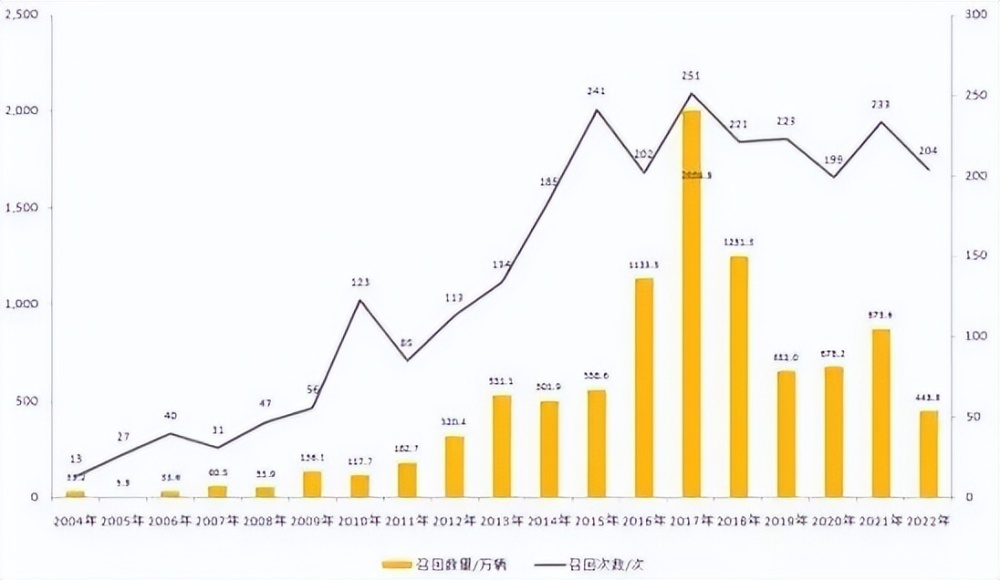

# 谁是“召回王”？

汽车召回总量大幅降低，汽车质量越来越好了？

国家市场监督管理总局缺陷产品管理中心公布了《市场监管总局关于2022年全国汽车和消费品召回情况的通告》：2022年，我国共实施汽车召回204次，涉及车辆448.8万辆，分别比上年降低12.4%和48.6%。

“福特和本田等外资企业召回较多，新能源车召回很少，传统（燃油）车召回没有出现新的趋势性事件。”全国乘用车市场信息联席会秘书长崔东树表示，2022年的召回批次总体较少，尤其是2季度初的召回较少，后面受到疫情影响召回较少。

据统计，2022年无论是召回批次还是召回总量，均出现了明显下滑，其中召回总量达到了近十年来的最低点。

_图片来源：缺陷产品管理中心_

但这却并不代表汽车质量有了明显提升。

中国消费者协会发布的2022年全国消协组织受理投诉情况显示，2022年有关汽车投诉的主要问题之一，就是汽车质量问题。如部分传统燃油车品牌频繁出现发动机、变速箱等主要部件故障，新能源汽车续航里程缩水、智能辅助驾驶系统失灵等。2022年，汽车及零部件投诉量达43836件，同比增长5.31%，其中质量问题投诉占比近20%。

增长的投诉量和大幅下滑的召回总量，数据偏差之间，发生了什么？

**新能源车召回增长**

随着震动世界汽车业的高田气囊十年召回事件的结束，从2019年开始，国内汽车召回总量逐渐回落。

国家市场监督管理总局缺陷产品管理中心数据显示，2019年汽车召回223批次，召回总量653.0万辆；2020年召回199批次，召回总量678.2万辆；2021年汽车召回数量233次，召回总量873.6万辆；2022年共召回204批次，召回总量448.8万辆，创近10年新低。

其中，受市场监管总局缺陷调查影响召回26次，涉及车辆175.9万辆，占全年召回总数量的39.2%。

显然，召回监管在召回过程中发挥的督导作用依旧十分重要。

而随着近年来我国汽车市场的格局生变，汽车召回构成也产生了明显的变化。

根据公安部所发布的数据，截至2022年底，全国新能源汽车保有量为1310万辆，占汽车总量的4.1%。扣除报废注销量，比上年增加526万辆，增长67.13%。2022年全国新注册登记新能源汽车535万辆，与上年相比增加240万辆，增长81.48%。新注册登记新能源汽车数量从2018年的107万辆到2022年的535万辆，呈高速增长态势。

受此影响，2022年新能源汽车召回数量创历史新高，全年共实施新能源汽车召回47次，涉及车辆121.2万辆，占全年召回总数量的27.0%，同比增长31.5%。

《市场监管总局关于2022年全国汽车和消费品召回情况的通告》中指出，在新能源汽车缺陷线索报告中的4300例缺陷线索中，反映动力电池、电机、电控系统问题占新能源汽车缺陷线索报告的41.9%。

2022年，特斯拉共召回6次，以79.1万辆的累计召回数量力压一众品牌，登顶2022国内召回排行榜榜首。召回涉及车型主要为国产和进口Model
3/Model Y，其次是进口Model X/Model S等车型。最大一次召回量达到43万辆，召回原因是示宽灯软件参数错误，可能导致示宽灯无法点亮。

在召回方面，一直以来进口车、合资品牌车辆的召回次数和数量都远超国内自主品牌，这一差异从燃油车过渡到新能源车型，情况仍未有明显变化。

随着新能源车渗透率的逐年提升，自主品牌在新能源汽车市场中也取得了远高于进口品牌和合资品牌的市场占有率。同时，汽车企业解决问题的方式也发生了巨大变化，凭借远程升级（OTA）改善车辆问题正在被越来越多的车企采用且提升比率，这或许也正是新能源车召回数量创下历史新高，2022年全国汽车召回总量却是十年来最低的主要原因之一。

**召回监管不断进化**

值得注意的是，在智能化高速发展的当下，零件质量控制体系更加健全，质量数据的存储更加受重视，对于汽车的精确追溯、零部件切换的管理做得更加细致，售后信息的处理更加细致，这些使召回变得越来越“简单”。

特斯拉全部召回的车辆，基本都可通过汽车远程升级（OTA）技术为召回范围内的车辆进行软件升级，用户无需到店即可完成召回。

阿维塔科技董事长兼CEO谭本宏也在接受中国新闻周刊专访时表示：“我现在深刻感受到软件在智能电动车领域表现出的力量，很多东西是通过软件来解决，通过OTA解决我们很多体验上的问题。过去的传统汽车可能有一些功能和体验上的问题，比如说ABS或者ESP出现了一些问题，因为不能够OTA（只能通过更换硬件解决）。其实有时候可能能够通过软件的匹配去解决这个体验上的问题，但现在像智能电动汽车里面，像阿维塔这种产品它就是全域，无论是自动转向、动力还是车控，所有的全域都是细到每一个毛孔，它基本是可以迭代的，可以解决很大一部分的关键问题。”

随着汽车智能化程度的不断升高，尤其是新能源车型，OTA对其的改善作用十分明显，车主们也在逐渐适应如手机系统升级一样对车辆进行OTA。但OTA与召回之间的关系，却相当复杂。

《市场监管总局关于2022年全国汽车和消费品召回情况的通告》中指出，远程升级（OTA）逐渐成为车辆安全改进的重要方式，2022年实施OTA召回17次，涉及车辆88.7万辆，占全年召回总数量的19.8%。

据不完全统计，仅在2022年上半年，就有33家车企推送了共计92次OTA，全年OTA次数显然远超OTA召回次数，对于二者之间模糊的界限，监管部门也早已予以了高度重视。

市场监管总局于2020年底发布了《关于进一步加强汽车远程升级（OTA）技术召回监管的通知》，自本通知印发之日起，生产者（含在中国境内依法设立的生产汽车产品并以其名义颁发产品合格证的企业，以及从中国境外进口汽车产品到境内销售的企业）采用OTA方式对已售车辆开展技术服务活动的，应按照《条例》及《实施办法》要求，向市场监管总局质量发展局备案。生产者采用OTA方式消除汽车产品缺陷、实施召回的，应按照《条例》及《实施办法》要求，制定召回计划，向市场监管总局质量发展局备案，依法履行召回主体责任。如OTA方式未能有效消除缺陷或造成新的缺陷，生产者应当再次采取召回措施。

除了监管部门不断提高监管方式和方法之外，近年来，国内消费者对于汽车质量问题的关注度越来越高。包括车质网、汽车投诉网、懂车帝、中汽研、中保研等定期发布反映汽车真实信息、值得消费者信赖的车型可靠性、安全性数据报告，以及反映车市真实车辆缺陷信息、维护消费者合法权益领域等，也给国内汽车安全召回添了一份力。

不过，尽管国内汽车召回法规日益健全，车主维权行动花样百出，媒体保护车主权益的口号声也越喊越响，但最有说服力和实际检验意义的召回销量比数据上，国内市场还与发达市场相差甚远。

据美国媒体报道，美国高速公路安全管理局（NHTSA）近日发布数据显示，截至2022年12月下旬，汽车制造商共发布390次召回，涉及超过2500万辆汽车。

巨大的召回数量差异背后，是更大的汽车保有量差异。截止2022年底，美国汽车保有量2.832亿辆，在世界各国汽车保有量排第二，仅次于中国。而中国2022年机动车保有量已突破4亿辆，其中汽车3.19亿辆。

在召回制度方面，国内起步较晚。汽车召回制度起源于美国，1966年，美国就明确了找回的一系列管理程序及召回方式。而国内市场，2004年，由国家质监总局、发改委、商务部、海关总署联合制定的《缺陷汽车产品召回管理规定》出台，这是中国汽车召回制度的开始。

尽管起步晚，但我国在召回方面的进展速度也相当快。不到二十年时间，国内的召回制度迅速完善，逐步走上正轨。截至2022年底，我国累计实施汽车召回2628次，涉及车辆9578.7万辆。

《市场监管总局关于2022年全国汽车和消费品召回情况的通告》中提出，2023年，市场监管总局将深化产品安全监管创新，稳步推进汽车安全沙盒监管制度，确保创新制度安全、适度、可控。深化智能汽车OTA安全评估，推动企业不断改进产品设计、制造，降低产品安全风险，结合物联网技术带来的产品安全新问题，探索物联网产品安全监管新模式。

作者：郑宇

