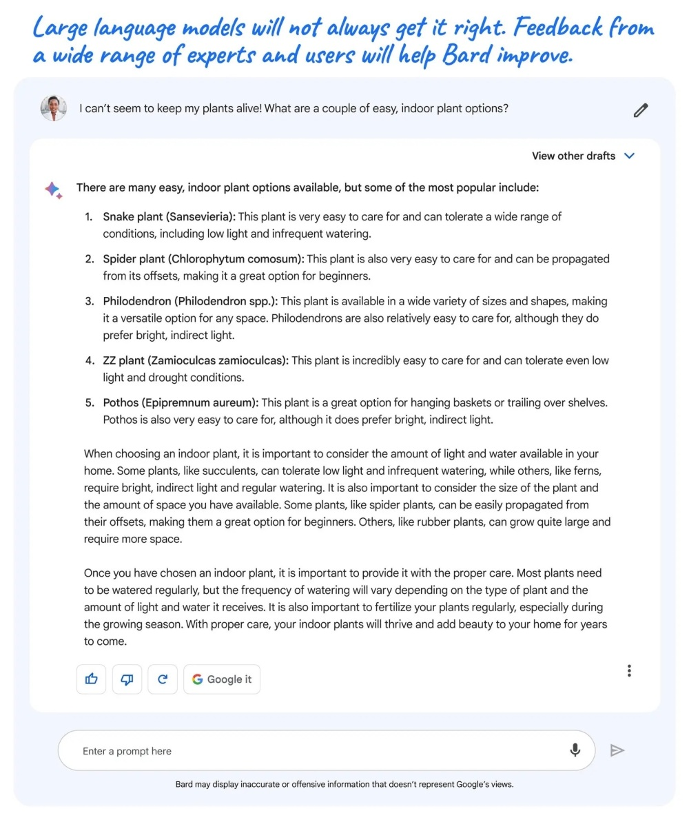

# 谷歌谨慎有限开放聊天机器人巴德，强调只是“搜索的补充”

当地时间3月21日，谷歌开放对其“ChatGPT竞争对手”巴德（Bard）的有限访问，最初供美国和英国的部分用户使用。用户可以加入等候名单，但谷歌表示推出速度会比较慢，也没有提供完全公开访问的日期。

在最近科技巨头部署AI的新竞赛中，谷歌被认为因谨慎态度失去了曾经的领先地位，这是该公司试图收复失地的重要一步。

与ChatGPT和新必应（New
Bing）聊天机器人一样，巴德为用户提供了一个空白文本框，邀请用户就他们喜欢的任何话题提问。不过，谷歌强调巴德不是其搜索引擎的替代品，而是“搜索的补充”——用户可以从中激发想法、生成草稿，或者只是聊聊生活。

_巴德为用户提供了一个空白文本框，邀请用户就他们喜欢的任何话题提问。_

根据巴德项目负责人Sissie Hsiao和Eli
Collins撰写的博客文章，他们谨慎地将巴德描述为“一项早期实验......旨在帮助人们提高生产力，加速他们的想法，并激发他们的好奇心。”他们还将巴德描述为一种让用户“与生成人工智能协作”的产品，这种说法似乎旨在分散谷歌对未来潜在问题的责任。

自2015年以来，谷歌一直在测试巴德背后的技术，但到目前为止，除了一小群早期测试人员外，还没有发布该技术，因为就像OpenAI和微软提供的聊天机器人一样，它并不总是产生值得信赖的信息。

当谷歌高管们21日演示聊天机器人时，它拒绝回答医疗问题，因为这样做需要准确和正确的信息。

一些科技媒体已经第一时间尝鲜了巴德。在The
Verge的演示中，巴德能够快速流畅地回答一些一般性问题，就如何鼓励孩子打保龄球提供建议（“带他们去保龄球馆”）并推荐一系列受欢迎的偷盗故事电影。巴德为每个用户查询生成3个回答，尽管其内容变化很小，并且在每个回答下方都有一个突出的“Google
It”按钮，可将用户重定向到相关的谷歌搜索。

_巴德为每个用户查询生成3个回答。_

与ChatGPT和必应一样，主文本框下方还有一个显著的免责声明，警告用户“巴德可能会显示不代表谷歌观点的不准确或令人反感的信息”。

_谷歌警告用户巴德可能会显示不准确或不恰当的信息。_

在测试中，尽管聊天机器人与谷歌的搜索结果相关联，但它无法完全回答有关谁主持了当天的白宫新闻发布会，虽然正确地识别出新闻秘书，但没有注意到《足球教练（Ted
Lasso）》的演员也在场。它也无法正确回答有关特定洗衣机最大负载容量的棘手问题，而是编造了3个不同但不正确的答案。

巴德与ChatGPT和必应相比如何？The
Verge认为，它肯定比任何一个速度都快，尽管可能仅仅因为它目前的用户较少，并且似乎具有与其他系统一样广泛的潜在功能。例如，在简短测试中，它还能够生成代码行。但它也缺少必应清晰标记的脚注，谷歌表示脚注仅在直接引用新闻文章等来源时出现。

在短暂的测试中，The
Verge提出了一些棘手的问题，包括一个明显危险的问题：“如何在家里制造芥子气”，巴德对此犹豫不决，并说这是一项危险而愚蠢的活动，也是一个政治敏感的问题。

巴德基于谷歌的AI大型语言模型LaMDA，应该比目前所呈现界面显示的更强大。但谷歌需要解决的问题是了解这种潜力有多大以及以何种形式向公众公开。与谷歌的谨慎态度相比，微软的必应聊天机器人虽然侮辱用户、挑逗用户，引起了很多负面关注，但让许多人喜欢上了这款聊天机器人，也使其在新闻上占据了热搜。

