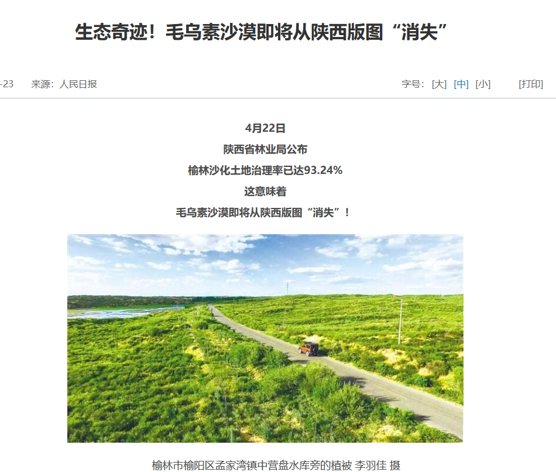

# 造了这么多防护林，为什么还有沙尘？

又是平平无奇的一天，在北方的打工人发现自己又要在漫天黄沙中朋克地上班了。从3月10号到现在，今年北方已经上演了3场沙尘大戏。漫天黄沙中，是延绵不绝的“你是风儿我是沙，缠缠绵绵到天涯”的春季狗血8点档戏码。

_（图片来源：中国天气）_

**隐约中总有一种宿命感**

与2021年3月15日的沙尘天气相似，2023年这次的沙尘天气影响范围十分广泛。中央气象台3月22日08时发布沙尘暴黄色预警，受冷空气影响，昨日至今晨，新疆南部、内蒙古、甘肃中东部、宁夏、陕西北部、山西中北部、河北北部、北京、吉林西部等地出现扬沙或浮尘天气，
**内蒙古中东部、河北西北部、北京等地出现沙尘暴，局部地区PM10超过2000微克/立方米**
，能见度明显降低，空气中尘土味儿重。这也是今年以来最强的沙尘天气。

_（图片来源：中央气象台）_

巧了不是——两年后沙尘的“戏码”居然在同一时间上演了。那为何在遭遇沙尘暴时，北方城市总是受委屈的那一个？这就不得不让人感慨“命运的捉弄”。

_中国北方多省发布沙尘暴预警_

**北方：眼泪在飞，为什么受伤的总是我**

沙尘总有“根”，它的根就是那些约占全球陆地表面的三分之一的干旱、半干旱区域。它们不仅是中国，也是世界主要的沙尘源区。
**直接影响我们的沙尘主要源自中国北方的干旱半干旱地区和蒙古国的戈壁沙漠**
，包括：新疆塔里木盆地边缘；甘肃河西走廊和内蒙古阿拉善地区；陕、蒙、晋、宁西北长城沿线的沙地、沙荒地旱作农业区；内蒙古中东部的沙地等。这些地区由于深处内陆，远离海洋，气候干旱，草木贫瘠，多为沙漠、荒漠、戈壁覆盖，进一步使得该地抗风蚀能力降低。此外，由于在冬春季，北方降水量普遍偏少，植被覆盖量也少，长期相对较低的相对湿度使得表层土壤疏松。

**除了本地的变化，高空大气环流形势的变化也与沙尘天气的出现紧密相关**
。随着季节更替，影响我国天气的大佬之一——东亚大槽开始蠢蠢欲动。当沙尘天气出现时，这个对流层西风带形成的、位于亚洲东部沿海一带的深槽会在亚洲西部形成稳定的脊区。

正是由于我国位于槽后西北气流控制区，东亚大槽不断向东推进，引领西伯利亚冬春冷空气不断南下。

由于控制该类天气的一般为大尺度天气系统，是叠加在平直西风带上的，范围大约在1000-3000km，所以杀伤力巨大。冷空气越强，形成的大风区越大，强度也越强。在大风的“缠绵”之下，
**蒙古和内蒙古荒漠地区原地徘徊的沙尘终于被怂恿，地表大量沙尘被卷入空中，随着大风一路南下东下，浩浩荡荡，终于浪迹到我国东部北方城市群**
。另外，我国的西部地区恰好位于地形高处，总是位于冷空气下游风向的北方，可不就是案板上的鱼肉么。

**沙尘源，强劲风力，再加上近地层不稳定的大气，每年冬春寒潮来袭的时候，北方便容易发生大规模的沙尘天气。**
以今年为例，2月下旬以来，沙尘源地温度持续走高，天干物燥，沙尘已经跃跃欲试。而恰好寒潮激发的蒙古气旋到来，两人一合计，就浩浩荡荡地南下拼事业了。

当然，此次沙尘天气能不能称得上是一次沙尘暴，还得另算——当水平能见度≤1km，并且在同一次天气过程中, 相邻3个或3个以上国家基本 (准)
气象站在同一观测时次出现了沙尘暴，才认为发生了一次沙尘暴事件。

其实，沙尘暴并非不能影响到南方。

虽然沙尘暴在东移南下过程中势力逐渐减弱，但是在环流的带动下特大沙尘暴也能大举南下，沿途洒下黄沙。2000年4月那次特大沙尘暴沙尘一度蔓延到黄淮、江淮、江南北部等地，连台湾岛都受到了影响。

**谁是长期驱动中国沙尘暴的幕后黑手？**

沙尘天气的出现，仅仅是一次天气现象的偶然么？

近40年来的气象记录表明,
中国北方春季大风日数的增减与沙尘暴日数的增减是一致的。而大风的增减往往反映的是气候周期性变化规律。所以大风日数异常增加，强度明显增强，一定是东亚冬季风的异常在背后“搞事情”。

但要论起灾害天气背后的可能幕后推手，还是厄尔尼诺这个我们熟悉的家伙。

研究已经发现， **在厄尔尼诺年, 冬春季大风天气较少；而在反厄尔尼诺年, 大风天气出现频繁，为沙尘暴出现提供了动力条件。** 20世纪 70 年代,
由于反厄尔尼诺事件占优势, 中国北方寒潮大风天气出现很频繁，而在80~90年代, 厄尔尼诺事件占优势, 寒潮大风天气出现相对较少。1998-2000
年爆发了20
世纪最强的一次反厄尔尼诺事件，在当年及次年，我国北方也爆发了罕见的高频沙尘暴。而今年，最近刚刚淡出视线的“三拉尼娜”事件可不能就被大家遗忘了呢！（戳这里回忆一下）

在气候尺度上，发表在著名刊物《Nature Communications》上的研究推测，沙尘暴活动与东亚夏季风和人口数量有关。东亚夏季风增强时,
人口数量急剧增多, 沙尘暴活动同时增强, 如汉、唐、北宋以及明朝前期; 而在东亚夏季风减弱时, 人口数量减少，沙尘暴也减弱,
如魏晋南北朝、五代十国、南宋以及明末。

需要注意的是，虽然气象条件在沙尘暴的输送上举足轻重。但沙尘暴的出现，与人为活动并非毫不相关。人为活动并非只是指化石能源利用加速的近代。对于我国而言，受沙尘暴伤害的历史可以追溯到2000年前。

北宋徽宗太学博士陈与义留下过“如何得与凉风约，不共沙尘一并来”的诗句，来吐槽自己遭遇沙尘暴突袭的倒霉运气。下图是根据高分辨率岩芯重建的过去2000年中国东西部沙尘暴记录的对比，
**揭示出中国北方存在两种沙尘暴演化模式** ：西部地区的沙尘暴主要受控于自然气候的变化,
人类活动的影响直到近代才表现出来，而人类活动在2000年前就成为了中国东部地区沙尘暴的主控因素。

_（图片来源：参考文献2）_

**造了那么多防护林，为什么还有沙尘？**

气象影响虽大却不可控，沙尘源这个可以建设和完善的“缺口”，成为了我国“控沙”的主要工作目标。为实现此目标，我国主要采取了建立三北防护林、实施天然林保护、退耕还林还草等措施，力图在源地改善起沙机制，从而减少沙尘天气的发生。

经过几十年的努力，我国创造了一个又一个奇迹。目前中国森林增加面积超过全世界所有国家的总和。“十三五”以来我国累计完成防沙治沙任务880万公顷，植被覆盖面积增加了200多万公顷，2000年-2017年期间全球绿叶面积的25%由中国贡献。2020年，中国四大沙地之一的毛乌素沙漠即将消失。而我国七大沙漠之一的库布其沙漠植被覆盖率已经从2002年的16.2%，大幅提升到2016年的53%，每年阻止上亿吨黄沙流入黄河。中国的防沙治沙成绩已经被世界看到。

_（图片来源：人民日报）_

那么，是否今日的沙尘暴就意味着防沙治沙没有成效，防护林没有起到作用？其实不然。

在改善当地生态环境上， **防护林建设是一个长期而缓慢的过程**
。通过植被根系固沙、蓄水功能，可以降低地表沙尘裸露面积，抑制、改善起沙条件，植被也可以减小局地的扬沙，但对整个风场的改善毕竟有限。得益于长期的绿化建设，近50年来，我国沙尘天气的确逐渐减少。以北京为例，根据北京观象台沙尘资料统计分析，
60-80年代及以前，北京春季的沙尘日数在10-20天以上，到了2010年以后，平均沙尘日数已经降低为3天左右。

在极端不利气象条件下，扬沙仍能被大风从未改造的沙漠中带起，在高空环流的带领下席卷我国北方。我们需要认识到，沙尘暴不能被根治，
**植树造林也不是解决一切问题的终极方案，不能百分之百解决我国的沙尘问题** 。防护林的建设和生态环境的科学治理仍然需要持续推进。

**防沙治沙，全球进行时**

除了我国，其实日本、俄罗斯、澳大利亚、美国、中东、埃及、希腊等国家和地区，也饱受沙尘暴困扰。在沙尘问题上，全球都是“命运共同体”。

**由于过度开发自然资源、过量砍伐森林、开垦土地，沙尘暴一直是美国西部平原的常客**
。但2020年6月，撒哈拉沙漠上空的风带着1.82亿吨沙尘穿越大西洋登陆美国东南部，筑起数十米高墙。

_撒哈拉50年来最大沙尘暴登陆美国（图片来源：腾讯网）_

我们需要认识到：沙尘暴是全球生态系统的重要一环， **只要内陆地区极端干旱区存在，沙尘就不可能彻底消失，沙尘暴也不会消失** 。

近些年我国沙尘天气的减少的确与控制起沙源区有关，此外，在全球变暖形势下的中低纬度地区平均风速的减少也起到了重要作用。

不过， **在全球循环中，沙尘暴并不总是“坏人”**
。虽然不直接吸收大气中的二氧化碳，但是，沙尘暴所带来物质是海洋浮游植物生长必不可少的肥料，某种程度上它是抵抗全球变暖的幕后英雄。

**气候变化是荒漠化的决定性因子，人为活动对荒漠化形成过程起着决定性作用。随着全球变暖加速，北半球中纬度内陆地区降水量虽然变化不大，但温度显著升高，必定使得地表蒸发加大，土壤变干**
。极端天气现象的增加将使我国北方地区干旱和暖冬现象日益严重,
如果继续加以不合理的人为利用，必然为异常沙尘暴的发生提供不良气候背景——而这正是我们想要抑制并使其减少的。

如何在环境治理中取得平衡，扩宽对自然和气候的认识，从而在人努力前提下利用天来帮忙，依然是未来全球都需要思考的问题。防沙治沙，保护环境，将永远是进行时，是主旋律。

（本文已于2021年3月16日首发于科学大院，本次发布略有调整）

**参考文献：**

[1] 杨艳, 王杰, 田明中,等. 中国沙尘暴分布规律及研究方法分析[J]. 中国沙漠, 2012, 32(2):465-472.

[2]
陈圣乾,刘建宝,陈建徽,陈发虎.过去2000年中国东西部沙尘暴的不同演化模式及其驱动机制讨论[J].中国科学:地球科学,2020,50(09):1316-1318.

[3] Chen F, Qiang M, Zhou A, Xiao S, Chen J, Sun D. 2013. A 2000-year dust
storm record from Lake Sugan in the dust source area of arid China. J Geophys
Res-Atmos, 118: 2149–2160

[4] Chen F, Chen S, Zhang X, Chen J, Wang X, Gowan E J, Qiang M, Dong G, Wang
Z, Li Y, Xu Q, Xu Y, Smol J P, Liu J. 2020. Asian dust-storm activity
dominated by Chinese dynasty changes since 2000 BP. Nat Commun, 11: 992

[5] 张德二. 1984. 我国历史时期以来降尘的天气气候学初步分析. 中国科学B辑, 14: 278–288

[6] 张仁健, 韩志伟, 王明星,等. 中国沙尘暴天气的新特征及成因分析[J]. 第四纪研究, 2002, 22(4):374-374.

[7] 康杜娟, 王会军. 中国北方沙尘暴气候形势的年代际变化[J]. 中国科学D辑, 2005, 35(11):1096-1096.

[8] 张高英, 赵思雄, 孙建华. 近年来强沙尘暴天气气候特征的分析研究[C]// 全国优秀青年气象科技工作者学术研讨会论文集. 2006.

[9] Wang S , Zhang B , Wang S , et al. Dynamic changes in water conservation
in the Beijing–Tianjin Sandstorm Source Control Project Area: A case study of
Xilin Gol League in China[J]. Journal of Cleaner Production, 2021,
293(1):126054.

[10] 徐启运, 胡敬松. 我国西北地区沙尘暴天气时空分布特征分析[J]. 中国减灾, 1996.

