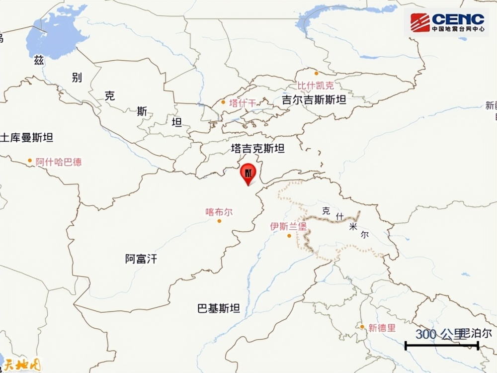
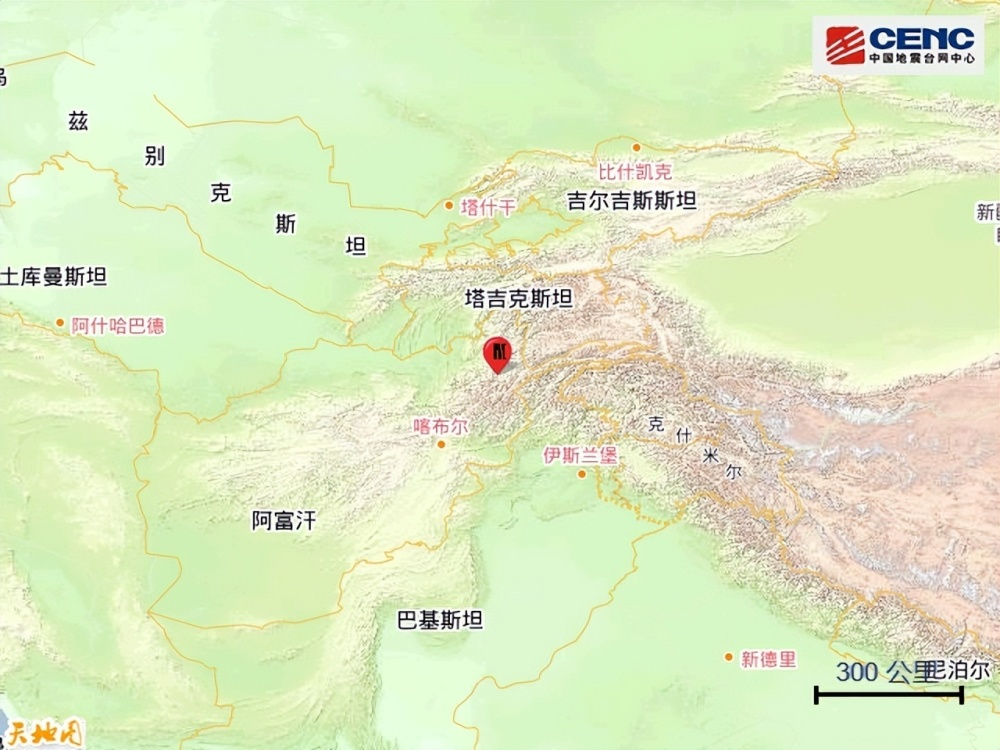

# 阿富汗发生6.9级地震，已致邻国巴基斯坦3人死亡

**速报参数**

据中国地震台网正式测定，3月22日0时47分在阿富汗发生6.9级地震，震源深度230公里，震中位于北纬36.50度，东经70.80度，距我国边境线最近约333公里。

**基础背景**

周边城市：震中300公里范围内有9座大中城市，最近为霍罗格（Khorog），距震中约129公里。

震中地形：震中5公里范围内平均海拔约2295米。

**阿富汗地震已致邻国巴基斯坦3人死亡**

受此次地震影响，巴基斯坦首都伊斯兰堡有强烈震感。巴基斯坦各地已有3人死亡、56人受伤。

来源 中国地震台网 央视新闻

编辑 曾佳佳

流程编辑 马晓双

