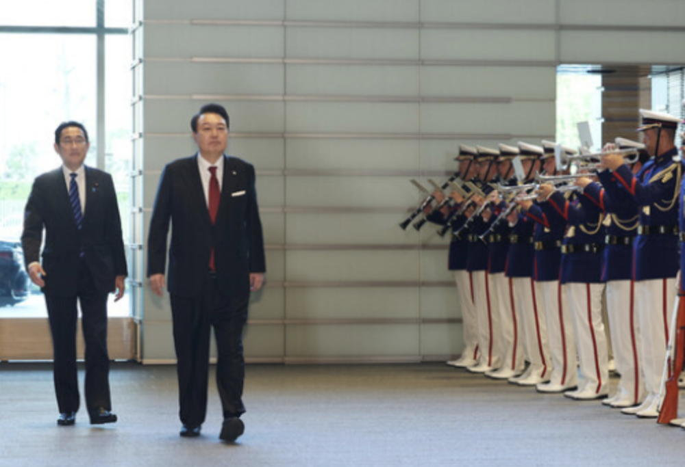

# 韩国人幸福感排名垫底：房价5年涨80％，贫富收入差距达1400倍

本文来源：时代周报 作者：刘沐轩

为什么韩国会给人一种人民不幸福的印象?

这样的观点似乎源于一些影视作品。无论是奥斯卡获奖电影《寄生虫》，还是《窥探》等悬疑犯罪片，再到《鱿鱼游戏》《黑暗荣耀》等在全球爆火的韩剧，韩国的影视作品似乎总是离不开他们的社会顽疾，例如底层人的挣扎、无止境的内卷、公权力的不作为……

韩国人也因此沉迷那些卧薪尝胆、大仇得报的爽剧。

_现实中几乎没人能像《黑暗荣耀》中那样实施完美的复仇。（图源：《黑暗荣耀》剧照）_

但现实总是残酷的，据知名民调机构益普索集团发布的《2023年度全球幸福感》调查报告，在32个国家中，2022年韩国的居民幸福感排名第31，仅高于匈牙利。

仅有57%的韩国人认为自己“非常幸福”或“相当幸福”，其余则认为“不是很幸福”或“一点也不幸福”。这一比例与2021年持平，相比于10年前的62%出现明显下滑，也远低于这32个国家73%的平均比例。

据悉，该调查按照普遍衡量幸福的五个方面来设计，依次是：生活意义感、生活掌控感、心理健康和幸福、社交生活和生活条件。

其中，仅有34%的韩国人“感到人生充满意义”，39%的韩国人感到“物质上的富有”，在这两个方面都处于垫底水平。

意义感崩塌

对于意义感，在竞争严重的国家里，大多数人难以实现阶级跃迁，因此总是习惯寄托于宏大叙事来说服自己。

但这一套在韩国可能走不通，因为韩国人恰恰对自己的国家最失望。

在益普索调查的30个问题中，韩国人最不满的就是自己的国家。仅有21%的人对韩国经济情况满意，23%的人对韩国社会政治情况满意，远低于40%的平均水平。

受到出口下滑的影响，韩国近期经济状况确实遭遇了困难。

根据韩国产业通商资源部的进出口数据，今年2月韩国出口同比下降7.5%，已经连续5个月出现同比下降，连续12个月贸易呈现逆差。在最关键的芯片上，韩国2月芯片出口大幅下降了42.5%。

_韩国釜山港的集装箱装卸码头。（图源：社交媒体）_

目前，韩国央行、韩国经济研究院和国际货币基金组织（IMF）都纷纷下调了今年韩国经济增长预期，至1.5%-1.7%。但对于最近的韩国民众而言，这点数字的下滑没有太多实在感，远远不及总统尹锡悦对日本的表态更令人寒心。

就在今年3月，韩国政府公布了其对二战期间日本强征韩国人劳工赔偿问题的最新解决方案，引发民众的集体抗议。韩国最终决定由韩国行政安全部下属财团出面，替日本企业赔付受害者和家属。

尹锡悦标榜自己是为了翻开日韩关系的新篇章，但这一行为被韩国民众斥责为“历史性的耻辱外交”。

受此影响，民调机构韩国盖洛普17日发布的一项调查结果显示，韩国民众对尹锡悦的施政好评率略降至33%，差评率略升至60%。

国家经济萎靡、政治外交不如人意，让不少民族自豪感特别强烈的韩国人意义感崩塌。

_韩国总统尹锡悦访问日本时与日本首相岸田文雄并肩走向国旗。（图源：社交媒体）_

而意义感崩溃的直观表现之一，就是年轻人不工作、不生育。

根据韩国统计厅3月20日发布的数据，韩国今年2月非经济活动人口中选择“休息”的15岁至29岁青年层高达50万人，规模为2003年1月开始统计以来最多。

这项统计中，“休息”不同于准备就业、升学和等待入伍，只是单纯地不想工作，相当于真正的“躺平”。

生育率更不必多言，根据韩国统计厅2月22日发布的数据，2022年韩国生育率降至0.78，再次刷新了由韩国保持的全球最低生育率纪录。

值得一提的是，益普索的调查中意外地发现，韩国人居然在与孩子和配偶的关系上最为满意。虽然不及平均水平，但是78%的韩国人对孩子满意，73%的人对配偶满意。

既患寡又患不均

抛开上层建筑的所谓意义感，韩国人的经济基础可能才是他们感到不幸福的本质原因。

从整体上看，韩国人的平均收入其实并不低，而且仍在继续上涨。

根据韩国央行发布的数据，受韩元贬值等因素影响，2022年韩国人均国民总收入同比增加4.3%，达到4220.3万韩元（约合人民币22.2万元），折合月薪约1.85万元人民币。

然而面对首尔的房价，这点工资根本不够看。

过去5年，韩国房价整体上涨了80%。韩国国民银行(KB)的数据显示，首尔平均住宅价格达到12.4亿韩元（约为人民币652万元），是全球房价最高的区域之一。

这意味着，韩国人相当于要不吃不喝近29年才能买到一套首尔的房子。

_如果可以选，谁会住在首尔的地下室呢（图源：电影《寄生虫》剧照）_

韩国人不仅患寡，还患不均。韩国影视作品中，财阀的手眼通天与地下室中如“寄生虫”般的穷人并不是夸张。

根据韩国国税厅3月21日向韩国国会提交的资料，韩国2021年综合收入上游0.1%群体的年收入，是收入下游20%群体的1400倍。上游0.1%群体有9399人，他们的人均年收入为33.3317亿韩元（约合人民币1753万元），总收入占到韩国全体国民人口收入的10.4%。

而收入下游20%群体约有186万人，他们的人均年收入为238万韩元(约合人民币1.25万元)。

在韩国，衡量贫富差距的净财产基尼系数也在2022年创下近10年来最高纪录。该指标通常将超过0.4作为贫富差距过大的警戒线，而韩国的数据为0.606。

此外，韩国的收入不平等还体现在性别上。

据韩联社报道，韩国统计厅公布的数据显示，2021年韩国男性的月均收入为389万韩元（约合人民币2.05万元），同比增加4.7%。女性为256万韩元（约合人民币1.35万元），同比增加3.7%。

这意味着，2021年韩国女性月收入仅为男性的65.8%。而在39个经合组织成员国中，韩国的男女工资差距已连续26年居首位。

