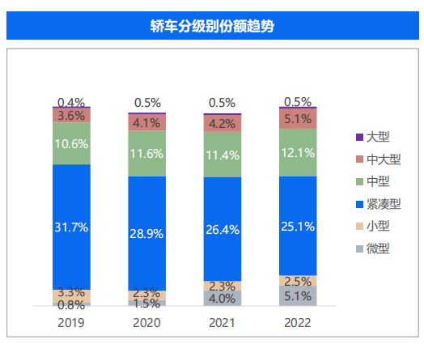
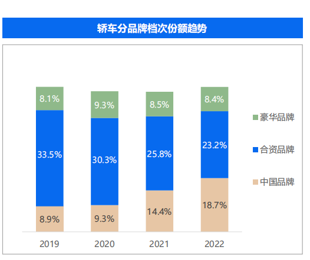
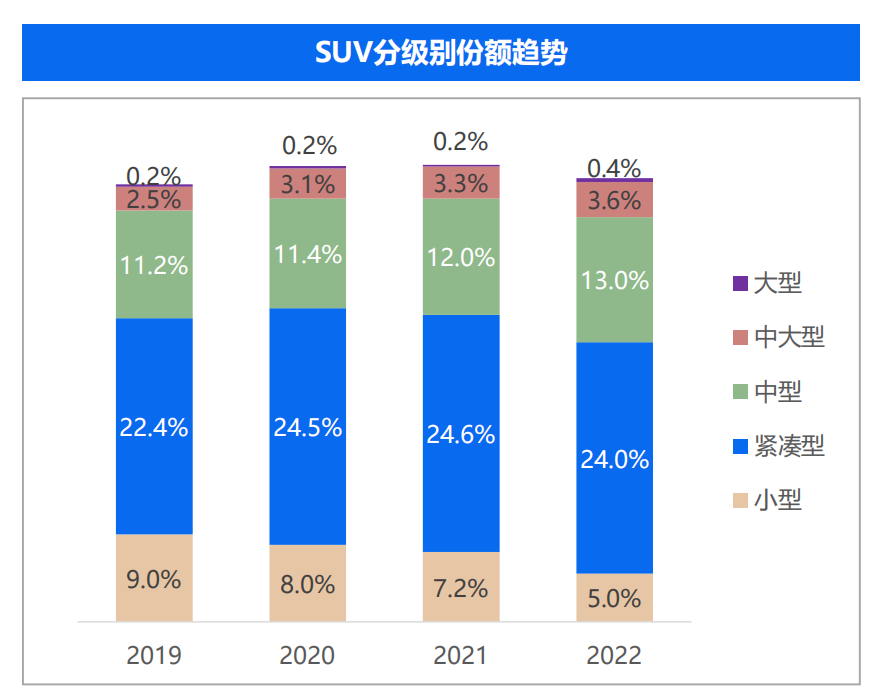
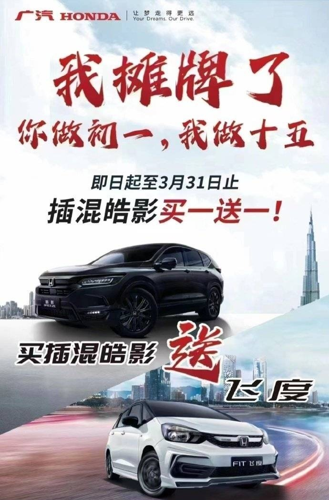
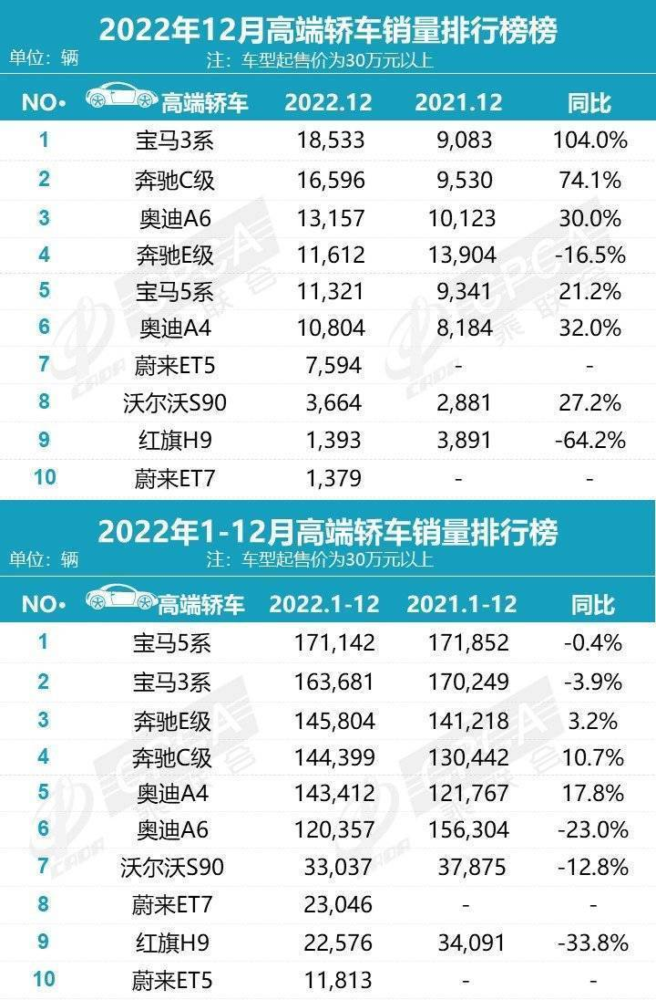
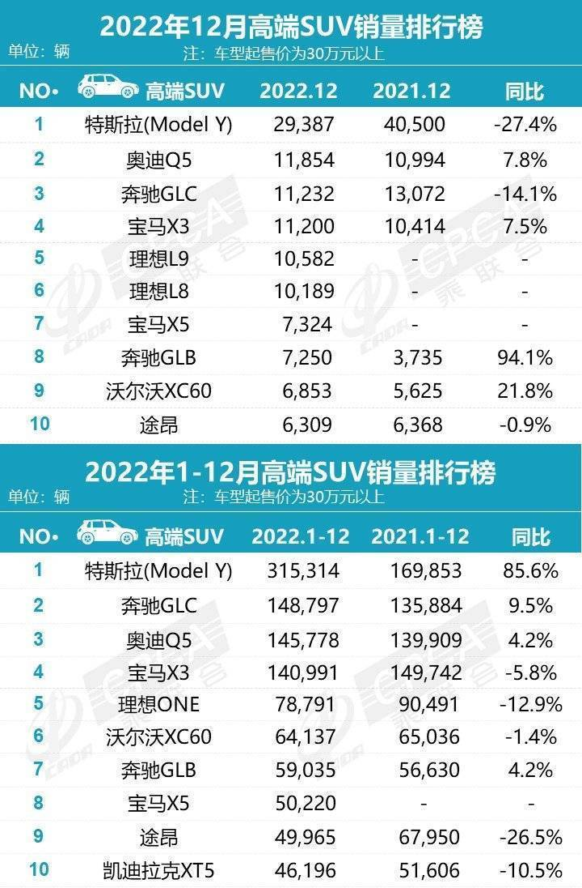
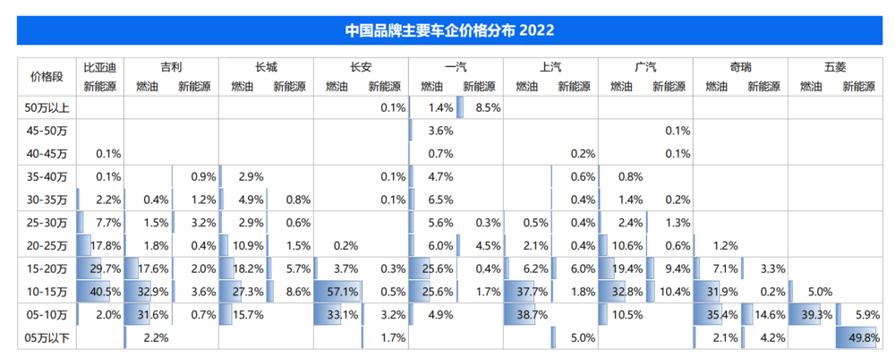

# 30万以下，谁还买油车？

出品｜虎嗅汽车组

作者｜李文博

编辑｜周到

头图｜《九品芝麻官》

“完全不理解，怎么现在还有人买油车？”

当蔚来创始人、董事长、CEO李斌在2021 NIO
Day后说出这句话时，引来了铺天盖地的诘责。人们“批评”斌哥看起来每天在APP里发红包，跟用户打成一片，实际上很早就何不食肉糜，脱离群众，完全无视了中国广大普通消费者的经济条件和用车环境。

内向的斌哥不语，默默承担了这些“骂声”，这不是因为他软弱，而是因为他早已看穿一切。

**不到一年，中国汽车市场燃油车和新能源车翻天覆地的销量变化，就是有力铁证。**

根据乘联会的统计，2022年中国乘用车累计零售2,054.3万台。其中，常规燃油车（纯燃油车）销量1486.8万台，同比下降13%，这个数字在过去三年分别是1,716万台（2021年）、1,818万台（2020年）和1,968万台（2019年）。新能源车零售567.4万台，同比增长90.0%，全年新能源汽车渗透率为27.6%。

另一个数据来源中汽协的统计中，结果同样惊人。2021年中国新能源车销量688.7万台，其中纯电车536.5万台，插电式混合动力汽车151.8万台，燃料电池汽车0.3万台，市场占有率25.6%，提前三年，在疫情反弹、芯片短缺、原材料价格上涨等多重不利因素影响下，实现了《新能源汽车产业发展规划（2021—2035年）》中提出的“到2025年，新能源汽车新车销量占比达到20%左右”的目标。

要知道，在2021年的时候，中国新能源汽车的渗透率只有14.8%。短短一年，这个渗透率，提升了10%。

**新能源车对市场的推土机式平趟，一点减速的意思都没有。**

今年前两个月，据中汽协数据，乘用车整体销量为312.1万台，其中，新能源乘用车销量93.3万台，市场占有率25.7%，渗透率26.6%，这意味着过去两个月每卖出四台新车，就有一台是新能源车，要么是纯电动，要么是插电式混动。在三个明星品牌——特斯拉、比亚迪和五菱的引领下，今年中国新能源车的整体销量将有望突破800万台，渗透率超过40%。

去年，中国新能源乘用车厂商零售销量排名的TOP15企业分别是：比亚迪（市场份额为31.7%）、上汽通用五菱（7.8%）、特斯拉中国（7.8%）、吉利汽车（5.4%）、广汽埃安（4.8%）、奇瑞汽车（3.9%）、长安汽车（3.7%）、哪吒汽车（2.6%）、理想汽车（2.3%）、长城汽车（2.2%）、蔚来汽车（2.2%）、小鹏汽车（2.1%）、零跑汽车（2%）、一汽大众（1.8%）、上汽大众（1.6%）。

细心的你一定发现了，油车时代躺着就能赚大钱的合资品牌，除了德国大众还在勉力支撑，其它的诸如丰田、本田、日产、别克、福特、马自达等，在面对中国品牌新能源车的骑脸输出时，别说还手，连最基本的招架之力都没有，可谓二十年内功，一夜就破防。

**2022年，合资品牌与中国品牌在主线战场，即30万以下价格区间内的正面对抗已经结束。**
2023年，合资品牌要做的是在牲口都不如的外部环境中，尽智竭力地活下去。中国品牌一边打扫战场，一边准备内战。

按照当下中国新能源车市场的竞争强度和淘汰速率，十年后还能留在中国市场，正常运营的合资品牌，数量不超过一只手。

为什么？ **因为30万以下，中国人确实不把合资品牌纯油车，当成首选项了。**

不是不报，时候未到

初见这个判断，你肯定会发出质疑：“怪不得塞车”的马自达的确是销声匿迹，但“马路三大妈”轩逸、卡罗拉和雷凌在全国各个城市街面上的可见度，也没比过去低多少。更何况，还有“比较高级”的朗逸、宝来，常年游荡在火车站、地铁站附近趴活。

我们用2022年，中国市场轿车和SUV的上险量——这个相对贴合现实的数据——来解答。

首先看轿车。在轿车上险量前十名中，紧凑车型占据六席。从级别份额上看，轿车依然占比最大，达到25.1%，相比2021年的26.4%，出现了一定萎缩。值得注意的是，紧凑型轿车的市场份额过去四年一直处于下行通道，从31.7%（2019年）到28.9%（2020年），再到26.4%（2021年），这是合资品牌在中国的核心销售基盘。

数据来源：汽车之家

**紧凑卖不狠，地位就不稳。**

这些合资品牌紧凑轿车让渡出的份额，一方面被比亚迪秦和海豚吞进肚里，比亚迪秦以环比翻倍，全年33.1万台的成绩，位列2022年轿车销量排名第四；另一方面流向了微型轿车和中大型轿车。微型轿车的份额从2019年的不到1%，迅速增长到2022年的5%，中型轿车的份额从2019年的10.6%，增长到2022年的12.1%。

数据来源：汽车之家（除SUV、MPV后的整体市场份额）

微型轿车在合资品牌2019年彻底放弃后，成为了五菱宏光MINIEV这台纯电小车表演的舞台，40.98万台的上险量让合资品牌既眼红又无奈。中型轿车，除了凯美瑞、雅阁外，天籁、帕萨特、迈腾等中国人眼熟的车型一概落榜，原因很简单，比亚迪汉在“性价比”层面对合资品牌实施了降维打击。

通过上险量，我们不难发现，10万以下轿车市场，中国品牌纯电车型一骑绝尘；10万到25万轿车市场，比亚迪依靠“油电同价”战略，干掉了竞争力一般的合资品牌车型，只剩下几块公认难啃的硬骨头；25万轿车市场，合资品牌仅有两台日系车硕果仅存，在豪华品牌入门车型价格下探的情况下，该细分市场的生存空间进一步挤压。

**一个比亚迪汉就能让合资品牌中级车瑟瑟发抖，节节败退，如果中国品牌全军出击呢？**

以前，花25万能买到的，无非就是凯美瑞、雅阁、迈腾这些合资品牌的老古董。合资品牌用横置发动机、铁皮车身随便攒一攒，就要掏空一个中国人辛勤工作两年产生的剩余价值，
**这是拿咱这儿当全球慈善总会了。**

但如今，这个预算可以让你挑花眼：要面子，选豪华品牌的宝马i3、特斯拉 Model
3；要性价比，选中国品牌的比亚迪汉、小鹏P7i、飞凡F7、零跑C01、哪吒S等，哪一台不比眼里只有暴利的合资品牌强？

中国人确实对轿车不怎么感冒，但不代表中国人不会挑轿车：2022年，中国品牌轿车的市场份额拉升到了18.7%，合资品牌轿车的市场份额被压缩至23.2%，中国品牌轿车完成对合资品牌轿车的超越，指日可待。

与“革命尚未成功”的中国品牌轿车不同，中国品牌SUV很早就实现了对合资品牌SUV的鲸吞。2019年时，中国品牌SUV就占据了21.5%的市场份额，到2022年，这个数字已经变成了22.3%，远超合资品牌的14.7%。

数据来源：汽车之家（除轿车、MPV后的整体市场份额）

具体来看，紧凑型（24%）是2022年中国SUV市场的绝对销量主力，依靠这一级距的统治级表现，中国品牌将合资品牌打得找不着北。

数据来源：汽车之家

在特斯拉Model
Y之后，比亚迪宋PLUS新能源以27.38万台的上险量，干掉了东风本田CR-V、一汽丰田荣放这两台传统强势合资SUV。同时，比亚迪在两台日系车身后埋伏了元PLUS，在大众途观身后埋伏了唐，随时启动“背刺”计划。今年前两个月，比亚迪宋在销量上超越了特斯拉Model
Y，登上王座；元PLUS干掉本田CR-V，唐干掉大众途观。在排名前十的SUV中，中国品牌车型占据六席，豪华品牌占据三席，合资品牌只剩下本田CR-V了。

在当下的中国汽车市场，合资品牌仅存的用户吸引力和号召力，也就剩MPV了。不过，这种情况也不会持续太久：2022年，别克GL8、丰田塞那、本田奥德赛一息尚存。今年前2个月，腾势D9已经卖得比丰田塞那多，传祺M8和别克GL8的销量差距，也越拉越近。

在最近疯狂降价的车企中，合资品牌表现出了前所未有的紧迫和急躁，无论是参与车型还是降价幅度，都远超微微降价以表心意的中国品牌，
**一种末日气氛笼罩在合资品牌头上。**

图片来源：广汽本田经销商

从2020年开始，已经先后有长安雷诺，长安DS，长安铃木，一汽马自达，广汽菲克Jeep，广汽讴歌等合资汽车公司结束了中国业务，最近因降价套路多而爆红的东风雪铁龙有很大可能在库存清完后，连夜关门跑路。

对此，奥纬咨询董事合伙人张君毅认为，合资品牌在电动车推进上落后于国内自主品牌，导致其价格对消费者的吸引力越来越弱。在快速反应市场异动方面，合资品牌相对落后。今后在30万以下的车型里，自主品牌的地位会越来越高。

去年，根据乘联会的统计，比亚迪超过一汽-
大众，成为中国市场最畅销的乘用车品牌。这是中国品牌从1984年首家合资车企北京吉普成立以来，首次战胜合资品牌。并且，从2022年9月开始，中国品牌的市场份额持续突破50%，压合资品牌一头。

**打退这股合资品牌精锐部队，中国品牌花了整整38年。**

下一战：30万

在30万以下市场，中国品牌依靠驱动能源形式的变化，无论是舆论还是销量，都取得了阶段性胜利，我们有资格痛饮一杯庆功酒。但30万以上的高端市场，豪华品牌没有被摧枯拉朽地中国品牌连根拔起，只是稳定的根基出现了小小松动。在这片战场，中国品牌一探头，就挨打，而且是毒打。

2022年，豪华轿车市场，销量前六名被宝马、奔驰、奥迪瓜分，第七名是沃尔沃S90。蔚来ET7以2.3万台的销量排名第八，但体量只有排名第一宝马5系（17.1万台）的七分之一，即便早已被中国消费者开除出豪华品牌队伍的奥迪A4，也以压倒性优势，轻松战胜蔚来ET5。

数据来源：乘联会

今年前两个月，蔚来ET7跌出前十，ET5升至第六，成为豪华轿车市场的独苗。

**但你想想，除了蔚来之外，还有多少中国品牌造出来的轿车，是自我标榜越级豪华，拳打宝马5系、脚踢奔驰E的？销量一摊到眼前，全露馅了。**

在豪华SUV市场，中国品牌就更惨，2022年只有理想ONE一款车型进入前十，排名第五，与BBA主流车型14万的销量相比，差距肉眼可见。

数据来源：乘联会

今年前两个月，理想L9直逼宝马X5，L8紧追奥迪Q5L，扛起了中国品牌高端化的大旗。

但同样还是前面那个问题，除了理想，还有多少中国品牌推出的SUV，是主打一个“碾压传统豪华，颠覆既有认知”。在新能源和无限加长前置定语的双重护体下，还是只能在真刀真枪的战斗后，现出“菜鸡”原形。
**在各种PPT上将特斯拉Model Y按在地上摩擦，结果全年交付量连Model Y的零头都不到。**

所以，如今的中国汽车市场呈现出的态势是： **30万以下，确实没什么人考虑油车；可30万以上，大部分人的首选还是油车。**

那，中国品牌新能源车什么时候，才能在30万以上价格区间，对德系豪华品牌，复现30万以下，对合资品牌的碾压式粉碎打击呢？

**答案是：五年后的某一个月。**

原因有三：首先，中国汽车消费人口的年龄特征正在发生重大变革，据汽车之家对真实车主的统计，2017年至2022年期间，31-40岁的购车人群占比连年下滑，21-30岁的购车人群在短短五年间增长了11%。购车人群的用户结构重心不断向30岁以下的年轻人群转移，现在的年轻人在购买第一台车时，更愿意选择中国品牌，
**十年后，当他们来到功成名就的35岁，准备增购、换购时，同样也会更青睐中国品牌。**

其次，女性用户比例不断增加。众所周知，如今女性群体的社会地位、话语权和对消费市场的影响力与日俱增，
**且女性拥有50-200万可投资产的比例从2017年的25.9%上升至2021年的33.4%。**
更独立、更有钱、更理智的中国女性用户，已经纷纷跳出“品牌溢价牢笼”，她们更愿意选择“一台我喜欢的中国车”，而不是“刻板印象里的外国好车”。

最后，中华民族自信空前强烈。无论是产品技术的创新，还是服务体系，用户体验上的迭代。 **中国品牌都远比合资品牌步子迈得大。**
燃油车时代由合资品牌搭建的评价体系，在新能源车时代彻底失效，智能化超越品牌，成为产生新溢价的核心竞争力。

写在最后

2023年，是中国汽车市场淘汰赛启动的一年，是中国品牌全方位战胜传统合资品牌的一年，也是极少数中国品牌完成对德系豪华品牌超越的一年。

合资品牌近段时间针对燃油车的“回光返照式”降价，让笔者感觉到合资品牌在中国，很快就要成为“时代的眼泪”了。

10万以下，过去瞧不太上，现在高攀不起；10万到25万，SUV退路已断，轿车老家被偷；25万以上，都不用中国品牌动手，下探的豪华品牌会被格杀勿论，寸草不留。

合资品牌如今的境地是： **中国市场这么大，没有一处是我家。**

这其实一点也不怪中国人不念旧情。毕竟，躺赚了快40年的合资品牌向来只把庞大的中国市场看成提款机和快活林，只求大量攫取利润，绝不分享核心科技。既然从没把中国市场当成过家，现在被忍让多年的主人扫地出门，又有什么可抱怨的呢？

