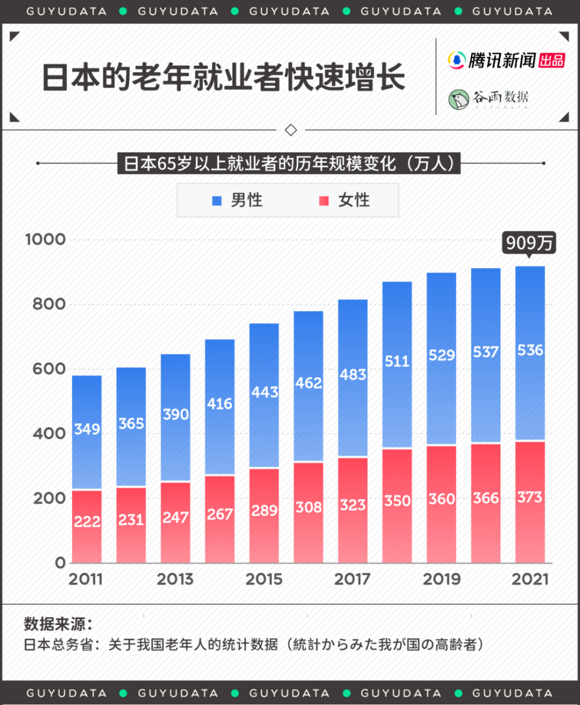
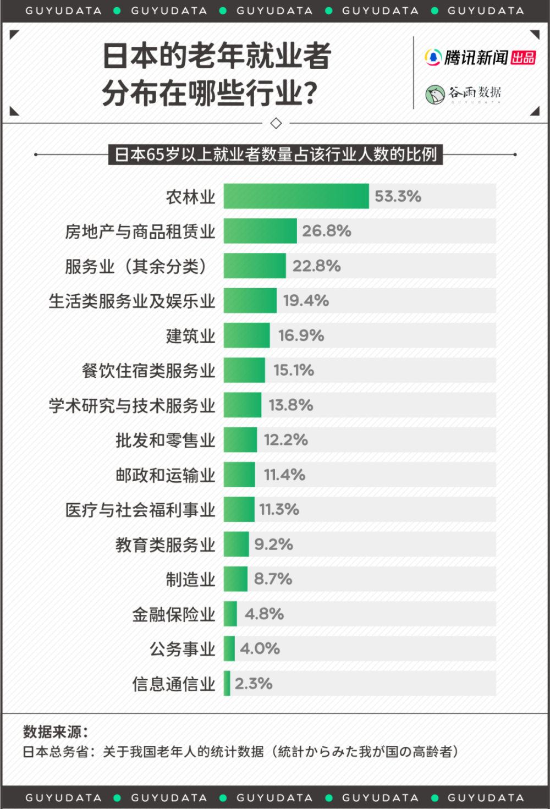
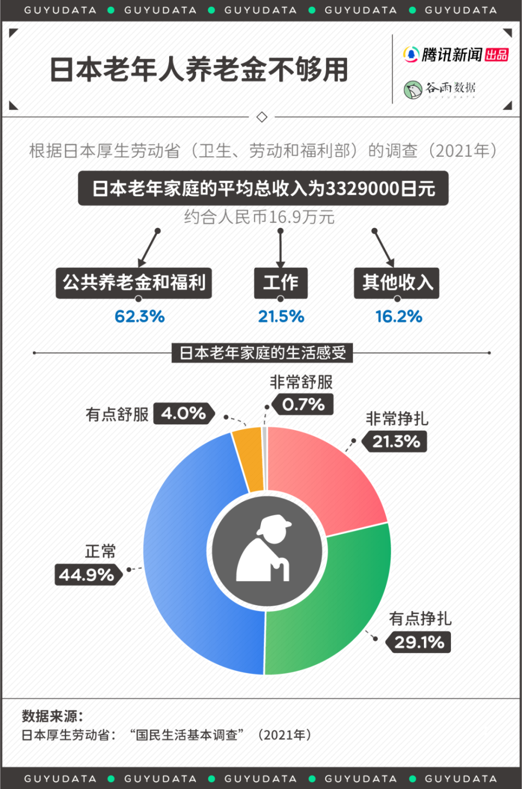
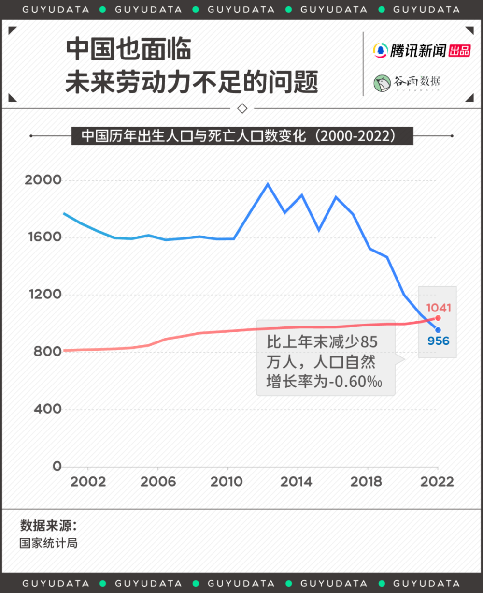

# 60岁当保安，70岁送外卖，日本老年人的现在可能就是我们的未来？

“35岁失业，之后做保安保洁。65岁才能退休的话，过六十大寿还得找领导请假。”

延迟退休年龄是年初以来的热议话题。网上出现了不少调侃的段子。初入社会不久的95后、00后一想到自己的苦日子又增加了几年，就悲从中来。

我们的现实还没到来，但邻国日本已经习以为常。对很多日本人而言，过了65岁，又是一段崭新的工作旅程。

我很想知道，日本老年人的就业情况如何？他们为什么要继续上班？这会是我们的未来吗？

古稀之年的日本人，很多还在上班

68岁在大阪街头巷尾开出租车，70岁西装革履挤地铁去上班，73岁在怀石料理店当服务员。这是日本稀松平常的场景。

**根据日本总务省统计局2022年9月的数据，65岁以上的日本老年人有3627万，占总人口比例29.1%，这个占比位居世界第一。中国排名第九。**

而截止到2021年，日本65岁以上的老年人，有909万处于就业状态。也就是说，每四个65岁以上的老年人，就有一个还在工作。

工作到老可能是日本老年人的专属。对比一下老年人口占比世界第二的意大利，就会知道，在老龄化社会里，不是每个退休老人都得工作。意大利统计局网站上，就业率最多只统计到55岁-64岁——事实上意大利的法定退休年龄是67岁。

而日本的退休年龄，直到2021年4月都是65岁，这之后的政策是，鼓励企业将员工的退休年龄从65岁提高到70岁——但事实上鼓励已经走进现实。

分性别来看，在日本老年就业市场里，女性的就业率相对低一些，男性才是主力。65-69岁的男性，超过60%还在工作。70岁以上的男性，也有25.6%没歇着。

这么多工作的日本老年人，都在忙些什么？

种田。统计显示，日本农林业的就业者中，老年人占了53.3%，超过一半。因为日本的粮食需求缺口大，年轻人又不愿意干，靠着高度的机械化，以及白发苍苍的老人们——根据日本农林水产省数据，自营农业劳动力的平均年龄已达68.4岁——日本农业才得以支撑着。

养老金不够用，不敢退休的日本老人

虽然2021年4月日本修订了《老年人就业稳定法》，鼓励大家把退休年龄从65岁延迟到70岁，但至少到现在，65岁还是日本的法定退休年龄。而10年之前，日本的法定退休年龄是60岁——那70岁还远吗？

退休年龄推迟，一个最直接的原因是，人越来越长寿了。

**根据世界卫生组织《2022年世界卫生统计》，日本人的预期寿命已达到84.3岁（男性81.5岁，女性86.9岁），高于中国的77.4岁（男性74.7岁，女性80.5岁）。**

****

老年人越来越长寿，新生人口却越来越少。2021年，日本女性总和生育率（表示每名女性一生中生育孩子的平均数）为1.30，与中国数据相当，共同处于全球最低水平。

**但延迟退休的另一个原因是，日本老年人也很想工作，因为养老金真的不够用。2021年日本老年家庭的平均总收入里，只有62.3%来自公共养老金与相关福利，约10.5万元人民币。**

日本的公共养老金制度有两层结构。第一层是统一费率的国民年金，无论什么职业，所有工作年龄里的公民都要缴纳。金额固定，目前每个月缴纳费用是16590日元（约为863元人民币）。

第二层则称为厚生年金，这是一种公务员、企业员工等在工作年限内获得报酬成比例的养老金，由个人与单位共同承担，多缴多得。因为厚生年金的发放金额更高，所以高于养老金平均线的家庭，通常是公务员，以及那些被企业终身雇佣的人。

不论哪种年金，交满10年后都具有领取资格。但日本公共养老金设计了一个独特的浮动制度：以65岁为界，如果选择提前领取养老金，每月发放金额就会减少。反之，每推迟1个月领取养老金，发放金额增加0.7%。

这就意味着，如果从75岁才开始领养老金的话，金额将比65岁开始领要增加84%——又是一种变相的鼓励延迟退休。但谁也不知道自己能活多久，这是一场和命运的博弈。

现实是，超过一半的日本老年家庭觉得日子不好过。具体来说，有五分之一的家庭表示生活相当艰难。

而并不宽裕的生活里，房贷就是一个重要的开销。在动画《蜡笔小新》里，野原广志在小新两岁时，也就是故事设定前的1987年买了房，背负35年的贷款。按照这一时间计算，直到2022年小新爸爸才能把房贷还完，而那时他67岁，理应退休两年。

67岁还完房贷的小新爸爸还算幸运。根据日本住房金融厅的数据调查，日本购房者还清全部房贷的平均年龄已上升到73岁，比20年前又增加了5年。

随着全民贷款年龄与金额的上升，依靠养老金的生活可能变得不稳定。退休后继续找工作变成一件别无选择的事——调查显示，60岁以上的日本老年人，有40%希望尽可能维持长时间的就业。

但另一方面，老年人在就业市场里不具备优势。所以，除去官员（公务员）、家庭自营（自己开店），日本老年人在企业里拥有的就业选择，四分之三都是非正式职员，也就是零工。

中国老年人，准备上市场

可以这么说，中国所面临的老龄化现状，和10年前、法定退休年龄还是60岁的日本很相似。

2021年，我国老年人口抚养比达到20.8%，这意味着，从公共负担来看，在我国每5个年轻人需要至少赡养1个老人。而根据国家卫健委的预计，到2035年，60岁及以上人口将突破4亿。彼时中国将进入重度老龄化阶段。

根据智联招聘《2022老龄群体退休再就业调研报告》，68%的可退休人员愿意再就业。

我和66岁的方叔聊了聊，他住在上海，退休前他是一名测绘工程师，退休后则当起了网约车司机。他的理由是，不能让家里的汽车闲置。那意思就像在说他自己。

老年人想工作，但年轻人想退休。越来越多年轻人把“提前退休”挂在嘴边，随之而来的新问题是：养不起自己，干脆也别生了。

十年间，新生人口快速下滑，并在2022年跌破1000万，来到956万。而同期死亡人口升至1041万——总人口出现了61年来的首次负增长。

00后与60后相逢在职场，在不远的一天，这会成为结果，而不是选项。

撰文、数据、设计｜鹿鸣 编辑丨李衷 出品丨腾讯新闻 谷雨工作室

腾讯新闻出品内容，未经授权，不得复制和转载，否则将追究法律责任。

