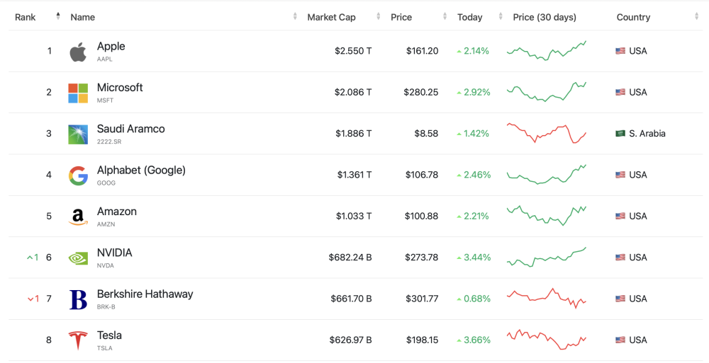

# 6822亿美元！英伟达市值超伯克希尔，成美国第5大上市公司

英伟达成为美国市值第5大上市公司。

3月23日美股开盘，图形芯片巨头英伟达（Nasdaq：NVDA）涨超3%，总市值逾6800亿美元，超过“股神”巴菲特旗下伯克希尔哈撒韦，跃升为美国市值第5大上市公司。

截至发稿，英伟达涨超3.4%，市值6822.4亿美元，今年以来股价已涨超90%。

消息面上，3月21日晚，英伟达创始人兼CEO黄仁勋在GTC大会上发表主题演讲，介绍英伟达在人工智能（AI）领域的多款产品，包括为大型语言模型设计的新款GPU（图形处理器）、针对AI视频的芯片L4，以及AI超级计算服务DGX
Cloud等。

其中，专为大型语言模型打造的H100 NVL，可处理含1750亿参数的GPT-3。与用于处理ChatGPT的HGX
A100相比，搭载四对H100和双NVLINK的标准服务器的处理速度最高可达10倍。黄仁勋称，它能将大语言模型的处理成本降低一个数量级。

对于英伟达带来的产品，金融机构Rosenblatt Securities的半导体分析师Hans
Mosesmann表示，这些产品“比竞争对手领先很多年。”该分析师认为，“英伟达在AI软件方面的领导地位不仅具有里程碑意义，而且还在加速发展。”

就在上周，摩根士丹利将英伟达的股票评级由“持股观望”上调至“增持”，目标价由255美元上调至304美元。摩根士丹利认为，有迹象表明，各界对大型语言模型的关注正在转变为强劲的短期和长期支出。

美国投行Evercore
ISI分析师同样认为，目前正处于AI巨大变现（monetization）的转折点，尤其大型语言模型在训练和推理方面对于英伟达产品具有一定需求。ChatGPT的推出引发了大规模的聊天机器人大战，而英伟达就是这场“战争”的受益者。

今年2月，英伟达发布2022年财报，期内实现营收269.14亿美元，同比增长61%，超出华尔街分析师此前预期；净利润为97.75亿美元，同比增长125%；全年GAAP摊薄每股收益创下3.85美元的纪录，同比增长123%。

