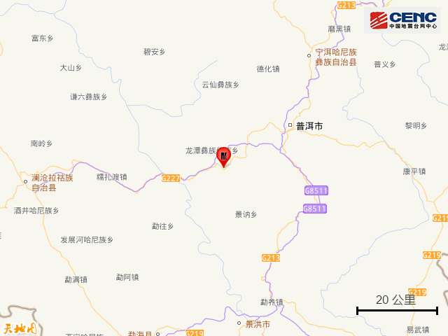
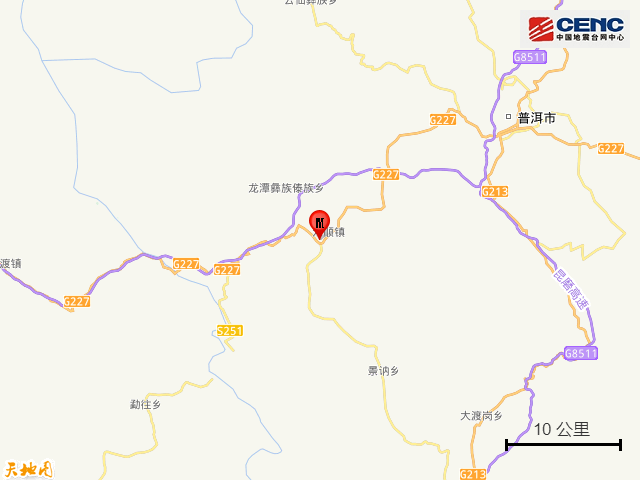
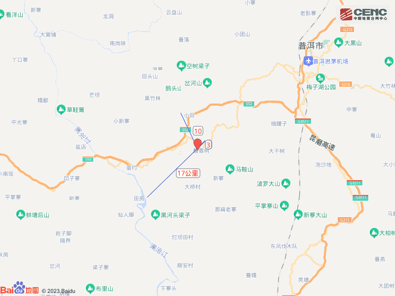
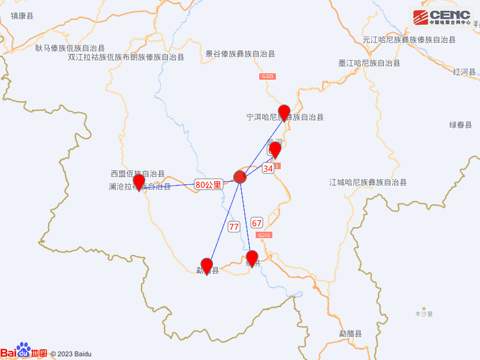
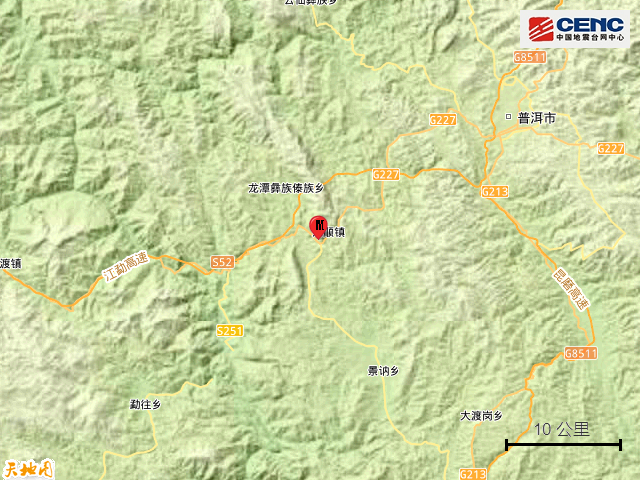
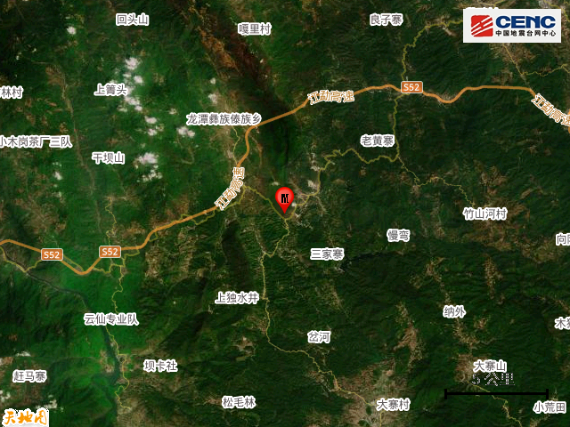
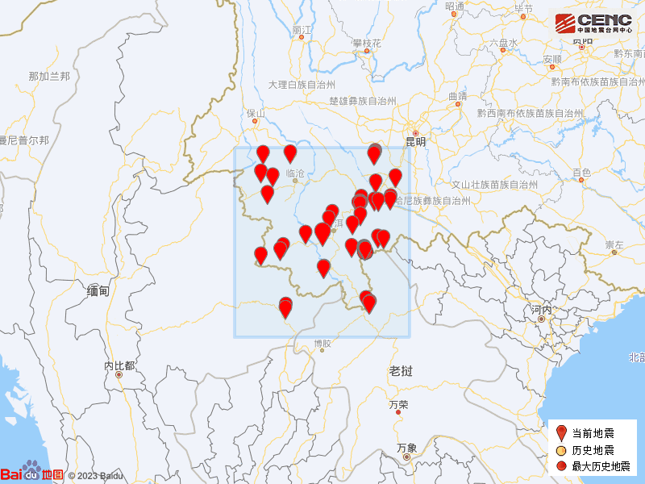

# 云南普洱市思茅区发生4.2级地震，周边5公里有多个村庄

据中国地震台网正式测定，3月23日18时26分在云南普洱市思茅区发生4.2级地震，震源深度10公里，震中位于北纬22.61度，东经100.71度。

本次地震周边5公里内的村庄有酸香树、大沙坝村、南本、大寨子、三家村、观音洞、大平掌、开花、右卡寨、大地，20公里内的乡镇有翠云乡、六顺镇、龙潭彝族傣族乡、思茅港镇。

震中距思茅区34公里、距宁洱哈尼族彝族自治县60公里、距景洪市67公里、距勐海县77公里、距澜沧拉祜族自治县80公里，距普洱市36公里，距昆明市339公里。

震中5公里范围内平均海拔约1204米。

根据中国地震台网速报目录，震中周边200公里内近5年来发生3级以上地震共82次，最大地震是2021年12月24日在老挝发生的6.0级地震（距离本次震中106公里），按震级大小前50次历史地震分布如图。

