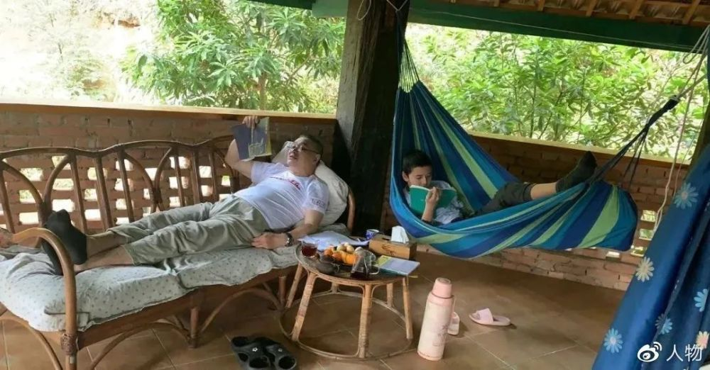

# 发现孩子患病后没有第一时间求医，名作家13岁儿子夭折

3月22日，《人物》公众号刊发了一篇报道《城堡里的马原》，讲述作家马原老年丧子的经历，引发热议。

_马原与儿子马格。_

马原是一名知名先锋作家，有两个儿子，其中小儿子马格于2022年6月1日因病死亡，年仅13岁。

这显然是一个关于老年丧子的悲痛故事。然而，不少人了解详情后认为，导致孩子夭折的的一个重要原因，是父亲马原信奉的某种“神秘主义”，让他在发现儿子患病后没有第一时间求医。

父亲马原为儿子缔造了一个“理想家园”，他在云南西双版纳建了一座山上城堡，马格在城堡中长大，朝夕与自然相处，自小有双亲陪伴。马格的教育也主要来自父亲，尽管马格也曾上学，马原却并不支持他接受主流教育。

马格上一年级时，学校常规体检测出马格心率超过130次/分钟。母亲想带孩子去医院检查，马原不同意。他对现代医学持有审慎和怀疑的态度。多年前，他被查出肺部长了一个肿瘤，没有选择去医院，而是选择在自然中“被疗愈”。尽管被妻子和好友三番五次劝说，他始终态度坚定：不能在心脏上动手术。

直到2021年，马原全身浮肿进医院治疗，他对心脏问题治疗的态度才有所松动。可惜的是，仅一年后，13岁的马格猝然离世。

孩子的早逝，并未让马原承认自己的决策失误。他认为孩子寿数到了，他给了孩子灿烂的一生。而在旁人看来，是马原的极度自我、强势和权威，让小马格失去了通过手术延长生命的机会。

马原有一套完全自洽的、与主流观念迥然不同的体系，并且不遗余力地将这套体系强加给身边人。在城堡中，他缔造了一个“楚门的世界”，在这个世界中，完全运行着他的逻辑。孩子生病是否求医，取决于他的意志。同样，他也会在其他选择上，一味向妻子孩子灌输自己的理念。比如，他希望马格未来做一个茶农，尽管马格抱怨“采茶太累”；他希望妻子和他一样住在城堡里，尽管妻子希望下山到城里生活。

逃离城市、选择自然疗法的马原，有权按照自己的理念过他这一生，这是他的自由。但13岁的小马格，甚至没有为自己学习、就医做选择的权利。这些，早已以爱之名被剥夺。

这样的悲剧，注定了儿子的不幸。

撰文|柴归

*文章为主编有态度原创出品，未经授权不得转载。

