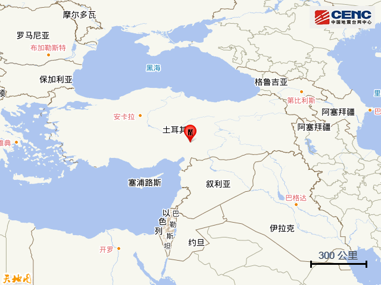
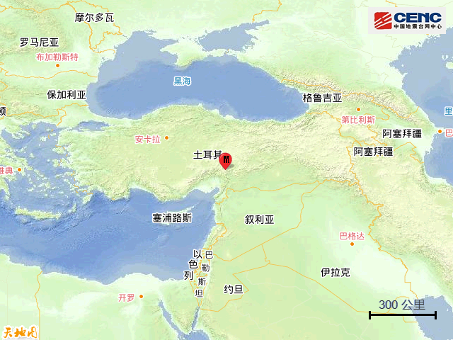

# 土耳其发生5.0级地震，震中200公里范围内有18座大中城市

据中国地震台网正式测定，北京时间3月23日17时19分（当地时间3月23日12时19分）在土耳其发生5.0级地震，震源深度10公里，震中位于北纬37.95度，东经36.65度。

震中200公里范围内有18座大中城市，最近为卡赫拉曼马拉什（Kahramanmaras），距震中约47公里。震中5公里范围内平均海拔约1880米。

