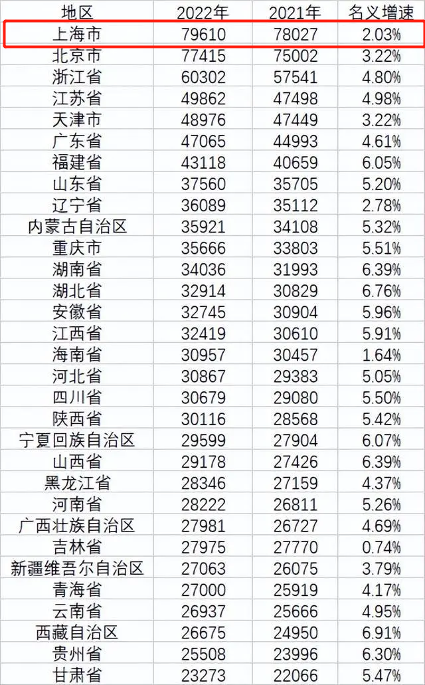

# 外来常住人口减少超25万，死亡比出生人口多4万，上海重磅数据出炉

每经编辑：黄胜

3月22日，《2022年上海国民经济和社会发展统计公报》发布。

统计显示，上海全年全市居民人均可支配收入79610元，根据国家统计局网站2月2日公布的31个省份去年居民人均可支配收入情况，上海市人均可支配收入水平为全国最高。

统计显示，至2022年末，上海全市常住人口为2475.89万人。其中，户籍常住人口1469.63万人，外来常住人口1006.26万人。对比2021年，上海全市常住人口降幅扩大，减少了13.54万人；外来常住人口减少了25.73万人，户籍人口增加了12.19万人。

值得注意的是，2022年，上海全市户籍人口平均期望寿命达到83.18岁，已接近全球最高水平。

_图片来源：每日经济新闻
资料图_

人均可支配收入79610元，全国最高！

据抽样调查，
**上海全年全市居民人均可支配收入79610元，比上年增长2.0%。其中，城镇常住居民人均可支配收入84034元，增长1.9%；农村常住居民人均可支配收入39729元，增长3.1%。**
全市居民人均消费支出46045元，比上年下降5.8%。其中，城镇常住居民人均消费支出48111元，下降6.2%；农村常住居民人均消费支出27430元，增长0.8%。月最低工资标准为2590元，小时最低工资标准为23元。

2月28日，国家统计局发布《中华人民共和国2022年国民经济和社会发展统计公报》，其中显示，2022年全年全国居民人均可支配收入36883元。按常住地分，城镇居民人均可支配收入49283元，农村居民人均可支配收入20133元。

**对比之下，上海的城镇居民人均可支配收入水平、农村居民人均可支配收入水平均接近于全国水平的2倍。**

另外，根据国家统计局网站2月2日公布的31个省份去年居民人均可支配收入情况， **上海市人均可支配收入水平也为全国最高。**

_31个省份2022年居民人均可支配收入及名义增速（单位：元。来源：根据国家统计局数据整理）_

常住人口减少了13.54万人，外来常住人口减少了25.73万人

统计显示，至2022年末，上海全市常住人口为2475.89万人。其中，户籍常住人口1469.63万人，外来常住人口1006.26万人
**。全年常住人口出生10.8万人，出生率为4.35‰；死亡14.8万人，死亡率为5.96‰；**
常住人口自然增长率为-1.61‰；常住人口出生性别比为107.81。

2022年，上海全市户籍人口平均期望寿命达到83.18岁。其中，男性80.84岁，女性85.66岁。

据《2021年上海国民经济和社会发展统计公报》，2021年末，上海全市常住人口为2489.43万人。其中，户籍常住人口1457.44万人，外来常住人口1031.99万人。全年常住人口出生11.6万人，出生率为4.67‰；死亡13.9万人，死亡率为5.59‰；常住人口自然增长率为-0.92‰；常住人口出生性别比为107.76。

2021年，上海全市户籍人口平均期望寿命达到84.11岁。其中，男性81.76岁，女性86.56岁。

**对比之下，上海全市常住人口降幅扩大，减少了13.54万人；外来常住人口减少了25.73万人，户籍人口增加了12.19万人。**

**上海全市户籍人口平均期望寿命下降了0.93岁，**
根据世界卫生组织发布的《2022年世界卫生统计》报告显示，目前，全球人均预期寿命最长的国家是日本，能够达到84.3岁。
**对比之下，上海人口平均期望寿命接近全球最高水平。**

人均GDP超18万元

初步核算，2022年上海实现地区生产总值（GDP）44652.80亿元，至年末，上海全市常住人口为2475.89万人。
**据此计算，2022年上海市人均GDP较去年同比上涨近4%，为18.04万元。据澎湃新闻，上海人均GDP水平与捷克水平相当，超过葡萄牙、沙特、希腊等国家。**

从走势看，2022年经济运行凸显韧性。全市GDP一季度同比增长3.1%，受二季度疫情严重影响，上半年GDP同比下降5.7%；但随着复工复产加快推进，前三季度GDP同比降幅收窄至1.4%，全年降幅进一步收窄至0.2%。

分产业看，2022年第一产业增加值96.95亿元，下降3.5%；第二产业增加值11458.43亿元，下降1.6%；第三产业增加值33097.42亿元，增长0.3%。第三产业增加值占地区生产总值的比重为74.1%，比上年提高0.4个百分点，经济结构持续优化。

2022年，上海市全年地方一般公共预算收入7608.19亿元，比上年下降2.1%；地方一般公共预算支出9393.16亿元，增长11.4%。全年税务部门组织的税收收入完成15473.6亿元（不含关税及海关代征税），增长1%。

根据《公报》统计，2022年上海经济总量继续保持全国经济中心城市首位；实际使用外资超过235亿美元，规模创历史新高；跨国公司地区总部、外资研发中心分别新增60家和25家，累计分别达到891家和531家；创新型企业加快成长，新增国家级专精特新“小巨人”243家，有效期内高新技术企业超过2.2万家，上海的发展活力持续显现。

每日经济新闻综合公开资料

每日经济新闻

