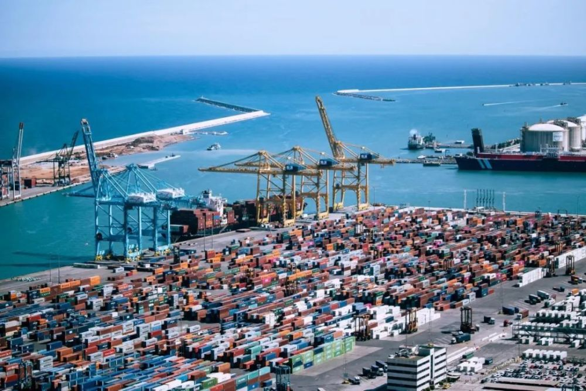

# 大量船只停靠在中国附近，美媒：聪明的航运公司已开始提前布局

【环球时报记者王冬 丁雅栀
崔瑾玥】自2021年以来，集装箱行业经历了从“一箱难求”到空箱增多的过程。作为贸易的“晴雨表”，集装箱相关变化一直受到国际市场密切关注。近来，有国外媒体报道称，在中国港口出现了大量集装箱空箱堆积现象，进而引发各方对中国外贸状况的担忧。3月20日，海关总署署长俞建华在新闻发布会中回应道，空箱增多的原因包括前期新集装箱投放量过大、国内堆存成本较低、国外疫情缓解后空箱短期大量回流等。那么，港口空箱率究竟代表着什么？中国外贸回稳又将为国际市场带来哪些活力?

**“牛鞭效应”导致超量供给**

“一箱难求”的局面出现在2021年。在疫情导致的供应链受阻、港口拥堵及新箱设备生产缓慢等因素影响下，集装箱供应紧俏。美国供应管理协会网站报道称，需求在传导过程不断变异放大而形成“牛鞭效应”（指供应链上的一个需求变异放大现象），刺激了新集装箱制造，导致超量供给。根据英国海运研究及咨询机构德路里发布的年度报告，仅在2021年全年，全球集装箱的总量就增长了13%，新箱产量同比增长118%。同时为了保障贸易需求，流通中的旧集装箱淘汰计划亦被推迟。

而就在去年年底，集装箱市场遭遇新变化，不少国际港口空箱堆积。美国CNBC网站报道称，“从短缺到过剩，全球航运业遇到‘新的麻烦’”。最近又有多家外媒报道称，集装箱空箱率说明中国制造业外流，出口能力下降，海外需求减少。那么，集装箱空箱率究竟代表着什么？

上海国际航运研究中心首席信息官徐凯22日接受《环球时报》记者采访时表示，集装箱作为一种物流资源，其空箱率不仅取决于箱子数量，还取决于流通速度。过去一段时间，疫情叠加苏伊士运河拥堵、长滩等港拥堵、部分欧美港口罢工等一系列事件，导致货物积压，集装箱流动性减弱，出现“一箱难求”的情况。当时，大量新箱经船运公司及大货主订购下海，加上众多本应老旧淘汰的集装箱经过修补继续使用，导致当前全球集装箱实际保有量增加，集装箱过剩。

对于目前全球空箱堆积的情况，徐凯表示，一般而言，集装箱可用性指数位于0.5说明供需平衡，目前中国主要港口的集装箱可用性指数在0.6到0.7之间，而位于欧美的安特卫普港、纽约港等港口集装箱可用性指数均高于0.8，远超国内各港口的堆放量。

此外，他还强调，空箱多不一定意味着货量的减少。如果货物在途的时间减短，集装箱周转时间也会加快，使得空箱率升高。

**“堆积只是一时的问题”**

“最近外贸复苏回暖趋势向好，码头空箱的堆存量已明显减少。”宁波舟山港集团工作人员22日对《环球时报》记者表示，为保障外贸出口，港口码头日常会保留一定数量的空箱，只是近期空箱从海外回流较多，场地相对以前更满。工作人员还表示，当前宁波舟山港空箱堆存能力充足，且对空箱采取了南北两翼港口及各个内陆场站的快速分拨，港口运行正常。

像舟山港一样，不少港口堆积的空箱正在减少。根据国务院物流保通保畅工作领导小组办公室监测汇总数据，3月13日—3月19日，监测港口完成集装箱吞吐量528.8万标箱，环比增长3.04%。20日，海关总署署长俞建华表示，相关部门在解读海关发布的前两个月统计数据时，对中国外贸发展形势的整体看法是，开局平稳，趋势向好。

从事大宗贸易的刘飞向《环球时报》记者表示，公司的业务主要是大宗农副产品的进口，会根据下游市场在哪就近停靠港口卸货。他说：“从天津港往下，青岛港、苏州太仓港、宁波舟山港、福州港、深圳盐田港、广西钦州港，公司都有卸货，现在几天就能快速清关，疫情防控措施优化调整后，产能都在慢慢恢复，堆积只是一时的问题。”

**大量船只停中国附近**

俞建华表示，大量空箱在我国港口蓄势待发，某种程度上也反映了国际市场依然看好我国下一阶段的出口能力。从海关最新数据看，2月下旬以来，出口用箱量在持续增长。3月17日，上海出口集装箱运价指数（SCFI）报909.72点，周环比上涨0.35%。受北方出口钢铁等重货出口带动，SCFI综合指数迎来今年首次反弹，分航线来看，北美航线仍然疲弱，欧洲航线运价反弹，以东南亚为代表的新兴市场航线总体向好。

“聪明的航运公司已经开始提前布局”，彭博社在报道中援引集装箱分析师的话称，它们的主要策略便是将空箱集中在靠近主要贸易航线附近和预计出现需求反弹的地方。因此，大量船只停靠在中国附近，等待着经济复苏。“从中国传递来的信号是令人鼓舞的。”美国CNBC网站援引一位物流从业者分析称，今年一些中国制造商选择分阶段“开业”，因此一些员工在3月初回归。

徐凯向记者表示，他对未来的生产活动加速恢复很有信心。他同时表示，目前欧美多家银行深陷困境，暴露出美国加息可持续性的问题，因通胀加息而抑制的消费需求有望反弹，未来的货运市场将在结构调整中稳步向好，“中国制造”将涌现出更多品牌、设计、高端产品和跨国供应链。

