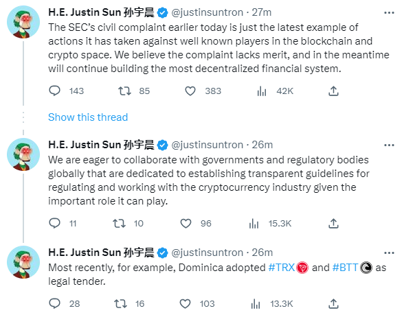

# 孙宇晨回应美国证监会起诉：缺乏依据，其数字资产监管框架尚不成熟

波场（Tron）创始人、火必（Huobi）全球顾问委员会成员孙宇晨（Justin
Sun）3月23日在推特发文称，他认为美国证监会（SEC）对其本人及旗下三家公司的起诉状“缺乏依据”，“我们将继续建立最去中心化的金融系统”。

孙宇晨指出，美国SEC的数字资产监管框架仍处于起步阶段，需要进一步发展，“这已不是什么秘密”。孙宇晨称：“鉴于加密货币行业可以发挥的重要作用，我们渴望与全球致力于建立透明监管与合作准则的政府和监管机构合作。”

他提到，多米尼加近日已将Tronix（TRX）和BitTorrent（BTT）作为法定货币。

美国SEC3月22日向纽约曼哈顿地区法院提交诉状，宣布对孙宇晨及其旗下公司Tron Foundation、BitTorrent
Foundation和Rainberry（前身为BitTorrent）提出指控，指控其出售未注册的Tronix代币和另一种加密证券BitTorrent，并欺骗性地操纵该平台原生代币Tronix的二级市场。

SEC称，孙宇晨试图通过虚拟交易（洗售）计划人为增加TRX交易量，让员工在其控制的两个加密资产交易平台账户之间进行超过60万次TRX虚拟交易。非法交易所用资产（TRX）全部系孙宇晨本人提供。

声明指出，孙宇晨据称策划了一场名人促销活动，诱使投资者购买TRX和BTT代币，并隐瞒了名人通过推文获得报酬的事实。

**相关阅读：**

美国证券交易委员会起诉孙宇晨：涉非法销售证券、欺诈和操控市场

