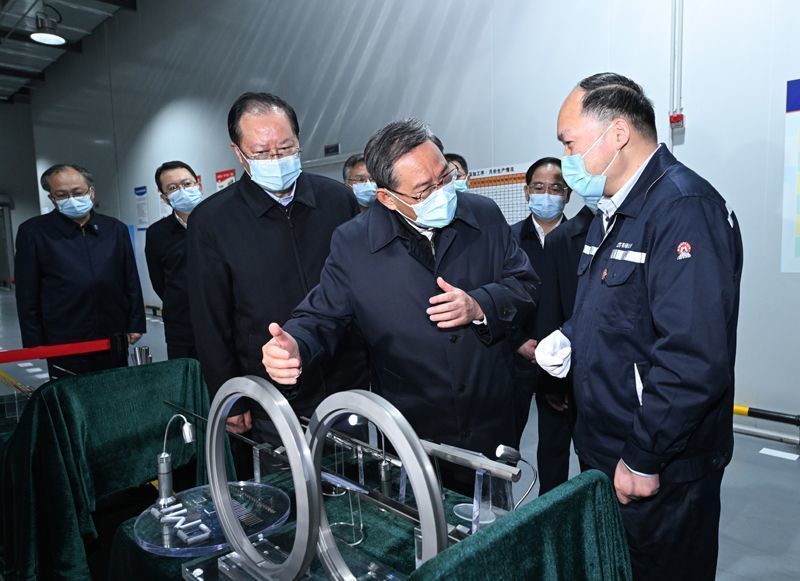
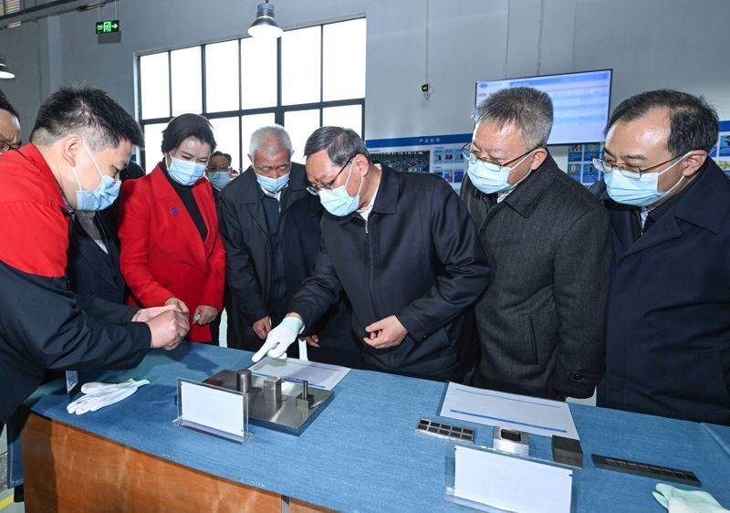

# 新任国务院总理首次外出调研，为什么去了湖南？

3月21日至22日，中共中央政治局常委、国务院总理李强在湖南调研并主持召开先进制造业发展座谈会。这是李强担任国务院总理以来，首次到地方调研。

为什么要去湖南？

从李强的行程来看，此番行程来意十分明显。他先后在株洲、长沙考察中车株洲电力机车、株洲硬质合金、中国铁建重工等多个制造业企业，并召集全国各地的8家企业负责人，专门就先进制造业发展谈了情况。

先进制造业为什么如此重要？用李强此行所讲的话——“实体经济特别是制造业是我国经济的根基所在”。

_3月21日，李强在株洲硬质合金集团调研。新华社记者
饶爱民 摄_

**密集走访株洲、长沙多家制造业企业，召集全国8家企业负责人开座谈会**

李强用两天时间在湖南调研，行程紧凑，主题鲜明——把握高质量发展这个首要任务，坚持把发展经济的着力点放在实体经济上，大力发展先进制造业，推进高端制造，加快建设现代化产业体系。

在株洲，李强考察了中车株洲电力机车、株洲硬质合金、湖南山河科技等企业，深入企业的车间和实验室，详细询问生产、研发和市场情况。

在长沙，李强考察了长沙比亚迪汽车、中国铁建重工、蓝思科技等企业，与企业负责人深入交流。

行程中，他对于制造业企业如何发展提出要求。

如李强说到科技创新——企业要大力培养、吸引和用好优秀科技人才，加快关键核心技术和重大技术装备攻关，打造更多有话语权的产品和技术。他还提到，企业是科技创新的主体，要培育世界一流的先进制造业龙头企业和专精特新企业，实打实帮助企业解决困难。

对于制造业、实体经济的发展，李强在先进制造业发展座谈会上表示，实体经济特别是制造业是我国经济的根基所在，随着国内外形势发生复杂深刻变化，我国制造业发展面临一个重要关口，我们坚守制造业的决心不能动摇，做强制造业的力度必须加大。

_3月22日，李强在长沙蓝思科技股份有限公司调研。新华社记者
饶爱民 摄_

**发力先进制造业，今年头两个月湖南规模工业增加值同比增长5.8%，实现稳健开局**

在湖南察看先进制造业企业，召开有关座谈会，也有其深意。

公开报道显示，近年来，湖南省持续做强做优做大制造业，塑造发展新优势，驱动增长新引擎。围绕制造业重点产业链，当地推进关键技术攻关，提升产业创新能力和竞争力。数据显示，今年1-2月，湖南省规模工业增加值同比增长5.8%，实现稳健开局。

近年来，湖南持续做强做优做大制造业，大力实施先进制造业发展“八大工程”和产业发展“万千百”工程，引导资金、技术、人才等资源要素向产业最薄弱环节、最需要地方集聚。三一智慧钢铁产业城、星朝汽车新能源基地等项目加速落地，48个产业发展“万千百”工程重点项目已于今年前两个月完成投资近100亿元。

今年，湖南省将重点抓好20个制造业关键产品“揭牌挂帅”项目、100个“产品创新强基”项目、新材料中试平台（基地）建设，实施首台套装备、首批次材料等“五首”产品奖励支持。

在培育制造业企业方面，湖南发挥龙头企业、“链主”企业的引领与整合作用，引导小微企业规模发展、中小企业专精特新发展，加快构建大中小企业梯度成长、协同创新更加紧密的良好产业生态。公开报道显示，今年湖南力争新增百亿元企业10家以上、国家级专精特新“小巨人”企业200家以上、规模工业企业1000家以上。

湖南省政府工作报告在讲到2023年湖南重点工作时还专门谈到，加快打造国家重要先进制造业高地。要求“重点支持工程机械拓展海外市场，推动轨道交通向高端整车发展”“力争新能源汽车产量突破100万辆、占全国10%以上”。

在这次湖南调研行程中，李强充分肯定湖南经济社会发展成就，提出湖南加快打造国家重要先进制造业、具有核心竞争力的科技创新、内陆地区改革开放的高地的希望。

新京报首席记者 吴为

编辑 刘茜贤 校对 赵琳

