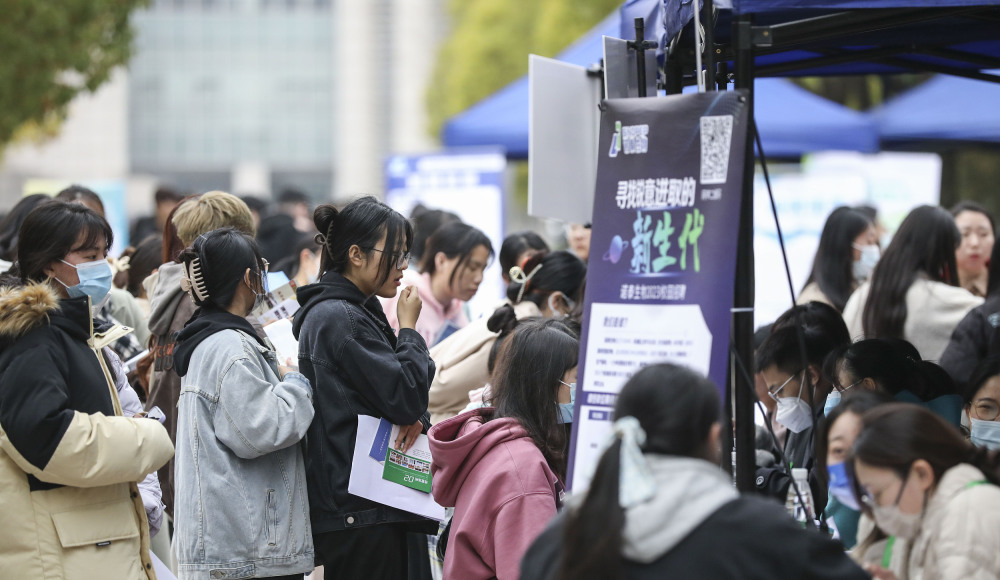

# 本科生的求职尴尬：并未声明只招研究生，本科生却感觉落了下风

_2023年3月21日，江苏淮安，大学生在招聘会上寻找岗位。视觉中国
图_

3月23日，教育部新闻发布会上表示，全国共招收研究生124.25万人，比上年增长5.61%。2022年，我国高等教育毛入学率59.6%，比上年提高1.8个百分点。这个消息可能会让求职路上的本科生心情复杂。

刚刚迈入“金三银四”就业季，某一线城市“硕博毕业生人数首超本科生”就登上热搜：今年该市高校毕业生数量约28.5万人，创了历史新高。在整体就业形势面临压力的大环境下，这一新变化迅速引发舆论热议，尤其是本科生群体的高度关注。既没有学历优势，也缺乏社会经验，本科生该拿什么在竞争激烈的求职路上脱颖而出？这不仅是他们的焦虑和担心，也是公众普遍关心的问题。社会需要正视本科生的求职尴尬，也需要为本科生这一就业的主体人群提供更多帮助。

**1**

不少本科生发现：虽然用人单位并没有“白纸黑字”声明只招研究生，但从投简历到参加笔试、面试，任何一个环节上，本科生都有随时被“筛选”的可能。

这并非错觉。数据显示，2023年，我国高校毕业生将达到1158万人，同比增加82万人。高校毕业生的数量又创新高，这也意味着，今年的就业形势更趋严峻。与此同时，2022年毕业的研究生已达86.2万人，今年有可能更多。和他们相比，本科生自然会感觉落了下风，底气不足。

确实，随着我国高等教育从大众化迈入普及化阶段，本科生不再处于金字塔的顶端，正如一些网友调侃的：“一板砖拍下去，能拍倒一堆本科生”。另一方面，不少本科生可能也背负着来自家庭、社会过高的角色期待，比如，那些选择返乡创业、送外卖或者从事家政行业的本科生，总会受到“读书无用”的质疑。

同时，一些本科生的自我期望和社会现实也存在落差。此前，一项调查显示，近七成大学生认为自己毕业10年内会年入百万。但现实情况是，2021届本科毕业生的平均薪资为5833元，这已经是近10年中的最高水平，其中，仅6.1%的应届本科生起薪过万。除了薪资待遇外，从工作岗位到价值感、成就感的获取，许多本科毕业生切身体会到了失落感。

但是，职场选拔的评价体系是多元的，学历只是其中的一个维度。

现实中一位本科生凭借突出的个人能力、过硬的工作能力，在应聘过程中一路打败同场“竞技”的硕士、博士，拿到Offer的例子也并不罕见。在就业的过程中，学历是一块很重要的“敲门砖”，但绝不是唯一的人才评价标准。

总体而言，如今大学生就业确实不容易，社会不能给他们加上太重的“包袱”。其实，风物长宜放眼量，适合自己的工作，才是最好的工作；能发挥所长的工作，就是值得为之努力的工作。

**2**

今年全国两会期间，考研“高考化”的现象成为热点话题。

一些本科生把大学读成了高中，把考研当成了“二次高考”。甚至有些学生从高考出分后就布局千里，由于成绩不理想，又不想复读，于是干脆选报那些考研率高的大学，从入学第一天开始就立志考研“上岸”。

于是，有不少网友质疑这些考研的本科生，认为他们只是把考研当作求职的捷径、人生的避风港。然而，这并不全是本科生的“错”。

一来，一些保研无望的本科生，在就业市场高学历人才增多的压力下，只能把求职的希望寄托在“学历升级”上；二来，部分本科生也许还没有规划好自己的职业道路和人生道路，考研不失为一种比较保险的选择。

但是，考研之路也绝不轻松。据统计，2022年全国有457万考研大军，院校计划招生人数110万左右，这意味着有300多万考生落榜。2023年，考研报名人数达474万人，比2022年增长了3.71%。

就像一位正在备战考研的大二生所感慨的：“我也想要丰富多彩的大学生活，但现实并不允许。”想在求职时更有底气，想要得到更高的薪酬，想获得更好的工作机会……这些朴素的、向上的愿望，不应该被随意嘲讽。

其实，与其让无数本科生挤上考研这座“独木桥”，不如由高校来为他们拓展更多的就业途径。比如，多渠道开展就业帮扶，有针对性地加强就业指导，提供专业建议；比如，可以敞开校门，做学生与就业单位之间的牵线者、建桥人；又比如，可以采用“直播带人”等有创意的方式，为学生创造更多就业机会。

相信有不少走上考研之路的本科生，或是受到现实因素的影响，或是被考研“高考化”的情绪裹挟，他们更需要的，可能是来自社会的帮助。

**3**

前段时间，一位文科男硕士吐槽招聘会上平均月薪只有5500元的新闻，曾引发人们对“文科生就业难”的讨论。硕士生尚如此，本科生的求职前景似乎更加艰难。

事实上，这与文科理科的分野关系不大。关键在于，学生所学的知识与就业的要求是否相匹配，是否能做到学以致用？求职难不难，主要还得看个人能力的高低。

但也要看到，还有许多本科生，明明很努力也很上进，却依然找不到理想的工作。一方面，个别高校的教学与社会实际需求相对脱节，教学内容与学生的个人发展联系不紧密；还有一些高校设置的专业和课程滞后于时代发展，导致部分本科生没能学到真本领、真技能。

另一方面，一些用人单位盲目追求高学历、重点高校毕业生，或是在应届生招聘要求里添上“丰富的工作经验”“上岗即上手”等不切实际的条件，从而让部分有潜力、有志向的本科毕业生被筛选在外。

揆诸现实，我国“人口红利”没有消失，“人才红利”正在形成，发展动力依旧强劲。解决就业问题，根本要靠发展，把经济蛋糕做大，把就业蛋糕做大。

为了帮助毕业生顺利就业，社会各界要千方百计想办法，发掘岗位资源、提供精准帮扶。比如，求职市场要秉持公平、透明的原则，消除各种不合理的限制；又比如，用人单位在“用人”之外，也要注重“培人”，用动态的眼光看待本科生，给予他们更广阔的成长空间。

从绝对数量上来说，本科生才是社会人才队伍的主力军，也是社会发展的栋梁之材。他们是人才，是发展的依靠，而非就业的“负担”。

每一位本科生都是从残酷的高考竞争中脱颖而出的，也都经历了大学四年的学习和锻炼，社会理应为他们提供更多实现个人价值、发挥个人才干的机会，为他们的蓬勃生长创造更多可能。

