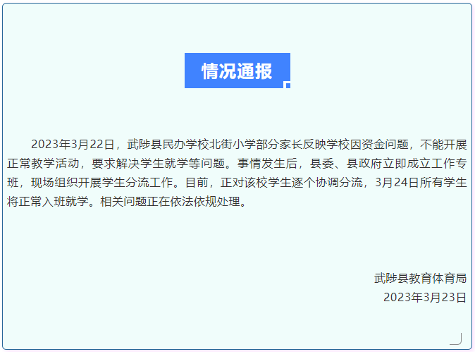

# 河南焦作武陟一私立小学将倒闭学生将辍学？官方通报

针对网传北街小学倒闭、学生将辍学传闻，3月23日，武陟县教育体育局通报，3月22日，武陟县民办学校北街小学部分家长反映学校因资金问题，不能开展正常教学活动，要求解决学生就学等问题。事情发生后，县委、县政府立即成立工作专班，现场组织开展学生分流工作。目前，正对该校学生逐个协调分流，3月24日所有学生将正常入班就学。相关问题正在依法依规处理。

**相关报道：**

河南一私立小学突然停办并让所有学生离校，学校及法人代表曾被限制高消费

