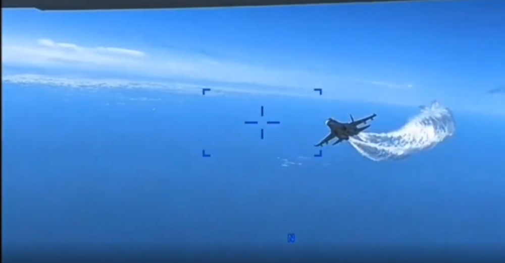
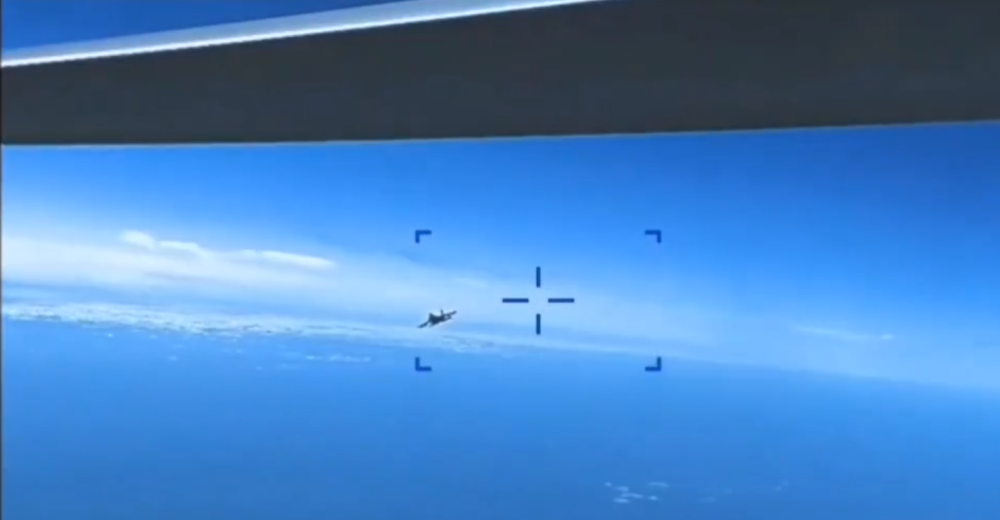
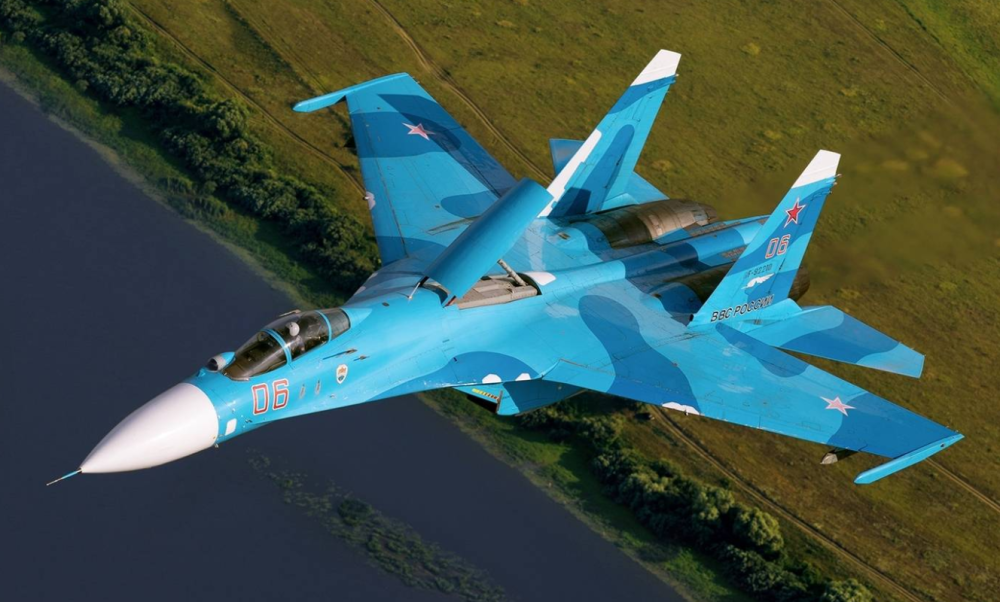
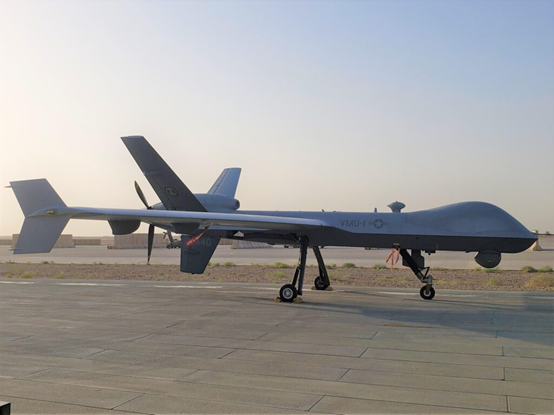

# 火焚美军“死神”：俄军可能使用了创新战术对付无人机

美军一架MQ-9“死神”无人机在黑海上空失事坠毁后美俄双方各执一词，美军坚持认为该无人机是被俄军派出的2架苏-27战斗机故意撞击而坠毁的，俄罗斯国防部对此予以反驳，表示该无人机是因为剧烈的空中机动动作导致失控坠海的，俄军苏-27战斗机没有使用机载武器攻击该无人机，更没有与之发生接触。

事实上，美军在公布这架“死神”无人机机头下方MTS-
B光电转塔传回的最后视频的时候，有意引导西方媒体以及世界舆论，指出无人机尾部推进螺旋桨已经被俄军苏-27战斗机撞坏等所谓的“证据”。其背后的用心则是：美国政府以及军方希望借助这一事件造成俄军故意“攻击”美军无人机的“既成事实”，从而有借口以北约的名义，将北约国家的战斗机部署到黑海甚至乌克兰领空，形成北约军事力量与俄军直接对峙乃至对抗的局面，实现其“火上浇油”的目的。

_美军MQ-9无人机光电转塔拍摄到俄军苏-27空中放油的画面截图。_

美国或隐去部分关键信息

首先，我们需要确认一下此次事件中美俄双方的机型。美国空军派出执行任务的型号应为MQ-9A的增程型号，即MQ-9A
ER，其外观上最大的不同在于动力系统采用了四叶螺旋桨，而不是原来的三叶桨，同时还增加了机内燃油量并且加装翼梢小翼，最大续航时间从27小时增加到了34小时。而俄罗斯空天军实施拦截的为2架从塞瓦斯托波尔的贝尔贝克空军基地起飞的苏-27战斗机，从机头光电雷达的位置来看，应该是较新的苏-27SM。

美军指责俄军苏-27SM战斗机撞击MQ-9A
ER无人机，导致后者螺旋桨受损，并且将视频最后几秒画面中已经扭曲变形的桨叶作为证据，而且，在第二架苏-27SM战斗机放油飞过MQ-9A
ER无人机上空时，视频信号还发生了中断。美军认为，就是这个时候发生的撞击。乍看起来，美军说的似乎有道理，其实只要我们对MQ-9A
ER无人机的结构布局进行分析，并且结合美军公布的视频，就可以发现美军此番言论的诸多漏洞。

MQ-9A
ER无人机在结构布局上基本继承了MQ-9A的设计，其机身后部除了霍尼韦尔TPE331-10涡桨发动机以及四叶推进螺旋桨，还有呈Y形布局的一副V形垂尾以及单个腹鳍。无论是V形垂尾，还是腹鳍，都采用了大展弦比翼面设计，其长度尺寸远远大于螺旋桨的直径，所以，按照视频中苏-27SM战斗机从MQ-9A
ER无人机后部飞过来的状态来看，无论是前者的哪一部分，包括机翼、机身、腹鳍、平尾等部位，都不可能撞击到后者的螺旋桨。如果两者真的发生撞击，也只能是苏-27SM战斗机先撞击到MQ-9A
ER无人机的V形垂尾。

在这里，有必要普及一下苏-27SM战斗机与MQ-9A ER无人机两者在重量级上的差距。从视频中的状态来推测，MQ-9A
ER无人机此时的飞行全重应当为3.5吨左右，飞行速度大致为350公里/小时，而苏-27SM战斗机同时挂载了2枚R-73近距格斗空空导弹以及4枚R-27中距空空导弹，再考虑到机内载油量（包括需要在空中放油的余量），其飞行全重应当在25吨左右，飞行速度大致为400公里/小时。有兴趣的读者不妨计算一下苏-27SM战斗机与MQ-9A
ER无人机在此时状态下的动能差距是多少倍，如果两者高速相撞，前者对后者形成的冲击力有多大。事实上，不要说苏-27SM战斗机这样的庞然大物，就算是MQ-9A
ER无人机在飞行中撞上一只鸟都是极其致命的一击。

_俄军苏-27战斗机靠近美军MQ-9无人机。_

所以，退一万步说，就算是苏-27SM战斗机真的从后面飞上来撞击了MQ-9A ER无人机，那么必然发生的结果就是：MQ-9A
ER无人机的无论哪个部位受到撞击，都是非常可怕的重创，比如V形垂尾肯定会折断，无人机再也无法保持方位以及俯仰上的稳定，会进入到失速螺旋状态，一对大展弦比平直翼在机身的高速旋转过程中会承受不住巨大的气动应力而折断，从MTS-
B光电转塔的视角来看就是一幅“天旋地转”的景象。

但是，我们从美军公布视频的最后几秒可以看到，无人机还依然保持平稳飞行的状态，MTS-B光电转塔甚至还特意为受损的螺旋桨叶拍了一段特写。这说明MQ-9A
ER无人机根本没有受到苏-27SM战斗机的撞击，几乎等于美军自己打了自己的脸。

其实，美军这番带有明显漏洞的言论只能“忽悠”对航空装备技术并不熟悉的公众。目前，俄方正在全力打捞坠海的MQ-9A
ER无人机残骸，很可能就是为了找到“打美国人脸”的有力证据。但是，在美军公布的视频中，我们还的确看到了无人机视频信号中断、螺旋桨叶扭曲变形等画面。按照俄军的说法，苏-27SM战斗机既没有发射机载武器攻击MQ-9A
ER无人机，也没有与之发生任何碰撞接触，而最后该无人机还是坠毁了。事实上，笔者分析，俄军苏-27SM战斗机很可能采用了一种精心设计的创新战术，既达到了警告美国人的目的，又不让美国人找到让局势升级的借口。

_俄军苏-27战斗机。_

复盘拦截过程

在说明俄军这种创新战术之前，先容笔者卖个关子。关注世界各国航展的读者应该都见过之前澳大利亚著名的阿瓦隆国际航展上经典的一幕，即澳大利亚皇家空军的F-111C战斗轰炸机喷着长长的火舌从天空中掠过的画面。这也是阿瓦隆国际航展的保留节目，主要是F-111C战斗轰炸机通过两台TF30涡扇发动机中间尾锥处的放油口来释放大量燃油，同时打开加力，利用加力燃烧室产生的高温尾焰将油雾点燃。

这个喷火表演既有极其震撼的视觉效果，对于战机来说也很安全，只要停止放油，火焰即可熄灭。虽然自2011年澳大利亚皇家空军F-111C战斗轰炸机全部退役后，我们再也看不到这一精彩表演了。但是，想象一下，如果F-111C战斗轰炸机喷着油雾从另一架飞机上方很近的距离飞过，并且突然开加力喷火，会是一种怎样的场景。不错，也许是俄军飞行员受到了F-111C战斗轰炸机喷火表演的启发，将这个绝招用在了对付MQ-9A
ER无人机的战术上。

讲到这里，通过视频分析以及一系列合理的推测，我们不妨还原一下3月14日俄军拦截无人机的一幕：当天，美国空军一架MQ-9A
ER“死神”大型长航时察打一体无人机从黑海的公海空域向北飞行，逼近俄军重要的军港塞瓦斯托波尔，事实上已经触碰到了俄军的底线。于是，俄军紧急起飞2架苏-27SM战斗机予以拦截。第一架苏-27SM战斗机以大迎角低速姿态从MQ-9A
ER无人机后方飞来，同时开始通过两台发动机尾喷口下方的放油口释放出大量燃油，形成长长的油雾带。不过，第一架苏-27SM战斗机的飞行员显然没有掌握好航向和速度，最主要的就是航线与MQ-9A
ER无人机形成了交叉，因此很快就错过去了。

_美军公布的后续视频显示MQ-9尾部的螺旋桨桨叶出现了受损。_

在发现遭到俄军苏-27SM战斗机拦截后，位于本土基地控制站内的美军飞行操控员便迅速接管了无人机，掉转航向，向西方飞去，试图摆脱俄军战机的拦截返航。不过，第二架苏-27SM战斗机的飞行员显然不想让MQ-9A
ER无人机就这样全身而退，他吸取了第一架苏-27SM战斗机飞行员拦截失败的教训，调整好航向，同样以大迎角低速姿态，并且喷出浓浓的油雾带，从无人机的后上方平行掠过。注意，此时第二架苏-27SM战斗机的两台AL-31F大推力涡扇发动机的尾喷口是斜向下的，为战机提供一定的直接升力。当这架苏-27SM战斗机从上方即将与MQ-9A
ER无人机错开的时候，其尾喷口正好对着该无人机的背部、接近头部的位置。于是，飞行员猛地一推油门杆，打开加力，尾喷口喷出的长长尾焰瞬间点燃了已经包围无人机的油雾带，形成一条壮观的火龙。之后，飞行员关闭放油口，加速爬升脱离。

而这条火龙点燃时产生的强大冲击波击中了MQ-9A
ER无人机头部鼓起的天线罩，使得其内部的卫星通信数据链天线失效，造成视频信号中断。而火龙沿着无人机机身两侧向后蔓延，烧毁了正好处于水平位置的两片桨叶。这也是我们在视频最后看到有一对处于相对位置的桨叶已经扭曲变形的原因，其采用的铝合金根本无法承受如此高温高速燃气流的冲击。同时，油雾带燃烧产生的火焰以及大量高温废气也冲入MQ-9A
ER无人机背部的TPE331-10涡桨发动机进气口，不仅造成发动机空中停车，也使得两级离心式压气机等内部结构受损。

_此次美军坠毁的MQ-9无人机是改进型号，增加了滞空时间。_

因此，当MQ-9A
ER无人机的通信数据链恢复后，我们看到在视频最后的几秒钟已经是火龙熄灭后，该机失去动力、滑翔下降的阶段，螺旋桨在受损后也只是处于无动力的顺桨状态。由于无法依靠滑翔返回基地，美军飞行操控员很可能趁着机上备用电源还有一定电力的情况下，操控无人机在海面迫降，尽可能远离克里米亚半岛沿岸。同时，美军还利用这段时间迅速发出指令，删除了无人机机载计算机内的敏感信息和软件。最终，MQ-9A
ER无人机在距离克里米亚半岛海岸约60公里处坠海。

两架俄军苏-27SM战斗机在“火焚死神”后，应该全程监视其坠海的过程，并且随时向基地指挥官报告。这也是为什么MQ-9A
ER无人机坠海后俄军能够如此快地出动舰船进行打捞。俄军这次成功的拦截行动，不仅没有给美军任何加大军事介入的口实，还予以美方最严厉的警告，同时也能够通过打捞MQ-9A
ER无人机残骸，获得更多的信息和尖端设备。尤其是该型无人机搭载的大量航电设备，包括MTS-
B光电转塔都是目前世界顶尖的机载设备，这样一架先进的大型长航时察打一体无人机相对完整地落入俄军手中，对于美军来说是极大的损失。

