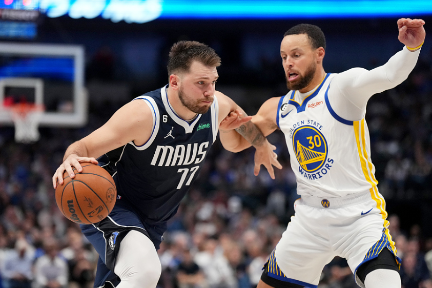
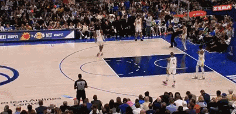
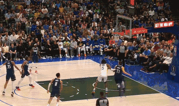
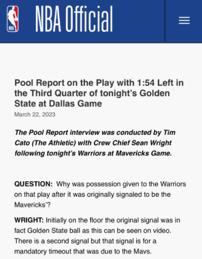
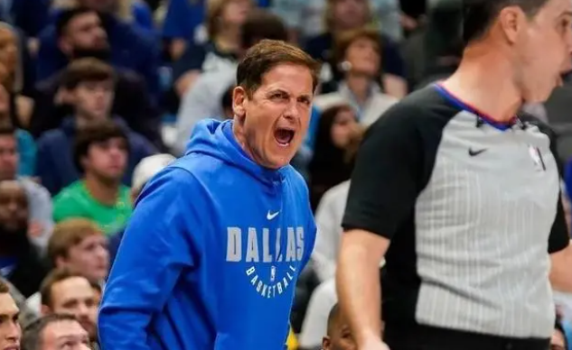
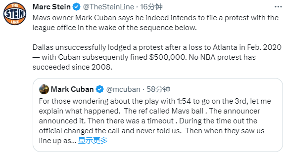
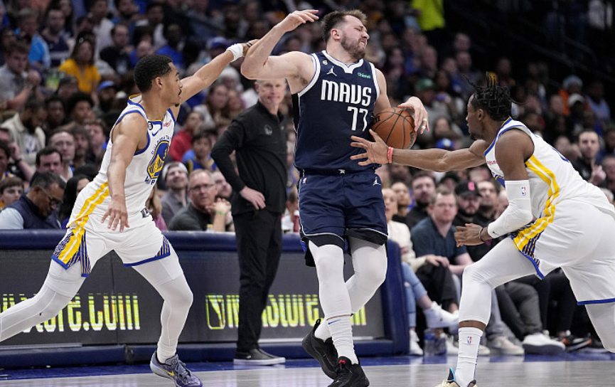

# 裁判解释勇士5打0争议球：球权本就属于勇士 库班抱怨后或放弃抗议

北京时间3月23日，勇士客场险胜独行侠，第三节勇士5打0卢尼扣篮一幕引热议，库班发推回应直言这可能是史上最糟糕的判罚，而且独行侠计划向联盟提出抗议；赛后裁判解释没有改判
吹的就是勇士持有球权。

在勇士和独行侠第三节最后阶段，暂停回来勇士直接5打0，独行侠球员全都在球场的另一端，如此诡异一幕引争议；从现场录像可以看出，1分59秒裁判第一时间没有把球权给独行侠，而是直接表示的是前场球、勇士球权！

裁判第一时间做了一个朝右边的手势，表示球权的方向（即前场球，勇士的球权），然后再朝着左侧，伸出手掌的同时响哨，这个姿势是吹暂停的意思。

赛后裁判解释勇士5打0争议一幕，裁判Wright回答:那个球在场上最初的判罚就是勇士的球，这个可以在视频上看到。当时确实有第二个手势，但那个手势是强制暂停扣在独行侠身上的意思。

据报道，独行侠计划向联盟抗议，裁判的误导导致勇士轻松拿到2分；独行侠老板库班发推解释并且抱怨裁判，表示：当时，裁判先是吹了我们的球权，现场的播音员也播报了，然后进了暂停，暂停期间裁判把球权改判给了勇士，但他们没有告诉我们改判的事情。之后，当他们看见我们像是准备发球一样的站位时，他就直接把球给了勇士。

库班还写道：在一场2分之差的比赛里这是疯狂的。这可能是NBA历史上最糟糕的判罚；他们所需要做的就是告诉我们一声，然而他们没有。

Marc
Stein报道，独行侠在2020年2月输给老鹰的比赛后也曾提出过抗议，但未能成功，库班还因此被罚款了50万美元，自2008年以来，NBA就从未有过抗议成功的案例。

在独行侠在2020年2月23日不敌老鹰的比赛中，比赛最后时刻，特雷-杨上篮被帽，但裁判吹了干扰球，同时约翰-
科林斯将球补进。之后经过回放，裁判认定该球不是干扰球，并认定科林斯的补篮有效。独行侠以“滥用规则”为由向NBA提出抗议，但被驳回。

​NBA薪资专家Bobby
Marks随后发推介绍了抗议的一些细则——1、抗议申请必须在比赛结束后48小时内提出；2、抗议方需缴纳10000美元的费用，抗议成功后将退还；3、独行侠方面需要在五天内提供证据；4、负责处理抗议的专员将在收到证据后的五天内做出裁决。

也许，看了裁判的解释后，库班会放弃抗议。

